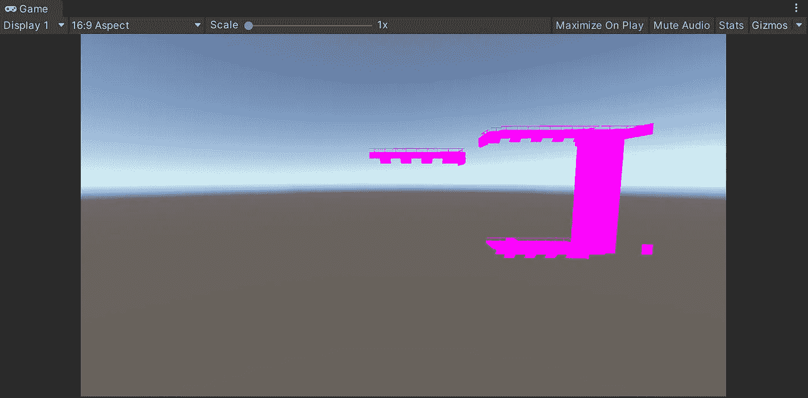
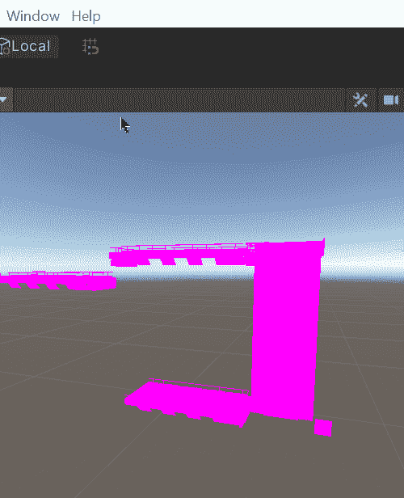
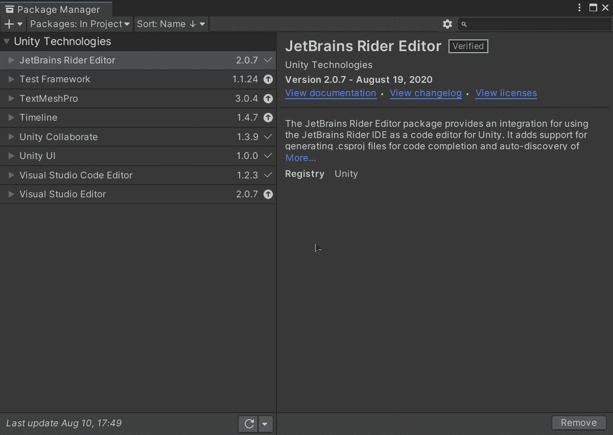
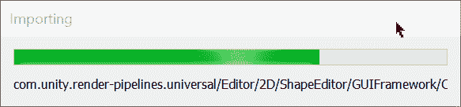
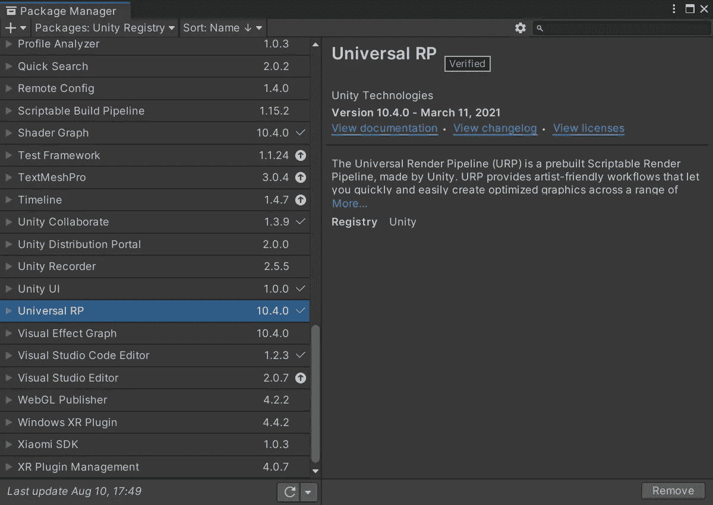
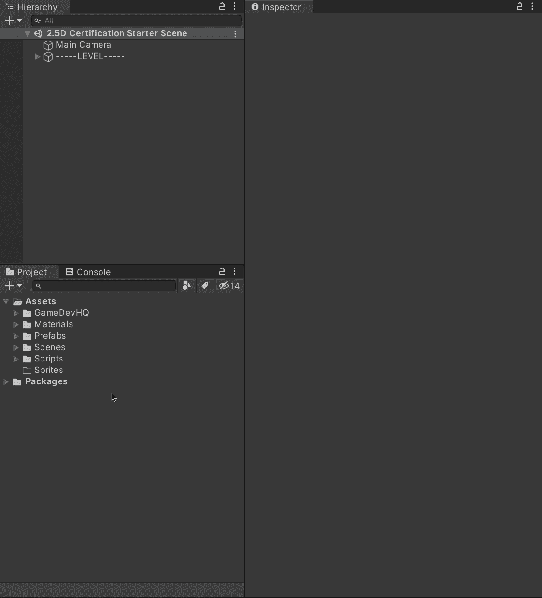
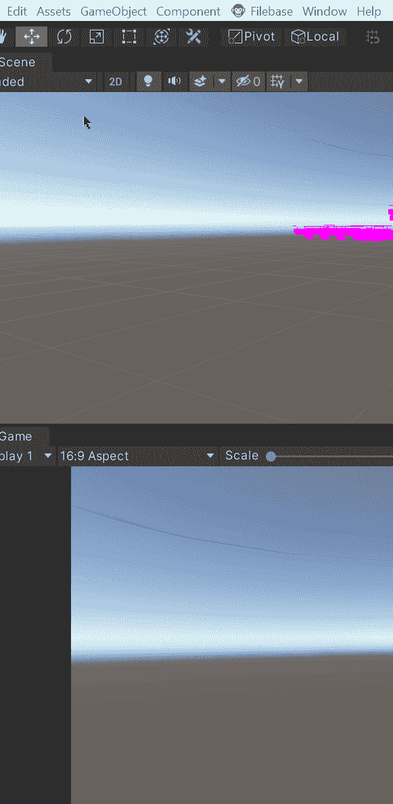
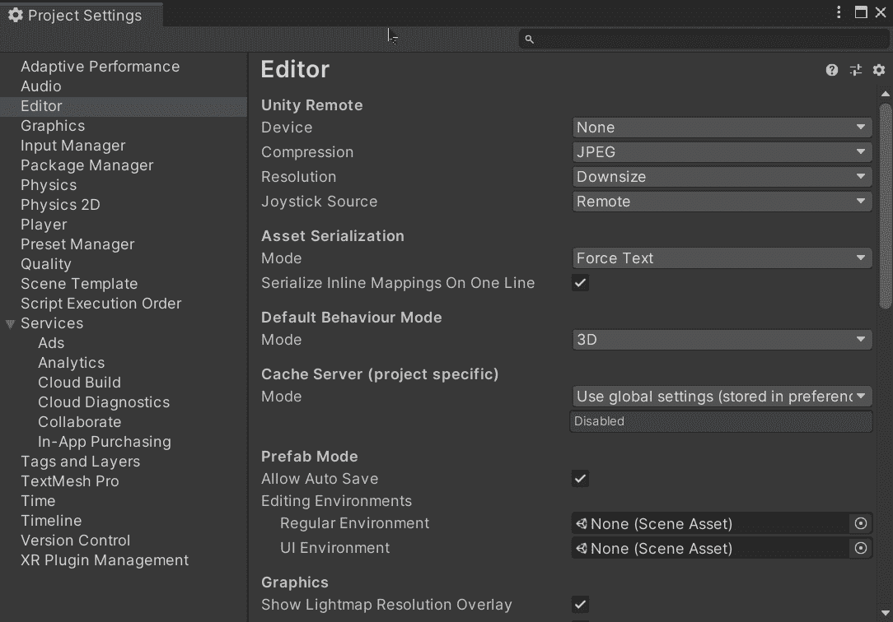
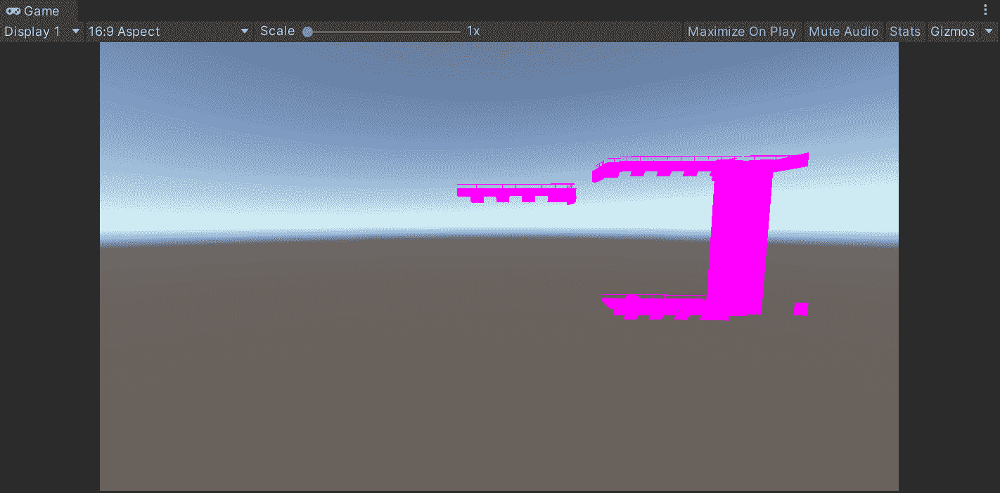
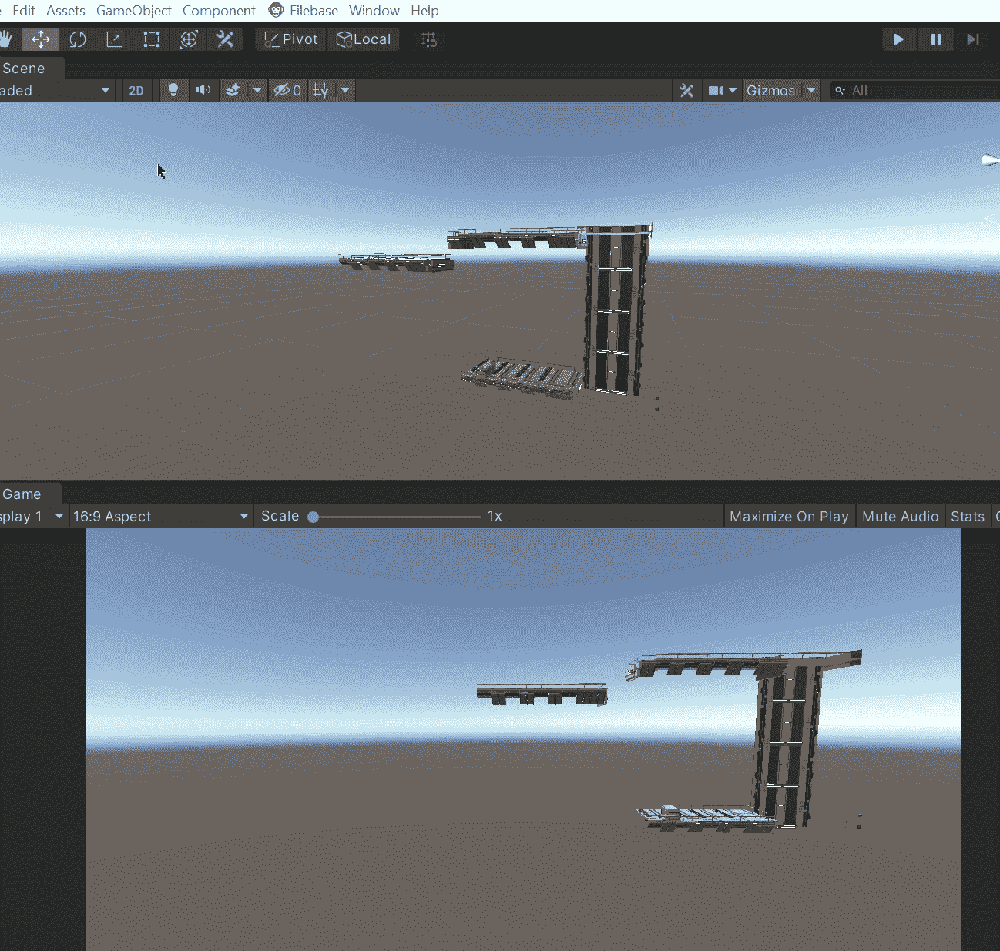

# 将您的项目升级到 URP | Unity

> 原文：<https://medium.com/nerd-for-tech/upgrading-your-project-to-urp-unity-cd50e12a7b14?source=collection_archive---------7----------------------->

## 统一指南

## 关于如何升级你的项目以在 Unity 中使用通用渲染管道(URP)的快速指南

**目标**:升级一个项目，使用 Unity 的通用渲染管道(URP)。

在上一篇文章中，我介绍了[如何用 Unity](/nerd-for-tech/pushing-objects-to-complete-puzzles-unity-86ef01b61ff8) 推动物体来启动解谜机。现在，是时候升级我们的 Unity 项目，开始使用通用渲染管道了。

# 当前阶段

首先，让我们看看 Unity 项目的当前阶段。我们有几个从[文件库](http://filebase.gamedevhq.com/)下载的游戏资产，正在使用 Unity 的默认内置渲染管道进行渲染。正如您在下图中看到的，使用此渲染管道时，资源的着色器似乎无法正常工作:

如果你想了解更多关于 Unity 渲染管道的信息，你可以访问 Unity 文档:

 [## 渲染管道

### 渲染管道执行一系列操作，这些操作获取场景的内容，场景包含环境和…

docs.unity3d.com](https://docs.unity3d.com/Manual/render-pipelines.html) 

# 升级到 URP

所以，为了开始改变我们的渲染管道到 URP，让我们点击 ***窗口>包管理器*** 打开包管理器:

打开后，让我们:

*   选择在左上方显示 Unity 注册表中的软件包的选项。
*   在列表中搜索通用 RP。
*   点击**右边的*安装*按钮。**
*   等到通用 RP 包安装完毕。

安装完成后，我们将能够看到右侧的 ***移除*** 按钮:

然后，为了创建一个资产来指示 Unity 所需的渲染管道，让我们创建一个新文件夹并单击 ***创建>渲染>通用渲染管道>管道资产(正向渲染器)*** :

现在，为了指示 Unity 使用 URP，让我们通过点击 ***编辑>项目设置*** 来打开项目设置，然后让我们点击图形选项卡来在**可脚本化渲染管道设置**中选择我们的**渲染管道资产**:

选择后，我们将能够看到着色器现在通过使用通用渲染管道正确渲染:

# 充当故障检修员

如果您的材质看起来相同，您仍然可以尝试通过单击 ***编辑>渲染管道>通用渲染管道>将项目材质升级为通用材质*** 来升级它们:

就这样，我们升级了我们的 Unity 项目，使用通用渲染管道！:d .我会在下一篇文章中看到你，在那里我将展示如何使用基于云的服务( [Filebase](https://filebase.gamedevhq.com/) )在我们的 Unity 项目中包含游戏资产。

> *如果你想了解我更多，欢迎登陆*[***LinkedIn***](https://www.linkedin.com/in/fas444/)**或访问我的* [***网站***](http://fernandoalcasan.com/) *:D**