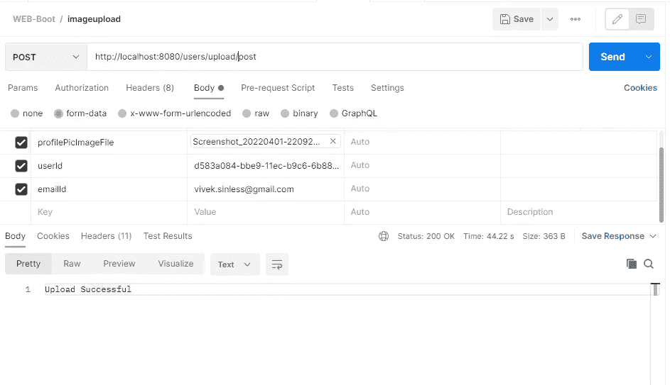
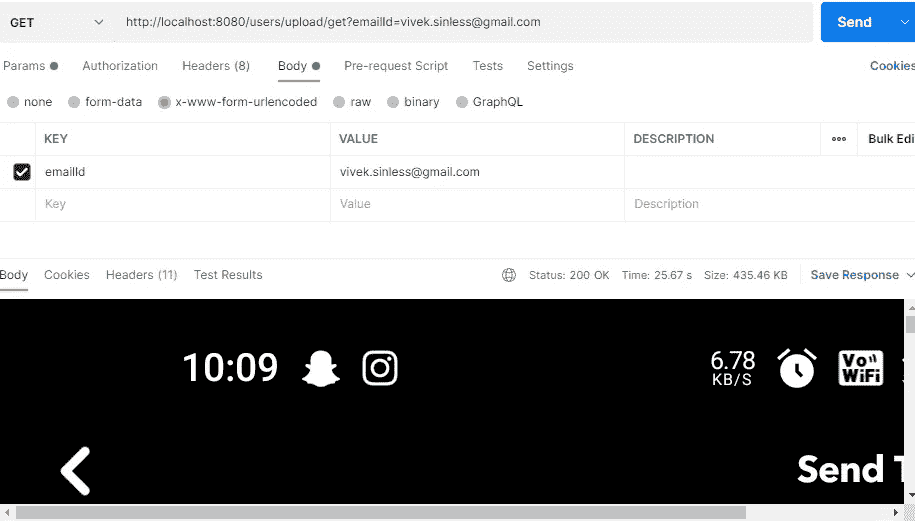

# SpringBoot 中的上传文件功能

> 原文：<https://medium.com/nerd-for-tech/upload-file-feature-in-springboot-9e4ed8474b82?source=collection_archive---------0----------------------->


来源:[https://unsplash.com/photos/gGFyi5h79uE](https://unsplash.com/photos/gGFyi5h79uE)

在本文中，我们将实现文件上传功能。我们将创建两个端点，分别上传和获取文件。post 请求将上传文件。Post 请求也可以用作 put 请求。
get 请求将获取文件。

[GitHub 代码可用](https://github.com/Viveksingh1313/uploadImage)。检查自述文件以启动应用程序。

**发布端点:**

```
@PostMapping(**"/upload/post"**)
**public** ResponseEntity<String> uploadProfilePic(@ModelAttribute User user) **throws** Exception {
   **userService**.updateProfilePicture(user.getUserId(), user.getProfilePicImageFile());
    **return new** ResponseEntity<>( **"Upload Successful"**, HttpStatus.***OK***);
}
```

获取端点:

```
@GetMapping(value = { **"/upload/get"** }, produces = MediaType.***ALL_VALUE***)
**public** ResponseEntity<**byte**[]> getProfilePic(@RequestParam String emailId)  {
    ***log***.debug(**"Inside {} controller"**, **"/user/profile/picture"**);
    User user = **userService**.getUserDetailsByEmailId(emailId);
    **byte**[] profilePicBytes = user.getProfilePicBytes();
    **return new** ResponseEntity<>(profilePicBytes, HttpStatus.***OK***);
}
```

用户实体:

```
**import** org.springframework.web.multipart.MultipartFile;class User {
 String userId;
 String emailId;
 byte[] profilePicBytes;
 @Transient
 private MultipartFile profilePicImageFile;}
```

用户服务 Impl:

```
@Override
**public void** updateProfilePicture(String userId, MultipartFile multipartFile) **throws** Exception {
    User user = **userRepository**.findByUserId(userId);
    **if**(user!= **null** && multipartFile!=**null**) {
        user.setProfilePicBytes(multipartFile.getBytes());
        **userRepository**.save(user);
    } **else** {
        ***log***.debug(**"User not found for userId : {}"**, userId);
        **throw new** Exception(**"User not found for { userId = "** + userId + **"}"**);
    }
}
```

**如何从 postman 调用这些端点？**

发布请求:/用户/上传/发布



获取请求:/users/upload/get



**代码说明:**

在用户实体中，我们有 userId、emailId、profilePicBytes **、** profilePicImageFile。profilePicImageFile 仅用于读取调用 post 请求时传递的文件。我们将这个文件转换成一个字节类型变量，并将这个字节数组存储在我们的 db 中。

在 get 调用期间，我们读取这些字节数组并将其传递给前端，以便将字节转换为图像。对于转换，我们使用:

```
produces = MediaType.*ALL_VALUE*
```

定义“**/上传/获取**”控制器时。如果我们知道 get 端点产生的媒体类型，那么我们可以使用特定的媒体类型。比如:

```
produces = MediaType.***IMAGE_JPEG_VALUE***
```

**图像的字节转换:**

**MultipartFile** 对象有一个名为“getBytes()”的方法。此方法用于将文件转换为字节，然后可以存储在 DB 中。在下面的代码中，我们只是以字节为单位读取文件，然后将其设置为用户实体的 profilePicBytes(byte[]type object)列/变量。

```
user.setProfilePicBytes(multipartFile.getBytes());
```

**@模型属性:**

在 post 请求“/users/upload/post”中，我们使用@ModelAttribute 而不是@ request body—`@ModelAttribute`将接受一个查询字符串。因此，所有数据都通过 url 传递到服务器。至于`@RequestBody`，所有的数据都会通过一个完整的 JSON 体传递给服务器。使用`@RequestBody.`无法上传图片

**多部分:**

多部分请求将一个或多个数据集组合成一个整体，由边界分隔。您通常将这些请求用于文件上传和在单个请求中传输多种类型的数据(例如，一个文件和一个 JSON 对象)。

**结论**

希望这篇文章是有帮助的。
Git 代码可以用一个自述文件进行解释:[https://github.com/Viveksingh1313/uploadImage](https://github.com/Viveksingh1313/uploadImage)

如果这篇文章对你有帮助，请鼓掌并关注我以获取更多这样的文章。你可以找到我的 [LinkedIn 简介](https://www.linkedin.com/in/vivek-singh-a109b511a/)和电子邮件 Id:vivek.sinless@gmail.com

快乐学习！干杯:)