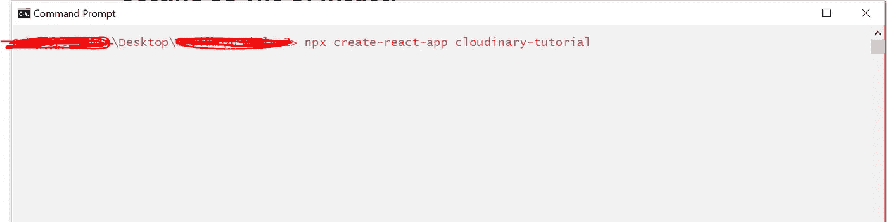
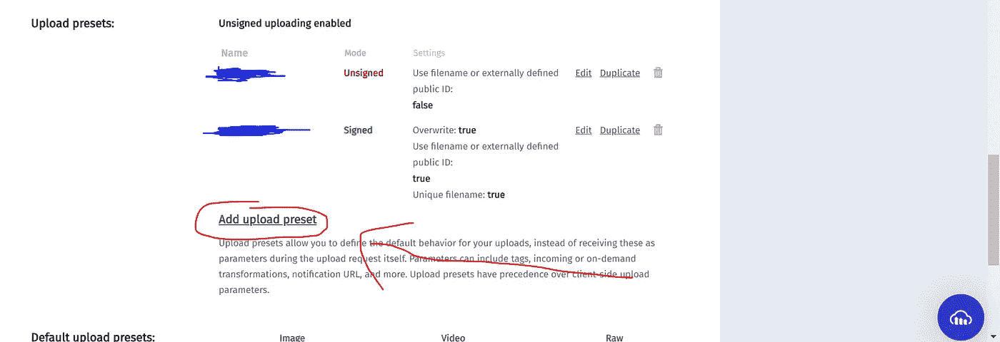
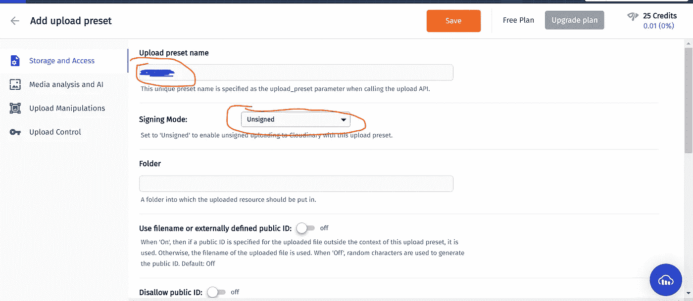
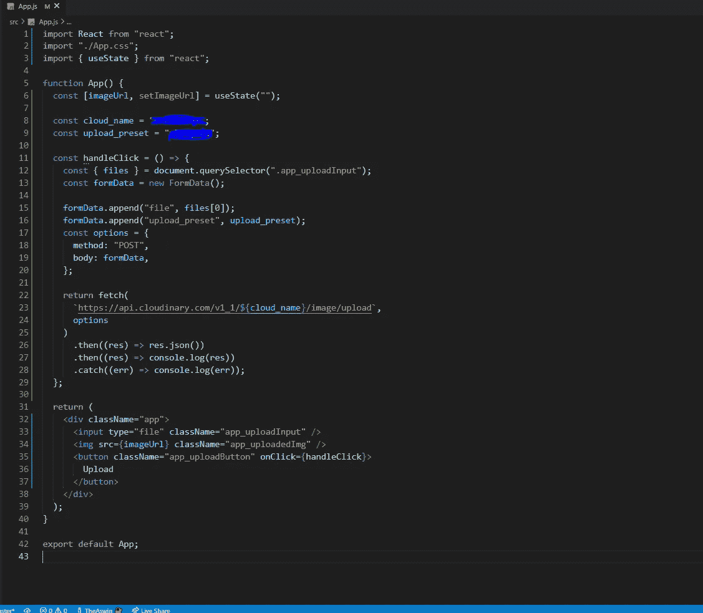

# 使用 React 将图像上传到 Cloudinary

> 原文：<https://medium.com/nerd-for-tech/uploading-images-to-cloudinary-with-react-e432c644485?source=collection_archive---------5----------------------->


云雾缭绕

如果我们想在某个地方存储我们成员的个人资料图片、他们上传的图片/视频等，该怎么办？我们当然不能使用大多数数据库。尽管一些数据库服务允许你上传你的图片到他们的云中，但是我们不能用它来满足我们的大部分需求！。否则，我们必须*存储上传图像的 URL。*在这些当中，出现了[云淡风轻](https://cloudinary.com/)

> Cloudinary 是一家 SaaS 技术公司，提供基于云的图像和视频管理服务。它使用户能够上传、存储、管理、操作和交付网站和应用程序的图像和视频。

所以，让我们*潜*进去吧！

# 内容

*   设置 UI (React)
    确保您已经在全球范围内安装了最新版本的 create-React-app:`npm i create-react-app -g`)
*   设置 Cloudinary
    (确保您在 [Cloudinary](https://cloudinary.com/) 中有帐户)
*   设置功能
*   更新用户界面

# 设置用户界面(React)

为了这篇文章，我使用 CMD(窗口的终端)和 VSCode(你可以使用任何，根据你的喜好！)

首先，在 CMD 中导航到您的目录，并键入`npx create-react-app cloudinary-tutorial`，`cloudinary-tutorial`是项目的名称



创建-反应-应用

安装完成后，通过`cd cloudinary-tutorial && code .`导航到该文件夹，这将为我们打开 VSCode。现在是清洁过程。

清理过程包括删除`src`文件夹中不需要的文件，如:`App.test.js`和`setupTests.js`，并清理(删除)所有`App.js`中的代码，替换为:

```
//App.js
import React from "react";
import "./App.css";function App() {
 return (
  <div className="app">
  <input type="file" className="app_uploadInput" />
  <button className="app_uploadButton">Upload</button>
  </div>
 );
}export default App;
```

这里我们放置了一个带有`className` “app”的`div`和一个带有`className`作为“app_uploadInput”的[上传输入](https://developer.mozilla.org/en-US/docs/Web/HTML/Element/input/file)以及一个带有`className` “app _ upload button”
的`button`。您也可以将`App.css`替换为:

```
//App.css
.app {
 height: 100vh;
 display: flex;
 align-items: center;
 justify-content: center;
}.app_uploadButton {
 height: 2rem;
 width: 5rem;
 background-color: black;
 color: white;
}
```

这些都是基本的造型，我不打算详细介绍。
现在让我们启动开发服务器，看看我们的进度！

为了启动开发服务器，在 VSCode 中通过`Ctrl+Shift+`` 打开一个新的终端，然后在浏览器中键入:`npm start`现在打开`localhost:3000`，您会看到类似这样的内容:


就是这样！好消息是您已经完成了 UI 的设置(React)。

# 设置云阵列

现在让我们设置 Cloudinary！
登录后，转到您的仪表板，从那里复制**云名称**。


云名称

你还需要你的 **upload_preset** 。为此，请转到设置:


导航至上传选项卡:


向下滚动至上传预设部分，点击*添加上传预设:*



在新页面中，选择*签名方式*为*未签名，同时选择*，复制*上传预置名称*，点击保存。



就是这样！好消息是您已经完成了 Cloudinary 的设置。

# 设置功能

首先，我们为按钮添加一个`onClick`处理程序。为此，请导航回`App.js`，然后:

```
function App() {
 ***const handleClick = () => {};***return (
 <div className="app">
 <input type="file" className="app_uploadInput" />
 <button className="app_uploadButton" ***onClick={handleClick}***>Upload</button>
</div>
 );
}
```

我们正在定义一个名为‘handle click’的箭头函数，它现在是空的，当按钮被点击时就会被触发。下一步是将*手柄*点击。

```
function App() {
const cloud_name = "your_cloud_name";
const upload_preset = "your_upload_preset"; const handleClick = () => {
 ***const { files } = document.querySelector(".app_uploadInput");
 const formData = new FormData();*** ***formData.append("file", files[0]);
 formData.append("upload_preset", upload_preset);
 const options = {
  method: "POST",
  body: formData,
 };*** ***return fetch(`https://api.Cloudinary.com/v1_1/${cloud_name}/image/upload`, options
)
 .then((res) => res.json())
 .then((res) => console.log(res))
 .catch((err) => console.log(err));***
};//rest of code
```

我们来分解代码吧！
首先我们要[析构](https://developer.mozilla.org/en-US/docs/Web/JavaScript/Reference/Operators/Destructuring_assignment)上传输入的文件数组。然后我们创建一个新的[表单数据](https://developer.mozilla.org/en-US/docs/Web/API/FormData)。然后我们[将上传输入的第一个上传文件](https://developer.mozilla.org/en-US/docs/Web/API/FormData/append)和我们的 *upload_preset* 一起添加到表单数据中。之后，我们向 Cloudinary API 端点发送一个 POST 请求，类似于:`https://api.cloudinary.com/v1_1/:cloud_name/:action.`然后我们将在控制台中得到结果/错误！

现在，让我们测试我们的应用程序。转到`localhost:3000`，上传一个文件并点击按钮。在控制台中，您可以看到结果！

就是这样！好消息是您已经完成了函数的设置:)

# 更新用户界面

现在让我们在 UI 中显示*上传的*图片。
为此，首先让我们创建一个[状态钩子](https://reactjs.org/docs/hooks-state.html)。

```
***import { useState } from "react";***function App() {
 ***const [imageUrl, setImageUrl] = useState("");*** //rest of the code
```

*其次*，让我们创建一个新的`img`来显示图像:

```
<div className="app">
 <input type="file" className="app_uploadInput" />
 ******
 <button className="app_uploadButton" onClick={handleClick}>Upload</button>
</div>
```

您可以在您的`App.css`中添加:

```
.app_uploadedImg {
 height: 10rem;
 width: 10rem;
 position: absolute;
 top: 0;
}
```

现在，您的`App.js`可能看起来像:



接下来，是最重要的部分！
将您的帖子请求编辑为:

```
return fetch(`https://api.cloudinary.com/v1_1/${cloud_name}/image/upload`, options)
 .then((res) => res.json())
 ***.then((res) => {
  setImageUrl(res.secure_url);
 })***
 .catch((err) => console.log(err));
```

这段代码将图片上传到 Cloudinary 后，将`imageUrl`设置为我们得到的 URL。

就是这样！好消息是您已经完成了 UI 的更新。

您可以访问您的 Cloudinary 仪表盘来查看、编辑、删除(等等。)上传的图片。

今天就到这里吧！如果你读这篇文章感到无聊，找到这个有趣的提示:“GitLab”这个名字是如何形成的？通过连接字母 G-i-t-l-a-b。就是这样！*好消息是你已经看完了我的小* ***笑话*** *！*

如果你没看过我之前的文章，在这里找到[。](/nerd-for-tech/react-frontend-nodejs-backend-167e2904e5c9)

希望你们都喜欢这个！

谢谢！