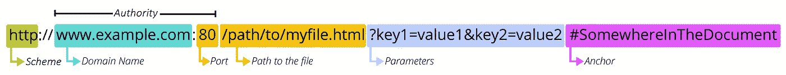
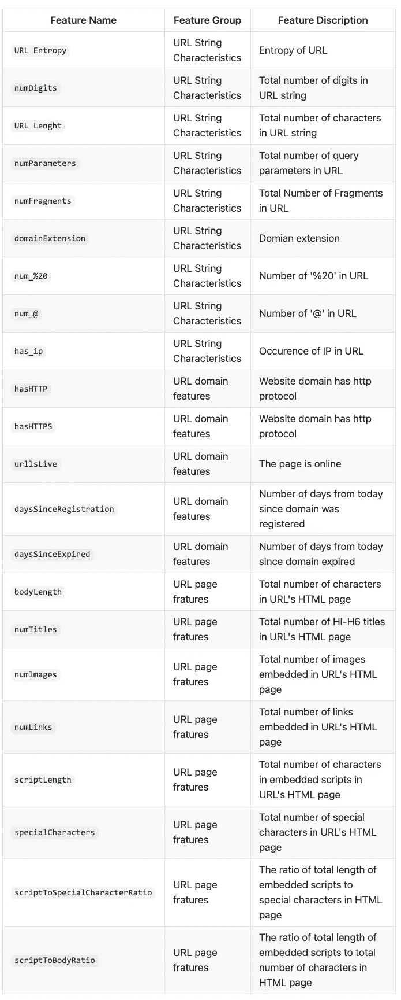
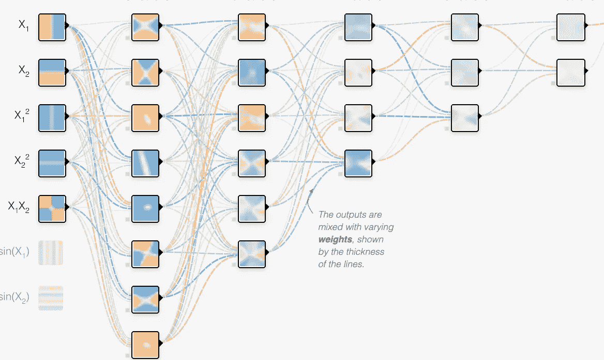
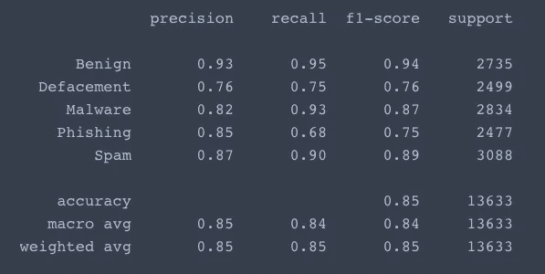
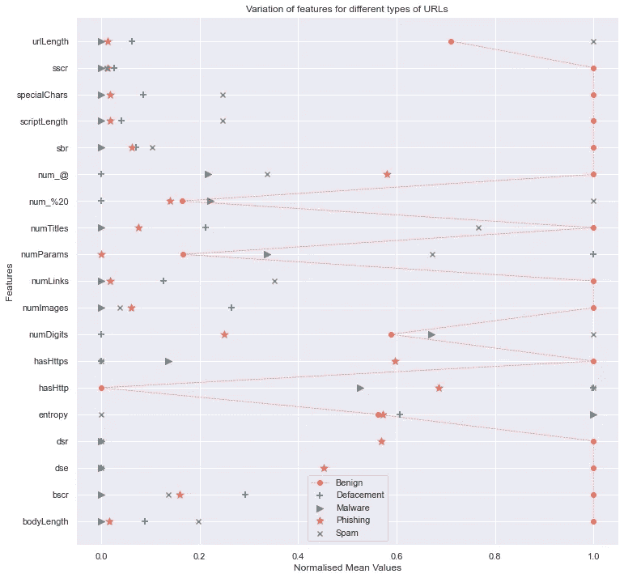
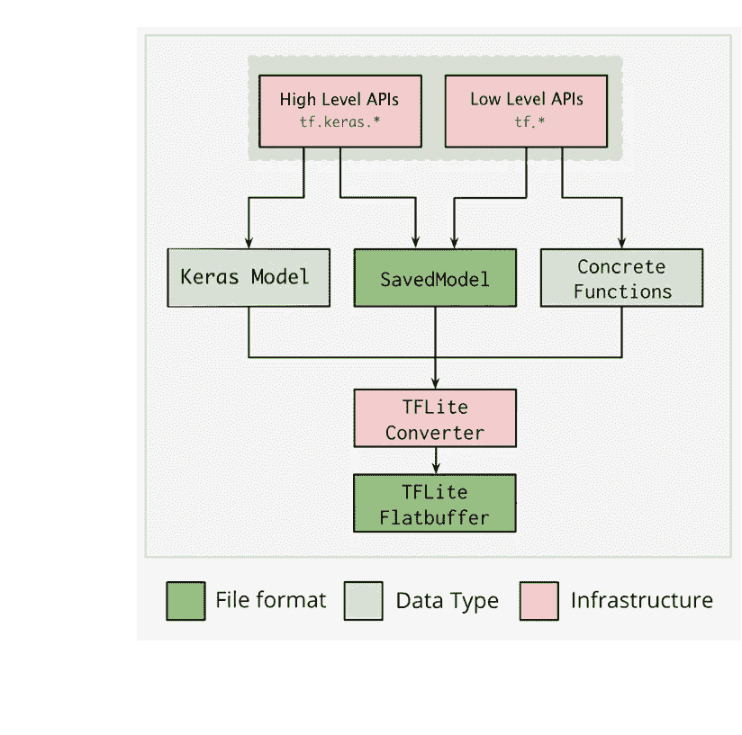
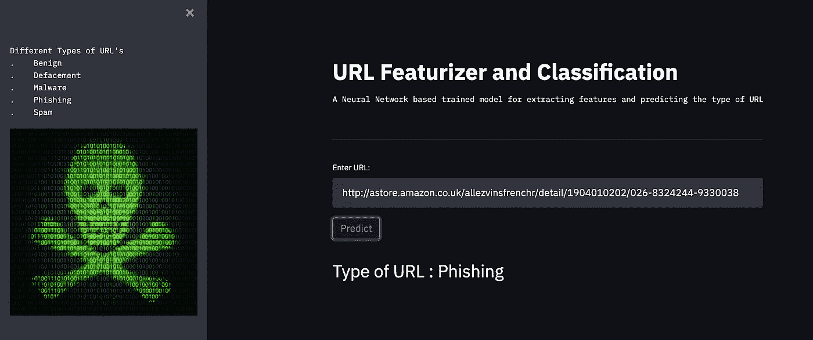
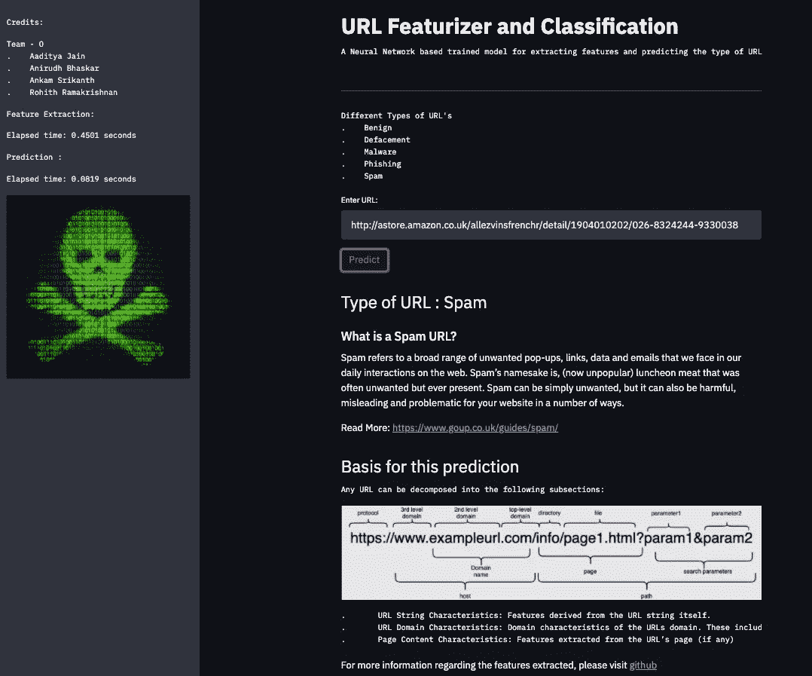

# URL 特征工程和分类

> 原文：<https://medium.com/nerd-for-tech/url-feature-engineering-and-classification-66c0512fb34d?source=collection_archive---------0----------------------->

在本文中，我们将通过 Streamlit 和 Tensorflow 神经网络到微处理器和物联网设备的更轻和可移植模型的转换，在简单深度学习模型的辅助下，开发一个成熟的 URL 分类 GUI。


杰佛森·桑多斯在 [Unsplash](https://unsplash.com?utm_source=medium&utm_medium=referral) 上拍摄的照片

网络安全是一个行话，自从万维网发展以来，它的使用一直在稳步增长。它可以被定义为保护连接到互联网的设备免受恶意攻击的实践。随着网络攻击的[数量和复杂性的增长](https://digitalguardian.com/blog/biggest-incidents-cybersecurity-past-10-years-infographic)，公司和组织，尤其是那些负责保护与国家安全、健康或财务记录相关的信息的公司和组织，需要采取措施来保护其敏感的业务和个人信息。早在 2013 年 3 月，美国最高情报官员就警告称，网络攻击和数字间谍活动是国家安全的最大威胁，甚至超过了恐怖主义。

恶意网站是现代网络威胁的罪魁祸首。它们是传播病毒、特洛伊木马和各种恶意代码的前沿阵地，这些病毒和代码可能会感染用户，导致数据失窃和洗钱。这些 URL 通常通过电子邮件链接、弹出广告和嵌入式下载进行传播。

要开发 Deel 学习神经网络模型，第一步是开发一个特征提取管道，该管道基于 URL 的字符串、域和页面特征，基于许多独特的特征来区分 URL。将从训练获得的每个 URL 中提取 N 个特征，产生一个 M×N 矩阵，M 是收集的 URL 的数量。


由[马库斯·斯皮斯克](https://unsplash.com/@markusspiske?utm_source=medium&utm_medium=referral)在 [Unsplash](https://unsplash.com?utm_source=medium&utm_medium=referral) 上拍摄

# 关于数据

用于此分析的数据收集自 https://www.unb.ca/cic/datasets/url-2016.html[的](https://www.unb.ca/cic/datasets/url-2016.html)。

*   **良性网址**:从 Alexa 顶级网站收集了超过 35，300 个良性网址。这些域名已经通过 Heritrix 网络爬虫提取网址。大约有 50 万个唯一的 URL 最初被抓取，然后被传递以删除重复的和只有域名的 URL。后来，提取的网址已通过病毒总检查，以过滤良性网址。
*   **垃圾网址**:从公开的 WEBSPAM-UK2007 数据集中收集了大约 12，000 个垃圾网址。
*   **网络钓鱼网址**:大约 10，000 个网络钓鱼网址来自 OpenPhish，这是一个活跃的网络钓鱼网站库。
*   **恶意软件网址**:从 DNS-BH 获得了超过 11，500 个与恶意软件网站相关的网址，这是一个维护恶意软件网站列表的项目。
*   **污损 URL**:超过 45，450 个 URL 属于污损 URL 类别。他们是 Alexa 排名可信的网站托管欺诈或隐藏的网址，其中既包含恶意网页。每一类 URL 都是分开的，因此对每个文件的提取都是单独进行的，并累积在一起用于最终的训练。

> *参考资料部分提到了概述数据集细节及其基本原则的完整研究论文。*

# **从 URL 中提取特征**

URL(统一资源定位器的首字母缩写)只不过是 Web 上给定的唯一资源的地址。理论上，每个有效的 URL 指向一个唯一的资源。这种资源可以是 HTML 页面、CSS 文档、图像等。实际上，也有一些例外，最常见的是 URL 指向不再存在或已经移动的资源。因为由 URL 表示的资源和 URL 本身是由 Web 服务器处理的，所以由 Web 服务器的所有者来仔细管理该资源及其相关联的 URL。



图片致谢:[https://developer . Mozilla . org/en-US/docs/Learn/Common _ questions/What _ is _ a _ URL](https://developer.mozilla.org/en-US/docs/Learn/Common_questions/What_is_a_URL)

这些解剖特征中的每一个都在区分 URL 中起着至关重要的作用。

存在多种用于恶意/垃圾邮件/网络钓鱼 URL 检测的技术，包括黑名单和人工智能辅助技术。黑名单是维护已知恶意域数据库并将新 URL 的主机名与数据库中的主机名进行比较的过程。这种系统的主要缺点是它检测新的和看不见的恶意 URL 的能力，只有当它被观察为来自受害者的恶意 URL 时，它才会被添加到黑名单中。人工智能辅助的机器/深度学习方法提供了一种可跨平台推广的预测方法，并且不依赖于已知签名的先验知识。给定恶意和良性恶意软件样本的样本，ML 技术将提取已知好的和坏的 URL 的特征，并概括这些特征以识别新的和看不见的好的或坏的 URL。

用于提取的外部库是 [whois](https://pypi.org/project/python-whois-extended/) 、 [PyQuery](https://pypi.org/project/pyquery/) 和 [interruptingcow](https://pypi.org/project/interruptingcow/)

使用 whois 包，我们可以提取自注册和到期以来的天数等特征。PyQuery 可用于从网页本身提取特征，包括但不限于链接数量、标题数量、图片数量等。



提取的特征

上述代码将从单个 URL 中提取特性，并返回一个特性名称字典作为键和相应的值。这个处理器将遍历不同的 CSV 文件。

最终特征提取的数据连同类别标签可以在 [*这里找到*](https://github.com/Rohith-2/url_classification_dl/blob/main/FinalDataset/feature.csv) 。

提取要素的过程极其耗时，由于数据集的庞大性质，运行时间大约为 96 小时*。

# 开发预测模型

基于提取的特征，可以开发预测模型，该模型将能够对看不见的 URL 进行分类。深度学习模型的方法有很多，为了简单起见，将训练一个只有密集层的顺序模型。欢迎您尝试各种技术。密集的层是规则的深度连接神经网络层。这是最常见和最常用的层。密集层对输入进行大量加权运算，并返回输出。

## 什么是神经网络？

这是一种构建从数据中学习的计算机程序的技术。它非常松散地基于我们对人脑工作方式的思考。首先，软件“神经元”的集合被创建并连接在一起，允许它们相互发送消息。接下来，网络被要求解决一个问题，它试图一遍又一遍地解决这个问题，每次都加强导致成功的联系，减少导致失败的联系。



[https://playground.tensorflow.org/](https://playground.tensorflow.org/#activation=tanh&batchSize=21&dataset=spiral&regDataset=reg-plane&learningRate=0.01&regularizationRate=0&noise=0&networkShape=8,6,4,3,2&seed=0.63950&showTestData=false&discretize=false&percTrainData=50&x=true&y=true&xTimesY=true&xSquared=true&ySquared=true&cosX=false&sinX=false&cosY=false&sinY=false&collectStats=false&problem=classification&initZero=false&hideText=false)

## Keras 序列模型

```
model = Sequential()    
model.add(Dense(256, input_dim = input_dim , activation = 'relu'))    model.add(Dense(128, activation = 'relu'))    
model.add(Dense(64, activation = 'relu'))    
model.add(Dense(32, activation = 'relu'))    
model.add(Dense(16, activation = 'relu'))    
model.add(Dense(5, activation = 'softmax'))
model.compile(loss = 'categorical_crossentropy' ,optimizer='adam' , metrics = 'accuracy' )
```

有许多排列和组合来创建神经网络，该网络随后被微调以获得更好的性能。该实现仅用于教育目的，并不针对任何指标进行微调。我们的模型将预测 5 种不同的标签——良性、恶意软件、网络钓鱼、垃圾邮件和污损。多类分类模型将输入给定的数据，并预测上述定义的标签作为输出。


由[卢克·切瑟](https://unsplash.com/@lukechesser?utm_source=medium&utm_medium=referral)在 [Unsplash](https://unsplash.com?utm_source=medium&utm_medium=referral) 上拍摄的照片

## 准备数据

机器或深度学习的最佳实践之一是在每个特征具有不同范围时对数据进行归一化。规范化的目标是将数据集中的数值列的值更改为通用比例，而不扭曲值范围的差异。

```
data = pd.read_csv("feature.csv")
data.replace(True,1,inplace = True)    
data.replace(False,0,inplace = True)

y = data["File"]    
data = data.drop(columns = "File")

encoder = LabelEncoder()    
encoder.fit(y)    
Y = encoder.transform(y)  

scaler = MinMaxScaler(feature_range=(0, 1))    

X = pd.DataFrame(scaler.fit_transform(data))
```

机器学习和深度学习模型，如 Keras 中的模型，要求所有输入和输出变量都是数字。所有非数字值如 True 和 False 都被转换为二进制，至于类标签，LabelEncoder 将字符串标签转换为数字范围。例如，良性:0，恶意软件:1，网络钓鱼:2，垃圾邮件:3，污损:4。我们可以从 tensorflow.keras.utils 导入 to _ categorical()来做同样的事情。

> 良性:00001
> 恶意:00010
> 网络钓鱼:00100
> 垃圾邮件:01000
> 污损:10000

我们现在可以开始用 80%的原始样本和 20%的样本训练模型，以评估模型在新数据上的性能。

```
X_train, X_test, y_train, y_test = train_test_split(X, Y, test_size=0.2, random_state=42)
```

## 训练模型

使用之前定义的顺序密集网络，我们现在将拟合(训练模型)X_train 和 y_train。

```
model.fit(X_train,to_categorical(y_train),epochs = 50,validation_split=0.3, batch_size = 128)
```

这是相对较轻的训练，可以在 CPU 或 GPU 上执行。所有测试都是在运行 OSX 版本 11.3.1 的 2.4 GHz 四核英特尔酷睿 i5 和 8 GB 2133 MHz LPDDR3 上进行的，培训运行时间约为 3 分钟。

## 测试模型

有许多统计方法可以测试任何给定的机器/深度学习模型的性能。几个值得注意的例子包括:

## 准确(性)

准确性是衡量模型所做的预测有多少是真实的指标。准确度越高越好。然而，在评估性能时，这并不是唯一重要的指标。

## 精确

精度度量标志着在识别正面结果时模型正确的频率。例如，模型多久向真正患有癌症的患者诊断一次癌症。

## 回忆

此指标衡量正确预测的数量除以本应正确预测的结果数量。它指的是被你的算法正确分类的相关结果总数的百分比。

```
y_pred = model.predict(X_test)    
predicted = np.argmax(y_pred, axis=1)    
target_names = ['Benign','Defacement','Malware','Phishing','Spam']    print(classification_report(y_test, predicted, target_names=target_names))
```



每个类别的性能指标

下图由每个类的归一化值的平均值组成，描绘了每个要素的每个类中的不同值。



## 张量流精简模型

TensorFlow Lite 是一个用于设备上推理的开源深度学习框架，由一些工具组成，这些工具通过帮助开发人员在移动、嵌入式和物联网设备上运行他们的模型来实现设备上的机器学习。

以下是转换到 TF-Lite 的优点:

1.  **轻量:**边缘设备在存储和计算能力方面资源有限。深度学习模型是资源密集型的，因此我们在边缘设备上部署的模型应该是轻量级的，具有较小的二进制大小。
2.  **低延迟:**边缘的深度学习模型应该做出更快的推断，而不管网络连接性如何。由于推断是在边缘设备上进行的，因此将消除从设备到服务器的往返行程，从而使推断更快。



来源:https://www.tensorflow.org/lite/convert/index

转化的过程比你想象的要简单，

*   加载先前训练的模型
*   选择优化方法
*   瞧，一个建兴(。tflite)诞生了

```
#Loading the Model
model = ts.keras.models.load_model('Model_v2.h5') 
converter = ts.lite.TFLiteConverter.from_keras_model(model)#Optimisation Constraints 
converter.optimizations = [ts.lite.Optimize.DEFAULT] #Conversion and creation
tflite_quant_model = converter.convert()
tflite_model_file = pathlib.Path('tflite_quant_model.tflite')
tflite_model_file.write_bytes(tflite_quant_model)
```

这种转换确实提供了一个更轻的框架，但没有什么是免费的，这种 ***可能会以模型的性能为代价。***

# 用于 URL 分类的 GUI


照片由 [Tirza van Dijk](https://unsplash.com/@tirzavandijk?utm_source=medium&utm_medium=referral) 在 [Unsplash](https://unsplash.com?utm_source=medium&utm_medium=referral) 上拍摄

我们人类使用我们的感官获取关于我们周围世界的信息。我们的视觉是我们与周围事物交流的最重要的部分之一。人类一生都在学习与不同的物体互动:对他们中的一些人来说，只需要几秒钟就能学会(就像门铃旋钮)，有些人需要更多的时间(就像开车)。

但是对于计算机，我们有一个问题——人们被迫进行抽象思考，他们被迫处理大量他们甚至记不住的命令。

因此，图形用户界面(GUI)是以最简单的方式使计算机和人之间的交互成为可能的最受欢迎的方法。

> [***Streamlit***](https://streamlit.io/)是面向机器学习和数据科学团队的开源 app 框架。在数小时内而不是数周内创建漂亮的数据应用。全是纯 Python。

Streamlit 提供了许多 API，这对于在不了解 CSS 和 JavaScript 等后端编程语言的情况下构建和部署应用程序非常有益。

第一步是开发一个 python 脚本来接受 URL 字符串并预测其类别。

同样的伪代码应该是，

*   从用户输入 URL 字符串
*   加载 Keras 模型、缩放器和标签编码器
*   对给定的 URL 应用特征提取和标准化
*   预测班级

基于命令行参数的输入

上述代码将 URL 作为命令行参数，并显示 URL 的类，如下所示。

```
>>> $ python predict_args.py -i [http://astore.amazon.co.uk/allezvinsfrenchr/detail/1904010202/026-8324244-9330038](http://astore.amazon.co.uk/allezvinsfrenchr/detail/1904010202/026-8324244-9330038)Output : Spam
```

> 这将作为我们通过 Streamlit 实现 GUI 的框架。

我们将使用几个 Streamlit APIs:

*   streamlit.text("高输出")
*   streamlit . Title(" Title ")/streamlit . Header(" Header ")/streamlit . Subheader(" Subheader ")
*   streamlit.image( Image.open(loc))

Streamlit 在其输出 GUI 中由两部分组成- *侧栏、*和*主*屏幕。“streamlit . text()”API 将在主屏幕上打印输出，而“streamlit.sidebar.text()”将在侧边栏窗口中显示相同的内容。

简单的 Streamlit GUI 实施

可以使用命令 streamlit run <name>在网络上本地运行上述脚本。py，下图是生成的 GUI。</name>



细流

最终的 GUI 代码是上述简单实现的扩展，加上一些 if-else 条件来显示 URL 类型的更多信息。



最终图形用户界面

> 链接到 GUI:[https://share . streamlit . io/rohith-2/URL _ class ification _ dl/main/GUI/GUI . py](https://share.streamlit.io/rohith-2/url_classification_dl/main/GUI/gui.py)
> 
> 以上代码都可以在我的 Github [*资源库*](https://github.com/Rohith-2/url_classification_dl) *中找到。*

## 合著者:[阿尼鲁德·巴斯卡尔](https://medium.com/u/1ee3802d5d20?source=post_page-----66c0512fb34d--------------------------------)和[斯里坎特·安卡姆](https://medium.com/u/c463efdba322?source=post_page-----66c0512fb34d--------------------------------)

## 参考资料:

*   Mohammad Saiful Islam Mamun、Mohammad Ahmad Rathore、Arash Habibi Lashkari、Natalia Stakhanova 和 Ali A. Ghorbani，“使用词法分析检测恶意网址”，《网络和系统安全》，Springer International Publishing，P467–482，2016 年。