# URL 缩短系统设计

> 原文：<https://medium.com/nerd-for-tech/url-shortening-system-design-88cd005604b4?source=collection_archive---------0----------------------->

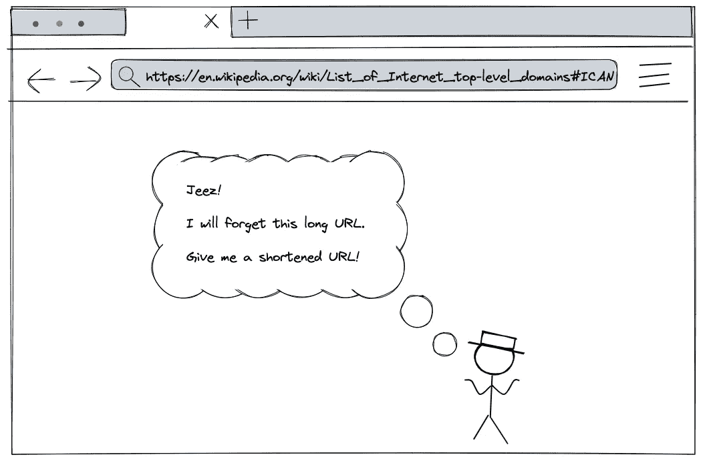

如何建立一个网址缩写器？

*本文的目标读者分为以下几类:*

*   *科技工作者*
*   *学生*
*   *工程经理*

*阅读本文的先决条件是系统设计组件的基础知识。本文并不包含对单个系统设计组件的深入指导。*

*免责声明:系统设计问题是主观的。本文是基于我对该主题的研究而写的，可能与现实世界的实现有所不同。欢迎分享您的反馈，并在评论中提问。*

原文发表在 [systemdesign.one](https://systemdesign.one/url-shortening-system-design/) 网站上。网址缩写器的系统设计类似于 [Pastebin](https://systemdesign.one/system-design-pastebin/) 的设计。我强烈推荐阅读相关文章，以提高您的系统设计技能。

# 网址缩写是如何工作的？

在**高电平**时，URL 缩短器执行以下操作:

1.  服务器为每个长 URL 生成一个唯一的短 URL
2.  为了可读性，服务器对短 URL 进行编码
3.  服务器将短 URL 保存在数据存储中
4.  服务器根据短 URL 将客户端重定向到原始的长 URL

# 术语

以下术语可能对您有用:

*   微服务:设计由小型独立服务组成的软件，这些服务有特定的用途
*   服务发现:自动检测网络上的设备和服务的过程
*   CDN:一组地理上分布的服务器，通过使内容更接近用户来加速 web 内容的交付
*   API:允许两个应用程序或服务相互对话的软件中介
*   编码:将数据从一种形式转换为另一种形式以保持数据可用性的过程
*   加密:使用密钥对数据进行安全编码，以保护数据的机密性
*   哈希:不可逆转的单向数据汇总，用于验证数据的完整性
*   Bloom filter:一种内存高效的概率数据结构，用于检查一个元素是否存在于一个集合中

# 什么是网址缩短服务？

一个 [URL 缩短](https://en.wikipedia.org/wiki/URL_shortening)服务是一个网站，它大大缩短了一个统一资源定位符( **URL** )。短 URL 将客户端重定向到原始网站的 URL。一些流行的面向公众的网址缩短服务是 tinyurl.com 的[和 bitly.com 的](https://tinyurl.com/app)【1】。

什么是网址缩短服务？

缩短 URL 的原因如下:

*   跟踪点击进行分析
*   美化 URL
*   伪装附属机构的基础网址
*   一些即时消息服务限制 URL 上的字符数

# 问面试官的问题

## **候选人**

1.  系统的用例有哪些？
2.  写操作的每日活跃用户数量( **DAU** )是多少？
3.  默认短网址应该坚持多少年？
4.  系统的预期读写比率是多少？
5.  缩短网址的使用模式是怎样的？
6.  谁将使用网址缩写服务？
7.  一个短 URL 的合理长度是多少？

## 采访者

1.  URL 缩短并重定向到原始的长 URL
2.  1 亿 DAU
3.  5 年
4.  100: 1
5.  大多数缩短的 URL 在创建后只会被访问一次
6.  公众
7.  最多 9 个字符

# 要求

## **功能需求**

*   类似于 [TinyURL](http://tinyurl.com) 或 [Bitly](http://bitly.com) 的网址缩短服务
*   一个**客户端**(用户)向系统输入一个长 URL，系统返回一个缩短的 URL
*   访问短 URL 的客户端必须被重定向到原始的长 URL
*   输入相同长 URL 的多个用户必须接收相同的短 URL(一对一映射)
*   短 URL 应该是可读的
*   短 URL 应该是无冲突的
*   短 URL 应该是不可预测的
*   客户端应该能够选择一个自定义的短网址
*   短网址应该是网络爬虫友好的( [SEO](https://en.wikipedia.org/wiki/Search_engine_optimization)
*   短网址应支持分析(非实时)，如从缩短网址重定向的数量
*   客户端可选地定义短 URL 的到期时间

## **非功能需求**

*   高可用性
*   低延迟
*   高可扩展性
*   持久耐用
*   容错

## **超出范围**

*   用户注册一个账户
*   用户设置短 URL 的可见性

# URL 缩写 API

系统中的组件通过具象状态转移(**)或远程过程调用( [**RPC**](https://en.wikipedia.org/wiki/Remote_procedure_call) )来公开应用编程接口( **API** )端点。公开公共 API 的最佳实践是通过 REST，这是因为松耦合和易于调试[2，3]。**

**一旦服务得到加强，性能应该得到进一步优化，就切换到 RPC 来进行服务之间的内部通信。RPC 的缺点是紧耦合和难以调试[4]。**

## ****网址缩短****

**客户端向服务器执行 HTTP PUT 请求来缩短 URL。使用 HTTP PUT 方法是因为 PUT 是幂等的，并且幂等性与长 URL 和短 URL 之间一对一映射的给定要求相一致。**

**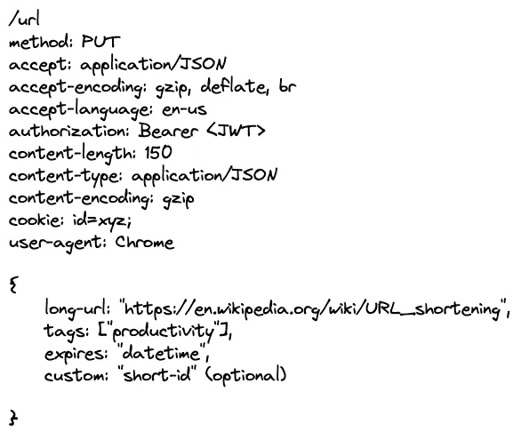**

**URL 缩短 HTTP 请求**

**URL 缩短 HTTP 请求头的描述如下:**

**URL 缩短请求标头**

**URL 缩短 HTTP 请求体参数描述如下:**

**URL 缩短请求负载**

**服务器响应一个状态码 *200 OK* 表示成功。HTTP 响应负载包含缩短的 URL 和相关元数据[5，6]。**

****

**URL 缩短 HTTP 响应**

**URL 缩短 HTTP 响应头的描述如下:**

**URL 缩短响应标头**

**URL 缩短 HTTP 响应负载参数的描述如下:**

**URL 缩短响应负载**

**如果客户端没有提供任何凭证或者没有有效凭证，则客户端接收到状态代码 *401 未授权*。**

****

**URL 缩短 HTTP 响应失败**

**如果客户端具有有效的凭证，但是没有足够的特权来对资源进行操作，则客户端会看到状态代码 *403 禁止*。**

****

**URL 缩短 HTTP 响应失败**

## ****网址重定向****

**客户端执行一个 HTTP GET 请求，从短 URL 重定向到原来的长 URL。HTTP GET 请求没有请求正文。**

**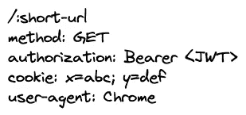**

**URL 重定向 HTTP 请求**

**URL 重定向 HTTP 请求头的描述如下:**

**URL 重定向 HTTP 请求标头**

**服务器以永久移动的状态代码 *301 响应。*状态码 *301* 表示短 URL 被永久移动到长 URL。当接收到状态代码 301 时，网络爬虫更新其记录[5，6]。**

**默认情况下， *301* 状态码将缓存存储在客户端。由于客户端的缓存，URL 重定向请求不会到达服务器。如果重定向请求没有到达服务器，则无法收集分析数据。HTTP 响应上的 *cache-control* 报头被设置为 *public* 以防止客户端缓存。公共缓存位于内容交付网络( [**CDN**](https://en.wikipedia.org/wiki/Content_delivery_network) )或反向代理服务器上。分析数据是从服务器收集的。**

****

**URL 重定向 HTTP 响应**

**服务器将*位置* HTTP 头设置为长 URL。然后，浏览器会自动向收到的长 URL 发出另一个 HTTP 请求。向客户端显示原始网站(长 URL)。**

**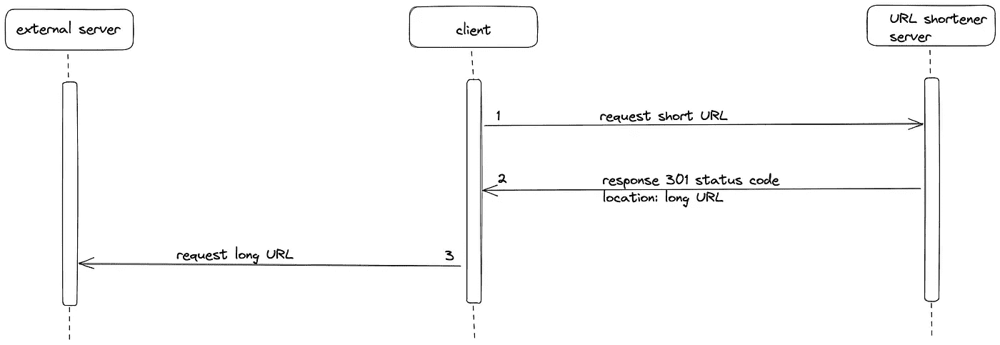**

**URL 重定向工作流**

**URL 重定向 HTTP 响应头的描述如下:**

**URL 重定向 HTTP 响应标头**

**HTTP 响应状态码 *302* 是*临时重定向*。服务器将*位置*头值设置为长 URL。 *302* 状态码并不能提高原网站的 SEO 排名。**

****

**URL 重定向 HTTP 响应**

**HTTP 响应状态码 *307* 是*临时重定向*。307 状态码让客户端在重定向时重用 HTTP 方法和原始请求的主体。例如，当客户端接收到响应重定向请求的 *307* 状态代码时，客户端可以针对原始长 URL 执行 PUT 请求。相反，状态码 *301* 和 *302* 自动将 HTTP 请求转换为 HTTP GET 请求。**

****

**URL 重定向 HTTP 响应**

**当客户端在数据库中不存在的短 URL 上执行重定向请求时，服务器以状态代码 *404 Not Found* 进行响应。**

****

**URL 重定向 HTTP 响应失败**

**在*摘要*中，使用 HTTP 响应中的 *301* 状态码来满足系统需求。**

# **数据库ˌ资料库**

**URL 缩写系统的读取量很大。换句话说，主要的使用模式是从短 URL 到长 URL 的重定向。**

## **数据库模式设计**

**数据库(数据存储)的主要实体是*用户*表和 *URL* 表。*用户*和 *URL* 表之间的关系是**一对多**。一个用户可以生成多个短 URL，但是一个短 URL 只能由一个用户生成。**

****

**URL 缩写数据库模式**

****URL 表****

**URL 缩写；URL 表的架构**

***URL 表的样本数据***

**URL 缩写；URL 表的示例数据**

****用户表****

**URL 缩写；用户表的模式**

***用户表样本数据***

**URL 缩写；用户表的示例数据**

## ****数据存储类型****

**诸如 [DynamoDB](https://aws.amazon.com/dynamodb/) 或 [MongoDB](https://www.mongodb.com/) 之类的 NoSQL 数据存储用于存储 *URL* 表。选择 NoSQL 存储 *URL* 表的原因如下:**

*   **非关系数据**
*   **动态或灵活模式**
*   **不需要复杂的连接**
*   **存储大量 TB(或 PB)数据**
*   **非常数据密集型的工作负载**
*   **IOPS 的吞吐量非常高**
*   **简单的水平缩放**

**Postgres 或 MySQL 等 SQL 数据库用于存储 *Users* 表。选择 SQL 存储来存储*用户*表的原因如下:**

*   **严格模式**
*   **关系数据**
*   **需要复杂的连接**
*   **通过索引进行查找非常快**
*   **[酸](https://en.wikipedia.org/wiki/ACID)合规**

**当客户机请求识别一个短 URL 的所有者时，服务器从不同的数据存储中查询*用户*表和 *URL* 表，并在应用程序级别连接这两个表。**

# **容量规划**

**与产生的短 URL 的数量相比，注册用户的数量相对有限。容量规划(信封背面)计算侧重于 URL 数据。然而，计算出的数字是近似值。关于系统设计容量规划的一些有用的**提示**如下:**

*   **一百万次请求/天= 10 次请求/秒**
*   **将数字四舍五入，以便更快地计算**
*   **换算时记下单位**

## **交通**

**URL 缩写词的读取量很大。每天活跃的用户( **DAU** )写的是 1 亿。每秒钟的查询( **QPS** )阅读量大约是 10 万次。**

**URL shortener 流量估计**

## **储存；储备**

**默认情况下，缩短的 URL 会在数据存储中保留 5 年。假设每个字符大小为 1 个字节。**

**缩短的 URL 记录的存储大小**

**总的来说，URL 记录的大小约为 2.5 KB。**

**URL shortener 总存储估计值**

**将存储的[复制](https://en.wikipedia.org/wiki/Replication_(computing))因子设置为至少三个值，以提高耐用性和灾难恢复能力。**

## **带宽**

****Ingress** 是进入服务器的网络流量(客户端请求)。**出口**是离开服务器的网络流量(服务器响应)。**

**URL shortener 带宽估计**

## **记忆**

**URL 重定向流量(**出口**)被缓存以改善延迟。遵循 [80/20 规则](https://en.wikipedia.org/wiki/Pareto_principle)，80%的出口由存储在缓存服务器上的 20%的 URL 数据提供服务。其余 20%的出口由数据存储提供服务，以改善延迟。1 天的生存时间( [**TTL**](https://en.wikipedia.org/wiki/Time_to_live) )是合理的。**

**URL 重定向内存估计值**

## **摘要**

**URL 缩写；容量规划**

# **高层设计**

## *****编码*****

**编码是将数据从一种形式转换成另一种形式的过程。****以下是对缩短的 URL 进行编码的原因:******

*   ******提高短 URL 的可读性******
*   ******让短网址不容易出错******

******URL 缩短器中使用的编码格式必须产生确定性(无随机性)的输出。满足 URL 缩短用例的潜在数据编码格式如下:******

******URL 缩写；编码格式******

*******base58* 编码格式类似于 [*base62*](https://en.wikipedia.org/wiki/Base62) 编码，只是 *base58* 避免了不可区分的字符，如 O(大写 O)、0(零)、I(大写 I)、L(小写 L)。 *base62* 编码中的字符消耗 6 位(2⁶ = 64)。在 *base62* 编码中 7 个字符长度的短 URL 消耗 42 位。******

******以下通用公式用于计算使用特定编码格式生成的短 URL 的总数以及输出中的字符数:******

> ******短网址总数=分支因子^深度******

******其中*分支因子*是编码格式的基数，而*深度*是字符的长度。******

******编码格式和输出长度的组合生成以下短 URL 总数:******

******短 URL 的总数******

******短 URL 的总数与编码输出的长度成正比。然而，为了更好的可读性，短 URL 的长度必须尽可能的短。7 个字符长度的 *base62* 编码输出产生 3.5 万亿个短 URL。当每秒使用 1000 个短 URL 时，100 年内将耗尽总共 3.5 万亿个短 URL。提高短 URL 可读性的编码输出格式指南如下:******

*   ******编码输出仅包含字母数字字符******
*   ******短 URL 的长度不得超过 9 个字符******

******基数转换的**时间复杂度**为 O(k)，其中 k 为字符数(k = 7)。因为字符数是固定的，所以基数转换的时间复杂度降低到常数时间 O(1)[7]。******

****在*摘要*中，一个 7 字符的 base62 编码输出满足系统要求。****

## ******写路径******

****服务器缩短客户端输入的长 URL。缩短的 URL 经过编码以提高可读性。服务器将编码后的短 URL 保存到数据库中。单机 URL 缩短程序的简化框图如下:****

****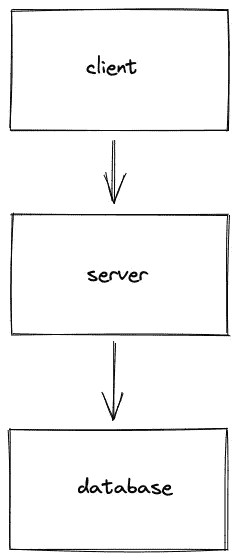****

****简化的 URL 缩写****

****单机解决方案不满足 URL 缩短系统的可伸缩性要求。密钥生成功能从服务器转移到专用的密钥生成服务( **KGS** )以[向外扩展](https://en.wikipedia.org/wiki/Scalability)系统。****

****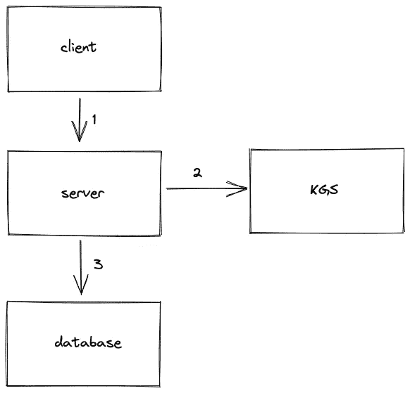****

****URL 缩写；密钥生成服务****

****缩短 URL 的不同解决方案如下:****

*   ****随机 ID 生成器****
*   ****哈希函数****
*   ****令牌范围****

## ******随机 ID 生成器解决方案******

****密钥生成服务( **KGS** )查询随机标识符( **ID** )生成服务以缩短 URL。该服务使用随机函数或通用唯一标识符生成随机 id([UUID](https://en.wikipedia.org/wiki/Universally_unique_identifier))。必须提供随机 ID 生成服务的多个实例，以满足可伸缩性的需求。****

****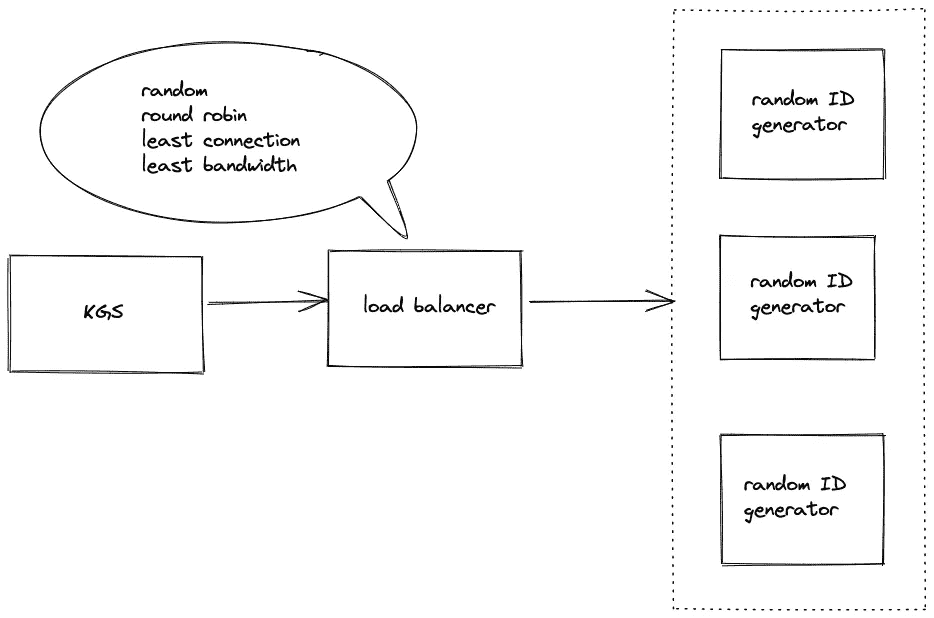****

****URL 缩写；随机 ID 生成器****

****随机 ID 生成服务必须是无状态的，以便于复制服务进行扩展。使用[负载平衡器](https://en.wikipedia.org/wiki/Load_balancing_(computing))将入口分配给随机 ID 生成服务。路由流量的潜在负载平衡算法如下:****

*   ****循环赛****
*   ****最少联系****
*   ****最小带宽****
*   ****[模哈希](https://www.cs.cornell.edu/courses/cs312/2008sp/lectures/lec21.html#:~:text=With%20modular%20hashing,%20the%20hash,lowest-order%20bits%20of%20k.)函数****
*   ****[一致哈希](https://systemdesign.one/consistent-hashing-explained/)****

****当大量客户端同时输入相同的长 URL 时，[一致哈希](https://systemdesign.one/consistent-hashing-explained/)或基于模哈希函数的负载平衡算法可能会导致不平衡的(**热**)副本。由于输出的随机性，KGS 必须验证生成的短 URL 是否已经存在于数据库中。****

****随机 ID 生成解决方案具有以下权衡:****

*   ****由于随机性，冲突的概率很高****
*   ****打破短 URL 和长 URL 之间的一对一映射****
*   ****需要服务器之间的协调来防止冲突****
*   ****频繁验证数据库中短 URL 的存在是一个瓶颈****

****随机 ID 生成解决方案的另一个**选择**是使用 Twitter 的[雪花](https://blog.twitter.com/engineering/en_us/a/2010/announcing-snowflake)【8】。雪花输出的长度是 64 位。雪花输出的 base62 编码产生 11 个字符的输出，因为每个 base62 编码的字符消耗 6 位。雪花 ID 由以下实体的组合生成(实际实现可能会有所不同):****

*   ****时间戳****
*   ****[数据中心](https://en.wikipedia.org/wiki/Data_center) ID****
*   ****工作节点 ID****
*   ****序号****

****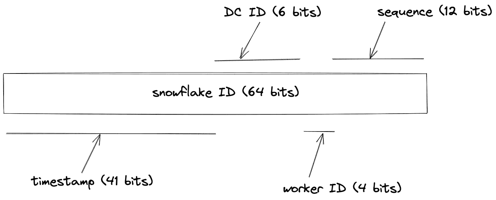****

****Twitter 雪花 ID****

****使用雪花 ID 缩短 URL 的缺点如下:****

*   ****由于比特重叠，冲突的概率更高****
*   ****由于已知位，生成的短 URL 变得可预测****
*   ****由于服务器之间的时间同步，增加了系统的复杂性****

****在*总结*中，不要使用随机 ID 生成器解决方案来缩短 URL。****

## ******哈希函数解决方案******

****KGS 查询[散列函数](https://en.wikipedia.org/wiki/Hash_function)服务以缩短 URL。散列函数服务接受长 URL 作为输入，并执行诸如消息摘要算法( [**MD5**](https://en.wikipedia.org/wiki/MD5) )的散列函数来生成短 URL [9]。MD5 散列函数输出的长度是 128 位。哈希函数服务被复制以满足系统的可扩展性需求。****

****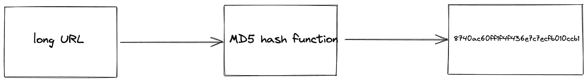****

****URL 缩写；散列长 URL****

****哈希函数服务必须是无状态的，以便于复制服务进行扩展。使用负载平衡器将入口分发到哈希函数服务。路由流量的潜在负载平衡算法如下:****

*   ****加权循环法****
*   ****最短响应时间****
*   ****IP 地址哈希****
*   ****模散列函数****
*   ****[一致哈希](https://systemdesign.one/consistent-hashing-explained/)****

****当大量客户端同时输入相同的长 URL 时，基于哈希的负载平衡算法会导致热副本。非基于哈希的负载平衡算法会导致冗余操作，因为 MD5 哈希函数会为相同的输入(长 URL)生成相同的输出(短 URL)。****

****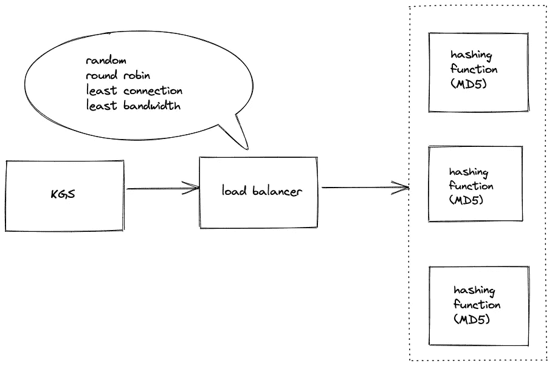****

****URL 缩写；哈希函数服务****

****MD5 输出的 *base62* 编码产生 22 个字符，因为每个 *base62* 编码的字符消耗 6 位，MD5 输出是 128 位。必须通过只考虑前 7 个字符(42 位)来截断编码输出，以保持短 URL 的可读性。但是，多个长 URL 的编码输出可能会产生相同的前缀(前 7 个字符)，从而导致冲突。随机位被附加到编码输出的后缀上，以牺牲简短的 URL 可读性为代价，使其不可预测。****

********

****URL 缩写；截断编码的 MD5 输出****

****URL 缩短的另一个散列函数是 [SHA256](https://en.wikipedia.org/wiki/SHA-2) 。然而，由于输出长度为 256 位，冲突的可能性更高。哈希函数解决方案的利弊如下:****

*   ****哈希函数产生可预测的输出****
*   ****更高的碰撞概率****

****在*摘要*中，不要使用哈希函数解决方案来缩短 URL。****

## ******令牌范围解决方案******

****KGS 查询令牌服务以缩短 URL。令牌服务的内部计数器函数生成短 URL，并且输出单调递增。****

****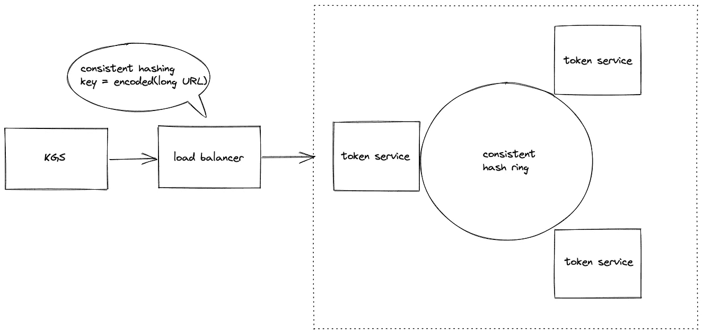****

****URL 缩写；一致哈希环中的令牌服务****

****令牌服务必须进行水平分区( [**shard**](https://en.wikipedia.org/wiki/Shard_(database_architecture)) )，以满足系统的可扩展性需求。令牌服务的潜在分片方案如下:****

*   ****[列表分区](https://en.wikipedia.org/wiki/Partition_(database))****
*   ****[模数分割](https://www.ibm.com/docs/en/iis/8.5?topic=partitioning-modulus-partitioner)****
*   ****[一致哈希](https://systemdesign.one/consistent-hashing-explained/)****

****列表和模数划分方案不满足系统的可扩展性要求，因为这两种方案都限制了令牌服务实例的数量。基于[一致性哈希](https://systemdesign.one/consistent-hashing-explained/)的分片符合系统要求，因为令牌服务通过提供新的实例而向外扩展。****

****使用负载平衡器将入口分发到令牌服务。使用[一致散列法](https://systemdesign.one/consistent-hashing-explained/)对[百分比编码的](https://en.wikipedia.org/wiki/Percent-encoding)长 URL 进行负载平衡，以保持长 URL 和短 URL 之间的一对一映射。然而，当大量客户端同时输入相同的长 URL 时，基于[一致散列](https://systemdesign.one/consistent-hashing-explained/)的负载平衡器可能会导致热碎片。****

****令牌服务实例的输出必须不重叠，以防止冲突。一个高度可靠的分布式服务，如 [Apache Zookeeper](https://zookeeper.apache.org/) 或 Amazon [DynamoDB](https://aws.amazon.com/dynamodb/) 用于协调令牌服务实例的输出范围。协调令牌服务实例之间的输出范围的服务被命名为**令牌范围服务**。****

****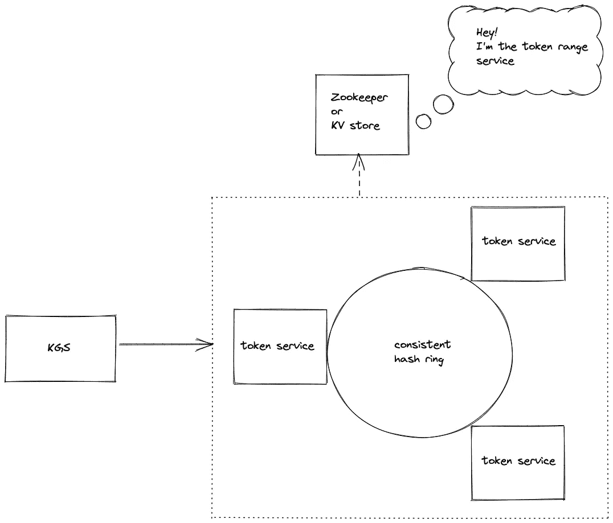****

****URL 缩写；令牌范围服务****

****当选择键值存储作为令牌范围服务时，必须将[仲裁](https://en.wikipedia.org/wiki/Quorum_(distributed_computing)#:~:text=A%20quorum%20is%20the%20minimum,operation%20in%20a%20distributed%20system.)设置为更高的值，以提高令牌范围服务的一致性。更强的一致性通过防止多个令牌服务获取相同的输出范围来防止范围冲突。****

****当令牌服务的实例被提供时，新的实例执行对来自令牌范围服务的输出范围的请求。当提取的输出范围完全用尽时，令牌服务向令牌范围服务请求新的输出范围。****

****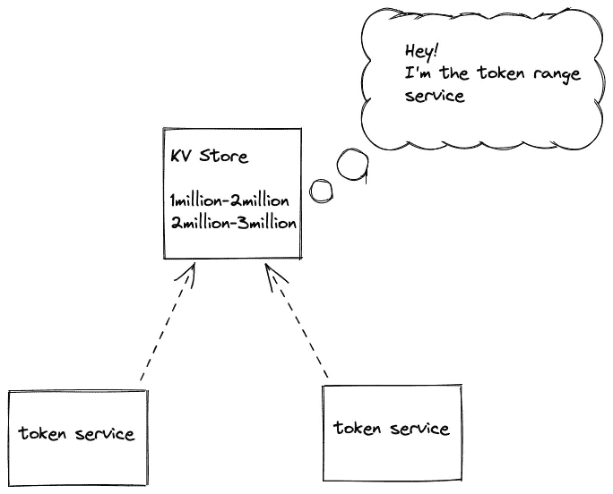****

****URL 缩写；令牌范围服务****

****如果频繁查询，令牌范围服务可能会成为瓶颈。必须增加输出范围或令牌范围服务副本的数量，以提高系统的可靠性。令牌范围解决方案是无冲突和可伸缩的。然而，由于单调增加的输出范围，短 URL 是可预测的。以下操作降低了缩短的 URL 的可预测性:****

*   ****将随机位附加到输出的后缀****
*   ****令牌范围服务提供随机输出范围****

****使用令牌服务生成短 URL 的时间复杂度是常数 O(1)。相反，KGS 必须在缩短 URL 之前执行以下操作之一，以保留一对一映射:****

*   ****查询数据库以检查长 URL 是否存在****
*   ****使用 *putIfAbsent* 程序检查长 URL 是否存在****

****查询数据库是一项昂贵的操作，因为磁盘输入/输出( **I/O** )和大多数 NoSQL 数据存储由于最终的一致性而不支持 *putIfAbsent* 过程。****

****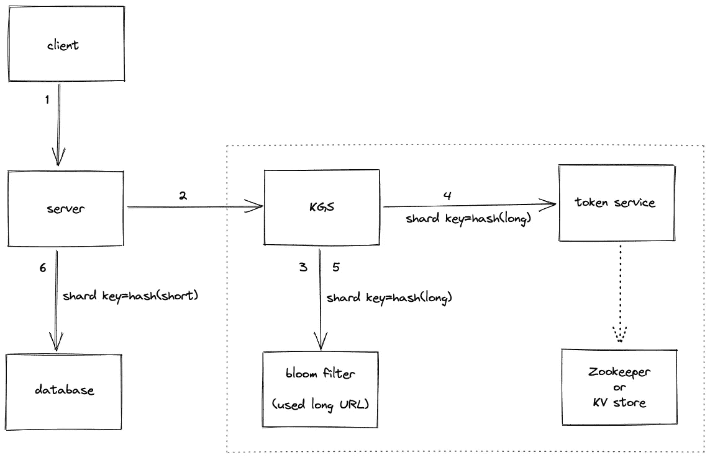****

****URL 缩写；布隆过滤器****

****布隆过滤器用于防止在 URL 缩短时进行昂贵的数据存储查找。布隆过滤器查询的时间复杂度是常数 O(1) [10]。在缩短长 URL 之后，KGS 用长 URL*填充布隆过滤器。当客户端输入定制的短 URL 时，KGS 查询布隆过滤器，以在将定制的短 URL 保存到数据存储之前检查长 URL 是否存在。但是，bloom filter 查询可能会产生误报，从而导致数据库查找。此外，布隆过滤器增加了系统的操作复杂性。*****

****当客户机输入一个已经存在的长 URL 时，KGS 必须返回适当的短 URL，但是数据库是用短 URL 作为分区键进行分区的。作为分区键的短 URL 与 URL 缩写符的读写路径产生共鸣。****

****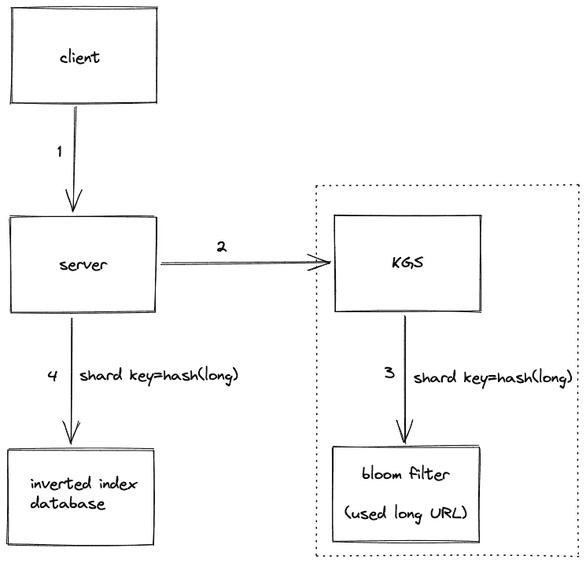****

****URL 缩写；倒排索引数据存储(长 URL:短 URL)****

****查找短 URL 的一个简单的解决方案是在数据存储的长 URL 列上构建一个索引[。然而，数据库索引的引入降低了写性能，并且由于使用短 URL 键的分片，查询仍然很复杂。](https://en.wikipedia.org/wiki/Database_index)****

****最佳解决方案是引入一个额外的数据存储(倒排索引),从长 URL 映射到短 URL(键值模式)。额外的数据存储改善了查找已经存在的长 URL 记录的短 URL 的时间复杂度。另一方面，额外的数据存储会增加存储成本。使用[一致哈希](https://systemdesign.one/consistent-hashing-explained/)对附加数据存储进行分区。分区键是快速找到 URL 记录的长 URL。诸如 DynamoDB 之类的键值存储被用作附加的数据存储。****

****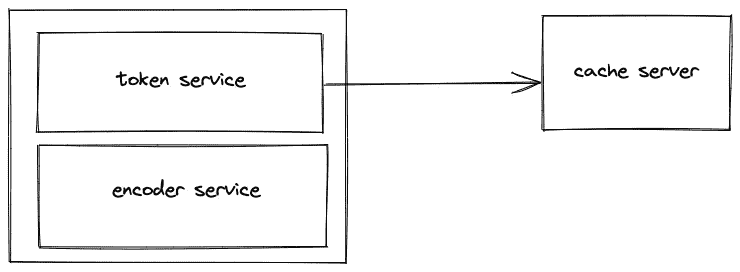****

****URL 缩写；扩展令牌服务****

****令牌服务在内存中存储一些短的 URL(**密钥**)，以便令牌服务快速向传入的请求提供密钥。令牌服务中的密钥必须由原子数据结构分发，以处理并发请求。存储在令牌服务存储器中的输出范围被标记为用于防止冲突。将密钥存储在内存中的缺点是在服务器出现故障时会丢失密钥的特定输出范围。必须将输出范围移至外部缓存服务器，以横向扩展令牌服务并提高其可靠性。****

****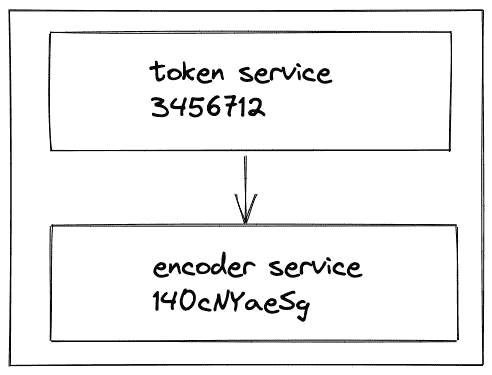****

****URL 缩写；令牌服务器****

****令牌服务的输出必须在令牌服务器内使用编码服务进行编码，以防止外部网络通信。一个附加函数执行令牌服务输出的编码。****

****在*摘要*中，使用令牌范围解决方案来缩短 URL。****

## ******读取路径******

****服务器将缩短的 URL 重定向到原来的长 URL。单机 URL 重定向的简化框图如下:****

********

****简化的 URL 重定向****

****单机解决方案不能满足大量读取的系统的 URL 重定向的可伸缩性要求。频繁的数据库访问导致的磁盘 I/O 是一个潜在的瓶颈。****

****URL 重定向流量(**出口**)按照 [80/20 规则](https://en.wikipedia.org/wiki/Pareto_principle)进行缓存，以改善延迟。缓存存储短 URL 和长 URL 之间的映射。缓存处理 URL 重定向中的不均衡流量和流量峰值。在访问数据存储之前，服务器必须查询缓存。[缓存备用模式](https://github.com/donnemartin/system-design-primer#cache-aside)用于更新缓存。当发生缓存未命中时，服务器查询数据存储并填充缓存。使用缓存备用模式的代价是初始请求的延迟。由于存储在缓存中的数据是受内存限制的，所以当缓存服务器已满时，使用最近最少使用([**【LRU】**](https://en.wikipedia.org/wiki/Cache_replacement_policies#Least_recently_used_(LRU)))策略来驱逐缓存。****

****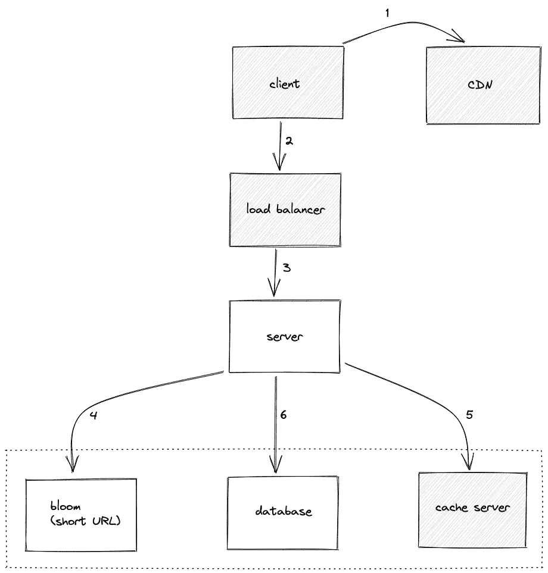****

****URL 重定向；不同层的缓存****

****为了实现可扩展性，在系统的以下层引入了缓存:****

*   ****客户****
*   ****内容交付网络( [**CDN**](https://en.wikipedia.org/wiki/Content_delivery_network) )****
*   ****反向代理****
*   ****专用缓存服务器****

****CDN 或专用缓存服务器等共享缓存可降低系统负载。另一方面，私有缓存只能由客户端访问，不会显著提高系统性能。最重要的是，私有缓存的 TTL 定义是至关重要的，因为私有缓存失效是困难的。在以下系统组件之间提供专用缓存服务器，如 [Redis](https://redis.io/) 或 [Memcached](https://memcached.org/) ，以进一步改善延迟:****

*   ****服务器和数据存储****
*   ****负载平衡器和服务器****

****客户端使用 URL 缩短程序的典型模式是缩短 URL，并且只访问一次短 URL。单次访问使用模式的缓存更新导致缓存[失效](https://en.wikipedia.org/wiki/Thrashing_(computer_science))。在缓存服务器和 CDN 上引入了短 URL 上的 bloom 过滤器，以防止缓存抖动。布隆过滤器在初始访问短 URL 时被更新。仅当已经设置了布隆过滤器(对同一个短 URL 的多个请求)时，才更新缓存服务器。****

****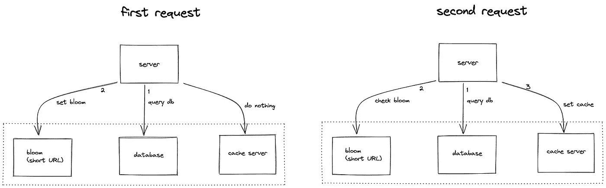****

****URL 重定向；缓存更新****

****如果短 URL 不存在，则不得查询缓存和数据存储。在*短网址*上引入了布隆过滤器，以防止不必要的查询。如果 bloom 过滤器中没有短 URL，则返回一个 HTTP 状态代码 *404* 。如果在 bloom 过滤器中设置了短 URL，则将重定向请求委托给缓存服务器或数据存储。****

****通过执行以下操作来横向扩展缓存服务器:****

*   ****对缓存服务器进行分区(使用短 URL 作为分区密钥)****
*   ****使用[领导者-追随者拓扑](https://redis.io/docs/management/replication/)复制缓存服务器以处理繁重的负载****
*   ****将写操作重定向到引导****
*   ****将所有读取操作重定向到跟随器副本****

****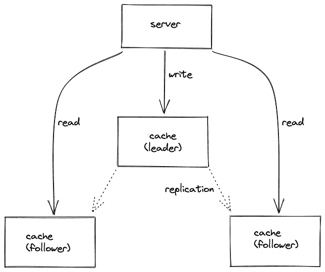****

****URL 重定向；扩展缓存服务器****

****当多个相同的请求同时到达缓存服务器时，缓存服务器将[折叠这些请求](https://developer.mozilla.org/en-US/docs/Web/HTTP/Caching#request_collapse)，并代表客户端向源服务器转发一个请求。响应在所有客户端之间重复使用，以节省带宽和系统资源。****

****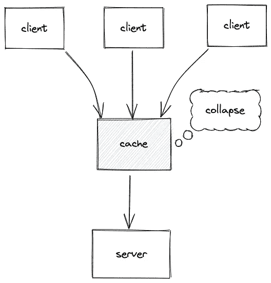****

****URL 重定向；缓存服务器折叠转发****

****为了满足 URL 重定向的可伸缩性需求，引入了以下中间组件:****

*   ****域名系统( [**DNS**](https://en.wikipedia.org/wiki/Domain_Name_System) )****
*   ****负载平衡器****
*   ****反向代理****
*   ****加拿大****
*   ****控制器服务自动扩展服务****

****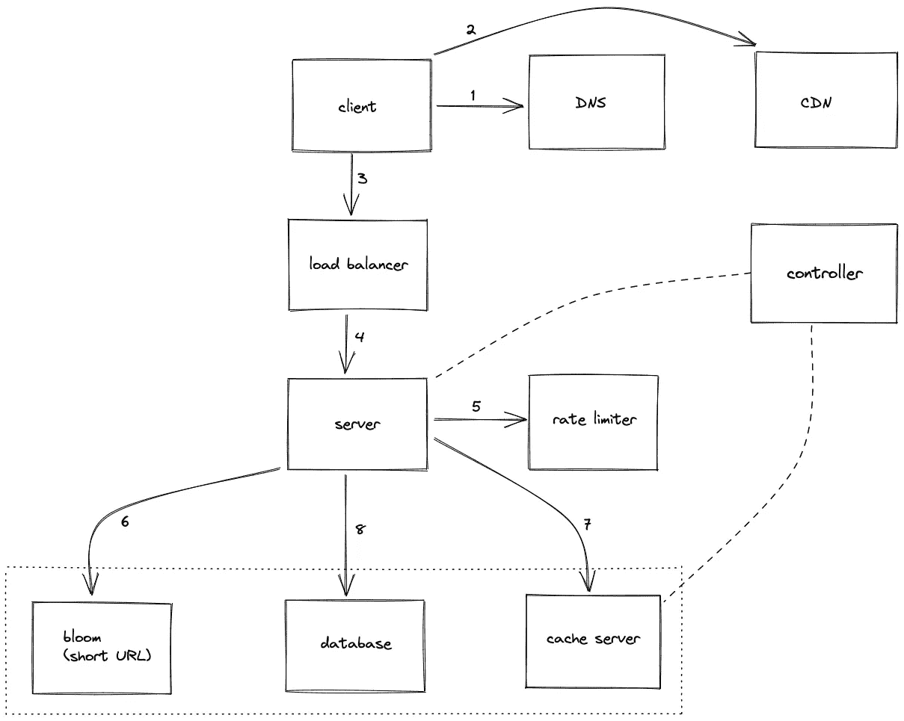****

****URL 重定向工作流****

****以下智能 [DNS 服务](https://github.com/donnemartin/system-design-primer#domain-name-system)改进了 URL 重定向:****

*   ****加权循环****
*   ****基于延迟****
*   ****基于地理定位****

****反向代理用作[应用编程接口网关](https://aws.amazon.com/api-gateway/)。反向代理以增加系统复杂性为代价执行 [SSL 终止](https://en.wikipedia.org/wiki/TLS_termination_proxy)和压缩。当一个非常流行的短 URL 同时被成千上万的客户端访问时，反向代理[会折叠转发](https://wiki.squid-cache.org/Features/CollapsedForwarding)请求，以减少系统负载。必须在以下系统组件之间引入负载平衡器，以便在副本或碎片之间路由流量:****

*   ****客户端和服务器****
*   ****服务器和数据库****
*   ****服务器和缓存服务器****

****CDN 以增加的财务成本为代价从更靠近客户端的位置提供内容。[拉 CDN](https://github.com/donnemartin/system-design-primer#content-delivery-network) 方法符合 URL 重定向要求。提供专用控制器服务，根据系统负载自动扩展或缩减系统组件。****

****[微服务](https://en.wikipedia.org/wiki/Microservices)架构提高了系统的容错能力。像 [Etcd](https://etcd.io/) 或 Zookeeper 这样的服务帮助服务找到彼此(被称为服务发现)。此外，Zookeeper 被配置为通过发送定期心跳信号来监控系统中服务的健康状况。微服务架构的缺点是增加了操作的复杂性。****

# ****设计深度潜水****

## ****有效性****

****以下配置提高了系统的可用性:****

*   ****负载平衡器以主动-主动或主动-被动模式运行****
*   ****KGS 以主动-主动或主动-被动模式运行****
*   ****每天至少备份一次存储服务器到对象存储，如 AWS S3，以帮助[灾难恢复](https://www.vmware.com/topics/glossary/content/disaster-recovery.html)****
*   ****限制流量速率以防止 [DDoS 攻击](https://en.wikipedia.org/wiki/Denial-of-service_attack)和恶意用户****

## ****限速****

****速率限制系统防止恶意客户端降低服务质量。以下实体用于识别速率限制的客户端:****

*   ****注册客户端的 API 开发者密钥****
*   ****匿名客户端的 HTTP cookie****

****API 开发者密钥要么作为 JSON Web 令牌( [**、JWT**](https://jwt.io/) )参数传输，要么作为定制的 HTTP 头传输。互联网协议( **IP** )地址也用于限制客户端的速率。****

## ****可量测性****

****扩展系统是一个迭代的过程。重复执行以下动作来缩放系统[11]:****

1.  ****基准测试或负载测试****
2.  ****瓶颈或[单点故障](https://en.wikipedia.org/wiki/Single_point_of_failure) ( **SPOF** )的概况****
3.  ****解决瓶颈****

****URL 缩短器的读取和写入路径被分离，以改善延迟并防止网络带宽成为瓶颈。****

****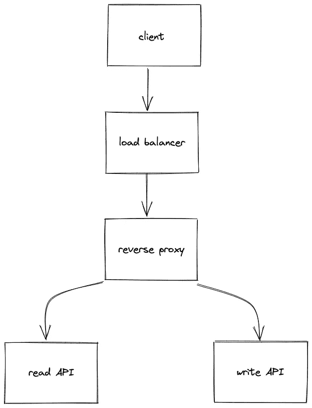****

****URL 缩写；分离的读写路径****

****横向扩展服务的一般准则如下:****

*   ****保持服务无状态****
*   ****对服务进行分区****
*   ****复制服务****

## ****容错****

****微服务架构提高了系统的容错能力。微服务相互隔离，服务会独立失效。简而言之，服务失败意味着功能减少，而不会导致整个系统瘫痪。例如，度量服务的失败不会影响 URL 重定向请求。[事件驱动架构](https://en.wikipedia.org/wiki/Event-driven_architecture)也有助于隔离服务和提高系统的可靠性，并通过自然支持多个消费者来扩展。****

****诸如 [Apache Kafka](https://kafka.apache.org/) 的消息队列的引入进一步提高了 URL 缩短器的容错能力。必须在系统的写入和读取路径中提供消息队列。然而，为了可靠性，消息队列必须经常进行[检查点检查](https://en.wikipedia.org/wiki/Application_checkpointing)。****

****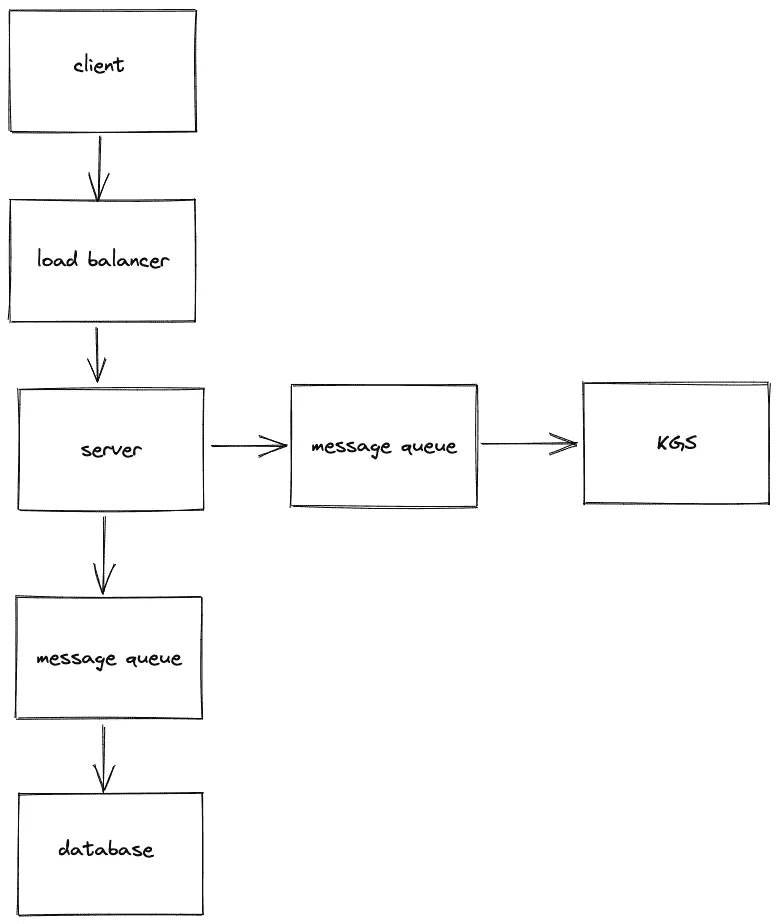****

****URL 缩写；信息排队****

****使用消息队列的原因如下[12]:****

*   ****隔离组件****
*   ****允许并发操作****
*   ****独立失败****
*   ****异步处理****

****使用消息队列的利弊如下:****

*   ****使系统异步****
*   ****增加了整个系统的复杂性****

****优化系统容错能力的进一步措施如下:****

*   ****在服务之间实现背压，以防止级联故障****
*   ****当发生故障时，服务必须指数级回退，以实现更快的恢复****
*   ****使用 [Paxos](https://en.wikipedia.org/wiki/Paxos_(computer_science)) 或 [Raft](https://en.wikipedia.org/wiki/Raft_(algorithm)) 共识算法实现领袖选举****
*   ****快照或检查点状态服务，如布隆过滤器****

## ****分割****

****以下有状态服务是为可伸缩性而划分的:****

****URL 缩写；分区服务****

## ****并发****

****kg 必须在分发短 URL 的原子数据结构上获取一个[互斥体](https://en.wikipedia.org/wiki/Mutual_exclusion) ( **锁**)或一个[信号量](https://en.wikipedia.org/wiki/Semaphore_(programming))来处理并发性。该锁防止将相同的短 URL 分配给来自 kg 的不同的缩短请求，从而导致冲突。多个数据结构将短 URL 分布在令牌服务的单个实例中，以改善延迟。使用短 URL 时，必须解除锁定。****

****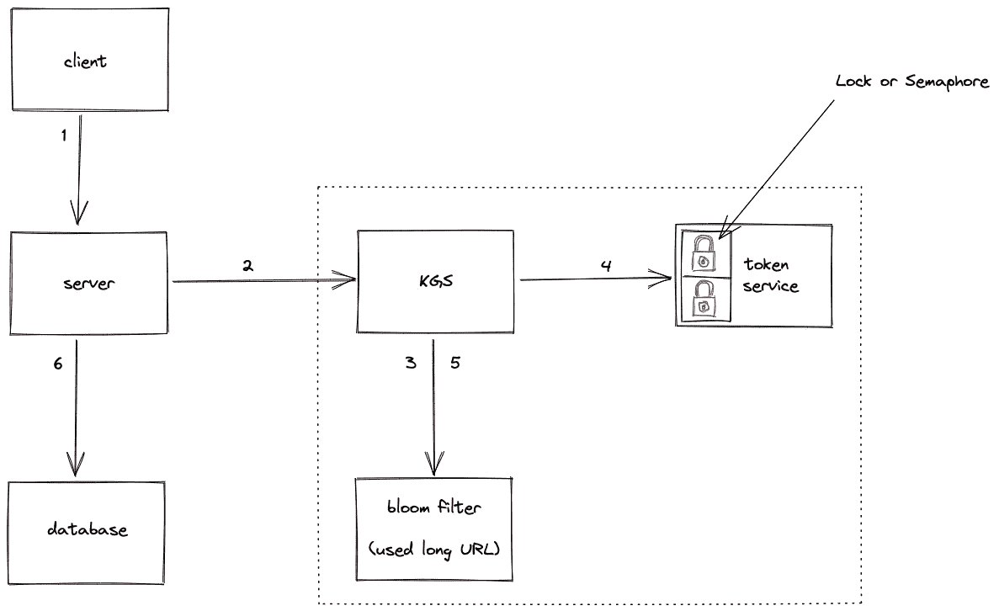****

****URL 缩写；锁定令牌服务****

****当多个客户端同时输入同一个长 URL 时，所有客户端都必须收到同一个短 URL。解决这个问题的一个简单方法是引入一个消息队列，并将重复的请求分组。另一种次优方法是使用反向代理的折叠转发功能。然而，在分布式系统中可能存在多个反向代理。最佳解决方案是使用分布式锁，如 [Chubby](https://static.googleusercontent.com/media/research.google.com/en//archive/chubby-osdi06.pdf) 或 Redis 锁。必须在长 URL 上获取分布式锁。分布式锁内部使用 Raft 或 Paxos 一致算法。****

****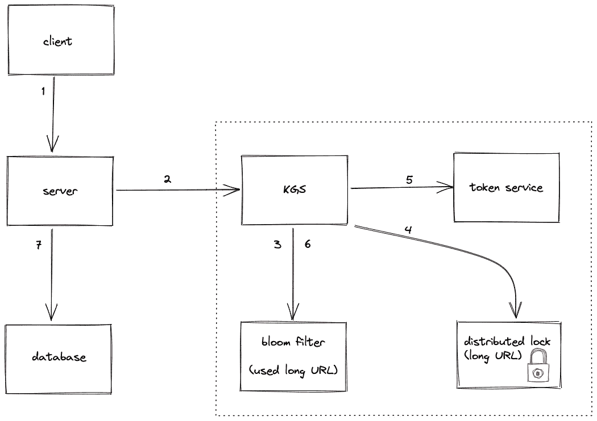****

****URL 缩写；分布式锁****

****当客户端输入自定义 URL 时，也必须使用分布式锁服务来防止冲突。必须在分布式锁上设置合理的 TTL，以防止饥饿。使用分布式锁的代价是延迟略有下降。如果 URL 之间的一对一映射不是系统需求，则分布式锁服务是不必要的。高度并发系统中的 URL 缩短工作流如下:****

1.  ****KGS 检查布隆过滤器是否存在长 URL****
2.  ****获取长 URL 上的分布式锁****
3.  ****缩短长 URL****
4.  ****用长 URL 填充布隆过滤器****
5.  ****释放分布式锁****

****布隆过滤器中的线程安全是使用并发位集来实现的。代价是增加了一些写操作的延迟。必须在 bloom filter 上获取锁来处理并发性。名为 [*的布隆过滤器的变体朴素条带布隆*](https://github.com/iamthebot/hyperbloom) 过滤器以额外空间为代价支持高度并发读取。****

# ****分析学****

****对客户端的使用模式进行分析是 URL 缩短服务的关键特性之一。一些流行的网址缩短服务，如 Bitly，通过提供网址重定向分析来赚钱。URL 重定向请求的 HTTP 头用于收集数据以生成分析。此外，客户端的 IP 地址标识了国家或位置。对分析有用的最流行的 HTTP 头如下:****

****URL 缩写；用于分析的 HTTP 标题****

****生成分析的工作流程如下[12]:****

1.  ****客户端请求 URL 重定向****
2.  ****服务器用长 URL 响应****
3.  ****服务器将消息放在消息队列中****
4.  ****存档服务执行批处理操作，将消息从消息队列移动到 HDFS****
5.  ****在 HDFS 上对收集的数据执行 Hadoop 以生成离线分析****

****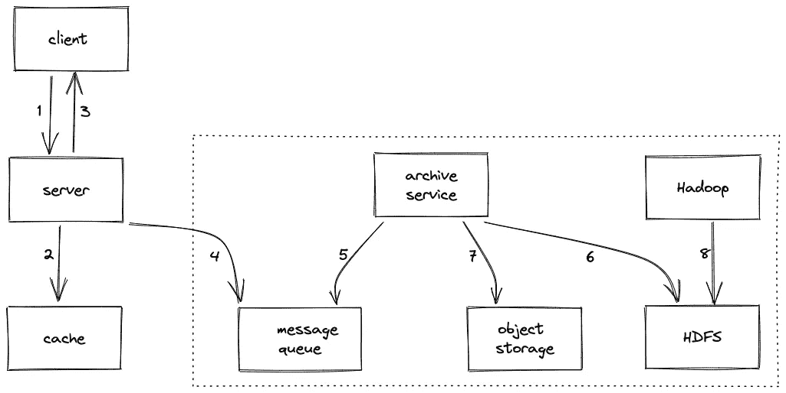****

****URL 缩写；分析学****

****诸如 Amazon Redshift 或 [Snowflake](https://www.snowflake.com/en/) 之类的数据仓库解决方案可以用于分析数据库。****

# ****数据库清理****

****数据库中过期的记录将被删除，以节省存储成本。主动删除数据库中的过期记录可能会使数据库过载并降低服务质量。从数据库中删除过期记录的方法如下:****

*   ****惰性去除****
*   ****专用清理服务****

****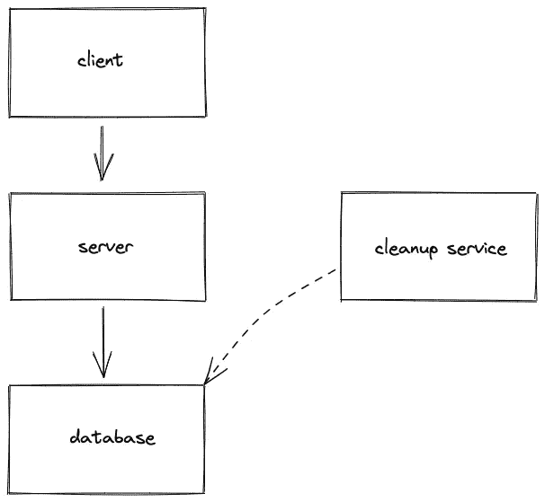****

****URL 缩写；数据库清理****

## ****惰性去除****

****当客户端试图访问过期的短 URL 时，从数据库中删除该记录。服务器用状态码 *404 未找到*响应客户端。另一方面，如果客户端从不访问过期的记录，该记录将永远留在那里，并消耗存储空间。****

## ****专用清理服务****

****必须在非高峰(低流量)时段执行专门的清理服务来删除过期的短 URL。清理服务扫描整个数据库以查找过期的记录。如果在执行清理服务期间流量突然激增，则必须停止清理服务，并且系统退回到延迟移除方法。****

# ****档案馆****

****数据库中未使用的数据被存档以节省存储成本。频繁访问的数据被归类为热数据，而长时间(假设时间范围为 3 年)未被访问的数据被归类为冷数据。****

****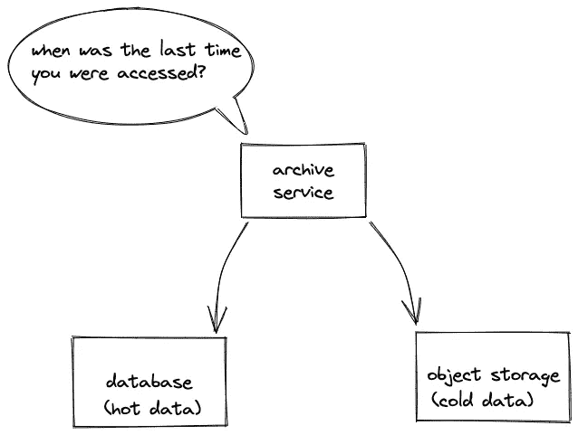****

****URL 缩写；存档工作流****

****数据库的 *last_visited* 时间戳列用于数据分类。在非高峰时段，冷数据被压缩并存储在对象存储(AWS S3)中，以避免服务降级。然而，对象存储和数据分类的维护是额外的操作工作。仅当您确定将来不会访问未使用的数据时，才必须对其进行归档。****

# ****监视****

****监控对于在系统故障导致实际问题之前识别系统故障以提高系统的可用性至关重要。监控通常通过在每个服务器(服务)上安装代理来实现。代理收集和聚合指标，并将结果数据发布到中央监控服务。仪表板被配置为可视化数据[13]。****

****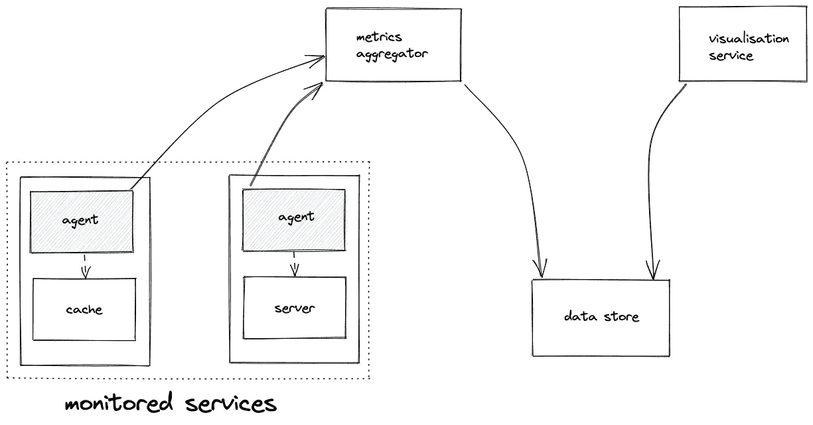****

****URL 缩写；监视****

****需要集中式日志记录来快速隔离故障原因，而不是在服务器之间跳跃。流行的日志聚合和监控服务有 [fluentd](https://www.fluentd.org/) 和 [datadog](https://www.datadoghq.com/) 。 [sidecar](https://learn.microsoft.com/en-us/azure/architecture/patterns/sidecar) 设计模式用于运行代理和收集指标。为了获得最佳结果，通常必须监控以下指标:****

*   ****操作系统( [CPU](https://en.wikipedia.org/wiki/Central_processing_unit) 负载、内存、磁盘 I/O)****
*   ****通用服务器(缓存命中率，每秒查询数)****
*   ****应用程序(延迟、故障率)****
*   ****业务(登录次数、财务成本)****

# ****安全性****

****下面的列表涵盖了一些最流行的安全措施[14]:****

*   ****使用 [JWT](https://jwt.io/) 令牌进行授权****
*   ****限制请求的速率****
*   ****加密数据****
*   ****净化用户输入以防止跨站点脚本( [XSS](https://en.wikipedia.org/wiki/Cross-site_scripting) )****
*   ****使用参数化查询来防止 [SQL 注入](https://en.wikipedia.org/wiki/SQL_injection)****
*   ****使用[最小特权](https://en.wikipedia.org/wiki/Principle_of_least_privilege)的原则****

# ****摘要****

****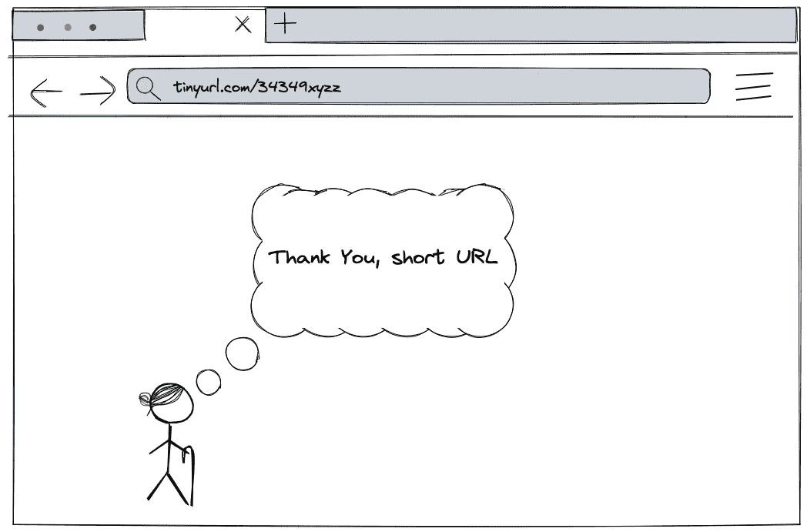****

****缩短的 URL****

****URL 缩短服务是一个常见的系统设计面试问题。尽管 URL 缩短器的用例看起来微不足道，但构建一个互联网规模的 URL 缩短器是一项具有挑战性的任务。****

# ****问题和解决方案****

****如果你想挑战你的知识，请访问文章:[知识测试](/@system-design/knowledge-test-url-shortening-system-design-ad80b7e3073f)****

# ****许可证****

****[**【CC BY-NC-ND**](https://creativecommons.org/licenses/by-nc-nd/4.0/):本许可证允许重用者以任何媒体或格式，仅出于非商业目的，以未经改编的形式复制和分发本文中的内容，并且仅在注明作者的情况下。原文章**必须反向链接**。****

# ****参考****

****[1] [网址缩短](https://en.wikipedia.org/wiki/URL_shortening)，Wikipedia.org****

****[2] [TinyURL OpenAPI](https://tinyurl.com/app/dev) ，tinyurl.com****

****[3] [比特开发者 API](https://dev.bitly.com/docs/tutorials/shorten-customize-links/) ，dev.bitly.com****

****[4]多恩·马丁，[RPC 与 REST 的系统设计入门比较](https://github.com/donnemartin/system-design-primer#remote-procedure-call-rpc)，github.com****

****[5]【mozilla.org MDN 网络文档 HTTP 状态码****

****[6][mozilla.org HTTP](https://developer.mozilla.org/en-US/docs/Web/HTTP/Redirections)中的 MDN web 文档重定向****

****[7]索菲，[大数据系统设计【tinyurl】](http://n00tc0d3r.blogspot.com/)(2013)，blogspot.com****

****[8]莱恩·金，[宣布雪花](https://blog.twitter.com/engineering/en_us/a/2010/announcing-snowflake) (2010)，blog.twitter.com****

****[9] [MD5 哈希函数](https://en.wikipedia.org/wiki/MD5)，Wikipedia.org****

****[10] [布鲁姆过滤器](https://en.wikipedia.org/wiki/Bloom_filter)，Wikipedia.org****

****[11]多恩·马丁，[设计 Pastebin.com(或 Bit.ly)](https://github.com/donnemartin/system-design-primer/tree/master/solutions/system_design/pastebin) (2017)，github.com****

****[12] Todd Hoff， [Bitly:建立一个每月处理 60 亿次点击的分布式系统的经验教训](http://highscalability.com/blog/2014/7/14/bitly-lessons-learned-building-a-distributed-system-that-han.html) (2014)，highscalability.com****

****[13][Artur ejs mont(2015)为创业工程师提供的网络可扩展性](https://www.amazon.com/Scalability-Startup-Engineers-Artur-Ejsmont/dp/0071843655)****

****[14]多恩·马丁，[系统设计初级安全指南](https://github.com/donnemartin/system-design-primer#security) (2017)，github.com****