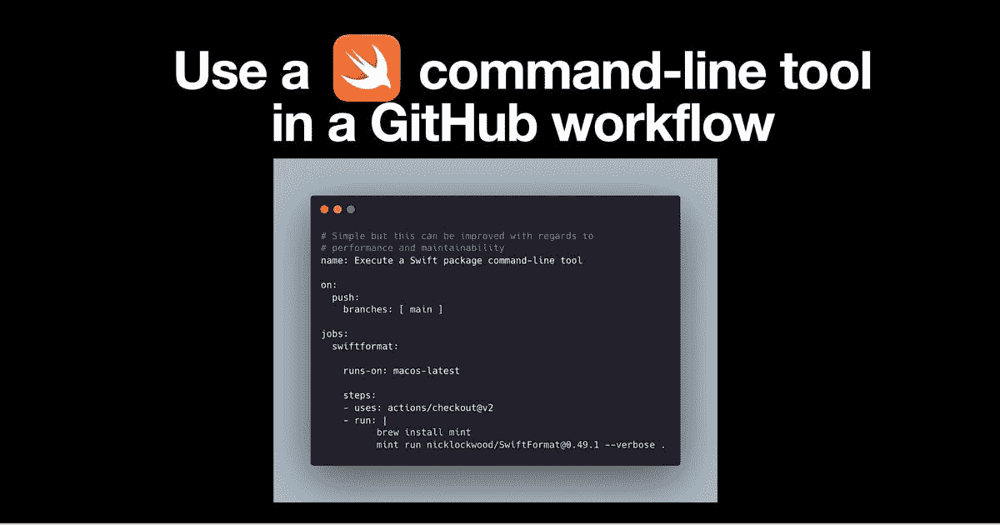

# 在 GitHub 工作流程中使用 Swift 命令行工具

> 原文：<https://medium.com/nerd-for-tech/use-a-swift-command-line-tool-in-a-github-workflow-69d0331886b1?source=collection_archive---------7----------------------->



这篇博文是为你写的，如果

*   您正在为 CI/CD 使用 GitHub 操作和工作流
*   你不知道如何在 GitHub 工作流*或*中使用 Swift 命令行工具
*   您想知道您的工作流(执行 Swift 命令行工具)是否可以在性能或可维护性方面得到改进

我的例子:我想使用 [Swiftformat](https://github.com/nicklockwood/SwiftFormat) ，一个命令行工具来重新格式化我当前的 GitHub 存储库中的 Swift 代码。

# 简单溶体

```
name: Execute a Swift package command-line toolon:
  push:
    branches: [ main ]jobs:
  swiftformat:runs-on: macos-lateststeps:
    - uses: actions/checkout@v2
    - run: |
          brew install mint
          mint run nicklockwood/SwiftFormat@0.49.1 --verbose .
```

该工作流程将

1.  安装 [Mint](https://github.com/yonaskolb/Mint) ，一个安装并运行 Swift 命令行工具包的包管理器
2.  使用 Mint 下载、从源代码构建，然后运行 Swift 包的可执行文件

这种工作流程的简单性有几个缺点:

*   每次执行工作流时，Swift 包都是从源代码构建的
*   当更改要使用的命令行工具的版本时，我必须更改工作流代码，例如，在将来的某个时候，我想使用版本 0.50.0

我将一步一步地解释如何改进上面的工作流程。你可以在这篇博文的末尾复制完整的和改进的工作流程。

# 逐步的改进

首先，在您的存储库的根目录下创建一个`Mintfile`。

```
nicklockwood/SwiftFormat@0.49.1
```

> Mintfile 可以指定一个版本化包列表。它使安装和运行这些软件包变得容易，因为具体的 repos 和版本是集中的。

然后修改您的工作流程，利用 GitHub action [cache](https://github.com/actions/cache) 来缓存 Mint 安装和构建的 Swift 包。

```
- name: Cache/Restore Mint packages
      id: mint-cache
      uses: actions/cache@v2
      with:
          path: ${{ github.workspace }}/mint
          key: ${{ runner.os }}-mint-${{ hashFiles('**/Mintfile') }}
          restore-keys: ${{ runner.os }}-mint-
```

为了可读性更好，我们把 Mint 的安装分开。如果 Mint 已经安装，让我们升级。

```
- name: Install package manager "Mint" to install and run Swift command line tool packages
  run: |
    brew upgrade mint || brew install mint || true
```

现在重要的部分来了:如果没有缓存版本，只安装和构建 Swift 包。

```
- name: Install command line tool (if not yet cached)
  if: steps.mint-cache.outputs.cache-hit != 'true'
  run: mint bootstrap
```

通过`mint bootstrap`，包管理器将找到在`Mintfile`中声明的版本并安装该版本。

最后一步，让我们运行命令行工具。

```
- name: Run command line tool
  run: mint run swiftformat --verbose .
```

Mint 将在已安装的包中搜索最新的标签，并在抛弃该版本时运行该版本。

整个改进的工作流程:

```
name: Execute Swift package command-line toolon:
  push:
    branches: [ main ]jobs:
  swiftformat:runs-on: macos-lateststeps:
    - uses: actions/checkout@v2
    - name: Cache/Restore Mint packages
      id: mint-cache
      uses: actions/cache@v2
      with:
          path: ${{ github.workspace }}/mint
          key: ${{ runner.os }}-mint-${{ hashFiles('**/Mintfile') }}
          restore-keys: ${{ runner.os }}-mint-
    - name: Install package manager "Mint" to install and run Swift command line tool packages
      run: |
          brew upgrade mint || brew install mint || true
    - name: Install command line tool (if not yet cached)
      if: steps.mint-cache.outputs.cache-hit != 'true'
      run: mint bootstrap
    - name: Run command line tool
      run: mint run swiftformat --verbose .
```

步骤“安装命令行工具(如果尚未缓存)”将仅在第一次运行工作流时执行。后续工作流运行将跳过该步骤，因为上一步“缓存/恢复新包”将从第一次工作流运行中恢复缓存。

*最初发布于*[*https://blog . ei dinger . info*](https://blog.eidinger.info/use-a-swift-command-line-tool-in-a-github-workflow)*。*