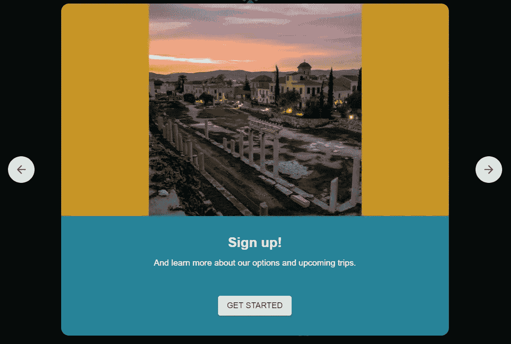
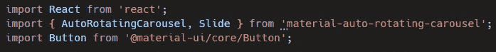
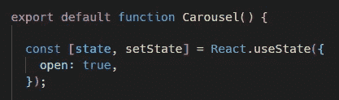
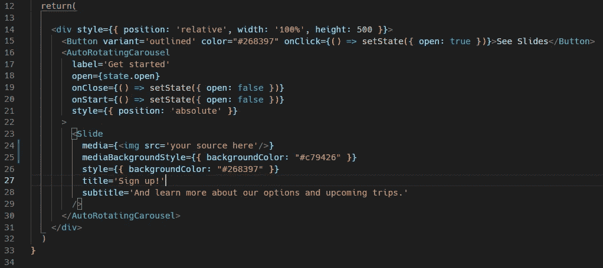

# 使用自动旋转的转盘来传递您的应用程序的电梯间推介

> 原文：<https://medium.com/nerd-for-tech/use-an-auto-rotating-carousel-to-deliver-your-apps-elevator-pitch-923d94f7130d?source=collection_archive---------22----------------------->



无论你是在为别人的企业做网站，还是在尝试推广自己的应用，你都需要找到一种方法来快速抓住你的观众的注意力，并说服他们采取下一步行动。当我在一个项目的登录页面中试图找到一种有效的方法来做到这一点时，我遇到了 material-UI 中的一个自动旋转的转盘，它是可定制的，并被证明是一个很好的打开器。我特别喜欢这个旋转木马，因为不管它的风格如何，它在打开时会模糊屏幕的其余部分，迫使你的观众只注意你的幻灯片。这并不是特别难，但我想我可以为你们中的一些人节省一些时间，并经历所有的步骤，包括给我带来一点麻烦的几个步骤。

如果您以前没有使用过 material-UI，可以通过在控制台上运行以下命令来开始:

`npm install @material-ui/core`

完成这一步后，您可以通过在终端上运行以下两个命令来继续:

```
npm i --save material-auto-rotating-carouselnpm i --save react-swipeable-views
```

如果在运行这些命令时出现错误，您可能需要下载旧版本，可以通过在每个命令的末尾添加以下行来完成:

```
--legacy-peer-deps
```

安装完这些依赖项之后，您现在就可以创建一个新的组件并导入要显示的 carousel 了。您需要从 material-UI 导入转盘、幻灯片和按钮组件，如下所示:



然后，您需要将默认状态设置为一个对象，键为 open，值为 true。使用 React hook useState 这样做使代码的其余部分更容易，并允许您使用功能组件而不是类组件。如果您是 React 钩子的新手，useState 很容易上手，您可以在这里看到一个快速简单的例子:

[https://juancarlosmezadelatorre . medium . com/react-from-class-components-to-hooks-4cc 787290262](https://juancarlosmezadelatorre.medium.com/react-from-class-components-to-hooks-4cc787290262)

如果您赶时间，并且不熟悉 useState，我将为您提供进行此类设置所需的代码，以便您能够理解其余部分:



使用 React 中的使用状态

以这种方式设置好状态后，您可以根据需要在 carousel 中嵌套任意数量的幻灯片组件。轮播可以定制几个道具，但它们都不是必需的，而幻灯片需要媒体、副标题和标题的道具。您可以通过让您的功能组件返回以下内容来复制开头图片中显示的 carousel:



第 15 行上的按钮是可选的，只有当您希望您的观众在按下由第 17 行上的标签 prop 呈现的“get started”按钮后能够再次看到幻灯片时，您才应该包括它。正如您所看到的，您可以在线完成基本的 CSS 样式，并且可以根据需要添加任意多的幻灯片。如前所述，carousel 组件不需要任何道具，但是您可能希望更改幻灯片切换之间的默认间隔，因为我发现 3 秒(3000 毫秒)的默认值对于传递消息来说有点快。您还可以通过向 carousel 组件添加不同的道具来覆盖内联样式并进一步定制。要查看可接受道具及其角色的完整列表，请务必访问他们的 [github 主页](https://github.com/TeamWertarbyte/material-auto-rotating-carousel/tree/legacy)，并在此了解更多关于他们的 [npm 包的信息。我真诚地希望您发现这个轮播是有用的，并且我希望这篇文章能够防止您在实现过程中遇到任何问题。](https://www.npmjs.com/package/material-auto-rotating-carousel)