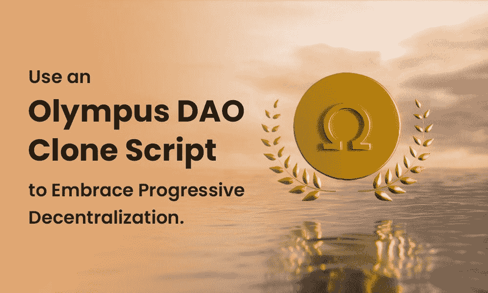

# 使用 Olympus DAO 克隆脚本来拥抱渐进的去中心化。

> 原文：<https://medium.com/nerd-for-tech/use-an-olympus-dao-clone-script-to-embrace-progressive-decentralization-f4cc4e6e6248?source=collection_archive---------10----------------------->

使用 Olympus DAO 克隆脚本来拥抱渐进的去中心化。

许多区块链项目失败的主要原因是他们使用了伪分权制。区块链倡议所有者面临的任务非常艰巨:

除了开发基于区块链的产品，他们还需要确保这些程序具有分散的功能。

很少有项目旨在逐步下放权力，因为大多数项目旨在快速成功。然而，有一个项目以 Olympus DAO 克隆脚本的形式追求“完全”去中心化策略。

这篇博客详细介绍了渐进去中心化的思想以及 Olympus DAO 是如何实现它的。

# 必须知道——什么是渐进式分权？

分散化不仅仅包括无中介的功能(从一开始)。此外，它还表明权力逐渐从创始团队转移到社区，这是逐步分权的主要目标。

在分散自治组织的帮助下，逐步实现了权力下放。但是等等，你可能想知道，Dao 到底是什么？他们是志趣相投的人组成的团体，为实现一个目标而合作。

# 如何实施渐进式分权？

在您的项目中实现全分散化所需的实验程度成倍增加。可以让您的项目逐步分散化的主要策略包括:

区块链社会普遍认为，合同一经签订，就不能再更改或修改。一种产生去中心化的技术是使用可升级的契约，该契约使用独特的代理模式。一个已经利用可升级合同的虚拟平台是分散的土地。

在合同中包括一系列不断升级的层次，每一层都赋予作者一套特定的技能。没有办法回去，因为水平只能提高，不能降低。例如，合同所有者可以在公平的竞争环境下自由测试所有游戏元素。

1.  他们改变基本因素的能力在一定程度上耗尽了
2.  合同的最后一级取消了它的所有特权。

“逐步权力下放”一词指的是实现预期结果的各种方法和技术。该项目将始终决定将其付诸实践的最佳方式。

# 奥林匹斯刀是什么？

尽管该项目通常被称为“Olympus DAO”，但它指的是一个使用 Olympus 协议实现策略选择的特定社区网络。奥林巴斯只不过是一种去中心化的储备货币，让 web3 金融部门能够不受审查的影响获得资金。

另一方面，奥林巴斯道克隆剧本的最终目的是推动产业的“去中心化”热潮。不仅如此，奥林巴斯副本还消除了 DeFi 领域的集中财务方法，并引入了逐步分散化。使用 DeFi 项目的用户可以完全控制他们的钱和钱包。

# 关于 Olympus DAO 克隆脚本的简要说明:

[***奥林巴斯道克隆脚本***](https://www.alwin.io/blog/olympus-dao-clone-script) 是一个基于 DeFi 的交换编程代码，功能与奥林巴斯道类似。使用这个组织良好的克隆脚本，人们可以快速建立一个具有严格安全准则的 DeFi。

Olympus DAO Clone 是基于 DeFi 的交易所 Olympus DAO 的 100%复制品，它允许用户快速创建一个高度安全的去中心化金融平台。

# 奥林巴斯道克隆脚本是如何工作的？

流动性是 Olympus DAO 克隆脚本的主要目标。通过保持其流动性，我们的 Olympus DAO 克隆脚本解决了流动性转移的问题。它从客户那里购买流动性，以换取出售的欧姆代币。通过持有该协议的绝大部分流动性，奥林巴斯保护了储备支持欧姆令牌的价值，并维持了该协议的流动性。通过利用其 LP 代币并提高储备的底价，即资产的市场价值，奥林巴斯可以建立自己的金库。我们可以创建一个适当的奥林巴斯克隆脚本，其中包含您想要的概念。

# 奥林巴斯道架构详解:

# 总资产金库:

代表奥林巴斯道系统内拥有和控制的所有资产的国库是重要的组成部分。7 亿美元的奥林巴斯国库余额中充满了像戴和这样支持本土欧姆代币的稳定人物。

通过使用 Olympus DAO 克隆脚本，您可以利用类似的特性和功能。债券和流动性池费用是财政部的两大收入来源。(我们接下来会讨论 LP 费用。)与政府或大公司类似，奥林巴斯出售债券来筹集资金。当您购买债券时，您同意逐步接受欧姆以换取戴、FRAX、瑞士法郎或 LP 代币。这使得奥林巴斯能够以更低的价格出售欧姆，为财政部创造收入以支持欧姆的价值。

# 协议控制的流动性:

Olympus DAO 的另一项创新是协议拥有的流动性。如前所述，任何加密货币的一个主要挑战是确保流动性。如果市场上没有足够的流动性，几乎不可能以固定价格买卖代币，因为每一笔重大交易都会引起波动。要发行新的代币，发行者必须鼓励流动性。

为了做到这一点，许多项目使用流动性池和赌注奖励，但这是昂贵的。此外，它无意中吸引了愤世嫉俗的投资者，最明显的是风险投资公司，他们利用流动性池，获取利益，然后放弃业务。这被称为“租赁流动性”

# 铆接和粘接:

奥林巴斯使用赌注作为其主要的价值累积方法，允许参与者用他们的欧姆代币来换取基础奖励。奥林巴斯债券是一种金融工具，允许协议购买资产，包括其流动性，以换取减少的治理令牌。换句话说，奥林巴斯债券不依赖外部资源，比如甲骨文公司的定价算法来计算任何两个 ERC 20 代币。

# 奥林巴斯道克隆的特点:

*   交换
*   农业
*   加密钱包集成
*   立桩标界
*   流动性池
*   投票
*   已识别的飞行物(identified flying object)
*   黏结
*   彩票

# 整理想法:

WeAlwin Technologies，一家著名的 [***Defi 开发公司***](https://www.alwin.io/decentralized-finance-defi-development) ，为潜在客户提供最佳的 Defi 服务。我们是密码市场的敏锐观察者，因此我们不怕适应和建立新的技术和商业模式。因此，我们喜欢 Olympus DAO 的额外特性和功能也就不足为奇了。基于彻底的调查，我们才华横溢的团队为雄心勃勃的加密货币业务创建了一个脚本。