# 使用 AWS 构建带有自定义图像的 Docker 容器

> 原文：<https://medium.com/nerd-for-tech/use-aws-to-build-docker-containers-with-custom-images-40db951ec403?source=collection_archive---------0----------------------->

我们将使用 NGINX 快速部署一个自定义 docker 映像，显示当前日期和时间。然后，我们将数据保存到 AWS ECR，以备后用。

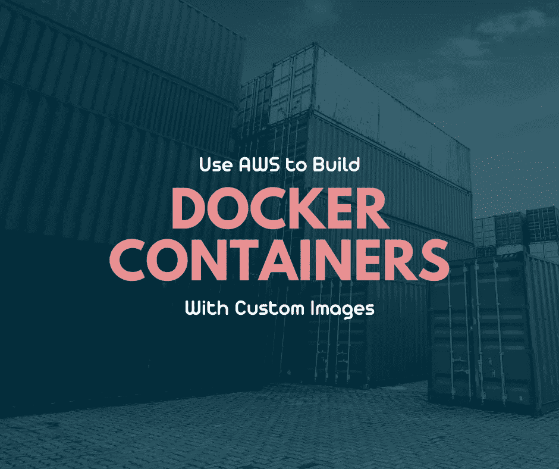

## **一点背景故事**

如果你是 Docker 的新手，系好安全带，享受旅程吧！Docker 是开发、发布和运行应用程序的一个很好的工具。它是开源的，易于使用，而且速度很快。Docker 使您能够将应用程序打包到可移植、可伸缩、灵活且自给自足的容器中。

容器保存所有重要的内容，比如应用程序需要的文件和程序。多个容器可以同时运行，每个容器可以有相同或不同的图像。

图像是一个可执行模板，包含容器的所有方向。您可以添加您的库和其他依赖项，并将其全部部署在一个包中。今天我们将从一个基础映像 NGINX 开始，然后我们将对它进行定制。Docker 的能力远远超出了我们今天要讨论的范围，但是让我们从一些基础开始吧。

## **必备品**

对于这一步，我将使用 AWS，因此您需要一个具有适当权限的帐户。我们将使用 Cloud9 作为我们的 IDE，并将使用 AWS ECR 来保存数据。您需要安装和配置 AWS CLI。

你还需要一个 Docker 账户，并且需要在 Cloud9 中安装 [Docker。在我的 GitHub 帐户上访问我的 Dockerfile 和 index.html 脚本。链接贴在这些文件的图片下面。](https://docs.aws.amazon.com/cloud9/latest/user-guide/sample-docker.html)

## **步骤 1——创建 DOCKERFILE 文件**

首先，我们将为此项目中的文件创建一个目录。我们将前往 Cloud9，为我们的项目创建一个文件夹或目录。这是我们存储 Docker 文件和 index.html**文件的地方。在 Cloud9 中，你只需右击 IDE 的文件夹名，然后选择**新建文件夹**。我将我的文件夹命名为" **customnginx"** ，如下图所示。**

**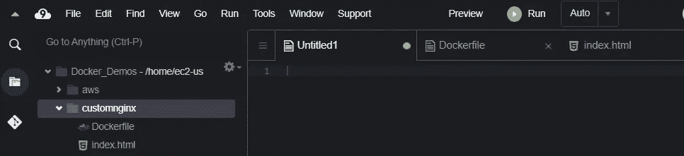**

**然后，在编辑器中，我们可以创建一个新文件，并将其命名为**“docker file”**。请务必使用大写的特定文件名，以便 Docker 可以轻松找到该文件。**

**Docker 运行 docker 文件中的指令，并按顺序运行这些指令。要创建 Docker 文件，从一个来自的**指令开始，该指令告诉 Docker 它将使用的基础映像或父映像。****

**接下来，我们将给出一个 **COPY** 指令，允许我们将刚刚创建的目录中的所有文件复制到 docker 容器中的当前工作目录中。**

**我们还将添加 **EXPOSE** 指令，让容器监听网络中指定的端口。**

**最后，我们将使用 **CMD** ，或者默认命令，该命令将对图像的所有容器执行。下面你会看到我使用的 CMD 命令，它将在前台运行 NGINX 并跟踪进程。**

**如果您想更深入地了解 Dockerfile 文档，请查看[。这是我们快速简单的 docker 文件的样子。](https://docs.docker.com/engine/reference/builder/)**

**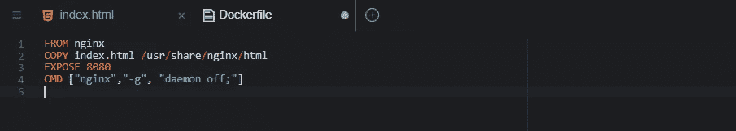**

**[https://github . com/darcyjwood/Docker _ Fun/blob/Docker _ NGINX _ Project/Docker file](https://github.com/darcyjwood/Docker_Fun/blob/Docker_NGINX_Project/Dockerfile)**

## ****步骤 2 —创建 INDEX.HTML 文件****

**接下来，我们创建一个 index.html 文件，它将在我们的 HTML 站点上显示当前的日期和时间。为此，我们需要创建一个 index.html 文件，然后添加一个类似如下的代码:**

**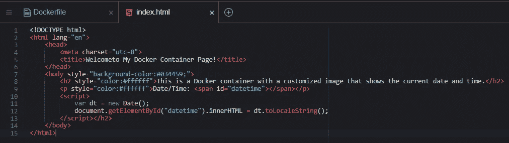**

**[https://github . com/darcyjwood/Docker _ Fun/blob/Docker _ NGINX _ Project/index . html](https://github.com/darcyjwood/Docker_Fun/blob/Docker_NGINX_Project/index.html)**

**现在我们已经创建了 Docker 文件和 index.html 文件，我们准备从 Docker 中提取我们的基本 NGINX 映像。**

## ****第三步—提取 NGINX 图像****

**要做到这一点，你需要在 Cloud9 中使用你的终端。确保使用`cd <the_name_of_your_directory>`进入你的项目目录**

**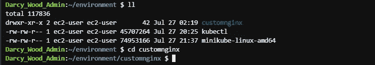**

**然后，我们将使用命令`docker pull nginx`来拉最新的 NGINX 图像。最佳实践是转到 Docker，通读图像信息，选择我们想要使用的版本，然后在下拉时在命令中添加特定版本，但是对于这个演示，我们只需要获得 NGINX 的最新版本，然后快速继续。**

**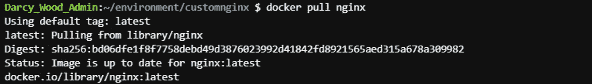**

## ****步骤 4 —创建一个 DOCKER 容器****

**现在，让我们使用 build 命令来创建我们的自定义映像。我们将使用“-t”标志来标记我们的新图像和“.”在这个命令的末尾，告诉 Docker 从我们当前的目录构建映像。我们的命令是:`docker build -t <your_custom_image_name> .`**

**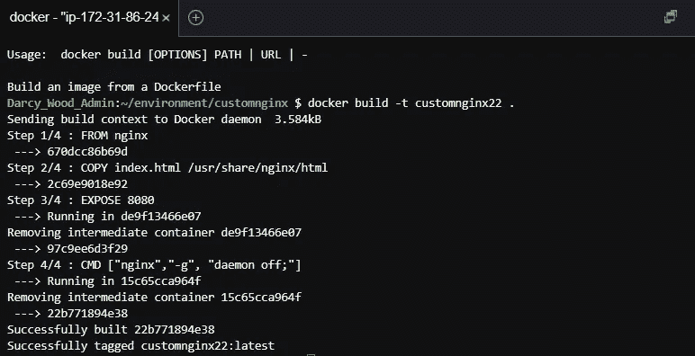**

**现在，如果我们运行`docker images`命令，我们将能够看到我们新创建的自定义图像。在运行容器时，它将使用我们之前创建的 Dockerfile 和 index.html 文件。**

**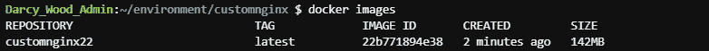**

**为了让我们的容器启动并运行这个新图像，我们将使用`docker run -d --name <your_container_name> -p 8080:80 <your_custom_image_name>`**

**“-d”将在分离状态下运行容器，这样它将在后台运行，“-p”将允许我们指定我们想要打开的端口。**

**补充说明:因为我们在 Cloud9 上使用一个实例，所以您需要确保在该实例上打开端口 8080，但是在完成这个项目后，请确保将其关闭。**

**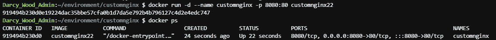**

**如果你使用`docker ps`,你将能够看到像容器 ID，它使用的图像，甚至它使用的端口这样的信息。**

**让我们通过在 web 浏览器中检查 IP 和端口来检查我们的容器是否设置正确并且工作正常。在这里，我将转到 AWS 中的 EC2 实例，并复制与我正在使用的 Cloud9 IDE 相关联的实例的公共 IPv4 地址。我将把这个 IP 地址和:8080 一起输入浏览器。**

**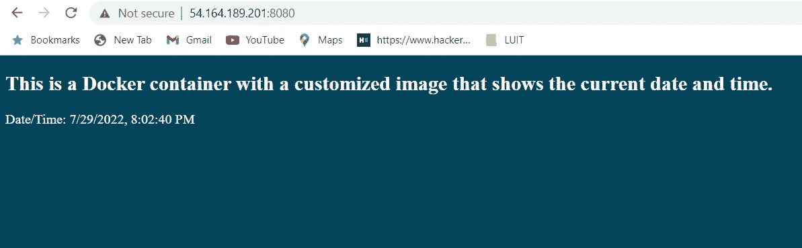**

**我们定制的图像正在我们的容器中工作！相当整洁。**

## ****步骤 5 —将数据保存到 ECR****

**我们将把数据保存到 AWS ECR，以便以后可以访问。要为 ECR 创建存储库，使用命令`aws ecr create-repository --repository-name <your_container_name> --region <your_region>`**

**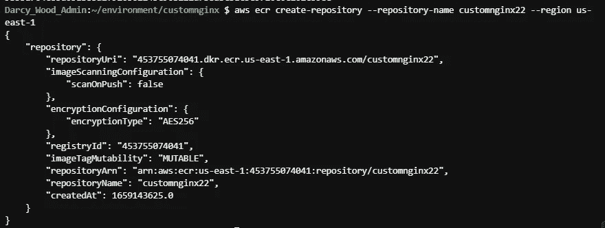**

**如果我们转到 ECR，我们可以看到我们的回购已经创建，但处于非活动状态。**

**为了将我们的图像推送到 ECR，我们需要使用令牌进行身份验证。如果我们选择您的存储库，然后选择**查看推送命令**按钮，我们就可以找到该流程的推送命令。然后，我们可以遵循 AWS 提供的步骤。我们将跳过第 2 步，因为我们已经建立了我们的形象。**

**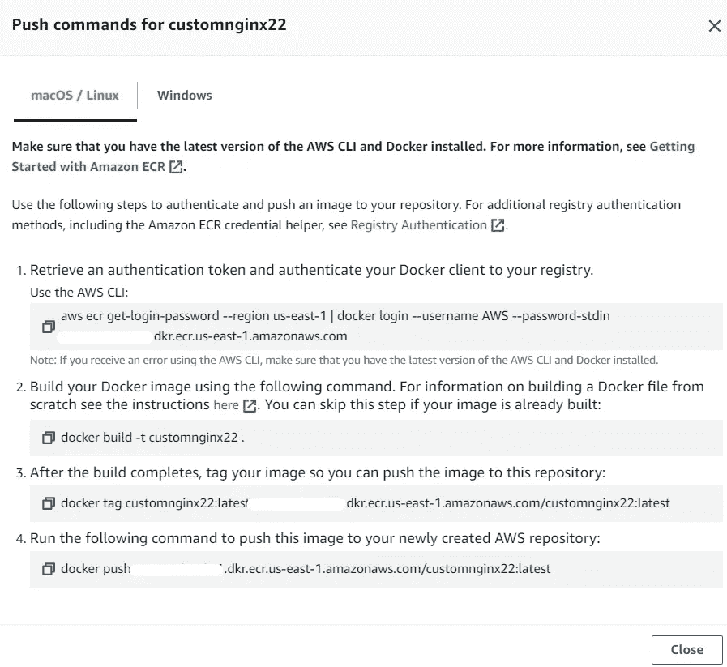**

**如果你成功了，你会看到这个:**

**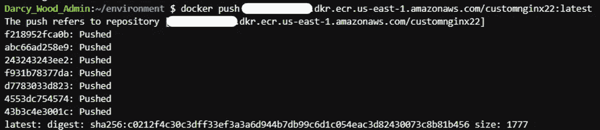**

**当我们返回 ECR 并选择我们的存储库时，我们可以看到我们有了新创建映像的最新版本。我们现在可以访问它以供将来使用。**

**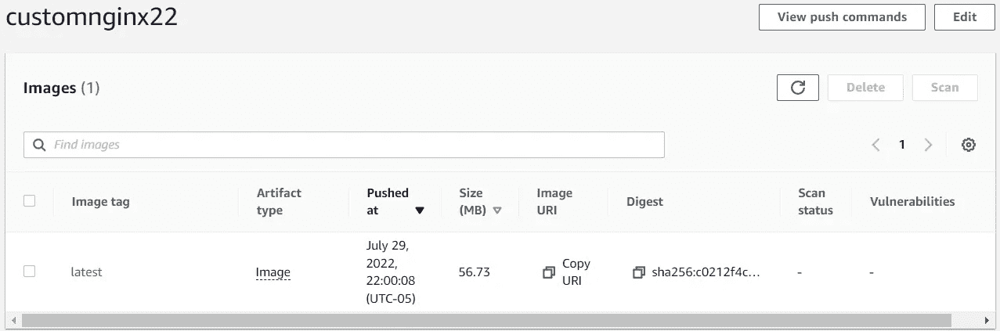**

**我们成功地使用 AWS 构建了一个带有自定义图像的 Docker 容器！如果你坚持下去并取得了成功，那就太棒了！我希望你喜欢这次演练。**

**完成后，请务必移除容器和您的图像。您可以使用以下命令:**

**`docker stop <first_four_digits_of_container_id>`**

**`docker rm <first_four_digits_of_container_id>`**

**`docker image rm <your_custom_image_name>`**

**现在您已经整理好了，可以构建更多的容器了。我很想听听看你在创造什么。联系我，我们聊聊 Docker！**

**一切顺利，
D。**