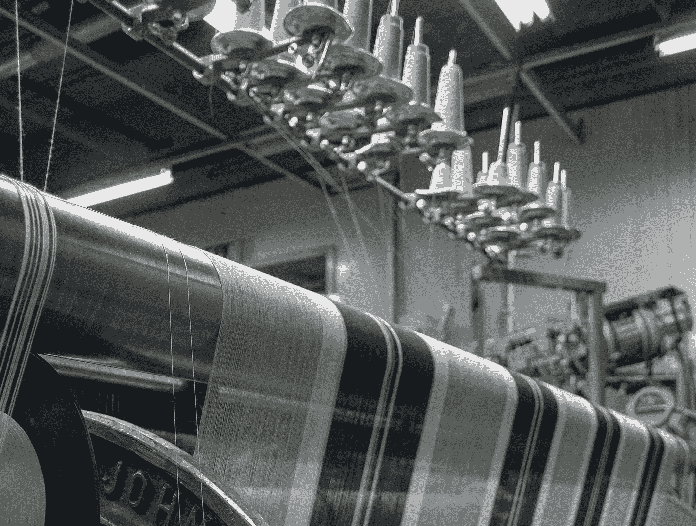
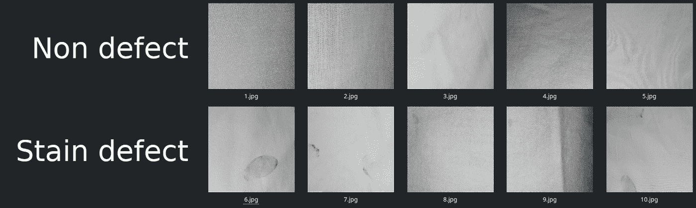
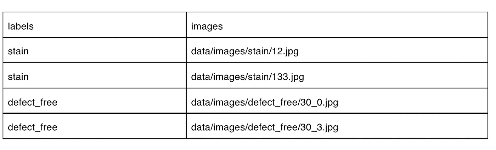
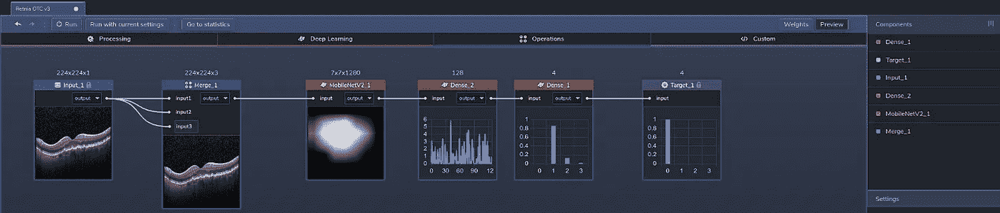
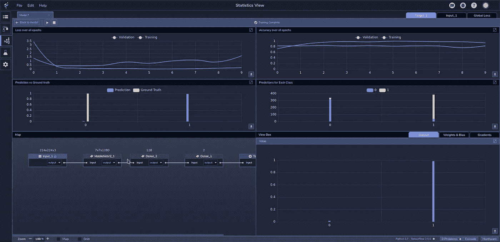
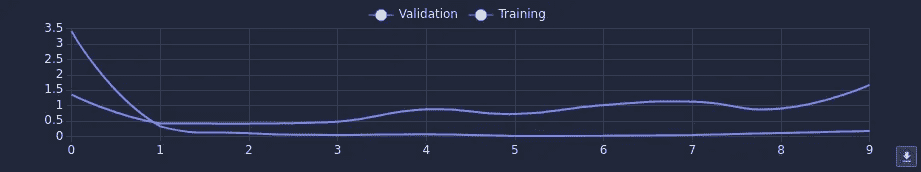
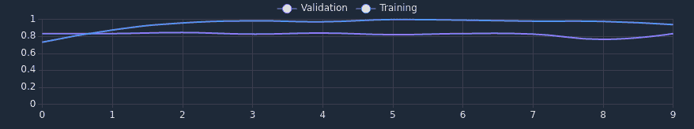

# 使用案例:织物污渍分类

> 原文：<https://medium.com/nerd-for-tech/use-case-fabric-stain-classification-5c7cf63cf9d2?source=collection_archive---------11----------------------->

[图片来源](https://unsplash.com/photos/9epO7Cu6UiM)。

全球纺织业几乎影响着地球上的每一个人，预计 2020 年其规模将达到 10003 亿美元。它包括生产、提炼和销售用于成千上万个行业的合成和天然纤维。

近年来，对高质量纺织品的高需求导致了自动化、基于人工智能的纺织品生产质量控制的应用。这也部分归因于技术发展、建模和模拟的使用，以及纺织品生产中普遍存在的高概率错误和缺陷。

随着(机器学习)ML 在[工业物联网](https://en.wikipedia.org/wiki/Industrial_internet_of_things) (IIoT)和[工业 4.0](https://en.wikipedia.org/wiki/Fourth_Industrial_Revolution) 中的使用越来越多，我们开始在[感知实验室](https://www.perceptilabs.com/)中建立一个图像识别模型，该模型可以分析纺织品的图像，以确定它们是否含有污渍。像这样的模型可以与纺织制造厂的实时摄像头或视频源结合使用，以快速捕捉缺陷并改善质量控制。

**数据集**

为了训练我们的模型，我们在 [Kaggle](https://www.kaggle.com/) 上使用了来自[织物污渍数据集](https://www.kaggle.com/priemshpathirana/fabric-stain-dataset)的图像。原始数据集包括 466 幅描绘正常和染色织物的图像。

原始数据集不平衡，有 68 张*无缺陷*图像和 398 张不同类型的涤棉织物污渍缺陷图像。为了消除训练过程中的潜在偏差，我们使用数据扩充(应用随机旋转，以及垂直和水平翻转)制作了一个平衡数据集，以将*无缺陷*图像的数量从 68 个增加到 408 个。图 1 显示了该数据集中的一些示例图像:

*图 1:来自数据集的图像示例—* [*图像来源*](https://www.kaggle.com/priemshpathirana/fabric-stain-dataset) *。*

当通过 PerceptiLabs 的[数据向导](https://docs.perceptilabs.com/perceptilabs/references/ui-overview/data-wizard)加载数据时，我们将图像大小调整为 224x224 以缩短计算时间，而三个(RGB)通道用于将数据输入预训练的模型。为了将分类映射到图像，我们创建了一个. csv 文件，该文件将每个图像文件与适当的分类标签(*污点*和*缺陷 _ 自由*)相关联，以便将数据加载到感知实验室中。下面是一个部分的例子。csv 文件看起来:

*的例子。csv 文件，用于将数据加载到将图像文件映射到其分类标签的感知标签中。*

**车型总结**

我们的模型由三个[组件](https://docs.perceptilabs.com/perceptilabs/references/components)组成:

组件 1: [MobileNetV2](https://keras.io/api/applications/mobilenet/) ，include_top=false，pretrained=imagenet

成分 2:密集，激活= [ReLU](https://machinelearningmastery.com/rectified-linear-activation-function-for-deep-learning-neural-networks/) ，神经元=128

组件 3:密集，激活= [ReLU](https://machinelearningmastery.com/rectified-linear-activation-function-for-deep-learning-neural-networks/) ，神经元=2

该模型通过 MobileNetV2 使用迁移学习，如图 2 所示:

*图 2:感知实验室中模型的拓扑结构—* [*图片来源*](http://www.perceptilabs.com) *。*

**训练和结果**

**我们使用 [ADAM](https://machinelearningmastery.com/adam-optimization-algorithm-for-deep-learning/#:~:text=Adam%20is%20a%20replacement%20optimization,sparse%20gradients%20on%20noisy%20problems.) 优化器、0.001 的学习率和交叉熵[损失](https://blog.perceptilabs.com/choosing-and-customizing-loss-functions-for-image-processing/)函数，在 10 个时期**中分批训练模型，每批 32 个。使用大约 122 秒的训练时间，**我们实现了 93.79%的训练准确率和 83.23%的验证准确率**。

图 3 显示了训练期间 PerceptiLabs 的统计视图:

*图 3: PerceptiLabs 训练时的统计视图—* [*图片来源*](http://www.perceptilabs.com) *。*

下面的图 4 和图 5 显示了训练期间 10 个时期的损失和准确度:

*图 4:训练中的损耗—* [*图片来源*](http://www.perceptilabs.com) *。*

在图 4 中，我们可以看到，在第一个 epic 中，训练和验证损失都迅速下降。在剩余的时期，训练损失保持相当稳定，而验证损失稳步增加，这表明我们可以更早地停止训练，以减少过度拟合。

*图 5:训练时的准确度—* [*图片来源*](http://www.perceptilabs.com) *。*

在图 5 中，我们可以看到，在前两个时期之后，训练精度保持相对稳定，并在接近结束时逐渐降低，而验证精度始终保持相当稳定。

**垂直应用**

像这样的模型可以用于制造业中基于计算机视觉的质量控制。当与生产线上材料的实时图像或视频配合使用时，这种 ML 模型为自动识别材料缺陷提供了坚实的基础。该模型本身也可以用作[迁移学习](https://blog.perceptilabs.com/when-to-use-transfer-learning-in-image-processing/)的基础，以创建用于检测其他类型材料中的缺陷的模型。

**总结**

此使用案例是图像识别如何应用于制造业的示例。如果你想建立一个类似这样的深度学习模型，[运行 PerceptiLabs](https://docs.perceptilabs.com/perceptilabs/getting-started/quickstart-guide) 并在 [GitHub](https://github.com/PerceptiLabs/fabric_stain) 上查看我们为这个用例创建的回购。另外，请务必查看我们的其他材料缺陷博客:[用例:金属表面缺陷检测](https://blog.perceptilabs.com/use-case-defect-detection-in-metal-surfaces/)。

[https://www . grandviewresearch . com/industry-analysis/textile-market](https://www.grandviewresearch.com/industry-analysis/textile-market)