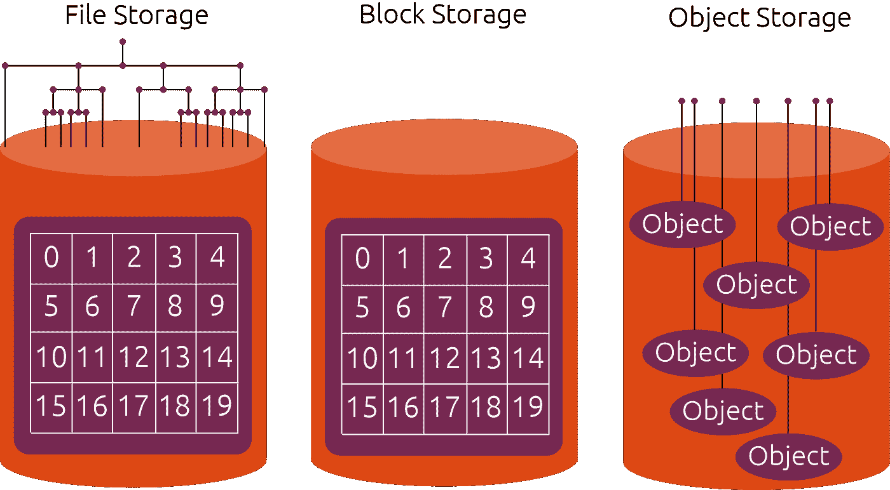
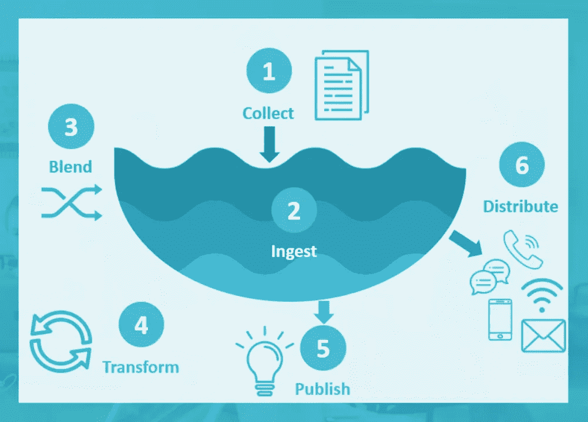

# 云对象存储的使用案例

> 原文：<https://medium.com/nerd-for-tech/use-cases-of-cloud-object-storage-1af9f9bfdb1a?source=collection_archive---------2----------------------->

迈克尔·泽兹奇在 [Unsplash](https://unsplash.com/s/photos/data-storage?utm_source=unsplash&utm_medium=referral&utm_content=creditCopyText) 上的照片

在对应用程序架构做出决策时，团队经常会讨论存储空间。根据数据类型要求和访问权限，他们通常需要在文件、数据块或对象存储之间进行选择。这些都是以不同方式保存、组织和呈现数据的存储格式。本文将关注对象存储与其他存储有何不同，以及它最常见的使用情况，这样您就可以知道它是否适合您。

[对象存储](http://lakefs.io/object-storage)是一种数据存储架构，其中每条数据都存储为一个带有关联元数据的对象。这些对象未经任何处理就被存储。因此，这种类型架构的主要目标是处理非结构化数据。与对象存储架构的通信是通过 API 或直接通过 HTTP(S)请求来完成的。

对象存储和文件存储(使用非常频繁)之间的主要区别在于，后者使用文件夹、目录、文件和层次结构来组织数据，而前者不使用这种错综复杂的通道来存储文件。这使得数据访问和检索更加容易。

# 对象存储的用例

为了帮助您确定对象存储是否适合您的需求，以及它是否会对您的基础架构产生积极影响，请考虑以下使用案例。如果您的需求属于上述任何一种，这种类型的架构是您的一个好选择。

# 恢复、备份和归档

为数据库转储、日志文件和其他静态资产创建恢复和备份点需要存储。为此，对象存储比任何其他存储体系结构(如块存储或文件存储)都更合适。

[*来源*](https://ubuntu.com/blog/what-are-the-different-types-of-storage-block-object-and-file)

每个存储的对象都在多个可用性区域自动复制，通常是三个不同的区域，它们之间有相当大的物理距离。这样做是为了确保在自然灾害可能危及某个区域的硬件并可能破坏它的情况下，您的数据在对象存储系统中仍然可用。

对象存储的另一个优点是对象存储中的数据不能被修改，这使它成为数据备份和恢复的理想选择。

如果需要修改某个对象，则必须删除当前对象，并创建另一个包含更新详细信息的对象。

更新对象时，有两种可能的情况。

默认情况下，更新对象时，会创建一个新对象，旧对象会被自动删除。如果对象存储启用了版本控制，则出于历史目的会保留对象的先前版本。

# 服务静态资产

现在，大多数网站和 web 应用程序都使用前端框架。在架构方面，他们使用了一种 [SPA](https://developer.mozilla.org/en-US/docs/Glossary/SPA) (单页应用程序)方法，其中只有一个单页应用程序。html 页面，在 JavaScript 的帮助下根据用户试图查看的页面改变其内容。

在这种方法中，大部分内容仅由静态资产组成。具体来说，组成应用程序的所有文件，除了 index.html 文件，都是静态文件。

大多数情况下，这些文件相对较小，但当您添加图像和视频等媒体文件时，它们会变大。

对于这些情况，对象存储是托管所有这些静态资产的最佳场所。这将减少服务器负载并释放大量空间，尤其是如果您有多个网站/网络应用程序。

与[块存储](https://cloud.netapp.com/blog/cvo-blg-what-is-block-storage-pros-cons-and-comparisons)不同，对象存储可以无限扩展到数 Pb 甚至更多。因此，如果您获得越来越多的文件，您可以增加对象的存储大小来满足您的需要，这在大多数对象存储体系结构中是自动完成的。

大多数对象存储架构还提供一个 [CDN](https://en.wikipedia.org/wiki/Content_delivery_network) (内容交付网络)作为服务的一部分，可以单独购买或免费包含在计划中。

这意味着存储单元中的所有对象都将被复制到 CDN 上，这将大大提高数据的加载速度。有了 CDN，资产将同时被缓存。因此，当浏览器稍后访问它们时，它们将被立即返回并从高速缓存中提供服务。

最后但并非最不重要的一点是，与块存储或文件存储服务相比，对象存储以每千兆字节的价格安排，将托管文件的成本降低了近一半。因此，为静态资产使用对象存储是有意义的。

# 数据湖

[*来源*](https://www.ecloudvalley.com/what-is-datalake-and-datawarehouse/)

许多机构和组织需要处理大量敏感和专有数据，包括金融数据、制药和医疗保健数据以及分析数据。

如果您查看对象存储空间，会发现有非常大的存储空间可以存放所有非结构化数据。它可以不仅仅是一个数据抛出；它可以是一个数据湖。这里要注意的第一点是，此类存储中的数据存储在一个池中，而不是孤岛。数据湖是一个收集组织数据的地方，以便将来从中受益。这些数据需要以高度可扩展、安全且经济高效的方式存储。我们已经看到对象存储正好提供了这一点。

一个问题是，人们通常不知道数据湖中的数据将如何被使用或转化为有价值的东西。因此，有必要集成额外的工具以确保更好的数据管理，并拥有广泛的数据处理、分析和人工智能工具。

一个这样的工具是 LakeFS。这个工具可以像管理代码一样帮助您管理数据:它提供了一个类似 Git 的分支和提交模型，可以扩展大量数据。它是免费使用的，因为它是一个开源平台，支持 AWS S3，Azure Blob 存储和谷歌云存储。LakeFS 有多个用例，从为数据创建开发环境的工具到持续的数据集成和部署。

你可以使用的另一个工具是由[亚马逊](https://aws.amazon.com/products/storage/data-lake-storage/)提供的 classic。亚马逊使您能够在安全的环境中在亚马逊 S3 上建立一个数据湖。这样做的好处是，您可以使用原生 AWS 服务来运行大数据分析、人工智能(AI)、机器学习(ML)和其他有用的流程，以从您的非结构化数据集中获取有价值的信息。

# 结论

对象存储的应用领域非常广泛。它可以带来相当大的优势，甚至在许多情况下是必要的。从保存重要文件备份的安全空间到可以用来存放静态应用程序文件的空间，对象存储有多种用途。

与其他类型的存储(如块存储或文件存储)相比，对象存储提供了许多优势，但每种存储都有自己的适用性。所以要根据自己的需求来选择。