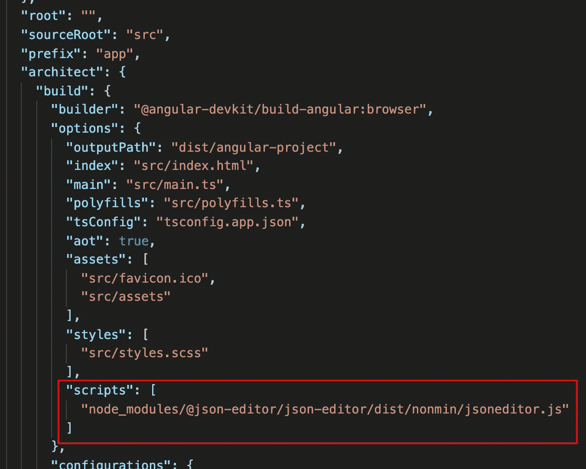
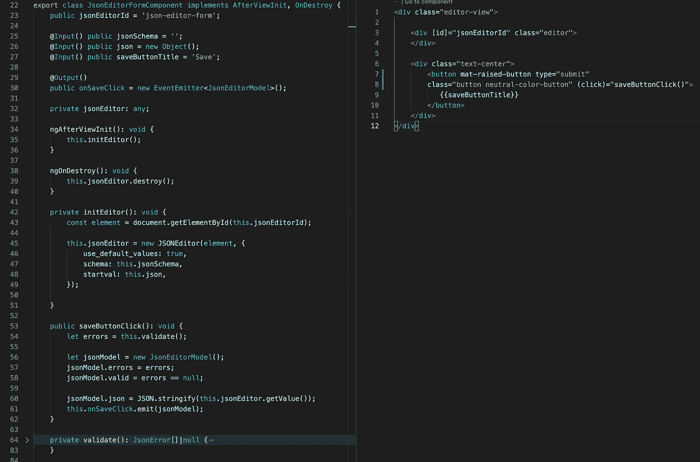
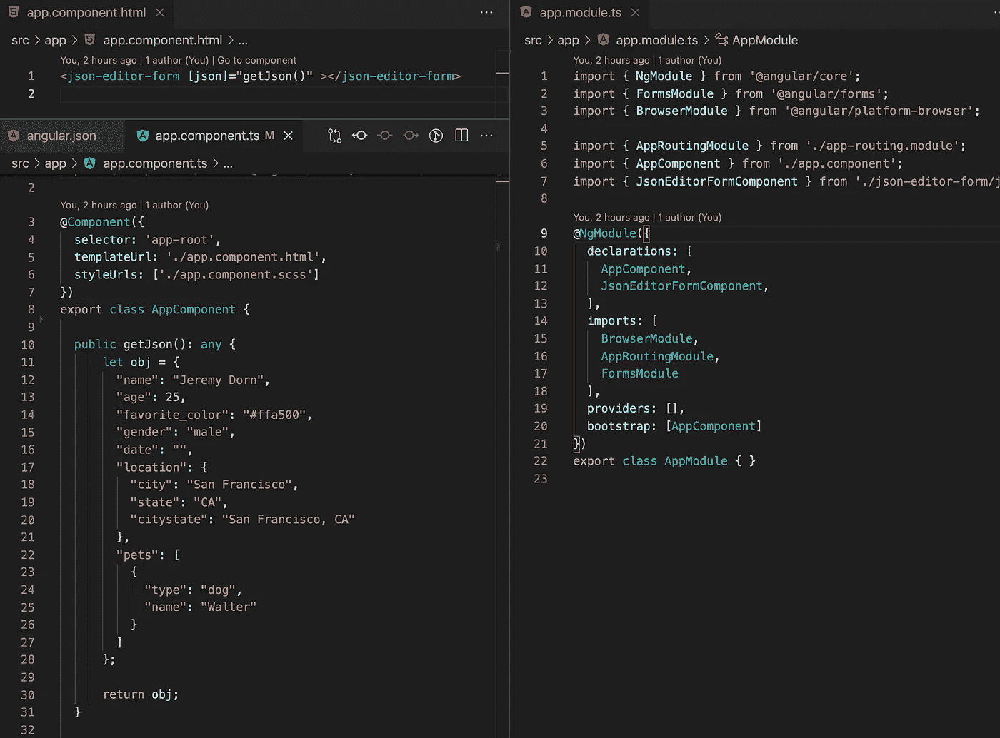
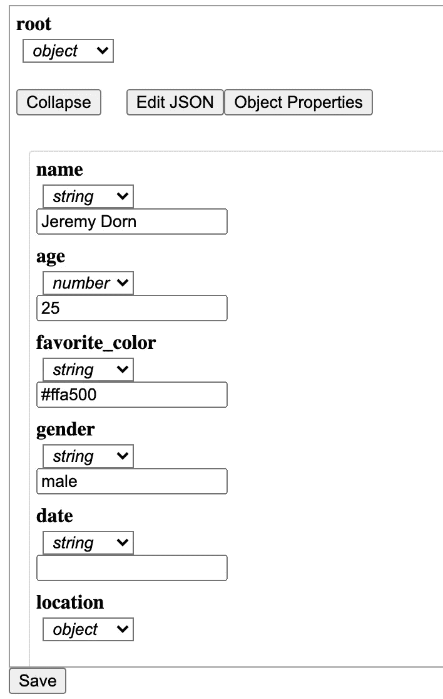

# 在 Angular 项目中使用外部 JavaScript 库

> 原文：<https://medium.com/nerd-for-tech/use-external-javascript-libraries-in-angular-project-557453e70a81?source=collection_archive---------4----------------------->

有时候你可以找到一个纯 JS 编写的好库。如何在 Angular 中使用这个库？

假设我想在我的 Angular 项目中使用这个 [json-editor](https://www.npmjs.com/package/@json-editor/json-editor) 。首先，我们需要使用以下命令安装它:

npm 安装@ json-editor / json-editor

这个命令在我们的项目中添加了一个库文件，我们还需要在我们的 *angular.json* 文件部分脚本中添加这个库的主文件。

在我们的例子中，我们只使用 JS 文件，但是如果库有图标或 CSS 文件，我们必须将它们添加到 styles 和 assets 部分。

我们准备使用外部库。为此，我们需要创建一个新的组件，在 ts 文件中设置它。

组件准备好了，让我们在主组件中使用它。

因此，我们有一个小表单来上传和保存文件。

如果你需要仔细看看[这个项目，这里是](https://github.com/8Tesla8/json-editor-external-js-libraries-angular) [的链接。](https://github.com/8Tesla8/angular-theme-scss)

*原载于 2021 年 10 月 15 日 http://tomorrowmeannever.wordpress.com**的* [*。*](https://tomorrowmeannever.wordpress.com/2021/10/15/use-external-javascript-libraries-in-angular-project/)