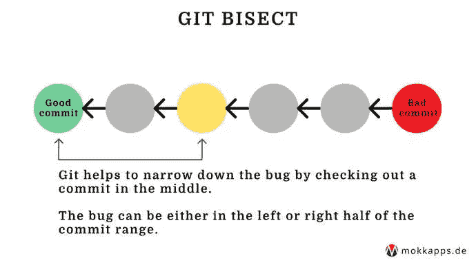

# 使用 Git 二分查找引入 Bug 的提交

> 原文：<https://medium.com/nerd-for-tech/use-git-bisect-to-find-the-commit-that-introduced-a-bug-166e845f3aa4?source=collection_archive---------12----------------------->


作为一名开发人员，你知道这种情况:代码运行得非常好，但突然出现了一个 bug，但你不知道它是何时何地被引入的。

如果你在一个大的团队中工作，那么很多提交同时被添加的可能性会很高。因此，找到引入 bug 的提交会变得非常困难。

幸运的是， [Git](https://git-scm.com/) 提供了一个工具来帮助检测引入 bug 的第一个错误提交。叫做“git 平分”。

# 它是如何工作的？

我们需要提供 Git 平分两个信息以便能够识别

1.  bug **不存在的“好”提交。**
2.  一个“坏的”提交，其中存在 bug**。**

**这样 Git“知道”bug 必须在“好的”和“坏的”提交之间转换。启动二等分过程会将提交范围分为“好”和“坏”提交，并检查中间的提交:**

****

**我们现在的任务是在提交时验证代码。这可以通过编译、运行应用程序或启动针对给定 bug 的测试用例来完成。接下来，我们需要告诉 Git 测试是“好”还是“坏”。Git 将简单地重复这个过程，直到我们挑出包含 bug 的提交。**

**使用的算法叫做[二分搜索法](https://en.wikipedia.org/wiki/Binary_search_algorithm)。**

****

# **实际例子**

**让我们看看如何从命令行运行 Git 二等分。首先，我们需要开始这个过程:**

```
$ git bisect start
```

**下一步是为 Git 提供“好”和“坏”提交。“坏的”提交通常是指“头”的当前状态:**

```
$ git bisect bad HEAD
```

**为了能够找到“好的”提交，你需要检查任何旧的版本，在那里你非常确定错误不存在。在您检查它并确认那里不存在 bug 之后，我们向 Git 提供相应的提交散列:**

```
$ git bisect good acd72832
```

**现在我们准备开始“平分”过程。Git 将检查我们提供的“好的”和“坏的”提交范围中间的一个提交:**

```
Bisecting: 6 revisions left to test after this (roughly 2 step)
[commit_ABC] Added controller
```

**此时，我们需要验证 bug 是否仍然存在。如果它仍然存在，我们需要运行**

```
$ git bisect bad
```

**否则我们就跑**

```
$ git bisect good
```

**将其标记为“好”。**

**根据结果，Git 将再次分割原始提交范围并选择前半部分或后半部分。它将再次检查中间的提交，我们需要验证那里是否存在 bug。**

**这个过程一直重复，直到我们成功地挑出错误的提交！**

**一旦我们找到了罪魁祸首，我们可以通过运行以下命令来结束平分过程:**

```
$ git bisect reset
```

**然后 Git 将完成这个二分过程，并把我们带回到之前的 HEAD 版本。**

# **结论**

**Git 二等分是追踪 bug 的有用工具。我只在完全不知道 bug 是从哪里引入的，并且需要搜索大量可能不相关的变更时使用`git bisect`。**

**想了解更多关于 Git 平分的信息，请看一下官方文件。**

**如果你喜欢这篇文章，请在 [Twitter](https://twitter.com/mokkapps) 上关注我，从我这里获得关于新博客文章和更多内容的通知。**

***原发布于*[*https://www . mokkapps . de*](https://www.mokkapps.de/blog/use-git-bisect-to-find-the-commit-that-introduced-a-bug)*。***