# 使用谷歌应用程序脚本创建一个线机器人提醒

> 原文：<https://medium.com/nerd-for-tech/use-google-app-script-to-create-a-line-bot-reminder-ebf5f8a8a1dc?source=collection_archive---------6----------------------->

我的新公司正在寻找一种方法来提醒成员每天打卡/下班。由于他们主要使用 LINE，我想如果我可以触发 LINE bot 定期发送消息，它可能会有所帮助🤖

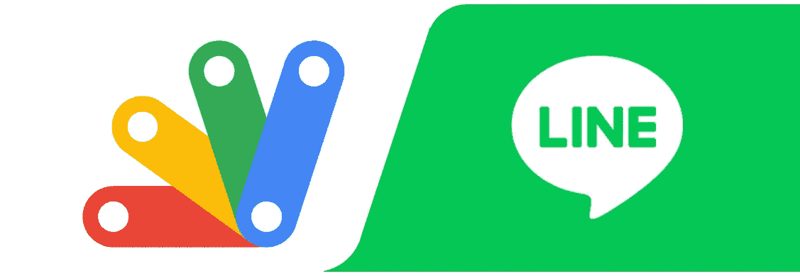

在这篇文章中，我将向你展示如何使用谷歌应用程序脚本来实现这一点:

1.  设置环境
2.  写我们的剧本
3.  奔跑

## 我们的目标

创建一个 LINE bot，在每天上午 9 点和下午 6 点向一组用户发送消息。

## 系统需求

一个谷歌账户和线消息 API(是的，就这些🙌)

# 设置环境

1️⃣:我们需要将自己注册为线路开发人员→创建一个提供商→创建一个消息 API。[下面是官方的分步说明](https://developers.line.biz/en/docs/messaging-api/getting-started/)。最后我们可以通过二维码添加 bot:

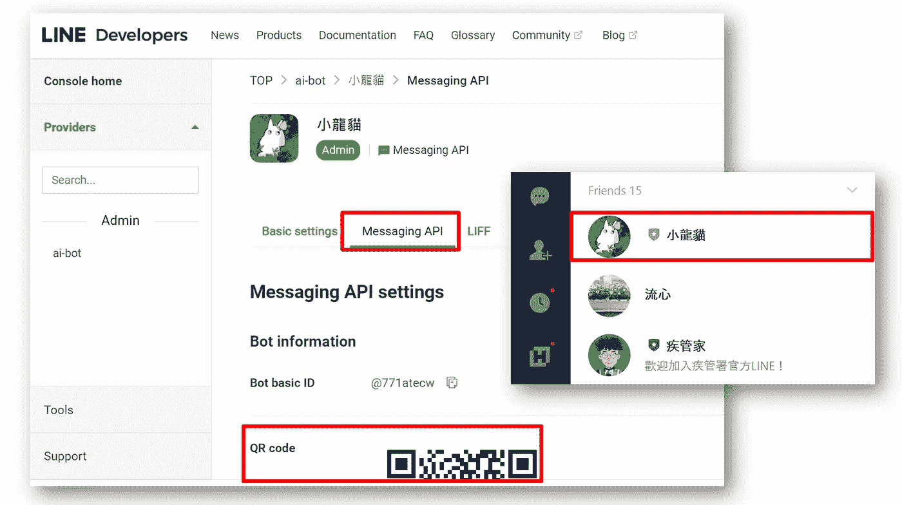

2️⃣转到你的谷歌驱动器，创建一个新文件夹(💬我的是“Linebot”)。接下来，创建:

*   这将是我们的数据库，存储需要接收消息的成员的用户标识。
*   **一个 Google App 脚本:**在这里写我们的逻辑，存储 userIDs，发送提醒。

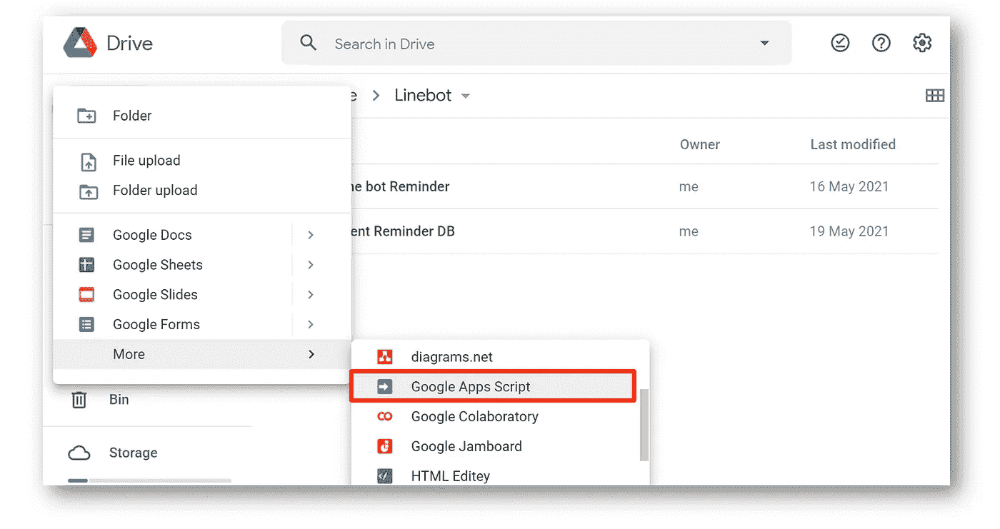

# 写我们的剧本

如果您也不熟悉天然气，这些部件会很方便:

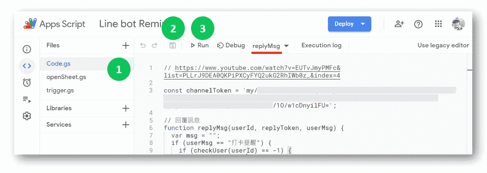

1.  我们可以在这里创建许多文件。但是，重要的是，每个文件中的⚠ **函数名称都应该不同**！⚠既然我们**不**需要在 GAS 中写`import functionA from "./a.gs"`，如果在同一个项目中有重复的函数名就会混淆。
2.  保存图标将保存当前项目中的所有修改(在上面的例子中，三个文件中的修改都将被保存)💾)
3.  要测试一个功能，点击**运行**，右边的功能(上例:`replyMsg`)将被单独执行👟

回到工作中，我们的脚本包含👌主要部分:

*   处理来自线路的消息
*   将用户 ID 添加到 Google 表单中
*   向所有用户发送提醒

## 1.处理来自线路的消息

最后，我们将部署 GAS 作为消息传递 API 的 Webhook URL。通过这种方式，无论何时收到任何消息，LINE 都会发送一个 HTTP `POST`请求。因此，在我们的应用程序脚本中，我们使用`Code.gs`中的`doPost(e)`函数来处理从 Line 发送的事件。

别忘了用你自己的替换上面的`channelToken`，你可以在开发者控制台找到:

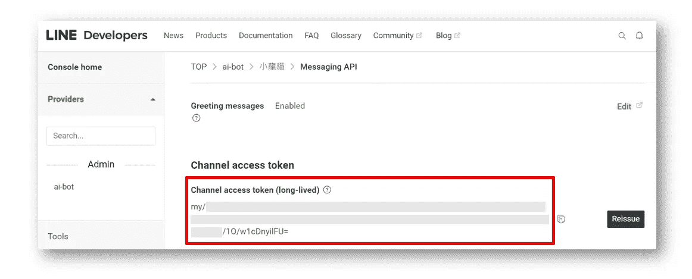

## 2.将用户 ID 添加到 Google 表单中

当用户告诉我们的 LINE bot:“提醒我打卡”时，在回复消息之前，我们必须检查该用户是否已经在我们的提醒列表中:

还记得我们为存储用户 id 而创建的 Google Sheet 吗？我们现在需要它的工作表 id😉

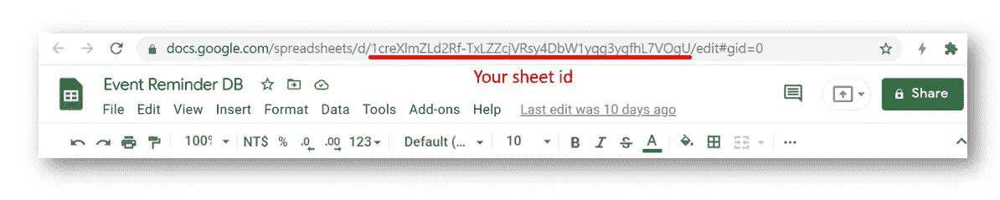

让我们把它放在下面的代码中(在`openSheet.gs`):

如果 userId 不在工作表中，我们使用`appendRow`在最后一行添加它的 Id。

太棒了，现在我们有了一个用户 Id 列表。我们可以继续给他们发送提醒⏰

## 3.向所有用户发送提醒

在消息传递 API 中，我们需要每个用户的 id 来向他们发送消息:

因此，让我们从工作表中获取 userId 列表:

由于提醒不应该在周末发送消息，我增加了一个`checkDay()`功能。[您可以从该列表中更改您的时区](https://sites.google.com/site/scriptsexamples/available-web-apps/event-manager/documentation/tools/time-zones)🌏

最后但同样重要的是，我们需要一个触发器在工作日的上午 9 点和下午 6 点执行`sendReminder()`。[本视频解释了许多可用于设置基于时间的触发器的其他功能](https://www.youtube.com/watch?v=5BYhGGPQlyA)⏳

# 奔跑

快到了！最后的☝+✌步骤:

1.  设置触发器
2.  部署天然气项目
3.  验证行消息 API 中的 webhook

## 1.设置触发器

在部署之前，我们必须确保扳机已经扣好。所以保存项目→运行`trigger.gs`(功能应该是`setupTrigger()` ) →检查触发标签

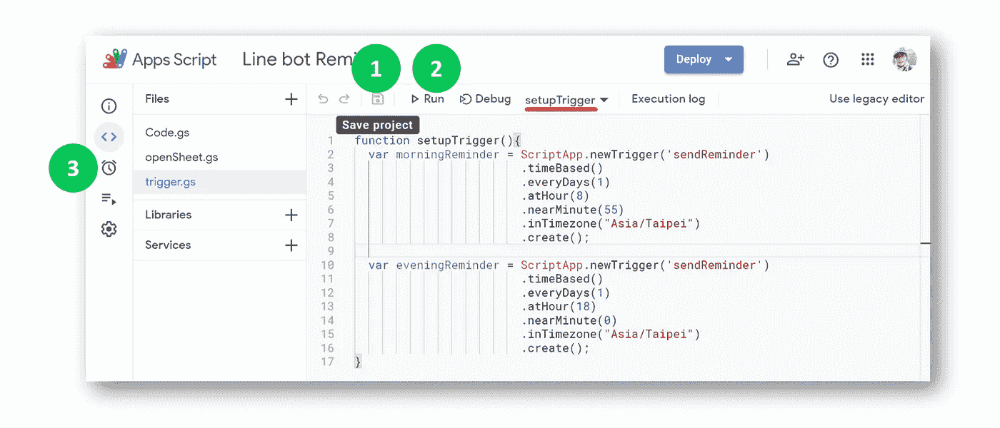

在选项卡中，我们应该看到两个触发器(`morningReminder` 和`eveningReminder`)。当选择`edit`时，我们可以看到更多的细节(下面的触发器是我们在上午 8:55 设置的)。你可能会发现，是的，在代码中设置触发器给了我们更多的灵活性

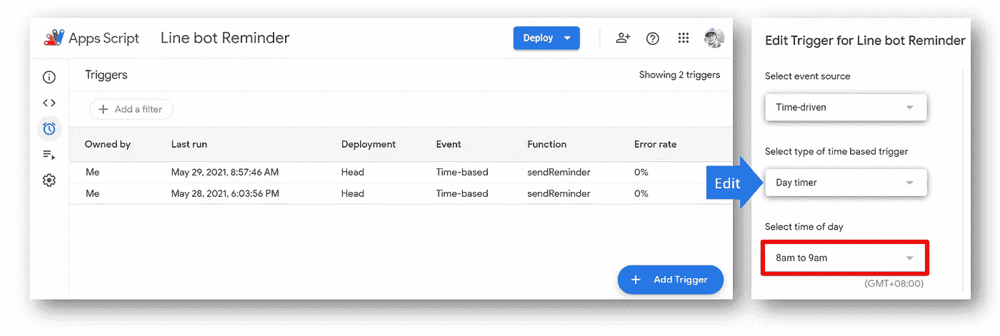

🙋‍♀️ **边注**:我们设定的时间和气体被触发的时间可能会有时间差。在上面的`LastRun`日志中，我的 8:55 提醒是在 8:57 执行的，而 18:00 提醒是在 18:03 触发的🤷‍♂️，我们已经尽力了😅

## 2.部署天然气项目

部署→新部署→类型:`Web app` → `Anyone`可以访问(所以不会要求用户授权脚本)→部署

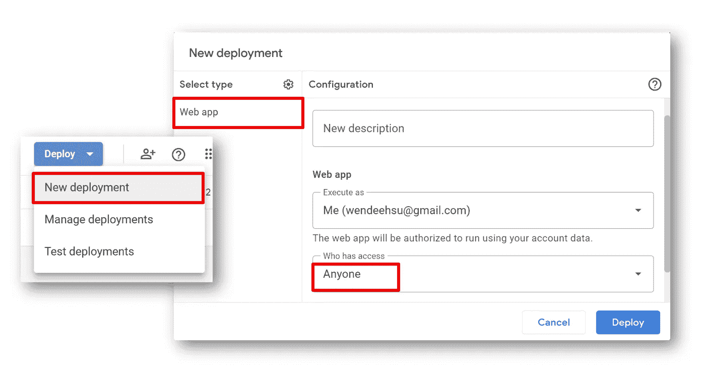

## 3.验证行消息 API 中的 webhook

复制 Web app URL →设置为 Messaging API 的 Webhook URL →验证(有些时候会出现诡异的错误，但是再点一下`Verify`就好了。应该能行😏)

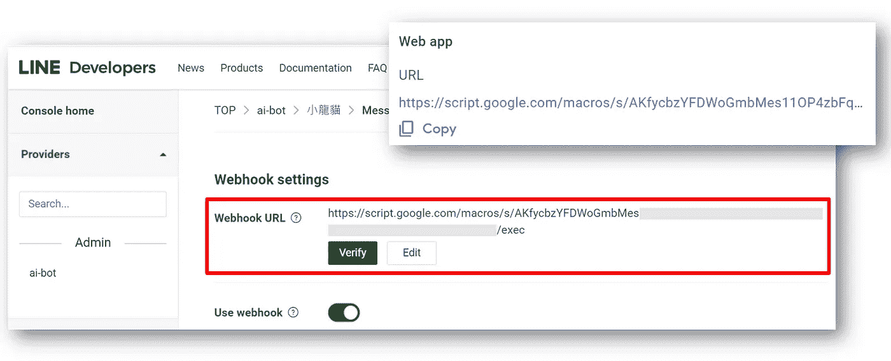

万岁！它工作了🍕🍕🍕

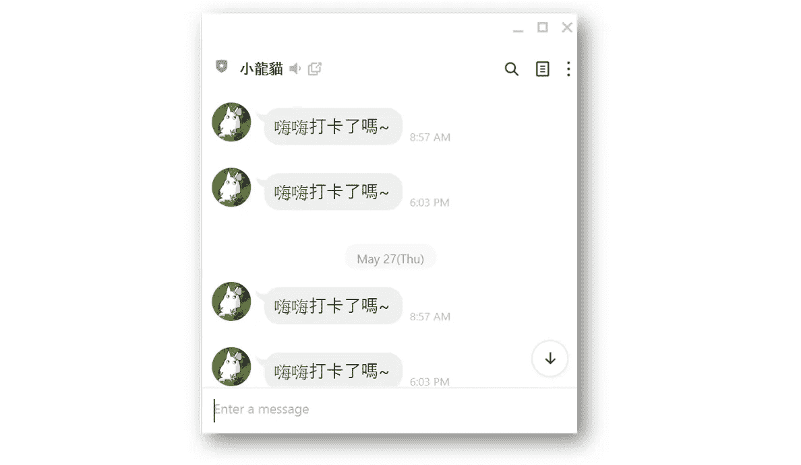