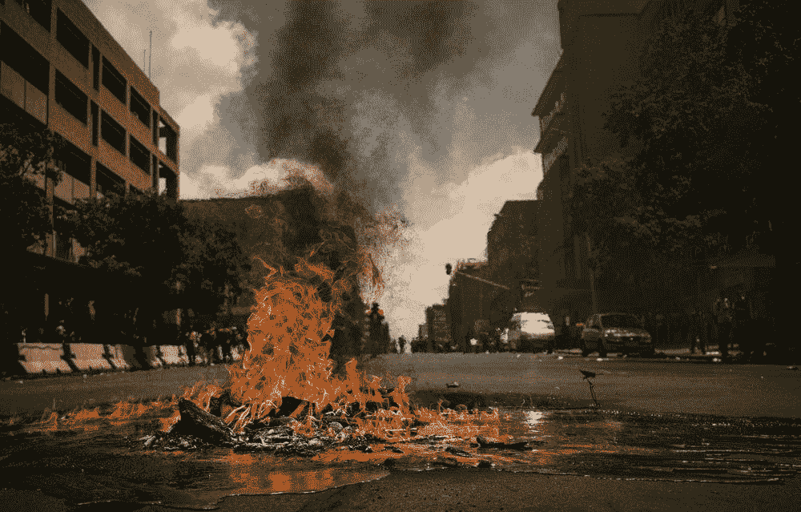

# 用音乐减少犯罪——不信我？看证据！

> 原文：<https://medium.com/nerd-for-tech/use-music-to-reduce-crime-dont-believe-me-look-at-the-evidence-963bc430f556?source=collection_archive---------1----------------------->

## 音乐不仅仅是你认为的那样。

照片由来自 Unsplash 的 Pawel Janiak 拍摄

惩罚或奖励。

阻止人们犯罪通常归结为这两者之一。

人们要么因为某种行为而受到*的惩罚*，要么因为避免这种行为(或者选择其他行为)而受到*的奖励*…