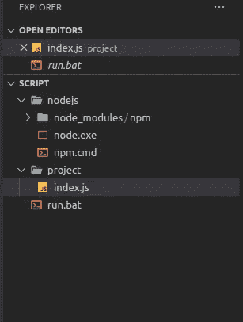
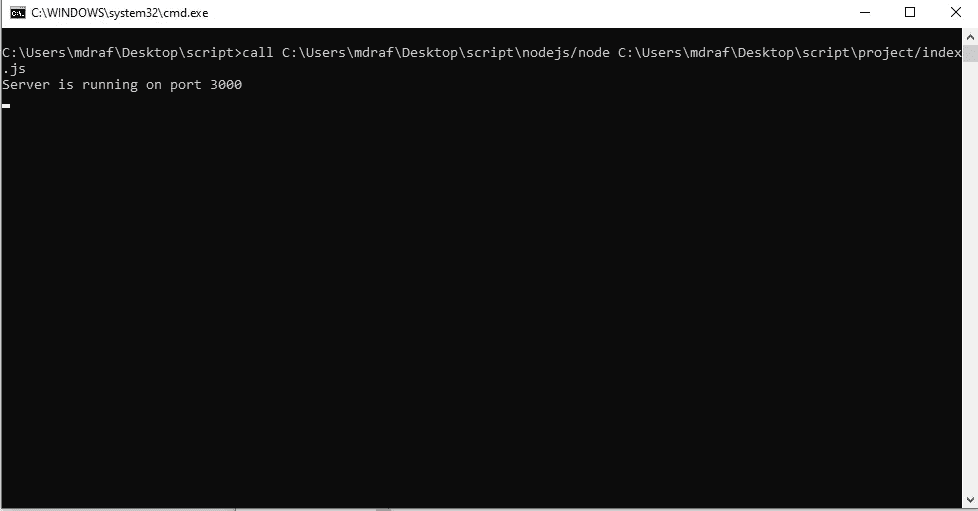
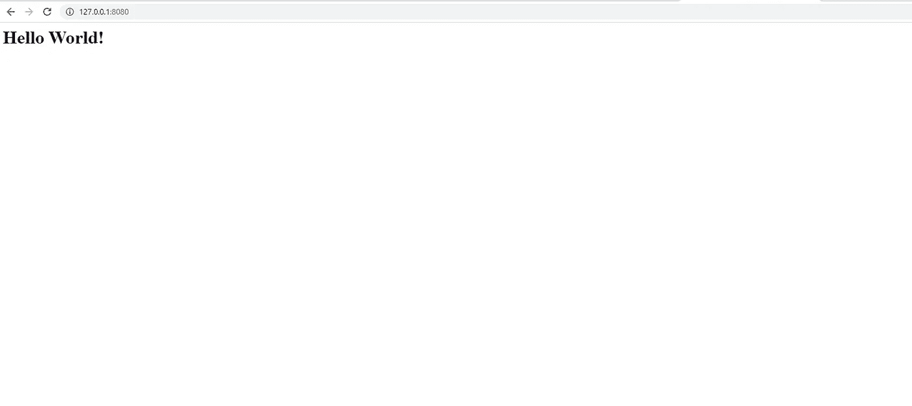

# 使用没有安装和管理权限的节点

> 原文：<https://medium.com/nerd-for-tech/use-node-without-installation-and-admin-access-b492796288c9?source=collection_archive---------5----------------------->

有时我们需要运行依赖于节点和 npm 的项目。我将向您展示与以下节点相关的不同案例，并找出解决方案。

1.  我想给我的客户谁不知道我的节点项目的发展。所以，要求他们安装节点并运行我的项目是一件繁琐的事情。
2.  我想在我朋友的电脑上运行这个项目，该电脑可能安装了一个节点，但我需要一个特定的版本，因为例如，我使用了导入，而不是要求支持节点 14+版本。
3.  我的客户端需要该应用程序的离线版本，所以没有机会运行 npm install，所有的软件包都将被下载和安装。
4.  我没有管理员权限，我的电脑管理员害怕恶意软件。所以他不会允许我安装节点

# **解决思路**

我将提供一个文件夹，在其中添加一个二进制节点，使用文件夹中的节点运行项目，并编写一个批处理文件，像运行桌面应用程序一样运行它。我将在 Windows 操作系统上实现它，但我相信这个想法可以在其他操作系统上实现。

我已经把代码上传到 GitHub 了。请访问[链接](https://github.com/mdrafee03/nodejs-without-installation/)查看实施情况。签出分支以检查实现。

# **分步实施**

1.  在您喜欢的位置创建一个名为 script 的文件夹(无论您的项目名称是什么)。我在桌面`C:\Users\mdraf\Desktop\script`上创建了它，我将在整个帖子中引用它。请使用您的位置。
2.  去 nodejs 官方页面下载 32 位/64 位 Windows 二进制(。zip)。因为它安装了 nodejs 版本，并且包含兼容的 npm 版本。
3.  解压 zip 文件，并将`node.exe`复制到脚本文件夹(`C:\Users\mdraf\Desktop\script\nodejs`)中名为 nodejs 的文件夹中
4.  如果你需要 npm，把`npm.cmd`和`node_modules`文件夹从解压后的文件夹复制到 nodejs 文件夹，我稍后会解释为什么你可以跳过 npm。
5.  将项目文件夹复制到脚本文件夹中
6.  在项目文件夹中创建一个名为`run.bat`的批处理文件。

最终，文件夹结构将如下所示

文件夹结构

# **带说明的批次文件代码**

`%~dp0`变量扩展了批处理文件的路径。所以`%~dp0nodejs/node` 指的是 nodejs 文件夹的 node.exe，`%~dp0nodejs/project index.js`指的是项目文件夹中节点项目的索引。`call`是运行命令的命令。

运行批处理文件后，单击 run.bat 文件，它显示服务器正在运行。万岁

这部分的完整实现上传到 [Github Repo](https://github.com/mdrafee03/nodejs-without-installation/tree/npm) 。

运行节点服务器

# 几个音符

1.  您的项目中可能有`package.json`,并且您有许多库需要安装。如果您的客户有在线支持，您可以运行 npm 安装，如果没有，您将运行 npm 安装，这将产生 node_modules，您将在您的项目中提供它。
2.  如果您的客户没有在线支持，您可以跳过 npm。因为您可能不需要安装 npm，所以您将把 node_modules 打包到项目文件夹中，如果您需要任何全局 npm 库，也将它们添加到脚本文件中。实现如下所示:

假设您需要一个全局 http 服务器。所以，你将在你的 pc 中运行`npm i -g http-server`并转到`C:\Users\[username]\AppData\Roadming\npm`，对我来说是`C:\Users\mdraf\AppData\Roadming\npm`并将`http-server.cmd`从这个文件夹复制到除了`node.exe` ( `C:\Users\mdraf\Desktop\script\nodejs)`)之外的 nodejs 文件夹，并将`node_modules/http-server`复制到`C:\Users\mdraf\Desktop\script\nodejs\node_modules`文件夹。现在可以拆下`npm.cmd`和`node_modules/npm`了。现在，您可以像 nodejs 一样运行 http-server 命令。

运行 run.bat 文件后，用 127.0.01:8080 打开浏览器，就可以看到服务器正在运行。

运行在 127.0.0.1:8080 的 http 服务器

这部分的完整实现上传到 [Github Repo](https://github.com/mdrafee03/nodejs-without-installation/tree/http-server) 。

# 结论

我们已经讨论了本文第一阶段提到的四个问题。以下是我们是如何做到的。

1.  你会把脚本文件夹给客户/任何你想给的人。他必须运行`run.bat`。一切都会马上准备好。不需要安装节点或 npm
2.  您的朋友可能在他/她的电脑上安装了不同的 nodejs 版本。因为这个脚本运行本地`node.exe`(不是全局的)，所以它将使用给定的 nodejs 和 npm 版本运行。
3.  如果客户端需要离线版本，您将添加 node_modules，这将消除下载的依赖性，并根据需要添加任何全局包。
4.  如您所见，它没有安装 nodejs，而是从您在脚本中给出的 nodejs 文件夹运行，不需要管理员访问。

谢谢你的阅读。如果您有任何反馈，请发表评论。干杯…