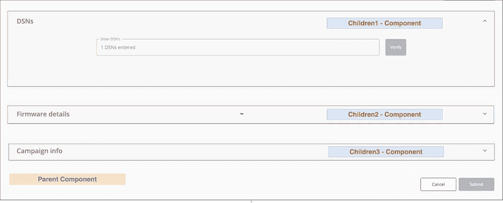

# Redux 的使用实例

> 原文：<https://medium.com/nerd-for-tech/use-of-redux-with-real-example-1686aae0815f?source=collection_archive---------6----------------------->

Redux —状态管理工具

总是不需要 Redux 来维护应用程序的状态。那么什么时候使用它呢？

**使用 Redux 的理由:**

当需要在组件之间来回传递**数据时，最好使用 Redux。将数据作为嵌套组件之间的道具向下钻取会导致**数据不一致**，并使复杂项目的代码**更难维护**。**

**示例:**

反应 UI 组件

在上面的例子中，Accordian (children2)应该只在 Accordian(children1)中的文本框填充了有效输入时才打开。如果在 children1 中维护本地状态，则 children1 状态的更新对 children2 不可见。这同样适用于孩子 3，孩子 2 的本地状态更新对孩子 3 不可见。此外，如果本地状态在所有子组件中维护，则该状态对父组件不可见。

此外，如果需要收集父组件中子组件的所有输入，则维护本地状态或引用将不起作用。实现 redux 将缓存组件状态，即使在卸载组件之后。

通过从父组件发出动作，可以控制子组件的状态。对于上面的用例，使用全局状态管理是很好的。

使用 useContext + useReducer 也可以达到同样的效果。是否使用 useContext/useReducer/Redux 取决于开发者。

**总结:**

需要简单 UI 变化的应用程序不需要像 Redux 这样复杂的模式。

由于状态是不可变的，Redux 通过返回新的状态来更新状态，这会导致内存的过度使用。实现 redux 会导致封装的缺失。

因此，在集成 Redux 的复杂性之前，一定要检查它的需求。