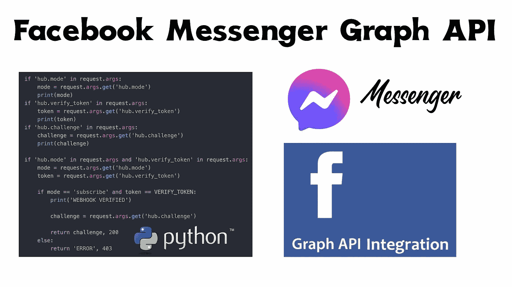
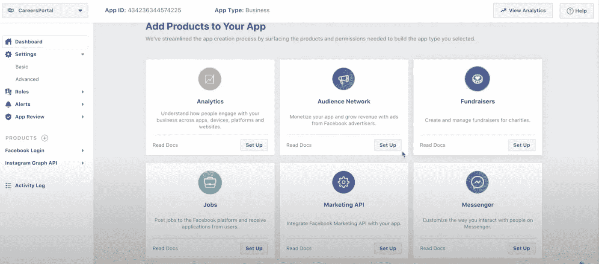
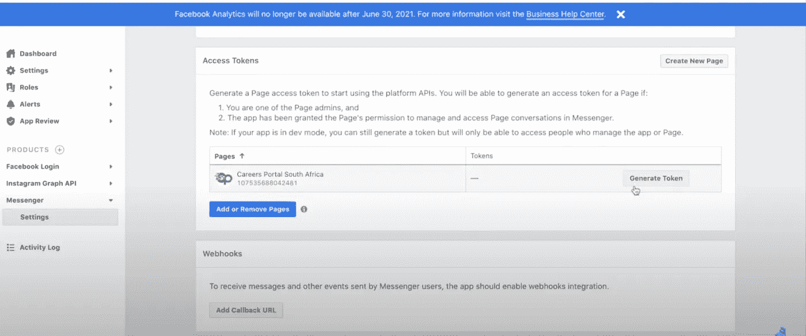

# 使用 Python 向 Facebook Messenger API 发送消息

> 原文：<https://medium.com/nerd-for-tech/use-python-to-send-messages-to-facebook-messenger-api-837a18997ade?source=collection_archive---------2----------------------->

我们将以 Messenger Graph API 教程来结束自动化系列教程。在本教程中，我们将了解如何从 Python 应用程序向脸书 Graph Messenger API 发送消息。

我们将在本教程中讨论的要点是:

*   创建我们的应用程序— Flask
*   在我们的应用程序中设置 Facebook Messenger webhook
*   在 HTTPS 上托管我们的应用程序
*   编写代码从我们的 webhook 接收消息，并将响应发送回脸书
*   向我们的脸书应用添加 Messenger 权限，获取访问令牌
*   测试我们的应用



使用 Python 向 Facebook Messenger API 发送消息

# 创建我们的烧瓶应用程序

首先，我们创建一个 python 项目目录和虚拟环境，在命令行上运行以下命令:

```
mkdir messenger && cd messenger
virtualenv messengerenv
source messengerenv/bin/activate
```

创建我们需要使用的文件:

```
touch app.py config.py
nano app.py
```

将此粘贴到 app.py 文件中:

```
from flask import Flask, requestapp = Flask(__name__)app.config['SECRET_KEY'] = 'enter-your-secret-key-here'[@app](http://twitter.com/app).route('/', methods=["GET", "POST"])
def home(): return 'HOME'if __name__ == '__main__':
    app.run(host='0.0.0.0', port='8888', debug=True)
```

这是一个最小的 flask 应用程序，只在主页上显示单词“HOME”。

您可以运行正在运行的应用程序和测试:

```
python app.py
```

然后访问 localhost:8888 或 your-ip-address:8888(端口 8888)。

# 在我们的应用程序中设置 Facebook Messenger Webhook

我们将遵循 Facebook Messenger API 文档中的启动教程，此处可获得:[https://developers . Facebook . com/docs/Messenger-platform/getting-started/quick-start](https://developers.facebook.com/docs/messenger-platform/getting-started/quick-start)

Facebook Messenger API 文档也提供了 Javascript 示例代码，我们将在 GitHub 上为 Python 重新编写这些代码:

 [## FB samples/messenger-平台-样本

### 用于发送和接收消息的 Messenger 平台示例。浏览此代码的入门指南…

github.com](https://github.com/fbsamples/messenger-platform-samples/blob/master/quick-start/app.js) 

编辑 app.py 文件，如下所示:

使用 Python 向 Facebook Messenger API 发送消息

# 在 HTTPS 上托管我们的应用程序

要在 HTTPS 上托管应用程序，你需要一个托管服务，youtube 上有一个完整的视频，你可以了解所有细节:[在数字海洋上托管 Python Flask 应用程序](https://www.youtube.com/watch?v=RP8nhiiQnTc)。

# 添加 Messenger 应用程序并获取页面访问令牌

我们需要获得一个脸书应用程序，该应用程序具有正确的 messenger 权限和访问令牌来完成该过程。

转到 facebook 开发者页面，创建一个应用程序。进入**设置** > **基本**，从应用程序网格中选择 messenger。单击设置继续。



设置 Messenger API 访问令牌

选择“添加新页面”,通过登录您的帐户并选择您想要使用的页面来完成授权。

单击 generate token —将其复制并粘贴到 config.py 文件中。调用 config.py 文件中的令牌 **PAGE_ACCESS_TOKEN** 作为字符串。



为 Messenger API 生成页面访问令牌

然后单击底部的按钮，输入回拨 url 并验证字符串。您的 webhook 应用程序现在应该已经在 https 服务器上启动并运行了，这样做没有问题。

输入 URL—[https://your-host-domain/webook](https://your-host-domain/webook)，并输入与 app.py 文件中完全相同的验证令牌。

# **测试你的应用**

你现在可以转到你连接的脸书页面并测试应用程序，请注意，除了脸书页面的所有者和注册开发者之外，该应用程序将不会为任何其他用户工作，除非你将你的应用程序通过脸书应用程序验证批准流程。

# 完整视频教程