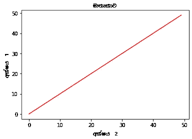

# 将僧伽罗语字体用于 Matplotlib 和 Google Noto 字体

> 原文：<https://medium.com/nerd-for-tech/use-sinhala-language-fonts-for-matplotlib-with-google-noto-fonts-371c26e12c7?source=collection_archive---------6----------------------->


M **atplotlib** 是一个跨平台的图形绘制库，在 **python** 中，它作为一个可视化实用程序创建静态、动画和交互式可视化。它与 NumPy 一起使用，为 MatLab 提供了一个有效的开源替代环境。它还可以与 PyQt 和 wxPython 等图形工具包一起使用。本文是关于如何使用[**Google Noto Fonts**](https://www.google.co.kr/get/noto/)在 Matplotlib 中安装和使用僧伽罗语字体。

# 谷歌 Noto 字体

谷歌一直在开发一个名为 Noto 的字体家族，旨在以和谐的外观和感觉支持所有语言。Noto 是一种拥有大量字体的字体，由 Google 根据 SIL 开源许可免费提供。在这里，我们将通过使用来自`ttf`文件的自定义字体，在 Google 协作 Matplotlib 图表中使用`NotoSansSinhala`僧伽罗文 Google Noto 字体。

# 使用 TTF 文件中的自定义字体

在本地使用 Matplotlib 中的自定义字体需要将`.ttf`保存在`matplotlib/mpl-data/fonts/ttf/`文件夹中。要在僧伽罗文字体的谷歌实验室中做到这一点，你需要做的是！

> 在这里，我使用了 Python 版本:3.7.11
> matplotlib: 3.2.2

我们需要安装我们的自定义字体。Matplotlib 需要一个 *True Type* 格式的字体(`.ttf`)。例如，如果我们想要添加僧伽罗文字体，我们需要检查我们的系统上是否安装了`ttf`格式的字体，否则我们需要下载并安装它。诺托桑斯僧伽罗字体可以从[这里](https://noto-website-2.storage.googleapis.com/pkgs/NotoSansSinhala-hinted.zip)。

下载字体包(。zip):

```
!wget "https://noto-website-2.storage.googleapis.com/pkgs/NotoSansSinhala-hinted.zip"
```

解压缩软件包:

```
!unzip "NotoSansSinhala-hinted.zip"
```

将路径复制到文件夹:

```
!mv NotoSansSinhala-Medium.ttf /usr/share/fonts/truetype/
```



用僧伽罗文字体绘制带有标题、y 标签和 x 标签的图表。

现在我们需要指示 Matplotlib 使用我们的自定义字体。我们可以使用 Matplotlib `font_manager`从文件中添加字体。

如果我们想绘制一个条形图并改变僧伽罗文字体的标签和标题，我们将使用僧伽罗文 Sans 字体。

笔记本中的以下代码片段向您展示了如何在标签和标题中使用*僧伽罗文 Sans* 字体:

# 摘要

1.  下载选择的字体。这里我们将*僧伽罗文 Sans* 字体下载到当前目录，没有必要下载到共享或 matplotlib 文件夹:`/usr/share/fonts/truetype`
2.  选择当前目录中的字体:如果你最终将字体下载到`/usr/share/fonts/truetyp`，将其改为:`fm.FontProperties()`
3.  使用`FontProperties().`在你所有的图上使用新字体