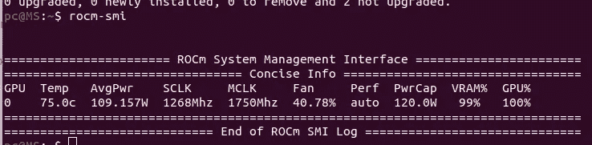

# 使用您的 AMD GPU 加速训练(ROCm)

> 原文：<https://medium.com/nerd-for-tech/use-your-amd-gpu-to-speed-up-training-rocm-87e34ff3554?source=collection_archive---------8----------------------->

在继续之前，以下是我系统规格:

CPU:英特尔酷睿 i5–7400 CPU

GPU: AMD RX570 8GB

操作系统:Ubuntu 20.04.1(内核 Linux MS 5 . 8 . 0–55 通用)

**注意:这不适用于 windows！仅基于 Linux 的**

最近，我一直在使用谷歌实验室来训练和测试 LSTM 模型。所以我在利用 GPU run type。但是由于 Colab 在特定持续时间内提供有限数量的 GPU 会话，我无法对模型进行连续测试。在我训练另一个模型之前，我必须等待一段时间。

除此之外，我想要一个强大的笔记本电脑，因为我还买不起，所以我在寻找一个替代品。幸运的是，我哥哥有一台游戏电脑，里面有 RX570 8GB。但那是 AMD。然而，就像 NVIDIA 有 CUDA 一样，AMD 也有 ROCm。

安装步骤可在以下链接中找到；

[https://rocm docs . amd . com/en/latest/Installation _ Guide/Installation-Guide . html](https://rocmdocs.amd.com/en/latest/Installation_Guide/Installation-Guide.html#ubuntu)

以下是我所遵循的步骤，(这些都是在上述网站上找到的，但这些是我完全遵循的一个)

**第一步**:添加用户到视频渲染(仅适用于 Ubuntu 20.04.1)组。

之后，运行“组”你会看到以下输出。

第二步:现在安装 ROCm

逐一运行以下命令

**第三步:**之后重启系统。

现在，要确认安装，请运行以下命令，

**步骤 4** :更新路径

如果 ROCm 安装正确，您可以运行“rocm-smi”命令，您将看到以下输出。

**步骤 5** :为 ROCm 安装 Tensorflow

逐个运行以下命令。

## 修复问题

现在所有的东西都安装好了，但是当你运行 tensorflow 代码时，它会出错。因此，要检查运行以下 python 脚本并查看输出。

它会给出一些错误，其中它会说“分段故障”

所以要解决这个问题，我们必须重新安装“rocRAND”，我们可以按照[https://github.com/xuhuisheng/rocm-build/tree/master/gfx803](https://github.com/xuhuisheng/rocm-build/tree/master/gfx803)提供的方法。

运行以下命令来解决该问题。如果你仍然不能解决这个问题，那么请检查上面的 github 并询问作者。当我写这篇文章时，作者已经在 11 天前更新了知识库。确保安装“git”并设置 git global.email 和 global.name 变量，否则不会下载 rocRAND 的源代码。

现在再次运行 python 脚本，它应该会给出以下输出。

现在，你可以开始使用这个 gpu 进行深度学习了。

我用[400，100，100，100]训练 LSTM，完成一个周期需要 25-30 分钟。批量= 128，总行数为 110000。有 10 个特征。

使用这个 GPU 后，它减少到 160 秒！

所以这是非常有用的，希望你也能找到它！

感谢您阅读到最后，如果有任何问题或困惑，请评论。

## 参考资料:

 [## 徐惠生/rocm-build

### 日期:2021-05-24 如果你不想从源代码编译 ROCm 组件。可以降级到 ROCm-3.5.1，这里是…

github.com](https://github.com/xuhuisheng/rocm-build/tree/master/gfx803) 

[https://rocm docs . amd . com/en/latest/Installation _ Guide/Installation-Guide . html](https://rocmdocs.amd.com/en/latest/Installation_Guide/Installation-Guide.html#ubuntu)