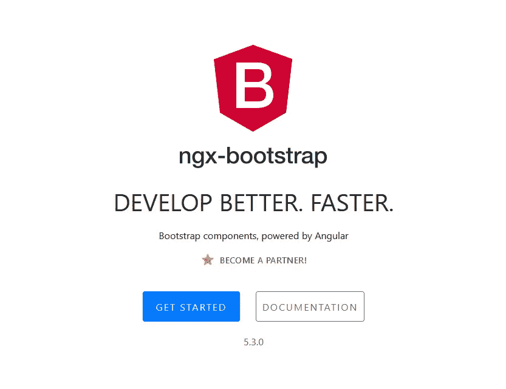
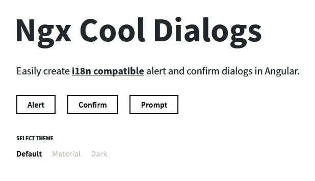
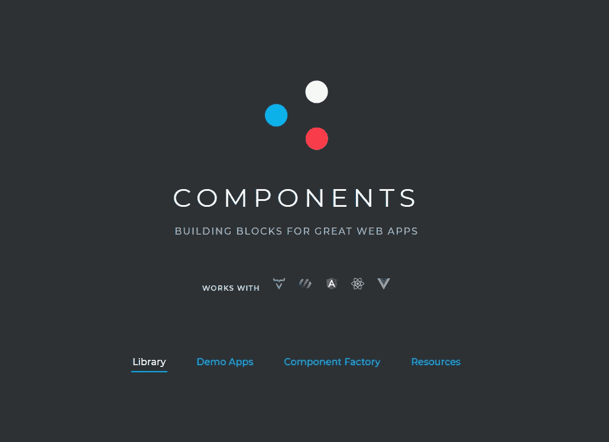
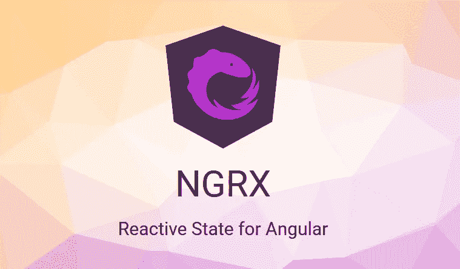

# Angular 2+的有用库

> 原文：<https://medium.com/nerd-for-tech/useful-libraries-for-angular-2-471204ec3b1e?source=collection_archive---------18----------------------->

Angular 是一个非常著名的前端开发框架，它完全配得上最好的称号(我知道在评论区会有一场关于这个的争论😂).但是如果你不知道正确的插件来使用它们，即使是最好的插件也没有用。

在本文中，我将列出几个我在大多数项目中使用的最喜欢的库。

# [Ngx-自举](https://valor-software.com/ngx-bootstrap/#/)

尽管大多数时候我喜欢使用定制组件，但 Ngx-Bootstrap 是 Angular 的一个非常棒的引导框架。它可能不适合你的所有项目，但对大多数项目来说都很好。

它是极简的，轻量级的，不会增加太多的项目规模，并且在大多数时候最适合。

# [Ngx-酷-对话](https://ngx-cool-dialogs.carlosroso.com/)

无论你开发什么类型的应用程序，总有对话框的空间，Ngx-Cool-Dialogs 做得很好。它非常灵活，需要很少的设置，并且非常容易使用。它是一个反应式插件，可以从 typescript 中触发，不需要任何标记，这对于任何情况都是非常棒和完美的。✔

# [Vaadin UI 组件](https://vaadin.com/components)

如果你正在寻找一个有着令人敬畏的 UI 的有用的表单元素的集合，Vaadin 就是你要找的。我没有在我所有的项目中使用它，但是我在一些项目中使用了它，到目前为止，没有失望。😏

我只使用了它们的表单元素，但是它们的集合还包括其他组件，可以很容易地替换 bootstrap 的组件。

# [@ngrx-store](https://ngrx.io/guide/store)

如果你是一个棱角分明的忍者，你已经知道@ngrx/store，如果不是，不用担心，你会习惯的。

它是最有用的库之一，可以帮助您开发高可维护性和高性能的角度应用程序。但是在项目中使用它之前有一些要求。请记住，在您开始使用它之前，它需要一些样板代码，对于小型项目来说，这是一个大材小用，但是对于大中型项目或企业级项目来说，它给桌面带来了彩虹🖖🌈

# 结论

还有很多我可能没有在这篇文章中提到的库，一旦我使用了其中的一些并进行测试，我会更新这篇文章，但是如果你心中有一个，把它放在下面的评论区，如果它真的有用，我会把它放在列表上。

谢谢你的来访😊