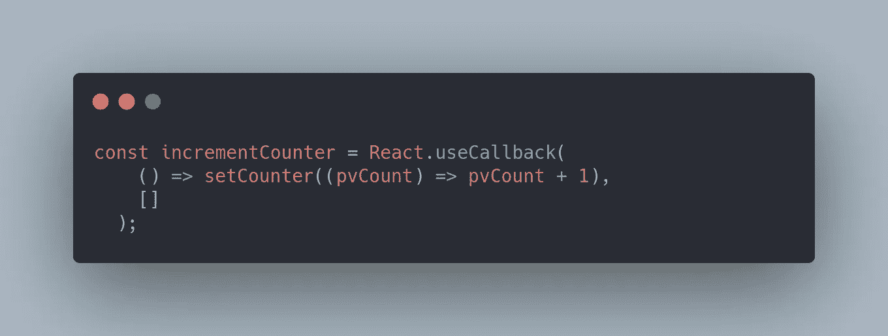
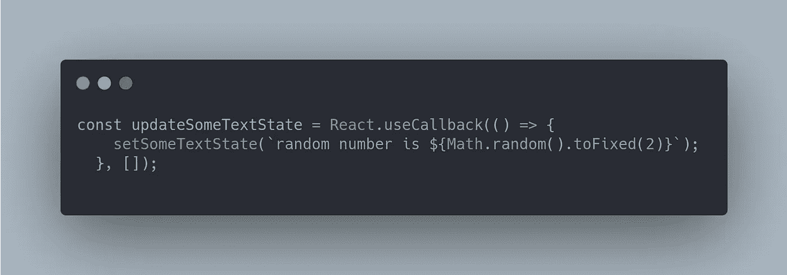
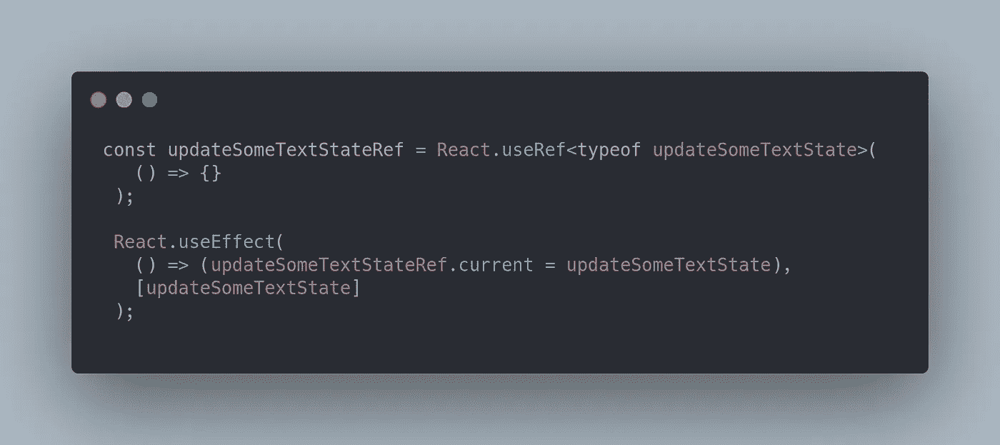
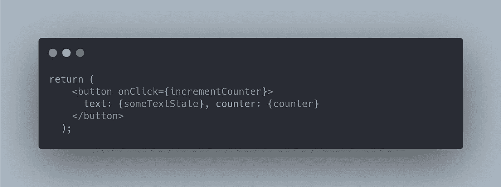

# 有效地使用 useEffect 钩子作为状态改变的回调。

> 原文：<https://medium.com/nerd-for-tech/useref-with-usestate-handling-the-dependency-array-nightmare-35e6418fdd75?source=collection_archive---------17----------------------->

跟我说说，让我先解释一下这个场景。

假设你需要做一些事情，比如当一个状态更新时调用一个函数，在 React 中最简单的方法是使用`React.useEffect`并使用状态作为依赖，这样钩子在每次状态更新时触发。

但是根据文档，依赖数组应该包含在钩子内部使用的、在钩子主体外部声明的东西，即函数和状态，以便钩子具有它正在使用的更新的依赖。

如果我们不希望每次其余的依赖关系改变时都调用`React.useEffect`怎么办，为此我们可以使用`React.useRef`来创建对其余依赖关系的引用，并使用引用而不是值本身。

嵌入式沙箱包含一个 React 应用程序来处理这种情况。

# 方案

当计数器更新时，我们通过使用其引用调用一个函数来更新名为`someTextState`的状态。该功能简单地更新了`someTextState`

# 代码走查

## 州

以下是我们正在使用的状态，`counter`将在按下按钮时更新。`someTextState`将在计数器更新后更新。

## 按钮点击的回调

如果按钮被按下，下面的函数将被调用，这将简单地增加计数器的状态。

## 更新另一个状态的函数

以下函数更新`someTextState`状态。

## 上述功能的参考

为上述函数创建一个引用，并在函数更新时使用`React.useEffect`钩子更新引用。

## 当计数器状态改变时更新另一个状态

当`counter`状态改变时，由于`updateSomeTextStateRef.current`包含对最新/更新的`updateSomeTextState`的引用，下面的钩子将调用`updateSomeTextState`函数。

注意，我们没有使用`updateSomeTextState`或`updateSomeTextStateRef`作为依赖项。

## 呈现组件

我们只是呈现包含两种状态内容的按钮，当按下按钮时调用`incrementCounter`函数。

## 沙箱

你可以看看下面的沙盒，看看所有的东西是如何连接在一起的。