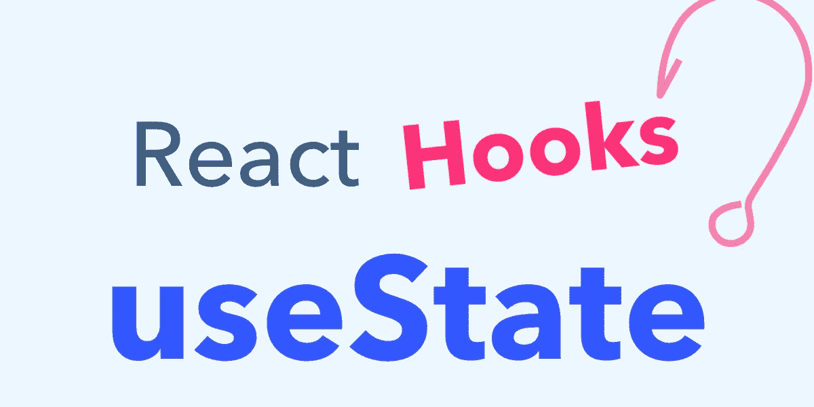

# 在 React 中使用状态挂钩

> 原文：<https://medium.com/nerd-for-tech/usestate-hook-in-react-7901afd9d4e9?source=collection_archive---------10----------------------->

react 中最重要的钩子的简化版本

在阅读本文之前，非常重要的一点是，您应该具备 react 的基本知识，以及如何在笔记本电脑上运行 React 应用程序。如果你不知道，我会推荐你阅读[我的关于 React 入门的文章](/codechef-vit/how-to-get-started-with-react-9fbbdab60a56)，这样你就有了基本的准备。



学习在功能组件中使用 useState。

关于 React 挂钩的几个事实:

## [📌](https://emojipedia.org/pushpin/) React 钩子只能用在功能组件中，因为类组件有自己的方式来做 React 钩子做的事情。

## [📌不能有条件地调用 React 钩子，例如，它们应该总是按照你希望它们被调用的顺序来放置。](https://emojipedia.org/pushpin/)

```
function App(){if(true){useState()}
```

现在上面的代码会给出一个错误，因为*“React Hook useState 被有条件地调用”*。对于每个组件渲染，必须以完全相同的顺序调用 React 挂钩。

**使用状态挂钩:**

从 React 导入 useState 挂钩，如下所示:

```
import {useState} from ‘react’ ;
```

只需在函数中调用它，并传递默认状态。useState 总是返回包含两个值的数组。数组中的第一个东西总是当前状态，第二个是允许你将当前状态更新到下一个状态的函数。

```
const [count, setCount] = useState(initialState)
```

**现在，在 decrementCount 中编写一个函数 setCount，如下所示:**

```
function decrementCount()
{
setCount(prevCount => prevCount-1)
}
```

这里，prevCount 存储的是最后一个计数，我们**没有使用 Count-1** ，因为 count 存储的是默认状态，如果我们连续使用 setCount 两次，它们只会相互覆盖，不会产生任何影响。

类似地，创建一个递增函数:

```
function incrementCount()
{
setCount(prevCount => prevCount+1)
}
```

**调用 useState 钩子的两种方法:**

第一种方式是在开始时直接传递默认值，第二种方式是使用函数方式，这样我们的函数就不会在每次重新呈现组件时运行。如果初始状态计算非常慢，我们不希望我们的网站变慢，我们应该使用函数版本，这样它只运行一次。

**想把对象作为默认状态怎么办？**

你们一定想知道，我们是否可以只更新我们想要改变的对象的一部分，而留下在使用钩子时不应该被触及的部分。答案是否定的！

在功能组件中，当使用钩子时，我们必须**展开初始阶段**和**，然后更新我们想要改变的对象**。如果您在状态中使用对象，请记住也要更新旧值，因为它们不会自动更新。我们可以这样做:

```
function App()
{
const [state, setState] = useState({**count:4 , theme: "blue"**})

function decrementCount()
{
setState(prevState =>{return{ **…prevState** , count: prevState.count-1)})}
```

> …prevState 用于更新旧值。

通常的做法是**使用多个状态挂钩**来处理不同的事情，这样每个部分都可以被单独处理，不会有任何问题。

我们可以为计数和主题使用多个挂钩，如下所示:

```
import React, {useState} from 'react';
function App(){const [count, setCount] = useState(4)const[theme, setTheme] = useState(“blue”)function decrementCount()
{
setCount(prevCount => prevCount-1)
setTheme("red")}function incrementCount()
{
setCount(prevCount => prevCount+1)
}
return(
<button onClick={decrementCount}>-</button>
<span>{count}</span>
<span>{theme}</span>
<button onClick={incrementCount}>+</button>
)}
```

**useState** 第一次看起来可能很吓人，但是一旦你明白了如何使用它，那么从字面上来说，这将是你学过的最好的东西。

如果您对我的博客还有任何疑问或建议，请给我发邮件至 muskanagarwal1906@gmail.com**或在 LinkedIn[联系我**联系我**](https://www.linkedin.com/in/muskanagarwall/)**！****