# 在过场动画游戏中使用推车轨道

> 原文：<https://medium.com/nerd-for-tech/using-a-dolly-track-in-our-game-over-cutscene-b2c731b228f8?source=collection_archive---------20----------------------->

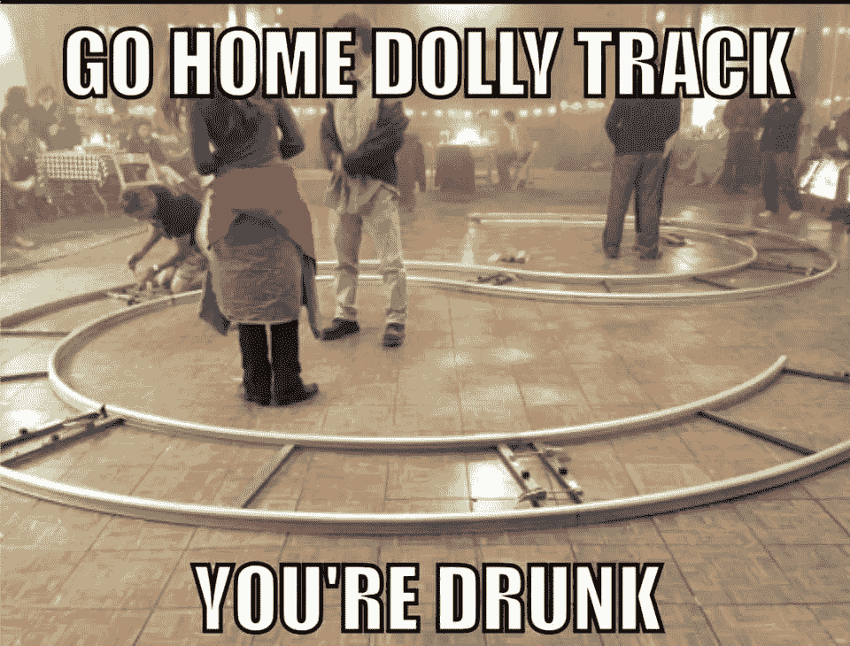

完成一个过场动画后，我们可以开始制作下一个了。首先，我们想看看导演的笔记，看看他们对过场动画的设想:

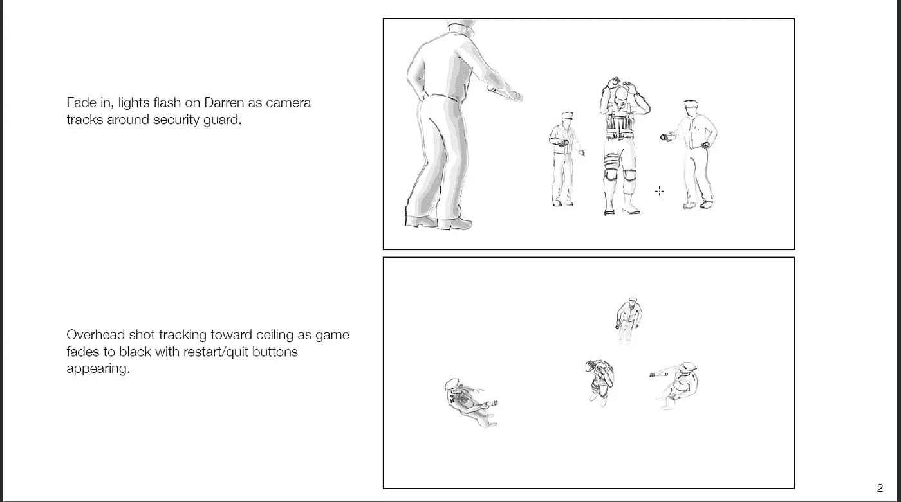

这张草图告诉我们，我们将需要创建 2 个不同的摄像机角度，以及一个小车轨道，我们可以用它来让我们的第一个摄像机跟踪警卫。
首先，让我们设置好两台摄像机:

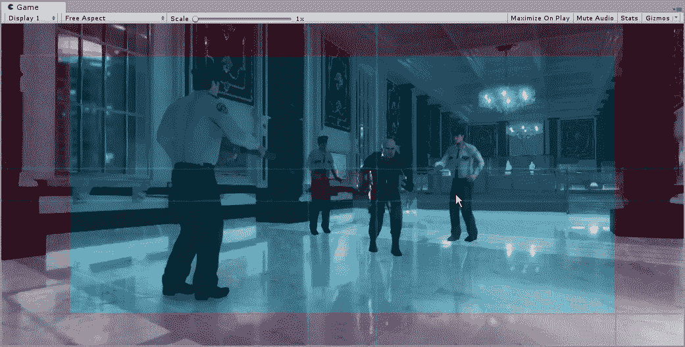

对于我们的正面场景，我们可以看到我们的死角接触到我们的球员和一名后卫，所以我们有一个很好的三分法设置:

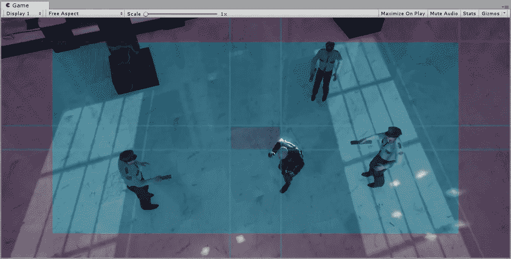

在这个空中镜头中，我们有一个角球碰到了我们的球员，而所有的警卫都在这个场景中。
现在我们已经设置好了摄像机，我们可以开始创建时间线并设置动画了:

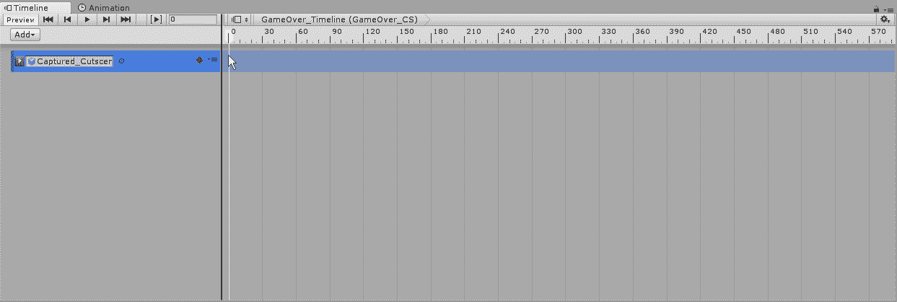

一旦我们为动画选择了演员，我们还必须确保添加剪辑。接下来，我们将让我们的 2 个摄像机就位，并让它们在我们的玩家开始低头的动画点进行切换:

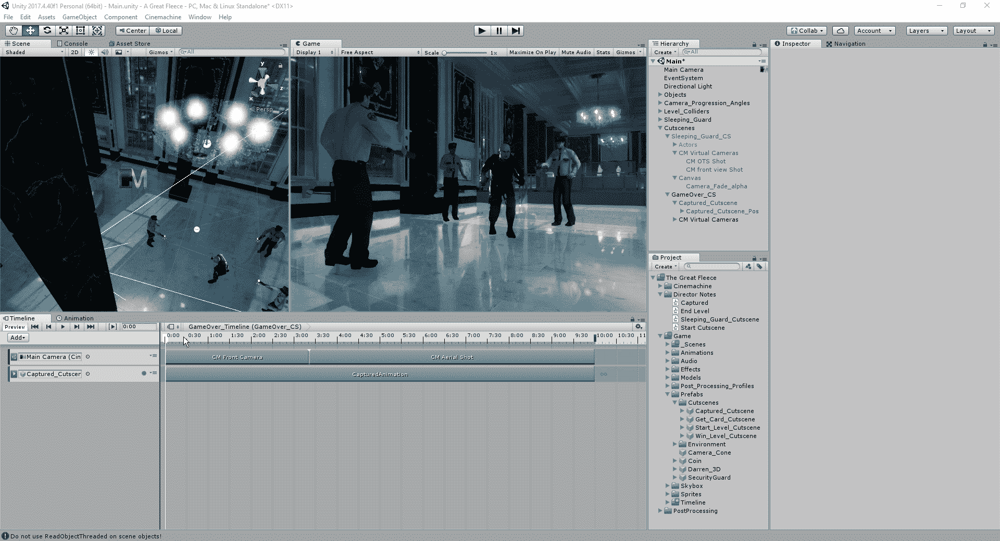

既然我们已经在适当的时候切换了摄像机，现在是时候开始制作摄像机在场景中的动画了。首先，我们将为我们的第一台摄像机实现一个移动系统，因为我们想让它在 1 号警卫周围移动:

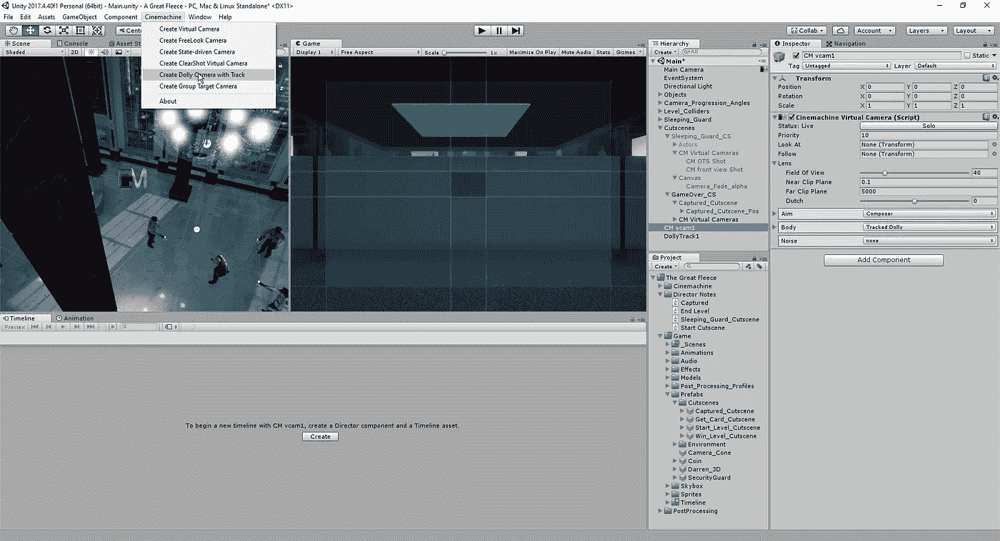

当我们创建一个小车轨迹时，它将使摄像机和轨迹一起工作。因为我们已经设置好了摄像机，所以我们可以删除摄像机，只处理轨道。在 Unity 中，移动轨道的工作方式是通过航路点。这些路点是轨道移动的不同焦点，允许我们在轨道上创建曲线来进行简单的转弯，或者我们可以创建一个巨大的过山车类型的系统。在我们的例子中，我们只需要处理 2 个点，并调整这些点的切线来给出我们的曲线:

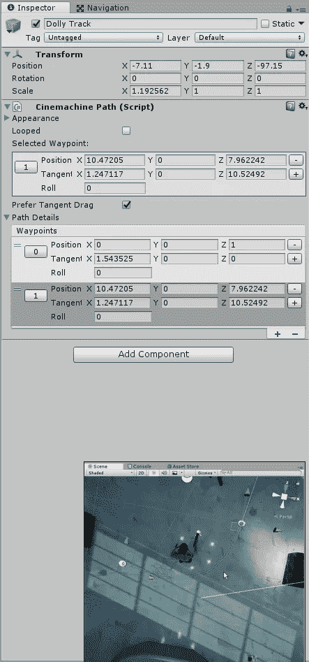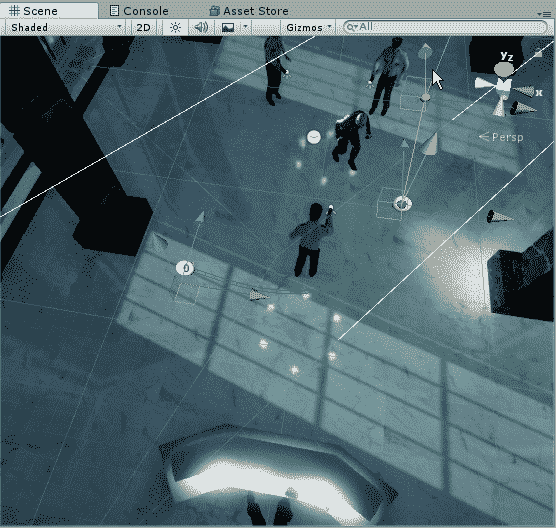

从这里开始，我们需要将新制作的轨道连接到摄像机，这样它就有了一条路径可循:

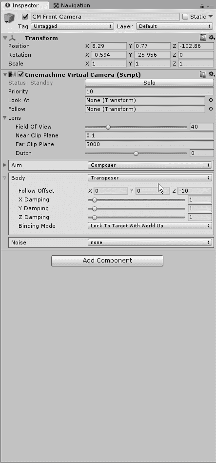

为了让我们的相机看向正确的方向，我们需要选择一个目标来观看。我们的演员是如何设置的，我们有一个内置于玩家中的目标，所以我们只需告诉我们的摄像机朝那个方向看:

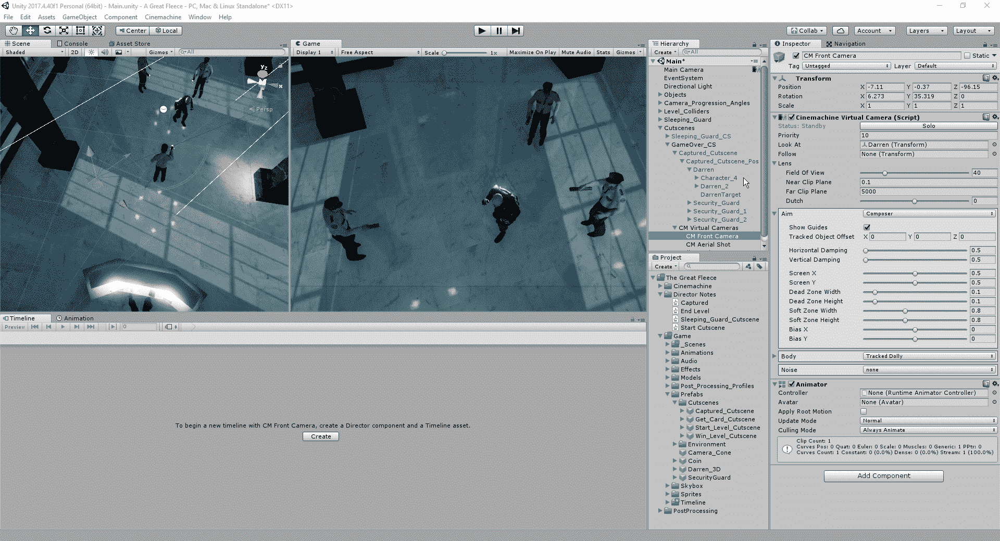

现在我们已经准备好了，我们将为我们的摄像机创建一个新的动画轨迹，并简单地让它在我们的轨迹上从 0 开始，然后在过程结束时移动到 1。完成设置后，我们可以查看摄像机的动画，看看是否需要调整摄像机的高度、移动速度或动画，然后再切换到下一个视图:

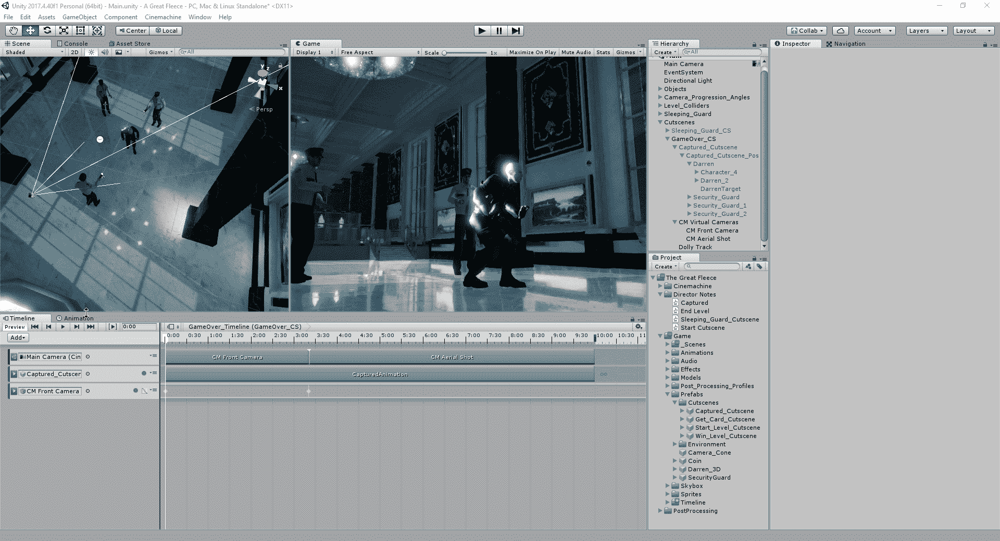

我们想要更改的一个快速设置是在摄像机视图的目标设置范围内，将死区宽度和高度调整为 0:

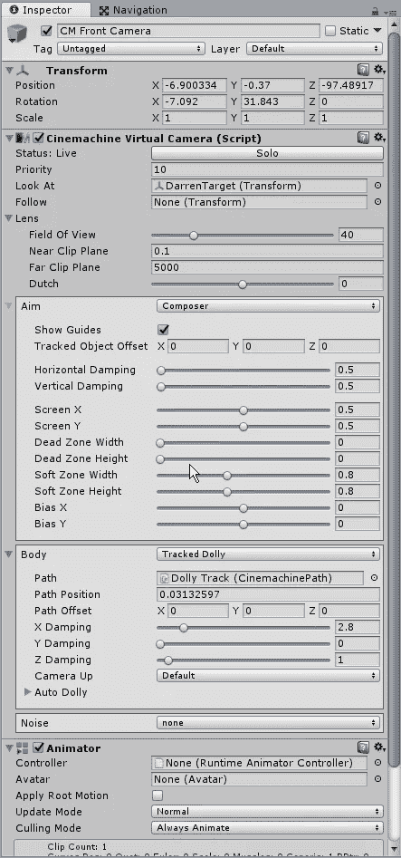

接下来，我们将创建一个快速画布，在过场动画的开始和结束处应用淡入和效果。与最后一个过场动画一样，我们将只改变它的每个部分的 alpha，而不是创建两个不同的对象，我们将只让动画序列持续整个时间，但对于它的大部分，它将是透明的:

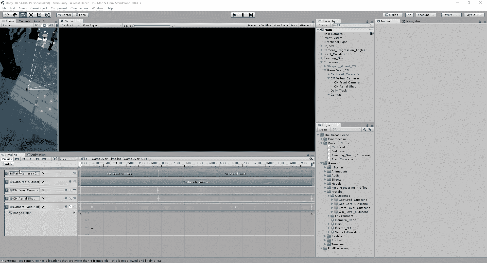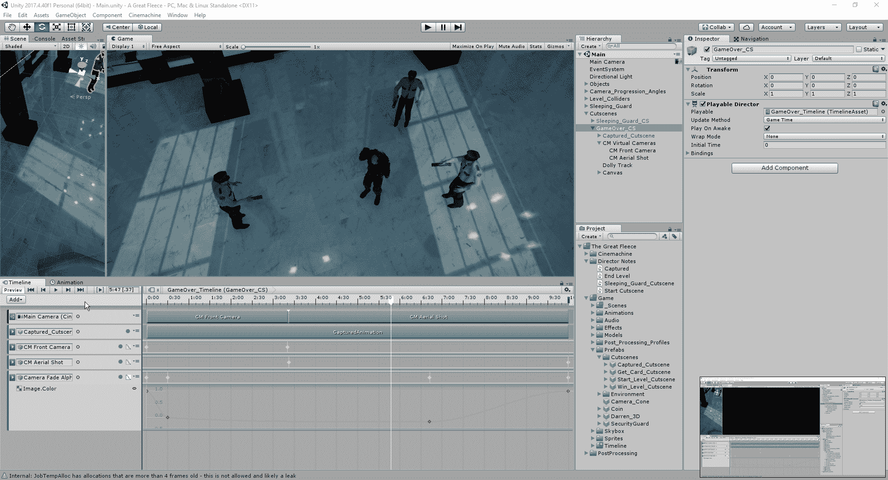

现在我们已经设置好了场景，我们将在屏幕上创建一些 UI。
首先，我们要在画布上创建文本和按钮:

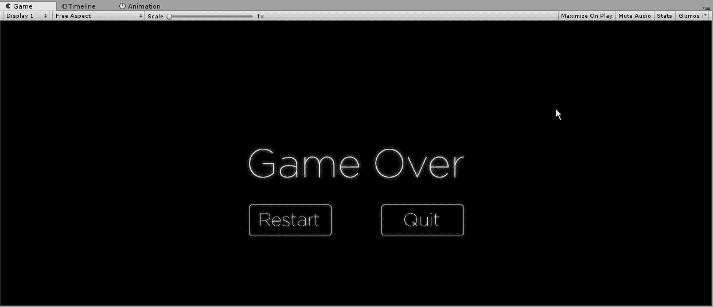

为了让我们将这三个独立的对象捆绑到一个动画中，我们将创建一个空对象来放置这三个部分，以便我们可以在同一个动画中一次调整它们:

最后，我们将为这些对象创建动画，并让它们开始出现在我们的过场动画的末尾:

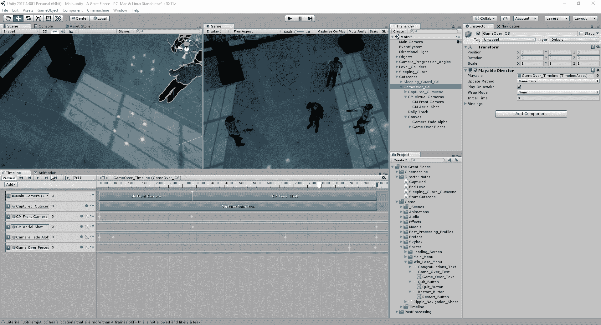

现在我们已经完成了过场动画游戏，我们可以开始游戏的下一部分了。