# 使用移动轨道| Unity

> 原文：<https://medium.com/nerd-for-tech/using-a-dolly-track-unity-eb503cb4cd08?source=collection_archive---------2----------------------->

## 统一指南

## 关于如何在 Unity 中使用推车轨道的快速指南

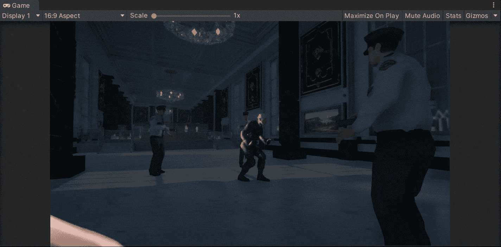

**目标**:实现一个 dolly 轨道，在 Unity 中构建一个过场动画。

在上一篇文章中，我介绍了 Unity 中的时间线[。现在，是时候实现一个小车轨道来处理一个虚拟摄像机并在 Unity 中构建一个过场动画了。](/nerd-for-tech/introduction-to-timeline-in-unity-cf9aba6d777e)

# 新过场动画

首先，让我们来看看过场动画，我们将建立使用小车轨道。我们有一个空的游戏对象，包含过场动画的演员和虚拟摄像机:

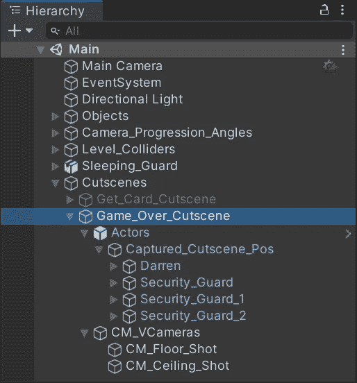

正如[在上一篇文章](/nerd-for-tech/introduction-to-timeline-in-unity-cf9aba6d777e)中，我们将虚拟摄像机放置在由[预览元素](/nerd-for-tech/working-with-previs-elements-unity-89aa8103007c)定义的位置。这个过场动画的目的是展示小偷(玩家)何时被守卫(NPC)发现，游戏何时结束。第一个镜头显示了从地板附近的角度辨认小偷，而第二个镜头显示了同一场景，但是是从上面的角度:

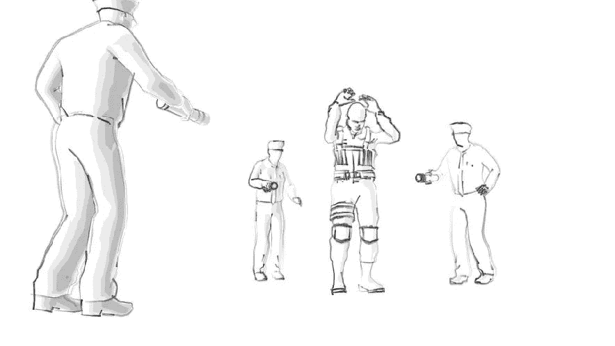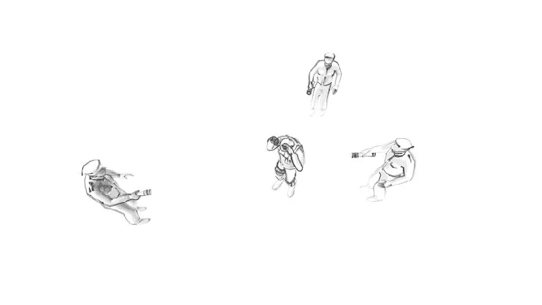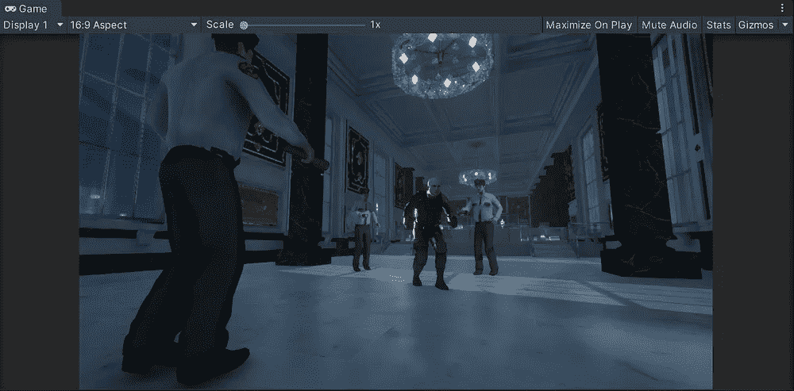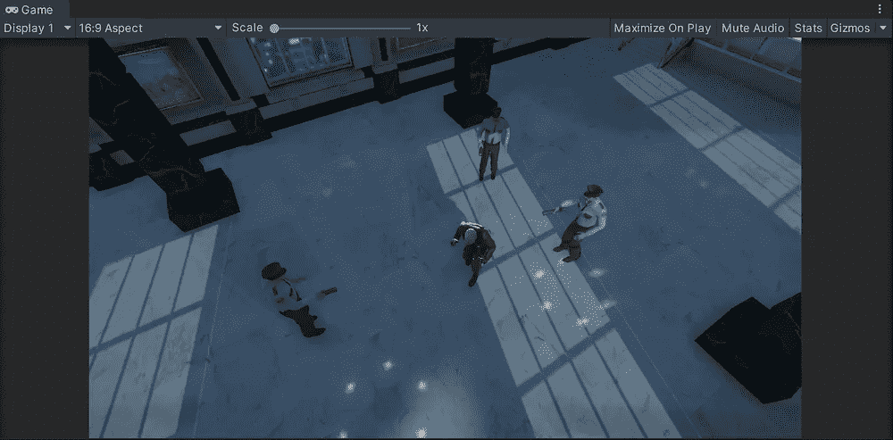

两个虚拟摄像机(来自 [Cinemachine](https://unity.com/es/unity/features/editor/art-and-design/cinemachine) )和模型的动画使用时间轴窗口处理。过场动画预计持续 10 秒钟，一旦小偷碰到它的头，我们需要从第一台摄像机切换到第二台摄像机:

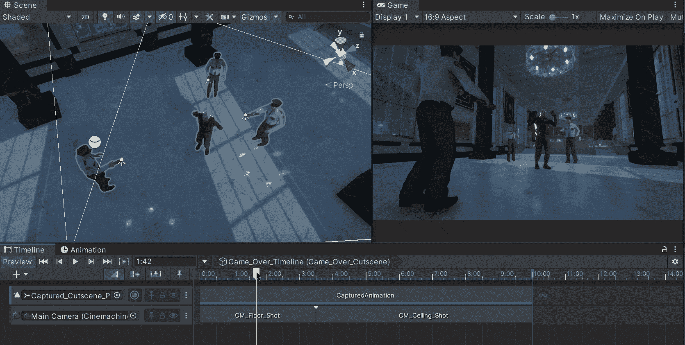

在 previs 元素中定义的需求之一是让第一个摄像机能够在安全警卫周围移动时跟踪 Darren(小偷)。因此，为了满足要求，让我们通过点击*cinema Chine>Create Dolly Camera With Track*来创建一个新的小车轨迹。

这将创建一个小车轨道和一个新的虚拟摄像机，但我们只需要小车轨道，因为我们已经有了各自的摄像机用于过场动画拍摄。让我们删除新的虚拟相机，并保留推车轨迹:

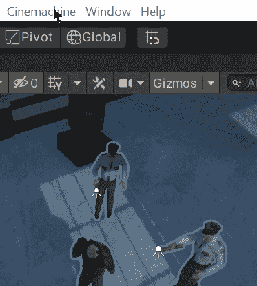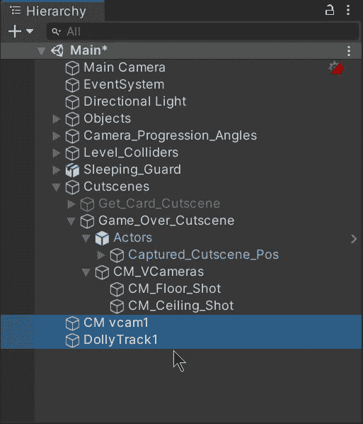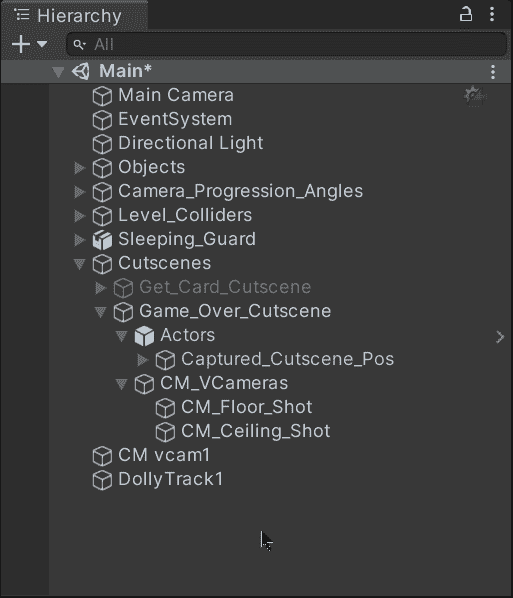

*移动小车轨迹*或*移动小车路径*是一组路点，允许我们指定动画路线并改变虚拟摄像机的位置。

现在，如果在场景视图中查看小车轨迹，我们将能够看到轨迹中只有 2 个路点。第一个航路点显示为 0，下一个航路点将显示下一个数字:

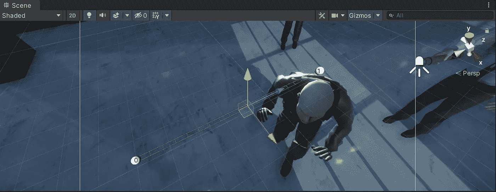

如果我们在层级中选择移动轨道，我们将能够通过检查器增加路径点:

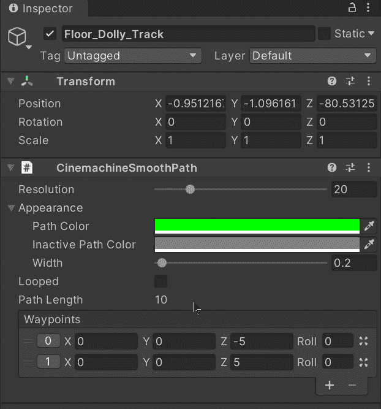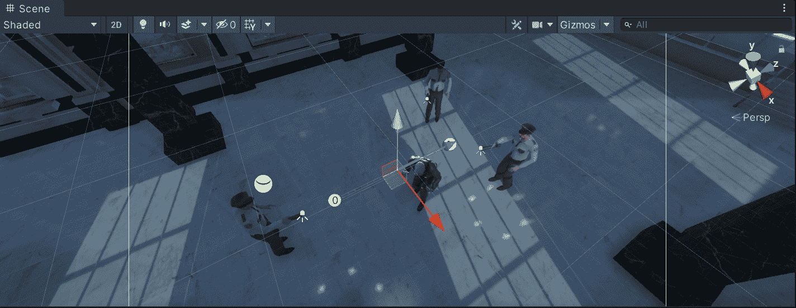

现在，让我们将移动小车轨道移动到开始跟踪小偷的位置附近(小偷已经由我们的第一个虚拟摄像机定义):

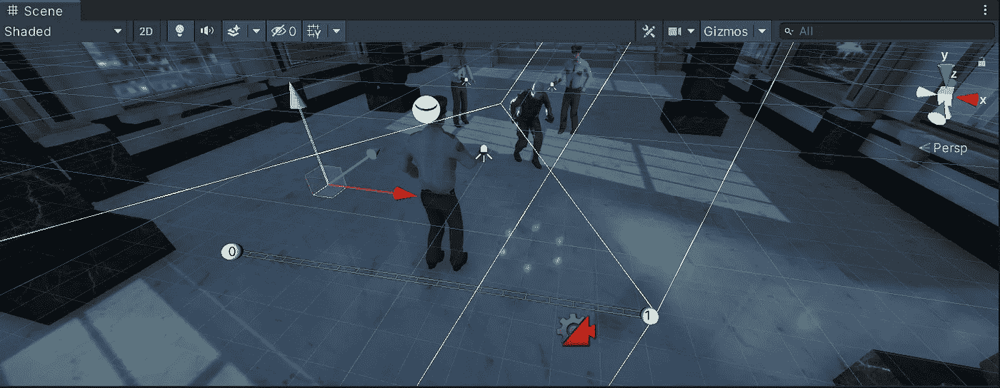

因为我们在赛道上只有 2 个航路点，所以我们只能用它来定义一条直线。因此，为了从四周掩护保安，让我们添加更多的路点，形成一条圆形的路径:

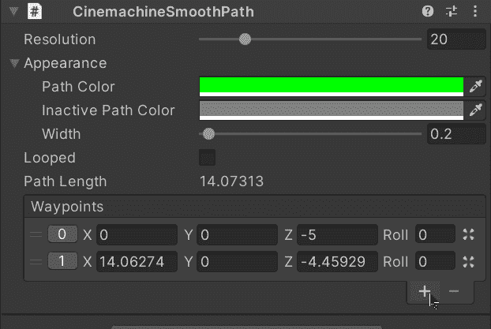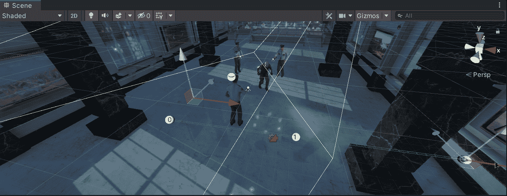

为了覆盖镜头中的三名警卫，我决定在赛道上使用 4 个航路点，如下所示:

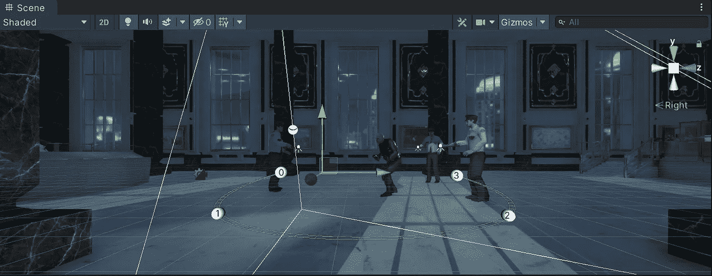

现在，为了实现推车轨迹，让我们从层次结构中为地面镜头选择虚拟摄像机。然后，在检查器中，让我们点击*身体*属性，并选择*被跟踪的小车*而不是*移位器*，这样我们就可以将小车轨道拖动到*路径*槽中，并在摄像机中实现它:

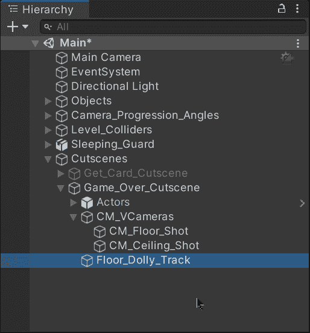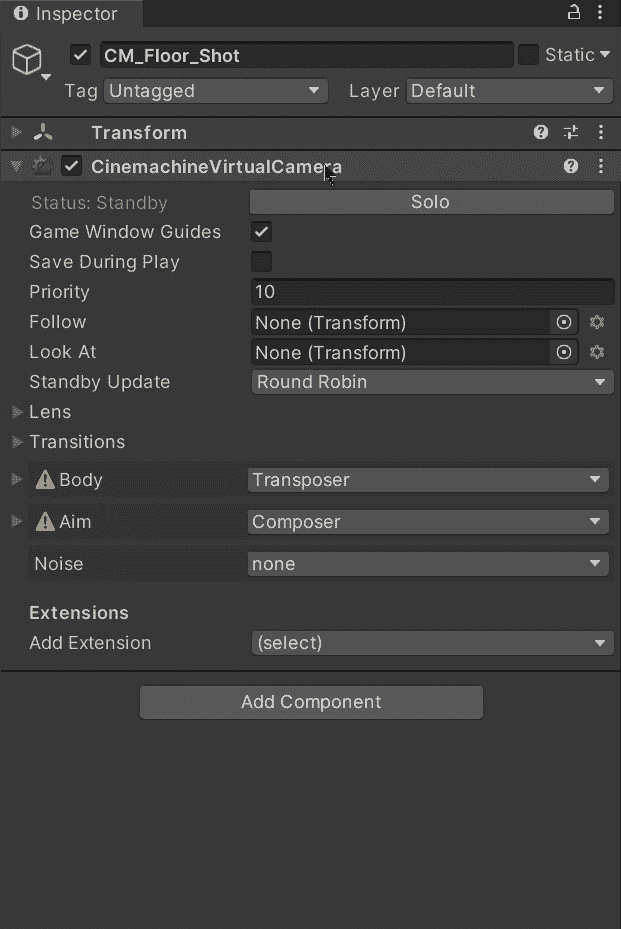

如果我们设置虚拟摄像机来显示游戏视图，并修改*路径位置*属性，我们将能够看到摄像机沿着小车轨道移动。*路径位置*基本上是根据小车轨迹的航点索引选择摄像机的位置；

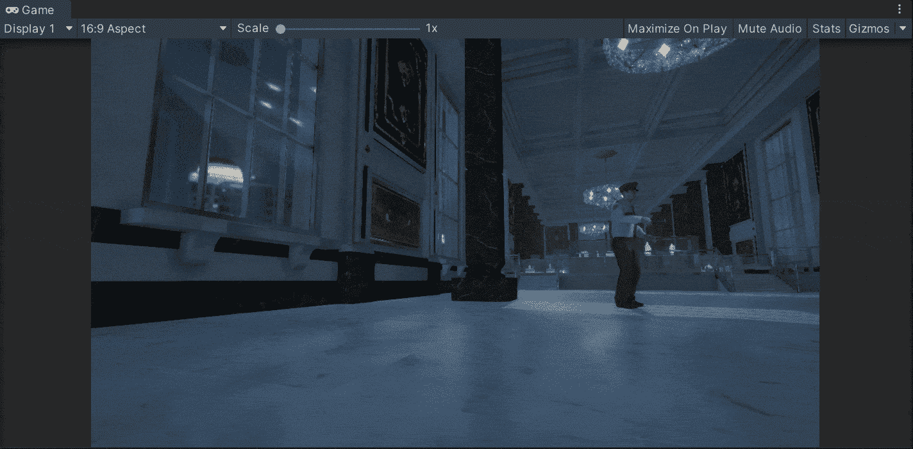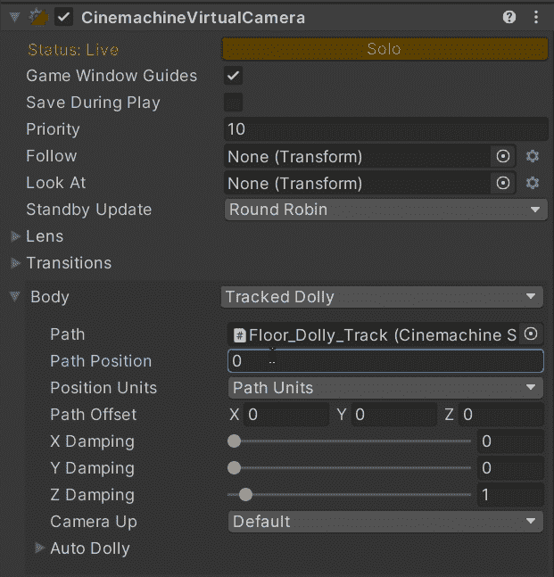

现在，为了给过场动画制作摄像机动画，让我们打开时间轴窗口并拖动虚拟摄像机来创建一个新的动画轨迹:

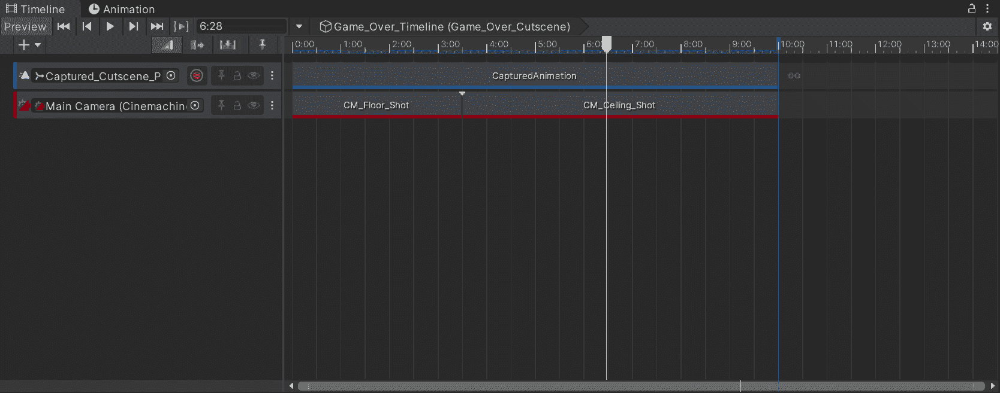

然后，要使用移动小车轨道上的航路点来记录摄像机的位置，让我们单击记录按钮，并移动箭头(以秒为单位),我们希望摄像机位于每个航路点。一旦我们选择了第二帧或第三帧，让我们通过检查器修改虚拟摄像机中的*路径位置*，我们将看到在时间轴中创建了一个关键帧:

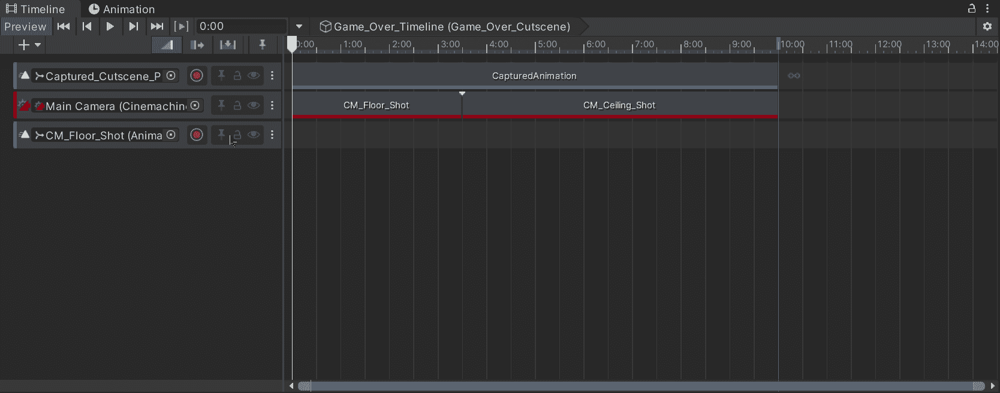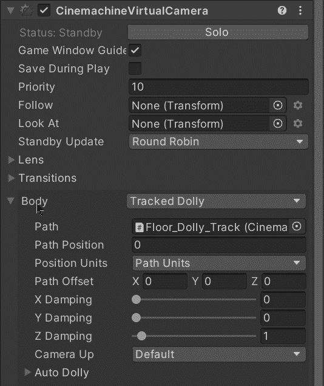

这样，我们可以确保摄像机在过场动画期间移动到移动小车轨迹中的不同路点:

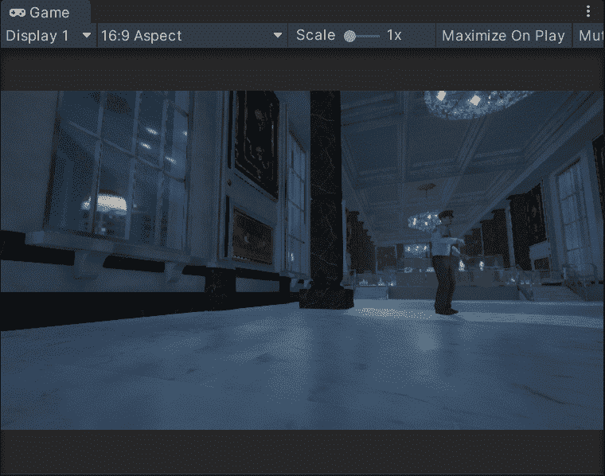

您会注意到摄像机只是在移动，并不看着我们的目标，因此，为了看着小偷，我们可以利用虚拟摄像机内的*看着*属性。为此，让我们将小偷游戏对象拖动到相应的插槽中，如果我们在时间轴窗口中播放过场动画，我们将会看到不同之处:

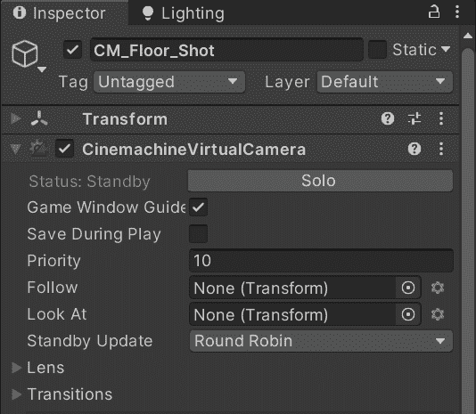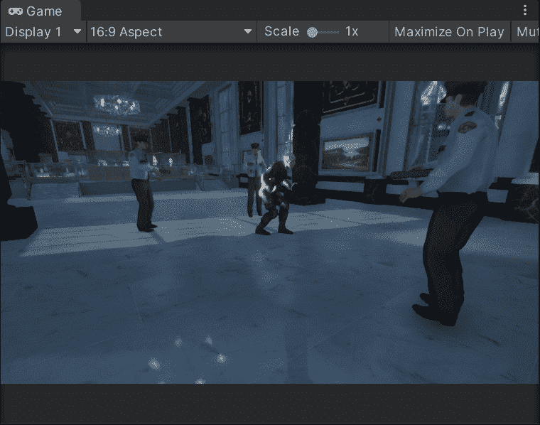

就这样，我们在 Unity 中实现了一个移动轨道！:d .我将在下一篇文章中看到你，在那里我将展示如何使用时间轴和 Unity 来处理动画。

> *如果你想了解我更多，欢迎登陆*[***LinkedIn***](https://www.linkedin.com/in/fas444/)**或访问我的* [***网站***](http://fernandoalcasan.com/) *:D**