# 使用抽象类设计敌人| Unity

> 原文：<https://medium.com/nerd-for-tech/using-abstract-classes-to-design-enemies-unity-60c39c793a66?source=collection_archive---------3----------------------->

## 统一指南

## 关于如何使用抽象类在 Unity 中实现敌人的快速指南

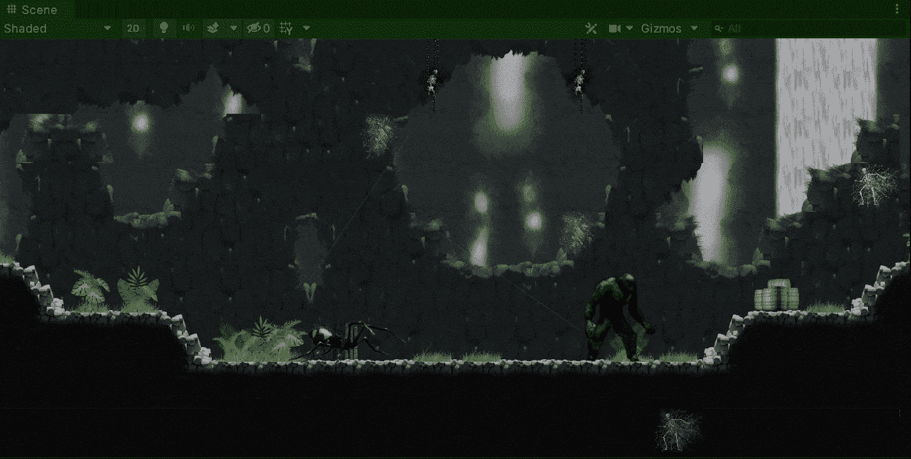

目标:使用抽象类在 Unity 的 2D 游戏中实现敌人的机制。

在上一篇文章中，我介绍了[如何用 Unity](/nerd-for-tech/implementing-a-jump-mechanic-unity-6420b106e47a) 为我们的玩家实现一个跳跃机制。现在，是时候开始在我们的 2D 游戏中使用抽象类或虚拟方法来实现敌人的机制了。

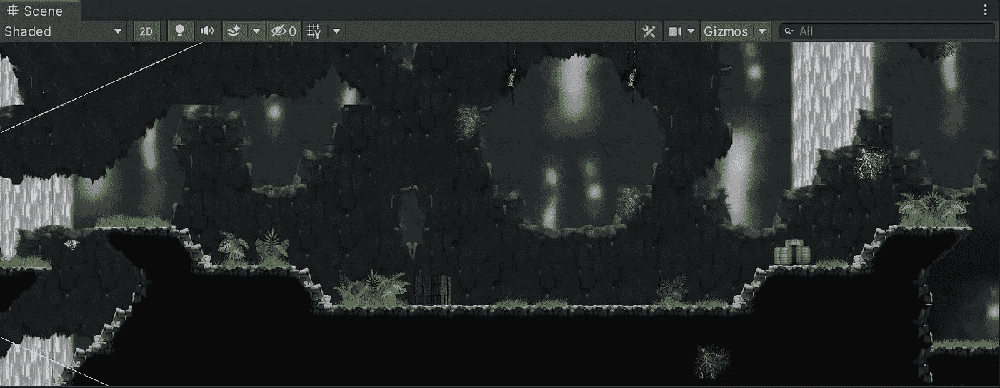

# 创造敌人

## 精灵

首先，让我们用精灵创建几个新的游戏对象来代表我们游戏的新敌人。出于我们的目的，我们将使用蜘蛛和苔藓巨人的精灵:

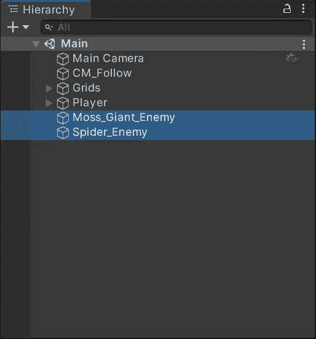

## 班级

然后，为了使用抽象类实现我们的敌人，让我们创建 3 个新的 C#脚本:

*   敌军

这个类将是抽象的，它将代表我们在游戏中使用的每个敌人子类的基础。

*   苔藓巨人

这个子类将从敌人类继承，并将处理主要的敌人机械和苔藓巨人机械。

*   蜘蛛；状似蜘蛛的物体；星形轮；十字叉；连接柄；十字头

这个子类将从敌人类继承，并将处理主要的敌人机制和蜘蛛机制。

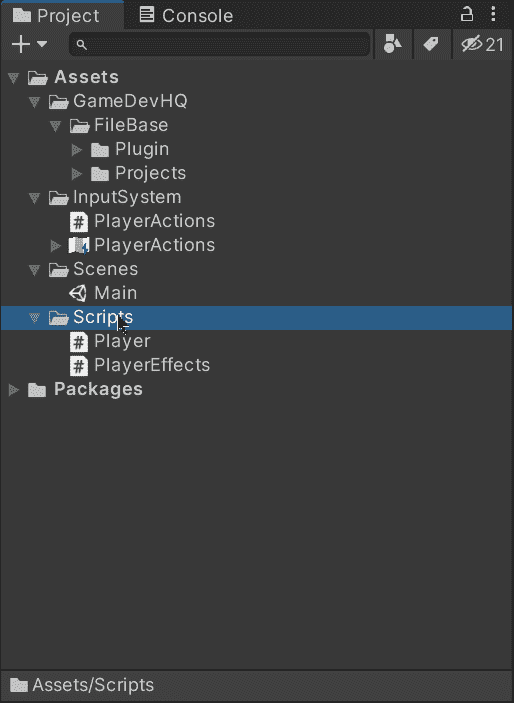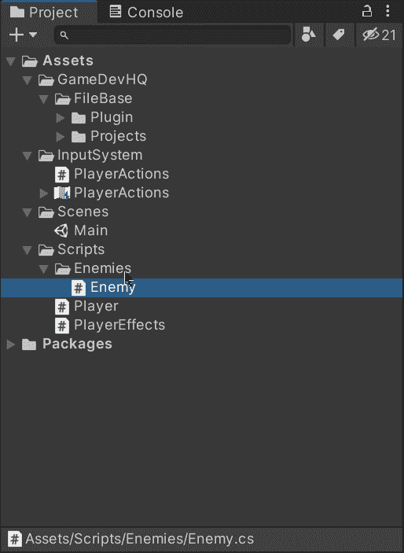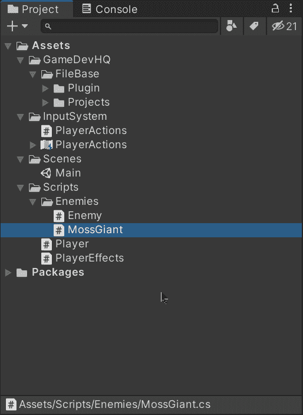

现在，为了表明**敌人**级将是敌人子类的基础，让我们:

*   打开**敌人**脚本，添加 ***摘要*** 关键字:

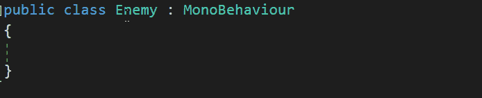

> 注意:指出**敌人**类是**抽象**很重要，这样我们可以在其中创建抽象方法。

*   开启**苔藓巨人**和**蜘蛛**职业，将**单行为**的继承改为**敌人**:

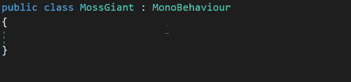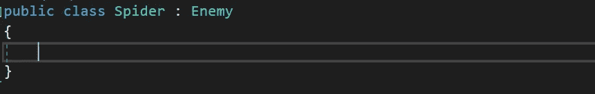

## 变量

现在，正如我们所知，每个敌人子类都继承自**敌人**类，我们可以创建新的变量，我们知道每个敌人都需要这些变量(比如生命值、速度或被击败后会掉落的宝石):

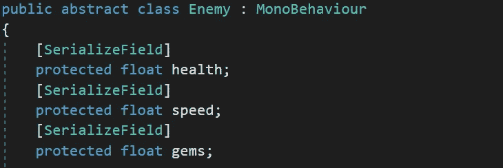

不要忘记使用**【serialize field】**能够通过检查器修改值。

> 注意:我们需要将变量设置为 **protected** (或 **public** )以便能够读取和使用敌人子类中的变量。

这样，我们就可以将各自的脚本附加到我们的敌人身上，并通过检查器修改其值:

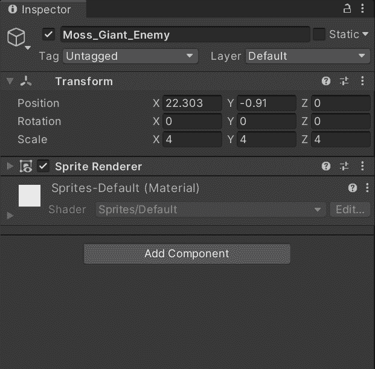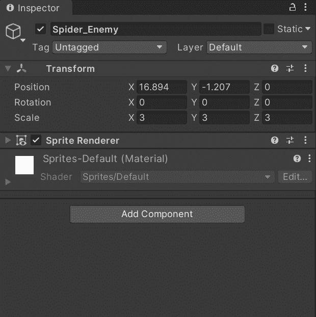

## 虚拟方法

现在，让我们实现一个每个敌人都可以从基类实现的方法:**攻击**。通过使用一个虚拟方法，我们能够在敌人子类中使用或覆盖它。让我们声明**虚拟攻击**方法，并在调用它时打印一条消息:

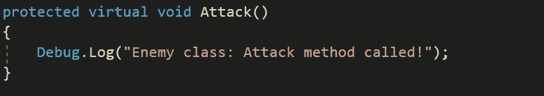

然后，让我们在敌人子类中声明**覆盖攻击**方法。使用 override 关键字，我们能够覆盖来自**敌人**基类的方法，或者通过使用**基类在新的实现中调用它。进攻**线:

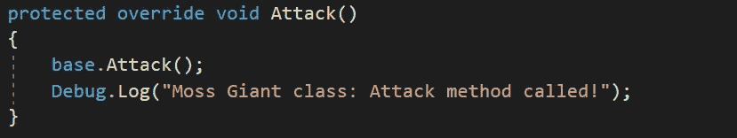

现在，为了看看虚拟方法是如何工作的，让我们使用**敌人**子类中的**开始**方法来调用**攻击**方法:

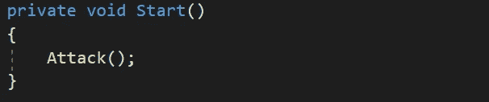

如果我们用 Unity 运行游戏，我们将能够看到来自**敌人**基类的**攻击**方法首先被调用(感谢 **base。Attack** )然后子类中的攻击方法继续执行:

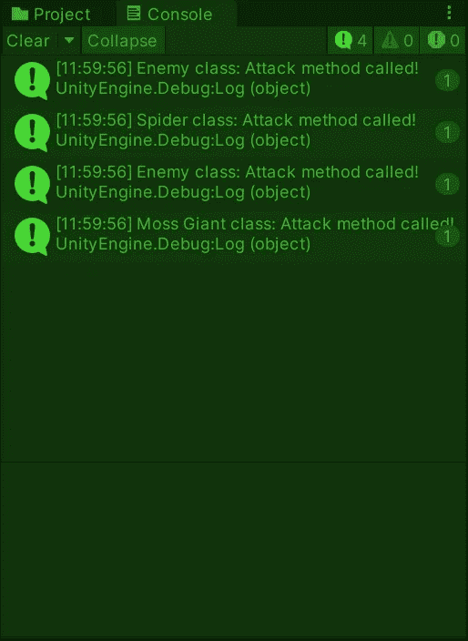

## 抽象方法

最后，让我们为基类实现一个抽象方法。抽象方法意味着在其子类中实现相同的方法是强制性的。例如，让我们将 **Update** 方法实现为一个抽象方法:

> 注意:当我们在**抽象**类中声明一个**抽象**方法时，我们不能定义任何功能。

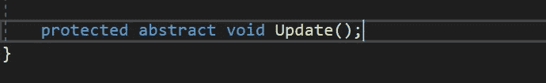

一旦 **Update** 被声明为抽象方法，我们将能够看到编译器在 **Enemy:** 的子类中显示一个错误

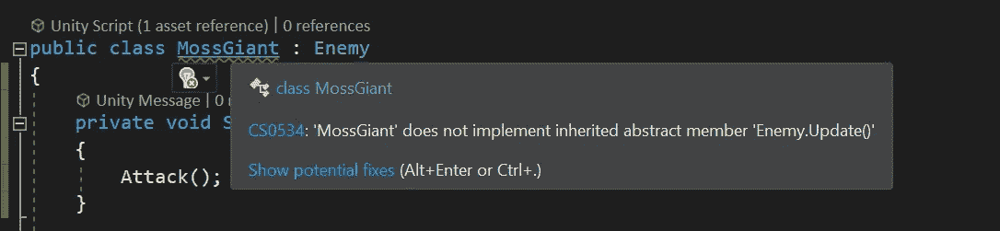

显示这个错误是因为我们应该在子类中强制实现 **Update** 方法。因此，为了解决这个问题，让我们在 **MossGiant** 和 **Spider** 子类中实现**覆盖更新**方法:

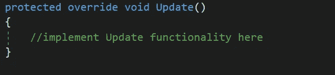

这样我们可以确保我们创建的每个敌人都强制实现了 **Update** 方法。通过使用抽象类或虚拟方法，我们能够交付一组功能性的、有组织的类，它们使用类似的机制，就像我们游戏中的敌人。

就这样，我们用抽象类实现了 Unity 的敌人机制！:d .我会在下一篇文章中看到你，在那里我会继续用 Unity 开发我们的 2D 游戏。

> *如果你想更多地了解我，欢迎登陆*[***LinkedIn***](https://www.linkedin.com/in/fas444/)**或访问我的* [***网站***](http://fernandoalcasan.com/) *:D**