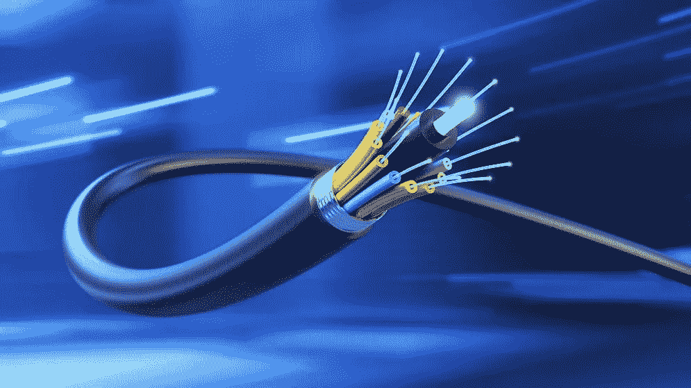
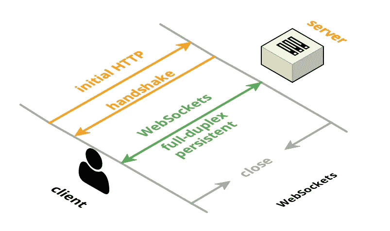
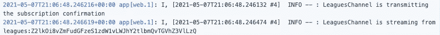
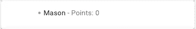

# 在你的 Rails/React 应用中使用 Action Cable:显示“在线”状态

> 原文：<https://medium.com/nerd-for-tech/using-action-cable-in-your-rails-react-app-showing-online-status-7204c6553d02?source=collection_archive---------3----------------------->

[哇，看看这条电缆](https://www.google.com/url?sa=i&url=https%3A%2F%2Fwww.capacitymedia.com%2Farticles%2F3825840%2Fellalink-and-emacom-launch-smart-subsea-cable-initiative&psig=AOvVaw1Hk6O8G6TdNOmKHnlRBbVT&ust=1620163029155000&source=images&cd=vfe&ved=0CAIQjRxqFwoTCKCA3uC3rvACFQAAAAAdAAAAABAJ)

我目前正在使用 Action Cable 来实现我的幻想相扑应用程序的现场草稿。已经有一些关于这个主题的文章，我觉得非常有用，我会在这个博客的末尾链接到它们。我想为那些试图使用 Action Cable 的人提供另一个资源，这个应用程序的后端使用 Ruby on Rails，前端使用 React，这样你就可以显示每个客户端上谁连接到了 Action Cable。

不要换台，我们开始吧！

# 什么是行动电缆？

Action Cable 是一个内置的 Rails 库，有助于 WebSocket 集成。Action Cable 允许您“访问用活动记录编写的完整域模型或您选择的 ORM”有必要稍微讨论一下什么是 WebSockets。

WebSocket 是一种通信协议，通常在服务器和一个或多个客户端之间。与 HTTP 不同，WebSocket 连接允许与服务器之间的数据传输，也称为“全双工”通信。左边是创建 WebSocket 连接的过程。

“握手”使用 HTTP 升级头将 HTTP 协议更改为 WebSocket 协议。一旦这被接受，数据就可以在客户机和服务器之间来回发送。服务器甚至可以自动广播来自客户端的消息和数据。

到目前为止，我们所知道的是 Action Cable 是 Rails 附带的一个库，它利用 WebSockets 或 WebSocket 协议，允许以自由流动、来回的方式(全双工通信)传输数据，而不像通常的 HTTP 请求/响应周期。好极了。

# 设置行动电缆

[我爱齿轮！](https://www.google.com/url?sa=i&url=https%3A%2F%2Ffineartamerica.com%2Ffeatured%2Ftechnicians-connecting-wires-of-eniac-science-source.html&psig=AOvVaw1OvUzgY6kyElWczfSaYzxF&ust=1620335884639000&source=images&cd=vfe&ved=0CA0QjhxqFwoTCKji3ti7s_ACFQAAAAAdAAAAABAW)

对什么是 Action Cable 有了一个非常基本的了解后，我现在将介绍如何设置它。因为我一直在学习 Action Cable，并在我的 fantasy sumo 应用程序中使用它，所以我将用这个例子来解释。

## 后端配置

要在后端的 Rails 中设置 Action Cable，您必须做 4 件事:

1.  创建您的渠道。我用`rails g channel league`是因为我对 Rails 生成器很感兴趣，我想为每个联盟提供一个频道。这将在我们的 channels 文件夹中创建一个 LeaguesChannel 文件。
2.  在您的 routes 文件中添加`mount ActionCable.server => '/cable'`。这将添加动作电缆端点。你真的可以随便命名这个`'/cable'`位。
3.  在 gem 文件中取消注释“redis”gem。Redis 是一个“内存中的数据结构存储”, Action Cable 使用它来跟踪数据。就像一个只为你的 WebSockets 的快速访问数据库。
4.  在 config 文件夹中，打开 cable.yml，将开发适配器从`async`更改为`redis`，并在下面添加一个 url 属性，为其提供与生产设置中相同的 url。我听说当适配器设置为`async`时，它在开发模式下不能很好地工作，这超出了我的理解，所以我按照普遍的建议做了这一步。你的 cable.yml 应该是这样的:

## 前端配置

配置前端非常简单。以下是步骤:

1.  运行`npm install actioncable --save`。这为我们提供了 Action Cable 的节点包，其中包括连接到后端 WebSocket 的方法。
2.  将“actioncable”添加到 index.js 文件中，并调用节点包中包含的“createConsumer”方法，如下所示:

我们正在从刚刚安装的包中导入 actionCable。然后，我们将创建一个 CableApp 对象来存储所有与电缆相关的项目。我们在该对象中创建一个名为`cable`的属性，并将其设置为调用 createConsumer 方法，该方法连接到我们在后端指定的地址。然后，我们可以将 CableApp 对象传递给我们的应用程序组件。

# 订阅行动有线电视

现在一切都设置好了，我们可以放入一些代码，这样我们的前端就可以订阅后端的频道并接收广播。在我的应用程序中，我希望订阅发生在用户打开一个联盟的草案时。因此，我将 CableApp 对象传递给我的草稿组件，并在组件上的一个 [useEffect](https://reactjs.org/docs/hooks-effect.html) 中进行订阅。

我们为 CableApp 对象创建一个名为“league”的新属性，并将其设置为一个函数 subscriptions.create，我们从 CableApp 的 cable 属性调用该函数。这个函数有两个参数:第一个指定订阅哪个频道，包括我们给它的任何参数，以及一个包含特定于 Action Cable 订阅的一些生命周期函数的对象。在这个例子中，我连接到我后端的“LeaguesChannel ”,并向它传递联盟 id 和当前用户的 id，它们都保存在我前端的存储中。

在我的 useEffect 的底部，我返回了一个匿名函数，我用它来清理(useEffect 可以返回一个函数来处理副作用)。因为我不希望用户在离开草稿页面时仍然订阅该频道，所以我在 CableApp 对象中调用了 disconnect 方法。

现在让我们看看我们在后端订阅的频道。这是我们在本文开头调用 rails 生成器时创建的文件之一。

在我们生成一个新的通道之后，已经提供了一些方法。我已经在我订阅的方法中添加了一些代码。这个方法使用我们在前端提供的联盟 id 和用户 id，在我们的数据库中找到这些记录，并为特定的联盟记录创建一个流。

> 这个频道是我从“ApplicationCable::Channel”创建的。通过 Action Cable，我们可以访问通用通道类和连接类。这些对于授权和认证用户非常有用，尤其是在纯 Rails 应用程序中。因为我在前端授权和认证，并相信无效用户将无法访问草稿页面，所以我没有这样做。

一旦我们从浏览器中挂载并渲染了我们的草稿组件，我们应该被订阅，我们后端的日志应该会显示类似…

# 显示用户“在线”

让我们添加一些功能，以便每当用户订阅该频道时，他们姓名旁边的图标将从灰色(非活动)变为绿色(活动)。首先，让我们添加一些代码到我们的前端。

这些连接和接收的函数在我的订阅创建函数中，该函数在草稿组件的 useEffect 中。connected 中的第 3 行告诉后端的 LeaguesChannel 的订阅实例调用一个“出现”函数，我们稍后将创建这个函数。Received 现在将带有温和标签的“数据”作为参数，并将其传递给 updateOnlineStatus。

这个函数在页面“用户-<userid>-状态”中找到一个 CSS 类。草稿页面上的每个用户卡旁边都有一个小图标，并被分配给此类，如下所示…</userid>

每当前端接收到用户在线的广播时，接收到的函数会将该用户的 id 发送到 updateOnlineStatus 函数，以便该图标也可以被赋予“在线”类。在 CSS 中，这个类将颜色改为鲜艳的绿色，这样用户的卡片看起来就像这样…

让我们回到前端的`connected()`函数和`this.perform('appear')`的功能。

因为连接的函数是在我们的订阅创建内部定义的(在 useEffect 内部，参考上面的 draft 组件)，`this`参考`props.cableApp.league`。当我们调用`this.perform('appear')`时，我们是在告诉 LeaguesChannel 我们想要调用一个名为“出现”的函数。让我们开始吧！

我已经更新了 LeaguesChannel 文件，添加了一个“出现”方法。它将向通道广播一个对象，该对象包含当前用户的 id 和“在线”状态。我还更新了 unsubscribed 方法，除了状态为“脱机”之外，广播相同的内容。

因此，现在当我们在这个频道上接收广播并将接收到的数据发送到我们的 updateOnlineStatus 函数时，我们将拥有一个与 DOM 上的用户状态图标匹配的用户 id，以及一个“在线”或“离线”状态，以让我们知道该图标是否应该具有“在线”类，从而给它一个绿色图标。

# 下一个挑战:显示已经在线的用户

我很快遇到的一个问题是，当我打开一个新的浏览器窗口并在草稿中登录另一个帐户时，两个用户对第一个用户都显示为在线，但最初在线的用户对最新加入的用户显示为离线。

我试图查询该频道的当前订阅情况，但事实证明这比我想象的要复杂得多(Action Cable connection 对象可能相当大而且冗长)。然后我想我可以在某个地方保存对每个连接用户的引用，也许是连接类。但是它实际上也不是这样工作的——此外，我们每次都必须迭代连接用户的集合，这似乎不是很好。

我在 Github 上偶然发现了一个不冷不热的分歧，大致涉及到这个问题，提供的解决方案是在建立新连接时断开所有连接，强制重新连接，然后所有订户都有最新的信息。虽然感觉不太优雅，但我暂时决定采用这种模式。我用它玩了一会儿，在无数次无休止地断开和重新连接之后，我找到了一个可行的解决方案。

在 LeaguesChannel 中，我为“再现”添加了这个方法。理想情况下，我只需向我的“出现”方法传递一个参数，但是我找不到关于使用`perform("method")`语法时在前端传递参数的文档。

在前端，在我的“received”函数中，我提供了一些条件，如果这些条件都满足，那么就调用“repreneur”方法，新用户可以看到他们订阅频道时已经在线的用户。

# 资源

[行动电报文件](https://edgeguides.rubyonrails.org/action_cable_overview.html)

[好教程](/javascript-in-plain-english/integrating-actioncable-with-react-9f946b61556e)

[行动电缆上的视频，特别是使用定制行动电缆的方法](https://youtu.be/KAnR4k6bJqE)