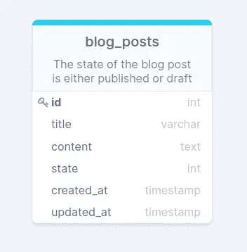
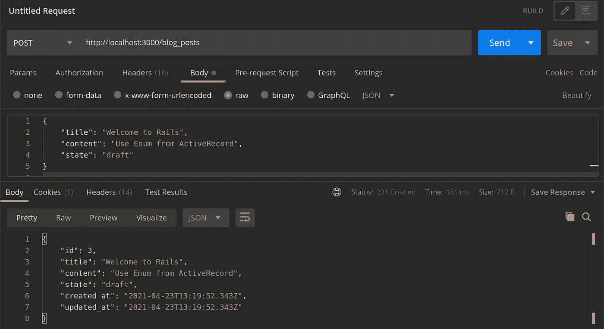
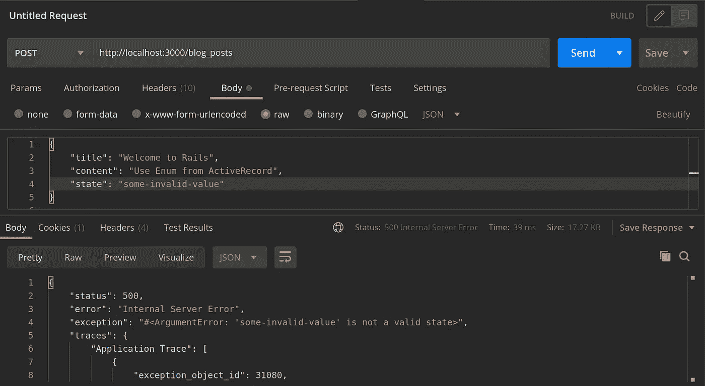
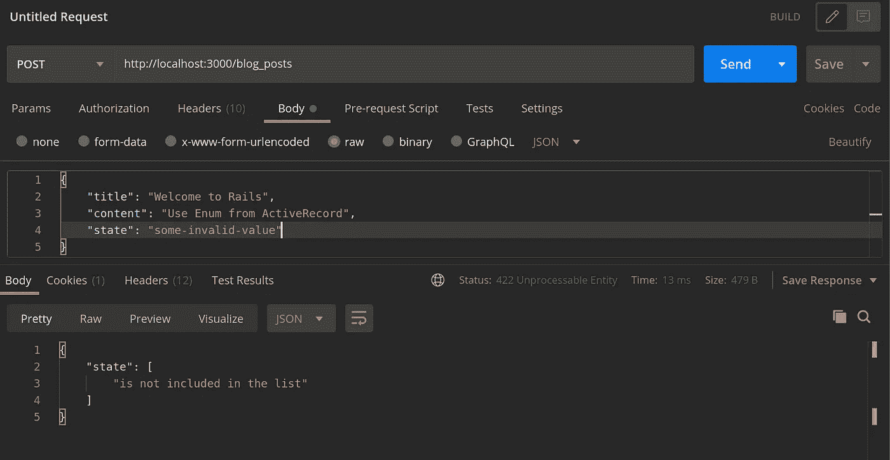
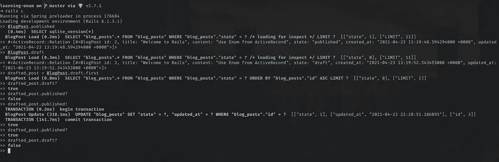

# Rails API 中的 ActiveRecord::枚举验证

> 原文：<https://medium.com/nerd-for-tech/using-activerecord-enum-in-rails-35edc2e9070f?source=collection_archive---------0----------------------->

## *ActiveRecord::Enum* 允许您声明一个 **enum** 属性，其中的值映射到数据库中的整数，但是可以通过名称进行查询。

最近，我一直在构建一个 Rails RESTful-API，并在 *ActiveRecord* 中发现了`enum`特性。让我们看看你如何使用它。



blog_posts 表模式

我们将建立一个非常简单的博客应用程序，其中我们有一个 BlogPost 模型来存储帖子。
注意，我们使用`int`作为*状态*属性的数据类型。这是因为 *ActiveRecord::Enum* 在内部将数据存储为整数，并允许您将它用作字符串。优点包括需要更小的存储空间，更快的查询和索引。

让我们从生成一个仅支持 API 的应用程序开始，并亲自动手:

```
rails new blog --api
```

为了加快速度，让我们搭建一个资源并运行迁移以将更改应用到数据库:

```
rails g scaffold BlogPost title content:text state:integer
rails db:migrate
```

让我们将博客模型中的`enum`添加到*状态*中:

app/models/blog_post.rb

不要忘记运行 Rails 服务器`rails s`。你应该可以通过 http://localhost:3000 访问服务器。

好了，现在让我们试着写一篇博文，看看是否一切都如预期的那样



酷！太好了。✨

到目前为止，一切顺利。但是，如果我们试图发送除了为*状态*枚举`[draft published]`定义的值之外的值，会发生什么呢？让我们试一试。



哦，呸！那是 500 美元。😕

这很奇怪，所以我们来调查一下…

框架跟踪具有以下对象:

```
{
   "exception_object_id": 31080,
   "id": 0,
   "trace": "activerecord (6.1.3.1) 
             lib/active_record/enum.rb:152:in `assert_valid_value'"
}
```

阅读`lib/active_record/enum.rb`源代码，确切地说是`assert_valid_value`函数定义，我们会发现:

源代码复制自[https://github . com/rails/rails/blob/main/active record/lib/active _ record/enum . Rb # L148-L152](https://github.com/rails/rails/blob/main/activerecord/lib/active_record/enum.rb#L148-L152)

这意味着，只要分配给 enum 属性的值在提供的键中不存在(在我们的例子中是 draft 和 published ),就会引发 *ArgumentError* 。

> 可以说，rails 团队选择引发`ArgumentError`而不是验证错误是正确的，因为我们可以完全控制用户可以从单选按钮组中选择什么选项，或者可以在`select`字段中选择什么选项，所以如果程序员碰巧添加了一个新的单选按钮，而该按钮的值有一个错别字，那么引发一个错误是好的，因为这是一个应用程序错误，而不是用户错误。
> 
> 然而，对于 API 来说，这是行不通的，因为我们不再能够控制发送给服务器的值。
> 
> —stack overflow[答](https://stackoverflow.com/a/37184383/9329261)作者 [Jay-Ar Polidario](https://stackoverflow.com/users/3073313/jay-ar-polidario)

那么，我们如何调整这种行为来满足我们的 API 需求呢？

我们将不得不覆盖 ActiveRecord::Enum 的`assert_valid_value`的行为。我们将通过从 ActiveRecord::Enum 继承，然后将修复应用到新类中的`assert_valid_value`来间接完成这个修复。

> 这个解决方案深受这个答案的影响[https://stackoverflow.com/a/58416806/9329261](https://stackoverflow.com/a/58416806/9329261)。

让我们首先为可验证的枚举类型创建一个类

app/types/validatable _ enum _ type . Rb

我们将使用`***decorate_attribute_type****(column_name, decorator_name, &block)*`。

> 此方法是一个内部 API，用于创建类宏(如 serialize)和功能(如时区感知属性)。
> 
> 用于将属性的类型包装在新类型中。当加载模型的模式时，与 column_name 同名的属性的类型将让位于给定的块。将改为使用该块的返回值。
> 
> —来源:[https://API dock . com/rails/v 6 . 0 . 0/active record/attribute decorators/class methods/decorate _ attribute _ type](https://apidock.com/rails/v6.0.0/ActiveRecord/AttributeDecorators/ClassMethods/decorate_attribute_type)

这里，我们允许传递多个枚举来应用所需的行为。对于每个传递的枚举，我们用 ValidatableEnumType 包装它的数据类型，它覆盖了抛出`ArgumentError`的`assert_valid_value`。

现在我们需要在 BlogPost 模型中包含我们的关注点，并将新的行为应用到我们的 *state* enum。

app/models/blog_post.rb

让我们重试上一次失败的 POST 请求，创建一个状态无效的 BlogPost，看看是否一切正常



喔喔喔🎉！

您可以轻松定制出错时返回的消息

app/models/blog_post.rb

试一试，看看消息看起来怎么样


关于验证错误的自定义消息

好多了，是吧？我们还没完。ActiveRecord::Enum 不仅仅局限于将数据从字符串转换为整数并存储在数据库中。



ActiveRecord::Enum 的用法

您将获得以下功能:

*   使用范围按提供的值进行查询(例如:BlogPost.draft)
*   更新记录的枚举值(例如:BlogPost.pubilshed！)
*   检查枚举值的相等性(例如:BlogPost.published？)

你可以在下面的 GitHub 库中找到我们写的源代码。[https://github.com/kerolloz/active-record-enum-example](https://github.com/kerolloz/active-record-enum-example)