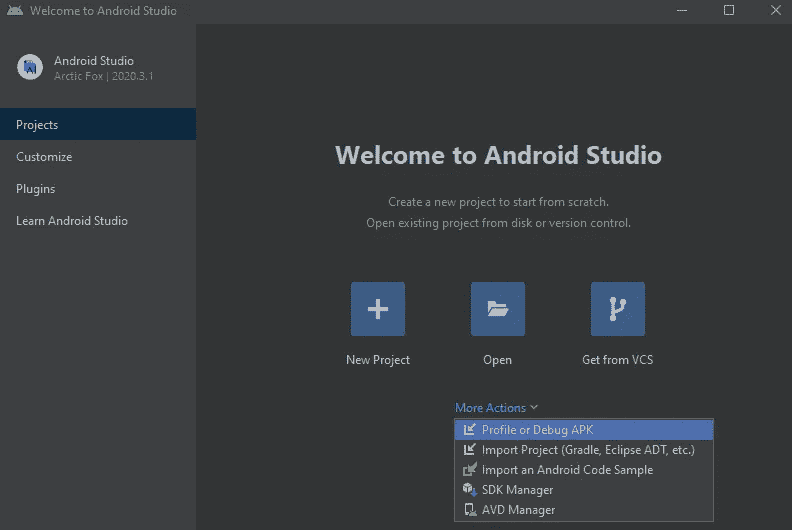
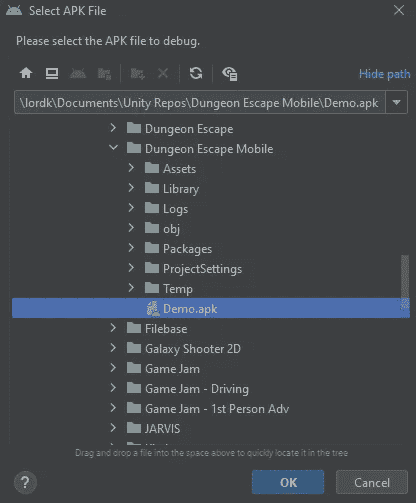
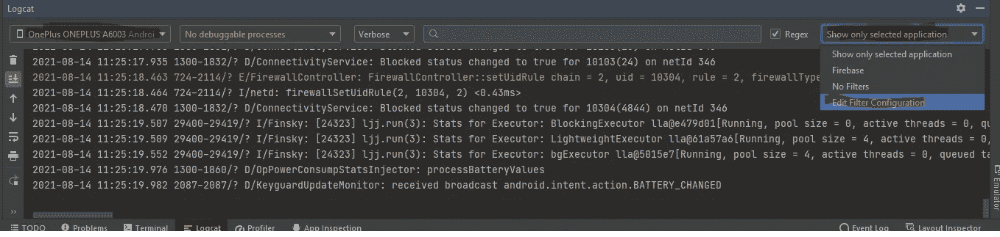
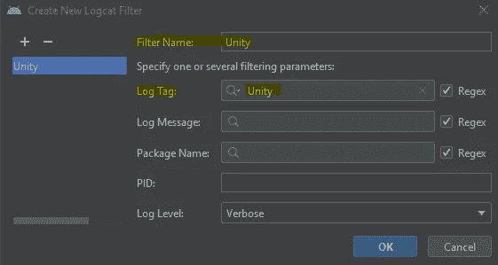
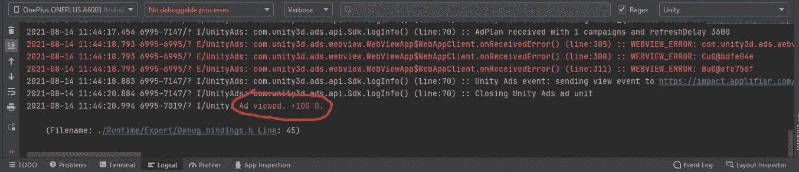

# 使用 Android Studio 和 Unity

> 原文：<https://medium.com/nerd-for-tech/using-android-studio-with-unity-bda2dd5b2068?source=collection_archive---------7----------------------->

**目的:**从 Android 设备上观察一个游戏的调试日志。

我们已经安装了来自 https://developer.android.com/[的 Android Studio。现在我们将选择*配置文件或调试 APK* 。](https://developer.android.com/)

然后我们选择*。我们创建的 apk* 文件。

现在，我们将 Android 设备连接到 PC，在设备上启用开发人员模式，然后在设备上启用 USB 调试。每个设备的这个过程都不同——你可能需要谷歌一下如何为你的设备做到这一点。

连接后，我们将单击 *Logcat* 选项卡，并从下拉列表中选择我们的设备。从最右边的下拉列表中，我们将选择*编辑过滤器配置*。

我们将创建名为“Unity”的新过滤器，并将*日志标记*指定为“Unity”*。*

现在，当我们启动应用程序时，我们将看到该应用程序的日志信息。下图，我看过一个游戏内广告，赚了 100 钻石。我们的调试模式正在工作！

