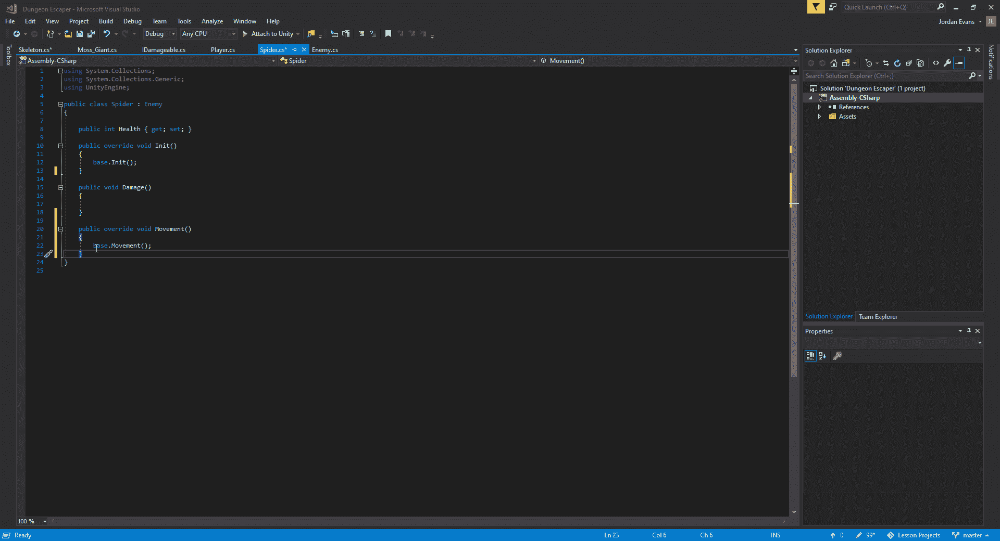
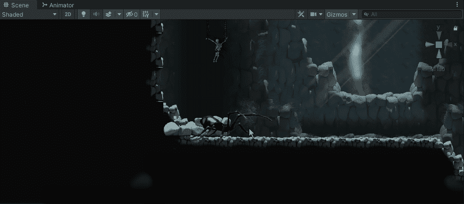
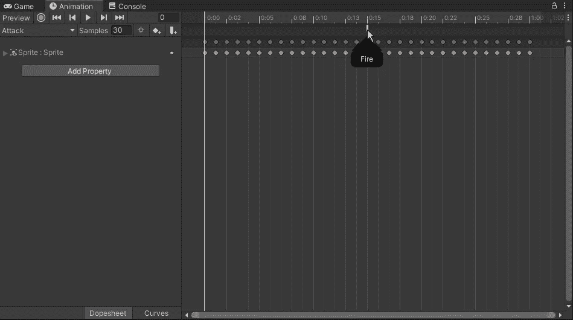
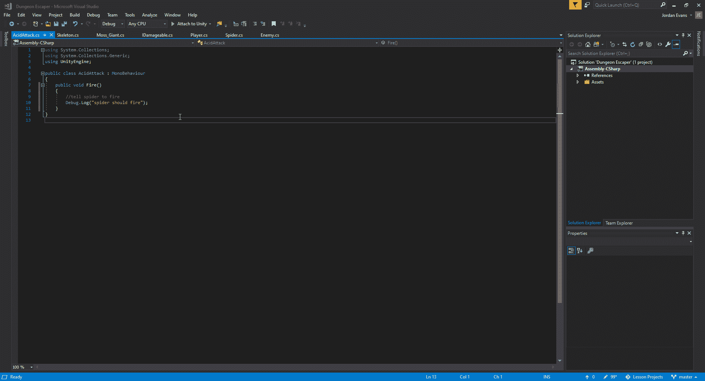
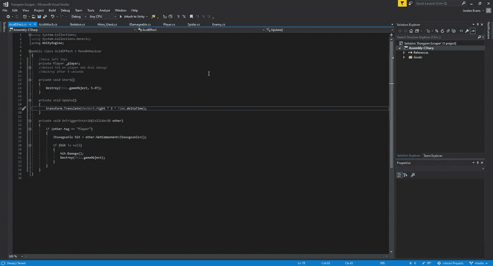
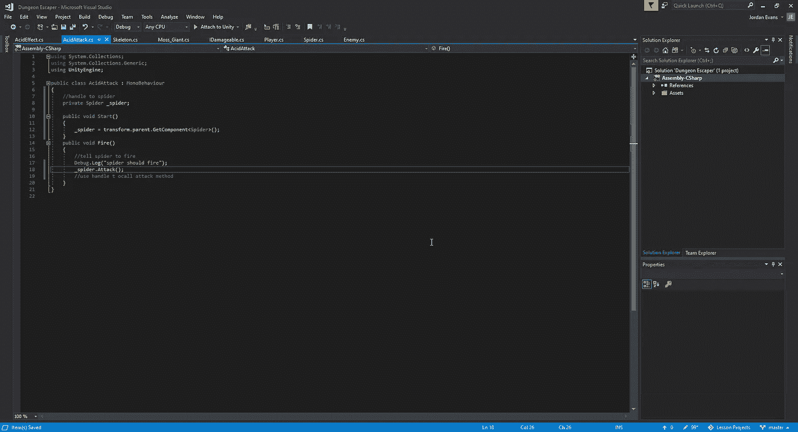
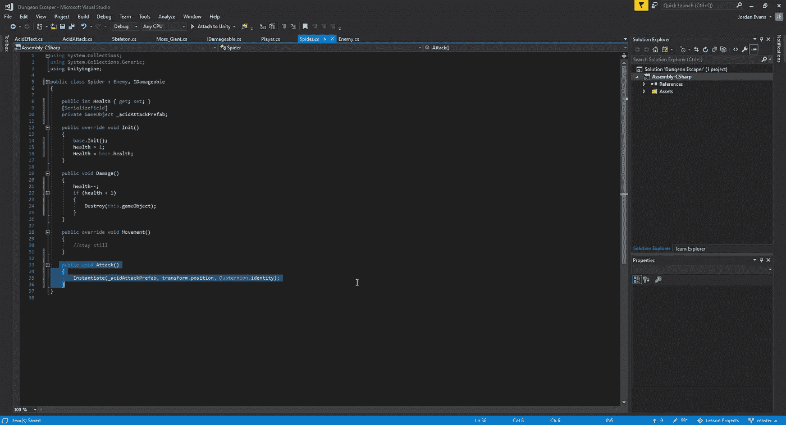
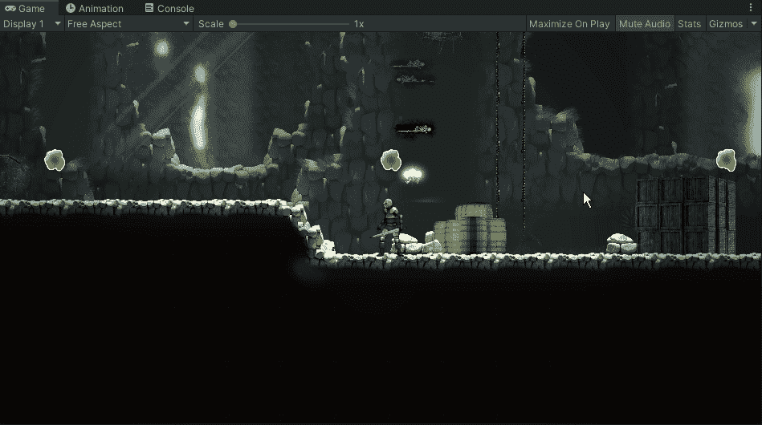

# 使用动画事件

> 原文：<https://medium.com/nerd-for-tech/using-animation-events-7f217991080f?source=collection_archive---------6----------------------->

现在我们已经设置好了骨架，让我们来看看如何让我们的蜘蛛敌人有自己独特的方法。对于这个游戏，我们的蜘蛛将只是坐在角落里无所事事，并发射酸性球。为了做到这一点，我们将需要进入我们的蜘蛛脚本并删除移动功能，同时在蜘蛛的攻击动画中创建新的事件。
为此，我们将在蜘蛛脚本中创建一个覆盖方法，并取消移动:

在我们的动画师中去掉过渡之后，我们可以看到它是否只是在它的角落里:

从这里开始，我们将为我们的蜘蛛攻击设置脚本，在摄影表中设置动画事件后，我们可以在游戏中测试它:

接下来，让我们实例化我们的 acid balls，让它从蜘蛛那里触发。我们需要为将要使用的攻击创建几个新脚本，并将其链接到我们的蜘蛛脚本:

一旦我们设置好了，我们就可以在游戏中进行测试，以确保酸性球与玩家互动，并在 5 秒钟后自我毁灭:

好了，我们已经通过使用动画事件设置了蜘蛛的独特攻击。接下来，我们将探索如何在我们的游戏中创建一个战利品系统。