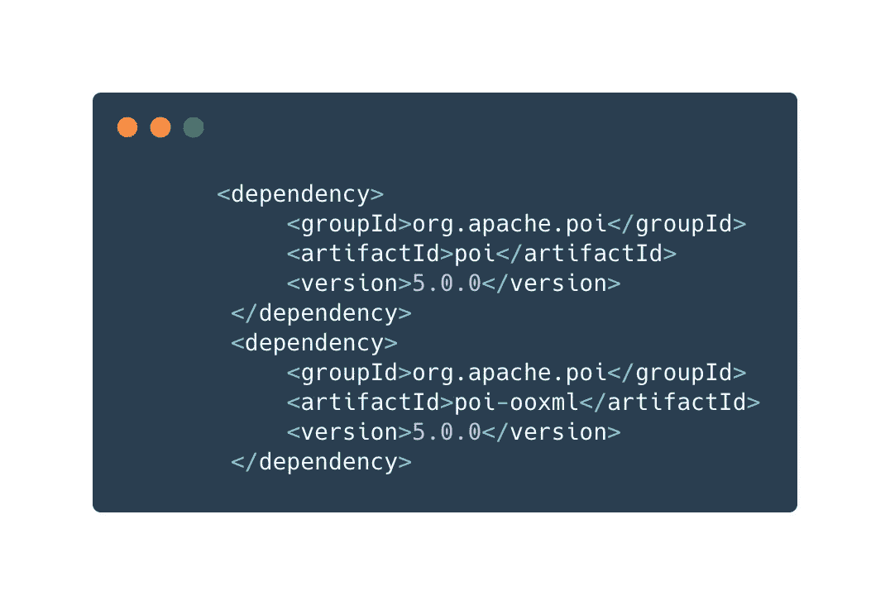
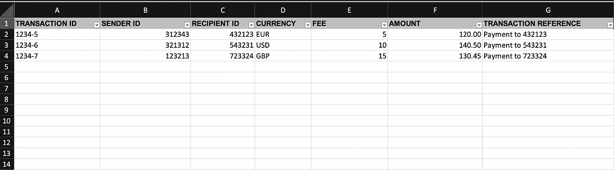
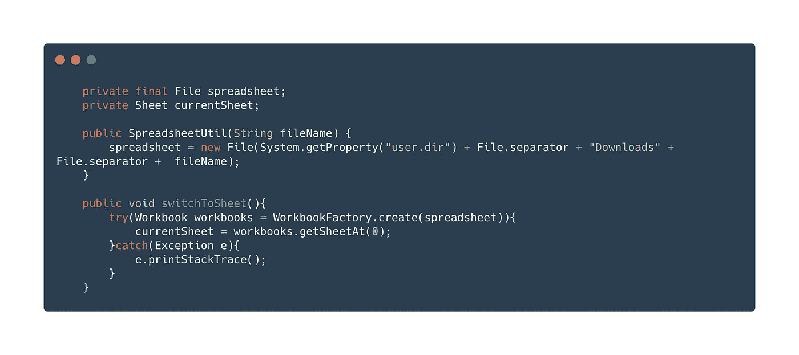
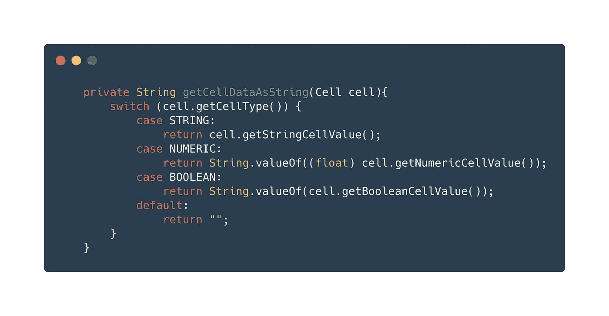
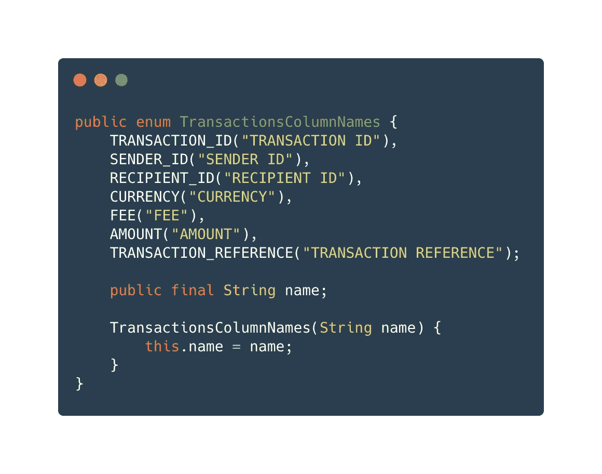
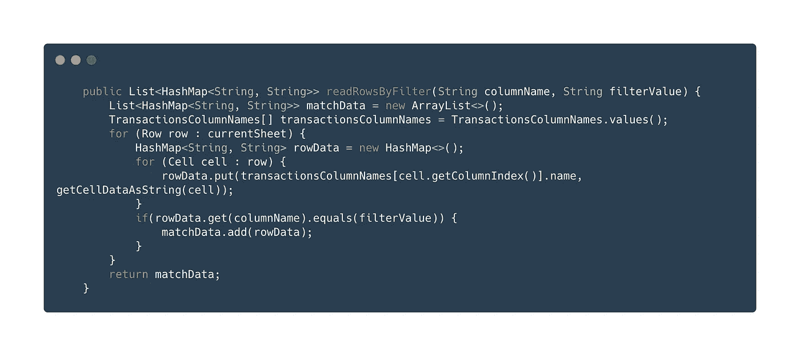
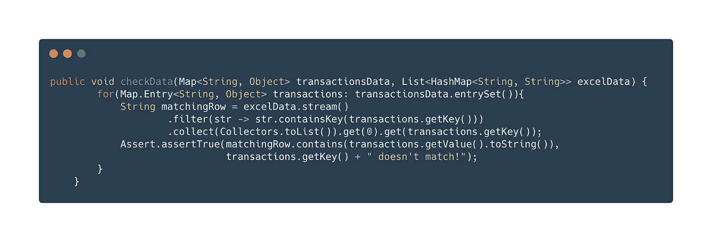
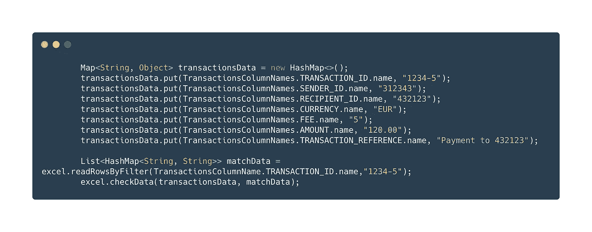

# 使用 Apache POI 测试银行交易

> 原文：<https://medium.com/nerd-for-tech/using-apache-poi-to-test-banking-transactions-ea7c1ff9ef5e?source=collection_archive---------32----------------------->

O 在**银行即服务**平台中，最重要的事情之一就是报告和发票。每笔交易的报告都以不同的格式保存，客户可能希望在特定的时间间隔或根据他们的需要使用这些报告。

在本文中，我将向您展示如何测试 excel 格式的事务。首先，假设您用 selenium 下载了示例事务。我们来看看如何通过这个交易进行价值比较。

首先，我们将使用 Apache POI 来完成这项工作。Apache POI 为我们提供了允许我们处理 office 文档格式的文件的库。在本文中，我们将使用工作簿和其他与 excel 相关的界面，因为我们将使用 excel 进行操作。

假设我们有一个如下所示的事务文件。现在，让我们开始处理这个下载的文件。

让我们创建一个助手，我们将在其中执行 excel 操作。创建类之后，我们创建如下函数来打开我们的文件并切换到我们想要处理的工作表。我们创建一个文件对象，并通过 WorkbookFactory 将其定义为工作簿对象。然后，通过工作簿接口提供的 getSheet 方法，我们切换到我们想要处理的工作表。我们将其定义为 currentSheet 对象。现在，我们将在当前工作表中执行所有操作。

让我们看看我们将以什么格式获取数据。excel 中可以有不同数据类型的字段，如布尔型、数值型等。我们希望将它们都作为字符串保存，并对它们进行比较。您也可以使用 switch-case 来实现这一点。通过单元格接口，您可以提取您想要的数据类型的单元格，然后转换它们。

在读取我们的数据之前，让我们首先确定有多少列，并将它们作为 enum 添加到我们的项目中，以便能够更容易地进行比较。我们将它们作为枚举添加的原因是我们将在映射时使用这个枚举。

现在我们可以继续阅读我们的数据。这里我们将通过过滤来读取数据。换句话说，我们将能够使用从外部发送的列名和我们想要过滤的值来提取我们想要的行。

正如你在下面看到的，我们通过映射来阅读一切。根据我们从外部提供的过滤器，我们读取 excel 中的数据，匹配列名和值，并将它们分配给一个列表。

是时候将我们通过这个 excel 读取的数据与我们将从外部给出的值进行比较了。现在让我们看看如何编写我们的最终方法。我们发送我们的交易数据，我们将从外部进行比较，以及我们从 excel 读取的数据。我们以键、值的形式逐一匹配我们的交易数据，并将其与我们从 excel 中获取的数据进行比较，并检查它们的值是否匹配。

最后，让我们看看如何从外部发送和断言所有这些值。如您所见，我们需要设置我们将从外部给出的值，就像 key，value 一样。这样我们可以更容易地断言所有字段。

我们现在已经将值定义为静态的，但是非常重要的是，您的测试是动态的，否则，您可能会错过将来的一些情况。当您在测试中使用这些值时，请注意动态地给出它们。

享受银行即服务平台测试的乐趣。🎊🎉