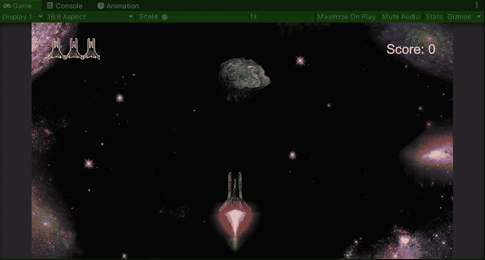
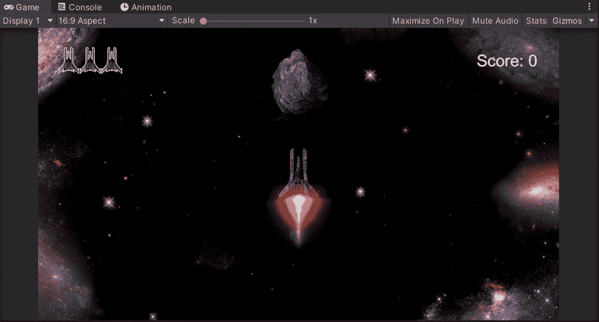
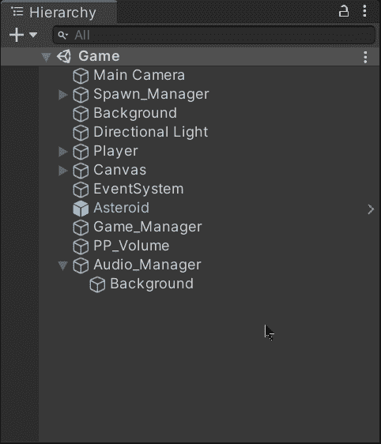
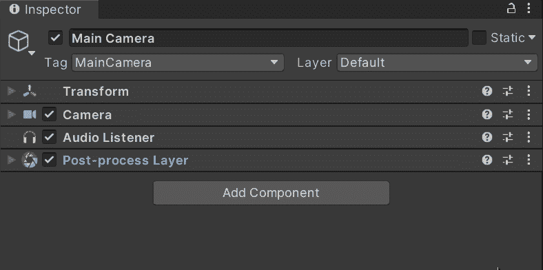
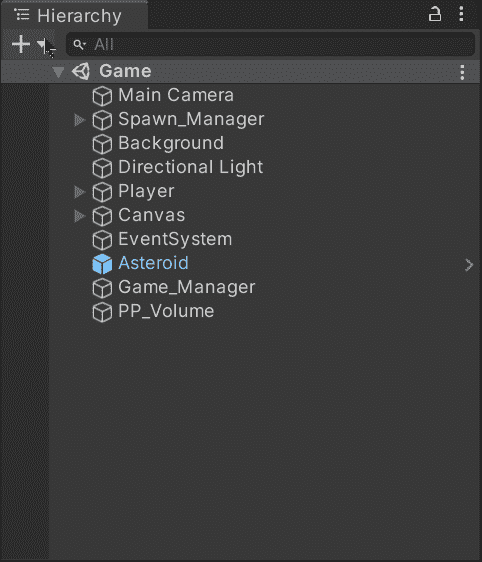
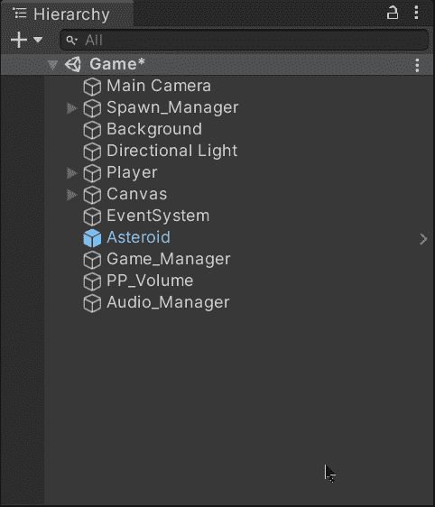
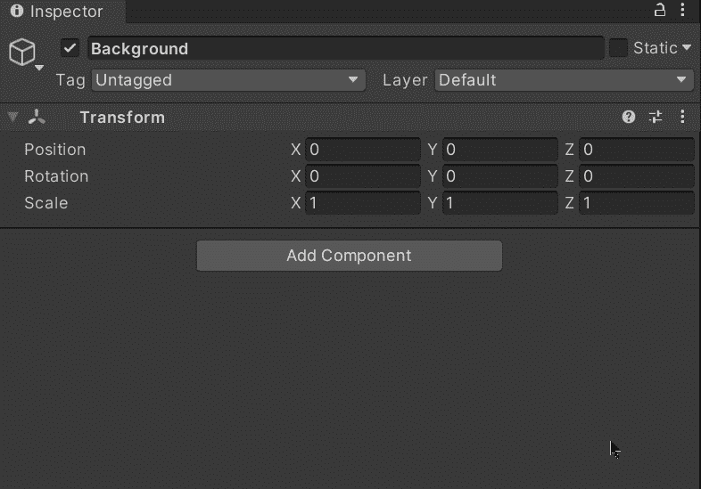
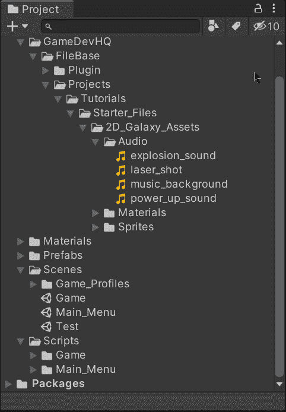
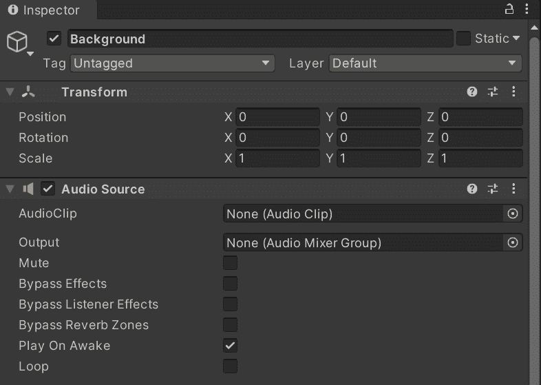

# 在 Unity 中使用音频

> 原文：<https://medium.com/nerd-for-tech/using-audio-in-unity-61a925b622a5?source=collection_archive---------35----------------------->

## 统一指南

## 关于如何开始在 Unity 中使用音频的快速指南

**目标**:在太空射击游戏中设置一个场景，开始使用 Unity 的背景音乐。

为了展示如何开始在 Unity 中使用音频，我们将在一个太空射击游戏中实现背景音乐。

这是 Unity 中太空射击游戏的现状。

# 听音频

正如您在下图中看到的，默认情况下，音频监听器组件连接到场景的主摄像机。该组件提供了一种从任何音频源组件接收输入，然后通过扬声器播放声音的方法。每个场景只能有一个音频监听器组件。

默认情况下，音频监听器组件连接到主摄像机。

如果您想了解更多关于音频监听器组件的信息，您可以访问 Unity 文档:

 [## 音频收听者

### 切换到脚本音频监听器充当类似麦克风的设备。它接收来自场景中任何给定的输入…

docs.unity3d.com](https://docs.unity3d.com/Manual/class-AudioListener.html) 

# 输入音频

现在，为了输入音频，让我们创建一个空的游戏对象，它将代表整个场景的音频管理器。然后，作为背景音乐源，创建另一个空的 gameobject 作为其子对象:

选择背景游戏对象，并在检查器中添加一个音频源组件:

如果您想了解有关音频源组件的更多信息，您可以访问 Unity 文档:

 [## 音频源

### UnityEngine 中的类/继承自:behavior/在:UnityEngine 中实现。AudioModule 建议更改谢谢…

docs.unity3d.com](https://docs.unity3d.com/ScriptReference/AudioSource.html) 

最后，为了在游戏中播放音乐，让我们将文件从项目文件夹中拖到音频源组件的音频剪辑属性中。而且，因为是背景音乐，让我们确保*在清醒状态下播放*和*循环*属性被启用:

现在，每当我们运行游戏时，背景音乐就会开始播放，并且由于在音频源组件中启用了*循环*属性，它不会停止。

就这样，你可以开始在 Unity 中使用音频了！:d .我将在下一篇文章中看到你，在那里我将展示如何在 Unity 中播放音效。

> *如果你想了解我更多，欢迎登陆*[***LinkedIn***](https://www.linkedin.com/in/fas444/)**或访问我的* [***网站***](http://fernandoalcasan.com/) *:D**