# 将 AWS S3 与 Unity 一起使用

> 原文：<https://medium.com/nerd-for-tech/using-aws-s3-with-unity-60d5eff26bec?source=collection_archive---------1----------------------->

在我的上一篇文章中，我回顾了如何为我的应用程序保存数据。有了保存的数据，是时候把数据上传到亚马逊简单存储服务(S3)了。

在上传保存的数据之前，您需要创建一个用于保存数据的存储桶，并创建允许您访问与您创建的存储桶相关的所有操作的权限。

前往亚马逊 S3 控制台。单击创建存储桶按钮，并按照步骤创建您的存储桶。

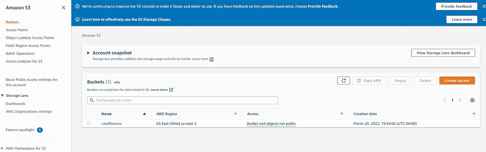

进入**身份和访问管理控制台** ( **IAM** )并进入策略选项卡。单击创建策略按钮并设置策略。该服务将是 S3，您将选择所有的行动和资源。

然后，您将转到角色，并单击未授权的角色。您将单击添加权限下拉栏下的添加策略。

搜索您的保单并附上。

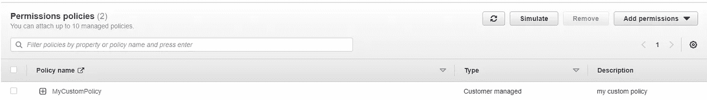

复制屏幕上方的 ARN 以备后用。

回到 S3 控制台，选择你的桶。转到权限选项卡。

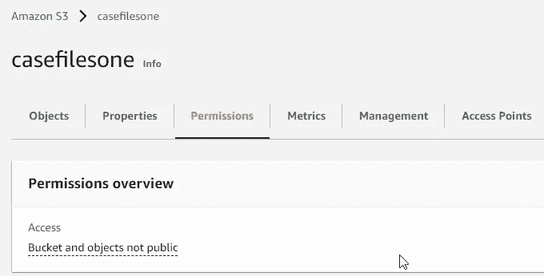

向下滚动到存储桶策略并选择编辑。这将进入一个新的屏幕，其中有一个按钮，上面写着策略生成器。单击此处并创建一个策略。策略将是您复制下来的 ARN，Amazon 资源名称将采用 arn:aws:s3:::bucketname/*的格式。

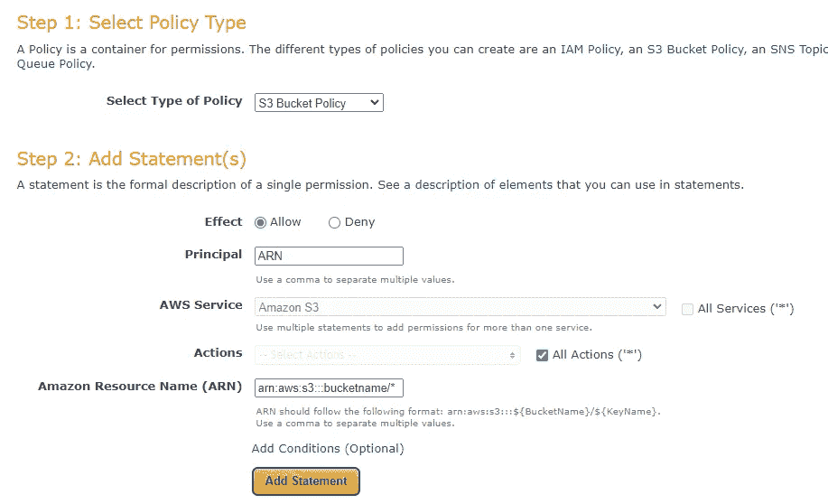

点击添加语句，您将能够在下面为它生成一个策略。

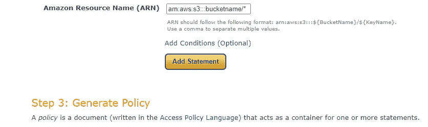

复制该策略并将其粘贴到您单击策略生成器按钮的屏幕上的策略中。

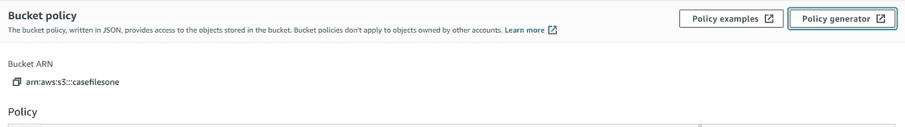

现在，您已经准备好进入 unity，并将其与您的项目联系起来。

我有一个空的游戏对象，它将成为我的 AWS 管理器。

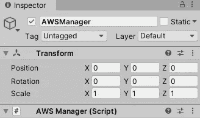

为了初始化 S3，我创建了一个属性，该属性将返回一个变量，该变量将是已初始化的 S3 客户端。您需要前往 **Cognito** 获取您的身份池 ID 以获取凭证。

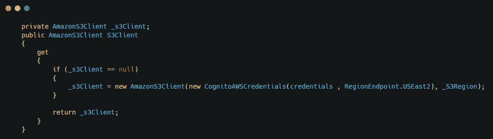

要让 AWS 工作，您需要使用几个不同的名称空间。

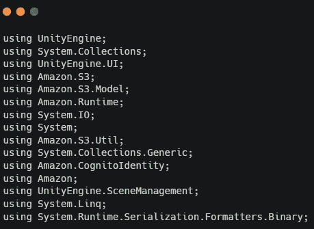

在 awake 方法中，您需要添加一些代码，告诉程序使用 unity web request 作为 HTTP。

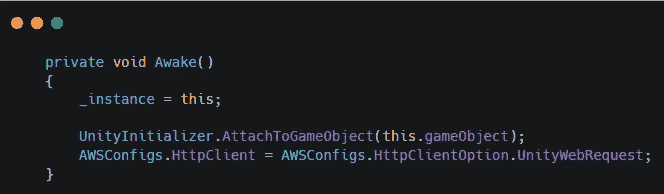

现在我创建了一个将保存的数据上传到 S3 的方法。AWS 可用的文档中概述了这种方法。

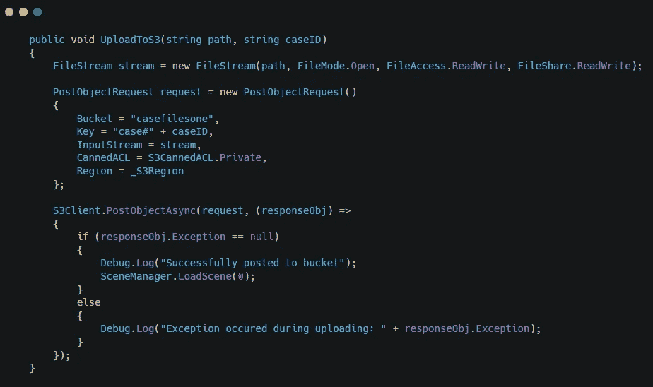

这个方法是从我在上一篇文章中使用的 submit 按钮下的 UIManager 中调用的。

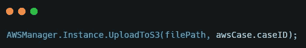

我还创建了一个方法来查找案例号，并从 S3 下载数据。文档中也概述了这种方法。

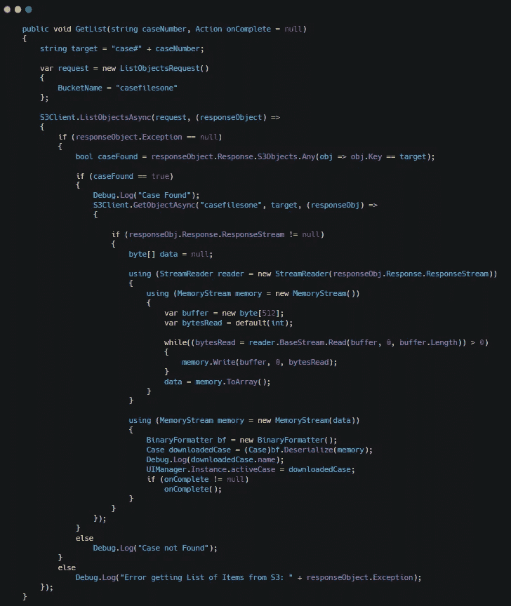

从搜索面板调用此方法。

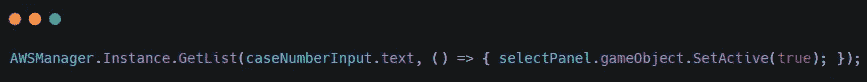

这就是我如何为我的应用程序设置 S3。

文档链接:[https://docs . AWS . Amazon . com/mobile/sdkforunity/developer guide/S3 . html](https://docs.aws.amazon.com/mobile/sdkforunity/developerguide/s3.html)