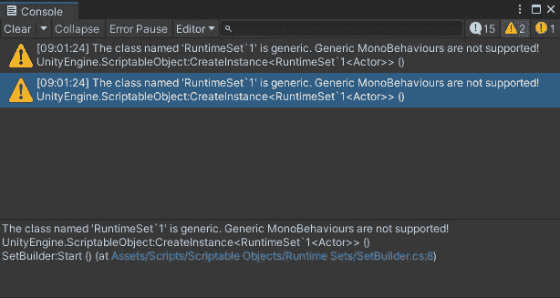
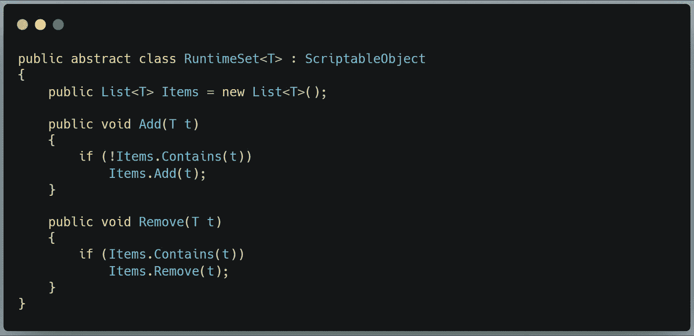
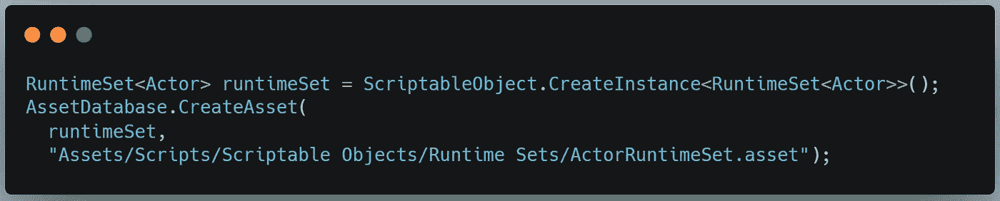
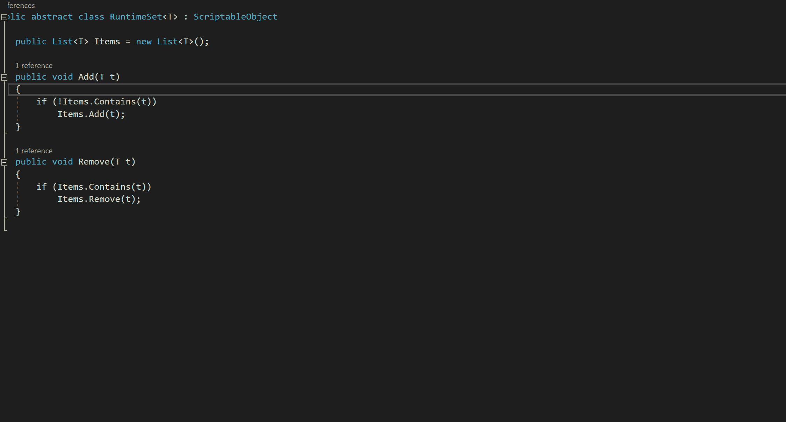
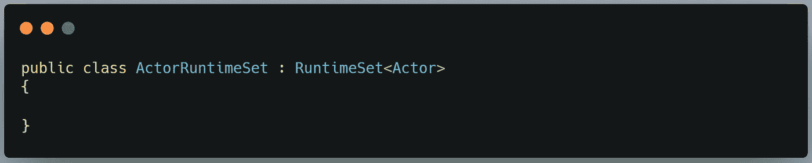
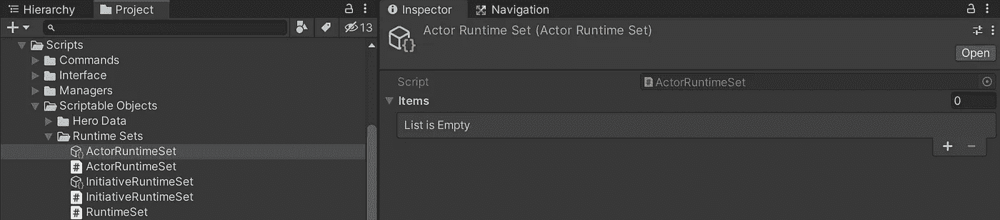
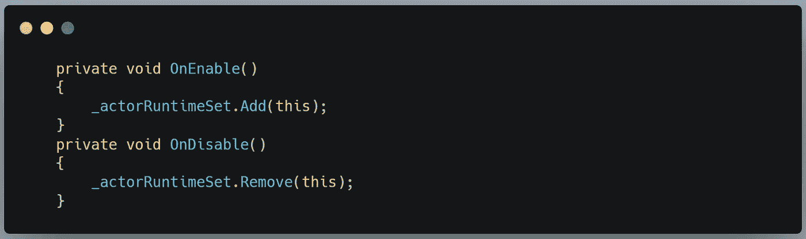

# 在 Unity 中使用 C#泛型类型和可脚本化的对象

> 原文：<https://medium.com/nerd-for-tech/using-c-generic-types-with-scriptable-objects-in-unity-340cfc32811f?source=collection_archive---------1----------------------->

## 利用类继承来蒙蔽 Unity

技术上不真实。

我最近看了 Ryan Hipple 关于游戏架构的精彩演示，他展示了一个他称之为运行时集的有用模式。这是跟踪场景中给定类型的所有活动对象的有用方法。如果你曾经需要跟踪一波中有多少敌人，或者玩家的战俘营中有哪些建筑，这是一个很好的方法来跟踪这些信息，并且任何需要这些信息的类或方法都可以使用，而不需要硬依赖或额外的代码。

棘手的是，他没有完全解释运行时集的实现。他只是展示了核心对象的简化版本。代码如下:

瑞安·希普尔，团结奥斯汀 2017

这很棒，对吧？如果我想跟踪我的战术救援游戏中的所有参与者，我只需要创建一个新的。此类属的特定类型的资产。像这样:

但是如果你看到顶部的剧透…不。Unity 不喜欢那样。

不支持一般的 MonoBehaviours？！这根本不是一种单一行为！瑞安·希普勒用了什么魔法来完成这个作品？

WTH，团结？！

好吧，显然我们需要一个不同的方法。Unity 不想创建一个泛型类的实例，所以我们必须给泛型类披上羊皮。

让我们制作一套服装。这并不复杂——只要有足够的外表来欺骗 Unity 给我们想要的就行了。

呜哇——呃，我是说……咩！

哇哦。是啊，就这么简单。 *ActorRuntimeSet* 继承了其父类的所有方法和字段——在本例中，不再通用的 *RuntimeSet < Actor >。*所以，不需要身体。我们已经定义过了。

现在，我们可以创建我们的。代码已修改的资产:

这是结果:

我可以把这个资产放到我的演员预置的一个序列化字段中，然后指示他们在启用或禁用的时候在列表中添加或删除他们自己:

这就是要点:通过将一个泛型类继承到一个标准类，你可以在 Unity 的注意下隐藏泛型类型。一旦你建立了一个资产，你可以让任何对象引用它来获得一个更新的项目列表。

你能想出其他方法来使用这一招吗？在下面留言告诉我吧！