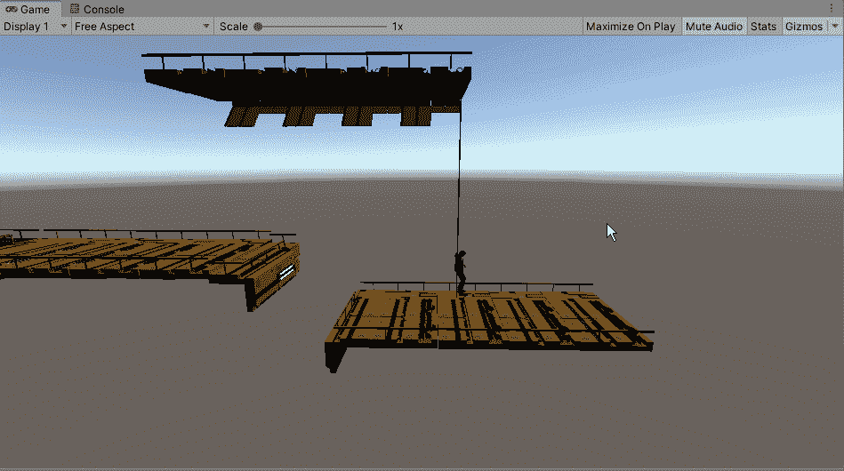
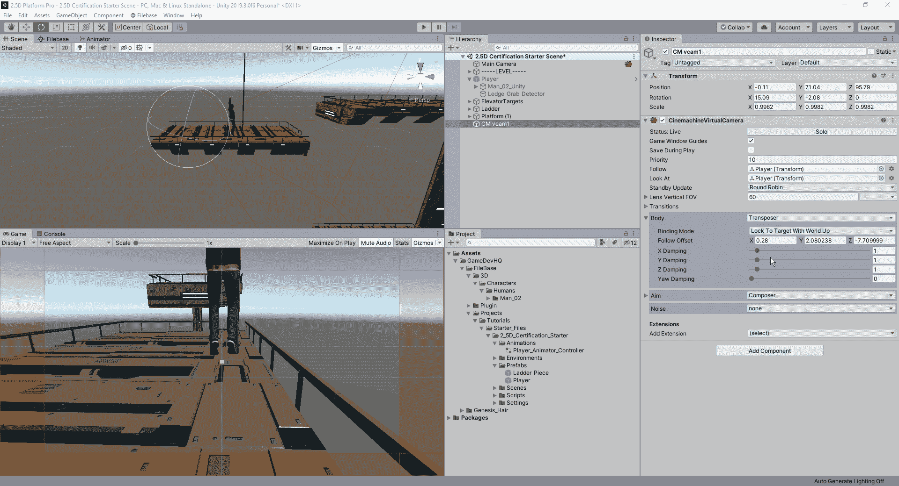
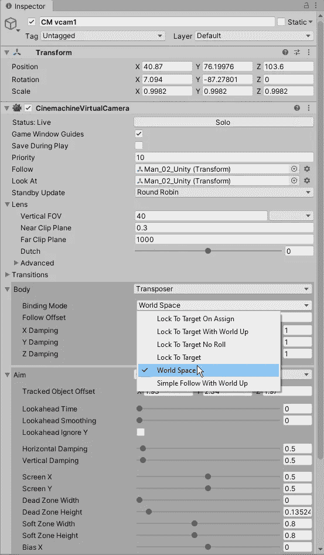
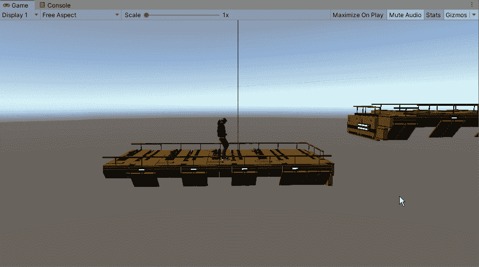

# 使用 Cinemachine 跟踪玩家

> 原文：<https://medium.com/nerd-for-tech/using-cinamachine-to-follow-the-player-415cf5782f0?source=collection_archive---------9----------------------->

根据游戏目前的情况，如果我们让我们的摄像机像我们以前处理基本对象一样跟随玩家，我们会遇到一个小问题:

当我们转动我们的球员时，我们也转动我们的摄像机。这造成了玩家不知道他们在向哪个方向行进的问题。为了解决这个问题，我们将利用我们对 Cinemachine 的了解，创建一个可以跟随玩家而不会引起相机问题的相机系统。一旦我们将 Cinemachine 资产添加到我们的编辑器中，我们就可以创建一个新的虚拟摄像机，并将其视角调整到我们喜欢的角度:

至于相机内的设置，它们可以根据您的喜好进行调整，但如果我们想确保我们的相机不会在我们四处移动时翻转，我们需要确保我们的绑定模式设置为世界空间:

一旦摄像机的所有设置和调整完成，我们就可以看到它在实际游戏中的样子了:

现在我们有了一个功能更好的摄像机，我们可以利用 Cinemachine 的资产来创建多种不同的方法来创建游戏中的沉浸感。无论是当我们将一个物体推到开关上表示门已经打开时屏幕会抖动，还是当某些条件被触发时调整我们的视野范围。至于其中的一些是如何发挥作用的，我会在游戏完成后创造一些东西。