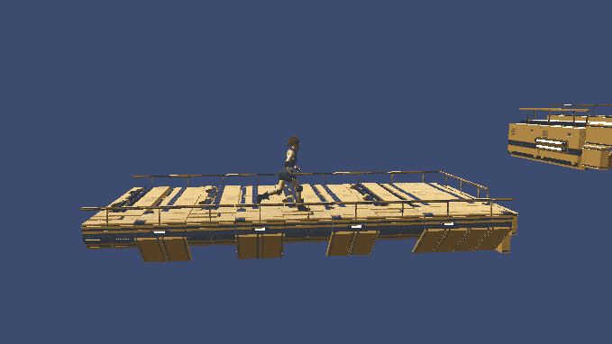
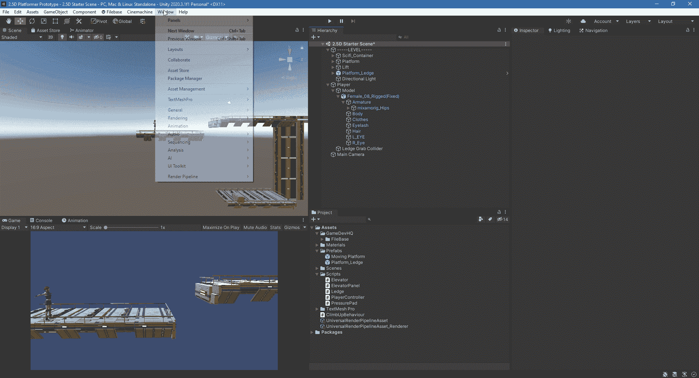
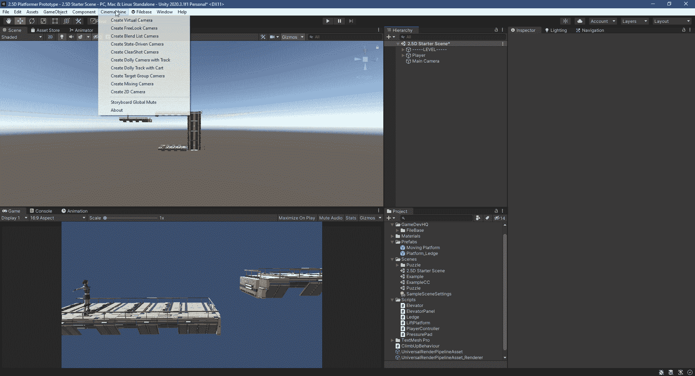
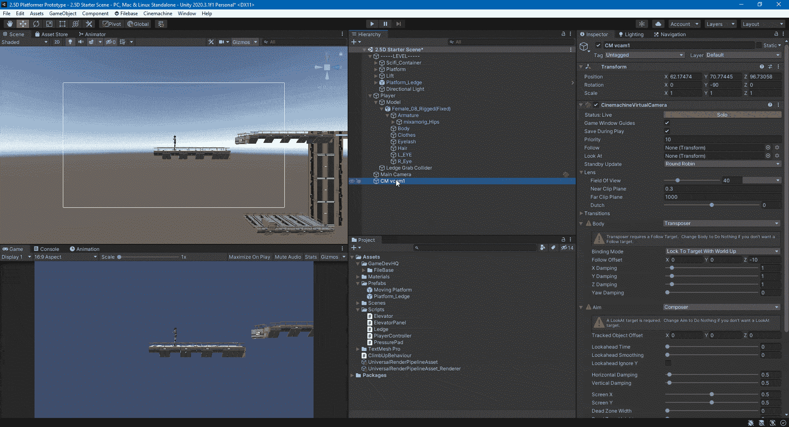
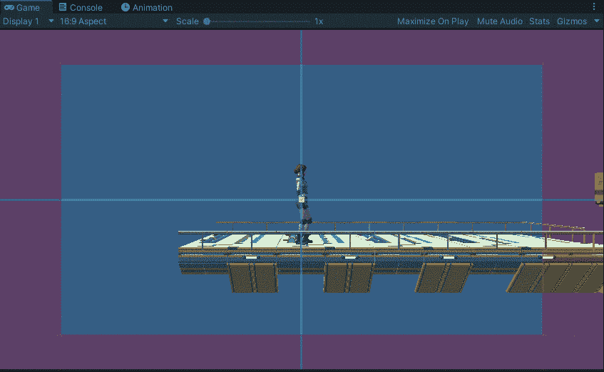
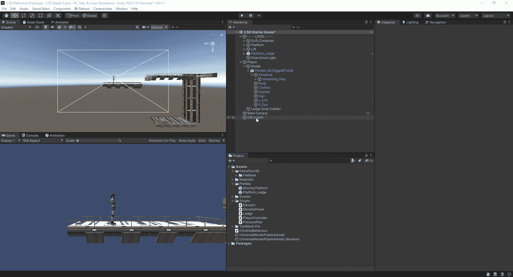
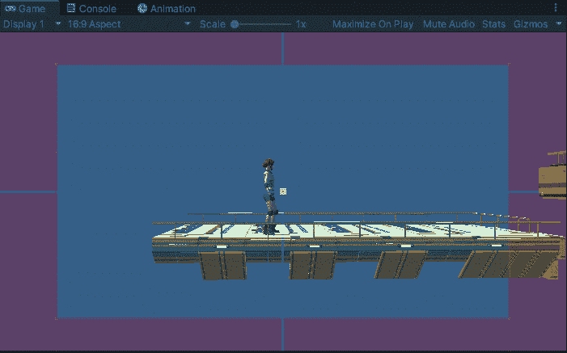

# 使用 cinema Chine-2.5D 跟随播放器摄像头

> 原文：<https://medium.com/nerd-for-tech/using-cinemachine-2-5d-follow-player-camera-8813f40c1aed?source=collection_archive---------9----------------------->

本文将展示如何使用 Unity Cinemachine 软件包创建一个摄像机，在玩家移动时跟随他们。

要将 Cinemachine 软件包添加到您的项目中，请打开软件包管理器窗口，然后在 Unity 注册表中找到 Cinemachine 并单击安装。

接下来，您需要将 Cinemachine 虚拟摄像机添加到场景中。一旦您添加了虚拟摄像机，Cinemachine Brain 组件将被添加到主摄像机，它将控制活动的虚拟摄像机。

要让主摄像机跟随玩家，你只需要将玩家游戏对象或其子对象添加到虚拟摄像机的 Follow and Look 字段中。然后，您可以将虚拟摄像机放置在您想要的位置。

主摄像头现在跟随玩家，在默认设置下看起来相当不错。

您可以调整虚拟摄像机的许多设置，以改变其行为方式。我更改的设置偏移了虚拟相机的目标，平滑了向目标的移动，并在玩家移动的方向上向前移动目标。

现在玩家在移动时可以看得更远。

