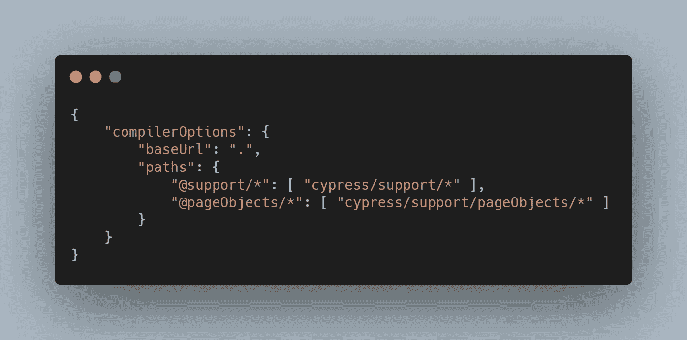
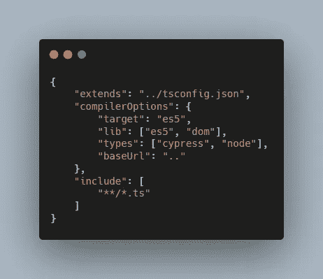
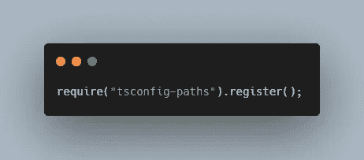
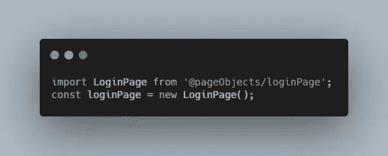

# 使用 Config 在 Cypress 中定义绝对路径

> 原文：<https://medium.com/nerd-for-tech/using-config-to-define-absolute-paths-in-cypress-a6a4f490f6a4?source=collection_archive---------3----------------------->

## 当然，相对路径和绝对路径(import/require)各有利弊——但就个人而言，我更喜欢使用绝对路径，因为它提供了更多的可读性和可重构性(例如，将文件移动到不同的文件夹结构)

就我记忆所及，我从来没有在编码时(特别是在 C#中)过多地处理过`import`或`require`，因为它肯定使用了名称空间导入。名称空间本身反映了要使用(或在这种情况下导入)的文件的文件夹结构或路径。

如果你一直在用 [Cypress](https://www.cypress.io/) 和 TypeScript 编写代码来创建自动化测试，那么你就有机会使用设计模式。我使用页面对象模型(POM)设计模式来定义页面中的元素和元素动作(即`click()`和`type()`)。随着代码库的增长，我意识到我越来越多地使用相对路径来导入或需要 POM 或 fixture 文件。有时，由于连接的测试流和断言，在单个`describe`中需要几个 POM 和 fixtures。

不过使用`'~/'`应该很容易。但是我认为 JavaScript/TypeScript 不会那样做，因为它会给你一个错误。

> 找不到模块“~/path/to/POM”或其相应的类型声明。

我在 Cypress 看过的几篇关于绝对路径的博文确实过时了。最好的有解决方案的在 [GitHub](https://github.com/cypress-io/cypress/issues/3262) 里。但是，前两个解决方案(使用@cypress/webpack-preprocessor 和 CypressFileKindPlugin)对我不起作用。即使它能工作，解决方案对我来说也太复杂了，特别是如果使用 webpack-preprocessor，因为我必须安装 4 个额外的依赖项(@babel/core，@babel/preset-env，babel-loader 和 webpack)，而我可能根本不会使用它们。

marklawlor 的第三个解决方案不仅有效，而且是最简单的。非常感谢他！😄

所以，这里是我结合使用他的解决方案和 flybayer 的总结

*   `npm install --save-dev tsconfig-paths`
*   在项目`tsconfig.json`的根文件夹中创建一个新文件

tsconfig.json

*   通过添加`extends`和`baseUrl`更新 cypress 文件夹中的`tsconfig.json`文件

cypress/tsconfig.json

*   更新插件文件的`index.ts`

赛普拉斯/插件/索引. ts

和...瞧啊。然后，您可以使用绝对路径导入和要求，使用根 tsconfig 文件中指定的路径。

cyprss/integration/log in . spec . ts