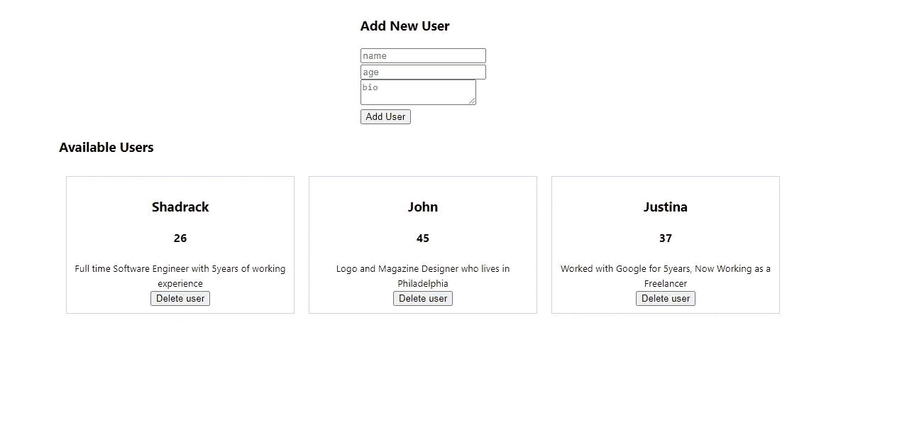
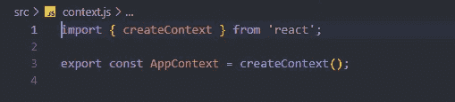

# 在与功能组件的交互中使用上下文 API

> 原文：<https://medium.com/nerd-for-tech/using-context-api-in-react-with-functional-components-dbc653c7d485?source=collection_archive---------0----------------------->

## 理解和使用 React 上下文 API


安德烈亚斯·古尔霍恩在 [Unsplash](https://unsplash.com?utm_source=medium&utm_medium=referral) 上拍摄的照片

在本文中，我们将学习 React 中的上下文 API，并使用它来构建一个非常简单的项目。

**先决条件:**本文假设你已经掌握了 JavaScript 和 react 的基本知识，但并不要求你在阅读之前就了解这些知识。

## **React 中的上下文 API 是什么？**

> 上下文提供了一种通过组件树传递数据的方式，而不必在每一层手动向下传递属性。— **反应文档**

如果您使用 react 有一段时间了，或者对 react 有一定的经验，您将会知道，当项目中的许多组件都要使用 props 时，通过 props 传递数据变得非常麻烦，您必须显式地将 props 传递到组件树中。

有时，一些组件不得不接收道具，只是为了将它传递给它的子组件。这就是所谓的**支柱钻孔。这给你的项目增加了一些复杂性，当项目越来越大时，管理起来就变得很困难。**

这种情况下，上下文 API 被证明是有用的。在我们的应用程序中使用上下文 API，我们避免通过不需要道具的中间组件传递道具，“道具演练”。

> B 同样，Context API 被设计用来共享“全局”数据，这些数据可以在你的应用程序的任何部分使用，而不需要沿着组件树向下传递属性。

## 如何使用上下文 API

让我们看看如何使用上下文 API 来构建这个简单的用户列表应用程序。

我用***create-react-app***来引导项目。
如果你想跟着做，你可以做 ***npx 创建-反应-app 应用-名称***

*我们将建造什么:*



简单用户列表应用程序

这是一个简单的应用程序，可以让你添加一个用户到用户列表中，也可以删除用户。

这是我的文件结构的样子:


文件结构

你会看到我使用了三(3)个组件 ***(User.js，UserList.js，AddUser.js)*** 和 **App.js** ，我们很快就会看到它们各自做了什么。还可以看到我们接下来要讲的 **context.js** 文件。

## 如何在 react 中创建上下文？

*context.js*



创建上下文

```
import { createContext } from 'react';
export const AppContext = createContext();
```

在上面的例子中，`createContext`方法将帮助我们创建一个**上下文实例**，它将帮助我们向各个组件发送数据。所以我们出口是为了能够进口并在那些组件中使用它。

**让我们看看 App.js 文件里有什么**

*App.js*

你会看到在*第 8 行* : `*const [ users, setUsers ] = useState(userList);*` 我使用了****useState***钩子来存储用户列表。*

**第 10–21 行→* `**dispatchUserEvent(actionType, payload)**` 是一个函数，它接收一个 **actionType** (例如:**‘ADD _ USER’，‘REMOVE _ USER’**)**和一个 **payload** (实际内容)，它将从如上所示的状态中添加或删除用户。***

***l *线 24–29→**返回**块中我正在做的`<AppContext.Provider value={{ users, dispatchUserEvent }}>`****

***`AppContext.Provider`标签中的`value`属性是对`<AddUser />`和`<UserList />` 组件可用的数据。
这意味着在`<AddUser />`和`<UserList />`及其所有子组件中，我们可以访问用户列表，还可以调度事件来添加或删除用户。***

***现在让我们看看如何从我们的 **UserList.js** 组件的上下文中获取并呈现用户列表。***

****UserList.js****

****第 6 行* →因为我们正在使用功能组件，所以我们正在使用 **useContext** 钩子，它是 react 提供给我们的，如此处所示`const { users } = useContext(AppContext);`***

> ***注意我们是如何在 **useContext** 钩子中传递 **AppContext** 的，以及我们是如何从上下文中只析构 **users** 的，因为我们想用这个组件呈现用户列表。***

***我们使用**地图**显示用户，并为每个用户呈现 **User.js** 组件。***

****User.js****

***在*第 12–16 行* →我们显示用户信息(如姓名、年龄和简历)***

***在*第 5 行→我们从上下文中得到* `dispatchUserEvent` 。***

***在第 7–9 行→我们调度一个 **REMOVE_USER** 事件，用 **userId** 作为第 18 行*按钮点击的有效负载。*这意味着每次点击按钮时，它都会调度一个事件，使用用户的 id 将用户从状态中移除。
*还记得****dispatchUserEvent****函数吗？****

******

***调度用户事件***

***让我们看看如何将用户添加到列表中。***

****AddUser.js****

***所以在这里，我们也可以从上下文访问 **dispatchUserEvent** 。`const { dispatchUserEvent } = useContext(AppContext);`***

***在*第 6–8 行* → am 使用 **useState** 跟踪来自输入字段的数据。
和函数***handleAddUser()****通过在按钮点击时分派一个*“添加用户”动作并将用户数据作为有效载荷传递来将用户添加到列表中。***

***所以最后我们有了这个:***

******

# ***在使用上下文 API 之前***

***请注意，上下文主要用于某些数据需要由不同嵌套级别的许多*组件访问，并且您希望避免沿树向下传递道具时。****

***上下文 API 非常有用，但是您应该小心使用它，因为它有时会使组件重用变得困难。***

***你可以在这里阅读更多 [React 文档—上下文](https://reactjs.org/docs/context.html)***

***感谢您的阅读。***

***也可以看下面的视频版。***