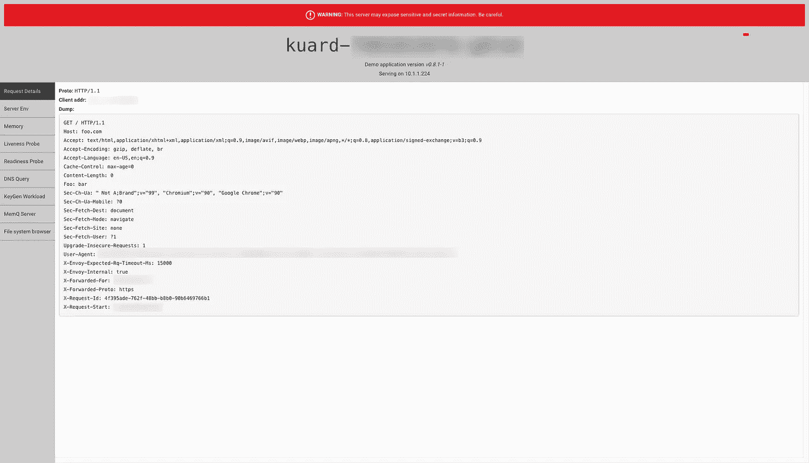

# 使用轮廓外部认证服务器

> 原文：<https://medium.com/nerd-for-tech/using-contour-external-auth-server-d8312a131c9c?source=collection_archive---------8----------------------->

**总结**


Contour 是 K8s 环境的入口控制器:【https://projectcontour.io/】T2。它在幕后使用特使代理:【https://www.envoyproxy.io/】T4

Contour 的一个有趣特性是它支持外部客户端授权([https://projectcontour.io/guides/external-authorization/](https://projectcontour.io/guides/external-authorization/))。因为 envoy 支持外部授权([https://www . envoy proxy . io/docs/envoy/latest/API-v3/extensions/filters/http/ext _ authz/v3/ext _ authz . proto . html](https://www.envoyproxy.io/docs/envoy/latest/api-v3/extensions/filters/http/ext_authz/v3/ext_authz.proto.html))，所以 Contour 能够集成到其中，提供一个使用 K8s 服务的优雅解决方案。在本文中，让我们看看如何在 K8s 中创建一个外部授权服务，以支持如下用例。基于客户端上下文支持 RBAC
2。基于客户端上下文的 API 防火墙等等。

在本文中，我们将尝试做这些用例的初步实现。我正在使用 docker desktop 在我的 Mac 上创建一个 Kubernetes 集群。

**设置**

安装等高线图:

```
# helm repo add bitnami https://charts.bitnami.com/bitnami
# helm install contour-example bitnami/contour
```

这将创建以下窗格:

```
# kubectl get pods | grep contour
contour-example-contour-68bdf8788b-98kqm 1/1 Running 0 3m21s
contour-example-contour-68bdf8788b-r8jhx 1/1 Running 0 3m43s
contour-example-envoy-76hxc              2/2 Running 0 62s
```

部署一个示例 web 应用程序([https://projectcontour.io/getting-started/](https://projectcontour.io/getting-started/)):

```
# cat kuard.yamlapiVersion: apps/v1
kind: Deployment
metadata:
 labels:
 app: kuard
 name: kuard
spec:
 replicas: 1
 selector:
 matchLabels:
 app: kuard
 template:
 metadata:
 labels:
 app: kuard
 spec:
 containers:
 — image: gcr.io/kuar-demo/kuard-amd64:1
 name: kuard
 — -
apiVersion: v1
kind: Service
metadata:
 labels:
 app: kuard
 name: kuard
spec:
 ports:
 — port: 8080
 protocol: TCP
 targetPort: 8080
 selector:
 app: kuard
 sessionAffinity: None
 type: ClusterIP# kubectl apply -f kuard.yaml
```

确认您可以连接到应用程序:

```
# kubectl port-forward kuard-<pod id> 8080:8080
Forwarding from 127.0.0.1:8080 -> 8080
Forwarding from [::1]:8080 -> 8080
Handling connection for 8080
Handling connection for 8080# curl localhost:8080
<!doctype html><html lang="en">
<head>
  <meta charset="utf-8"><title>KUAR Demo</title>
...
```

让我们首先创建一个支持 TLS 的外部认证服务。该服务本质上是一个 gRPC 服务器，可以用任何语言实现。此 gRPC 服务器使用此协议:[https://github . com/envoy proxy/envoy/proxy/blob/main/API/envoy/service/auth/v2/external _ auth . proto](https://github.com/envoyproxy/envoy/blob/main/api/envoy/service/auth/v2/external_auth.proto)

我选择了 Java 来实现外部认证服务器。要进行部署，请执行以下步骤:

1.  克隆 repo:[https://github . com/sudhindra-hub/external-auth-demo/tree/master](https://github.com/sudhindra-hub/external-auth-demo/tree/master)

```
# make all 
```

3.我们现在将在 Kubernetes 部署它。但是在此之前，我们应该在 Kubernetes 内部公开我们在 HTTPS 上的服务。为此，我们将创建一个自签名证书和私钥:

```
# openssl req -newkey rsa:2048 -nodes -keyout external_auth_server.key -days 365 -out external_auth_server.crt
```

我们将使用引用上述证书和私钥的密钥创建一个 Kubernetes 秘密:

```
# kubectl create secret tls my-tls-secret \
--cert=external_auth_server.crt \
--key=external_auth_server.key# kubectl describe secret my-tls-secret
Name:         my-tls-secret
Namespace:    default
Labels:       <none>
Annotations:  <none>Type:  kubernetes.io/tlsData
====
tls.crt:  1029 bytes
tls.key:  1704 bytes
```

我们将在下面引用我们在 YAML 中应用的这个秘密:

```
# kubectl apply -f [https://raw.githubusercontent.com/sudhindra-hub/external-auth-demo/master/k8s/external-auth.yaml](https://raw.githubusercontent.com/sudhindra-hub/external-auth-demo/master/k8s/external-auth.yaml)# kubectl get pods -l app=my-external-auth
NAME                                READY   STATUS    RESTARTS   AGE
my-external-auth-<pod id>   1/1     Running   1          4h28m
```

我们将创建一个引用上述外部服务的“extension service”CRD:

```
# kubectl apply -f [https://raw.githubusercontent.com/sudhindra-hub/external-auth-demo/master/k8s/extension-service.yaml](https://raw.githubusercontent.com/sudhindra-hub/external-auth-demo/master/k8s/extension-service.yaml)# kubectl get ExtensionService
NAME AGE
my-external-auth 4h
```

CRD 只是一个指向我们外部认证服务的指针。理想情况下，ExtensionService 需要配置有[https://project contour . io/docs/main/config/API/# project contour . io/v1。UpstreamValidation](https://projectcontour.io/docs/main/config/api/#projectcontour.io/v1.UpstreamValidation) 授权外部 auth 服务。但我没有在这个设置中这样做。不过，强烈建议在生产中启用此功能。

我们现在将为之前在 Contour 中部署的应用程序“kuard”创建一条路线。Contour ingress 只支持虚拟主机配置的 FQDN，因此我们将在我们的 Mac 上创建一个名为“foo.com”的虚拟 FQDN，只需更新 */etc/hosts* :

```
# grep “foo.com” /etc/hosts
127.0.0.1 foo.com
```

接下来，我们将通过创建自签名 CA 证书/私钥来公开 HTTPS (TLS 终止)上的“kuard”应用程序:

```
openssl req \ 
 -newkey rsa:2048 \
 -x509 \
 -nodes \
 -keyout server.key \
 -new \
 -out server.crt \
 -subj /CN=foo.com \
 -reqexts SAN \
 -extensions SAN \
 -config <(cat /System/Library/OpenSSL/openssl.cnf \
 <(printf ‘[SAN]\nsubjectAltName=DNS:foo.com’)) \
 -sha256 \
 -days 3650
```

这将创建“server.crt”和“server.key”。我们将参照这些文件创建一个 Kubernetes 秘密:

```
# kubectl create secret tls kuard
--cert=./server.crt \
--key=./server.key#  kubectl describe secret kuard
Name:         kuard
Namespace:    default
Labels:       <none>
Annotations:  <none>Type:  kubernetes.io/tlsData
====
tls.crt:  1025 bytes
tls.key:  1704 bytes
```

我们希望启用客户端身份验证(这是我们在外部身份验证服务上了解客户端身份的方式)。创建一个自签名证书和私钥，就像我们之前创建的一样，并创建一个名为“client-kuard”的秘密，它将该证书作为 CA:

```
# cat client_secret.yaml
apiVersion: v1
data:
 ca.crt: <base64 encoded PEM contents>
kind: Secret
metadata:
 name: client-kuard
 namespace: default
type: Opaque# kubectl apply -f client_secret.yaml# kubectl describe secret client-kuard
Name: client-kuard
Namespace: default
Labels: <none>
Annotations: <none>Type: OpaqueData
====
ca.crt: 1025 bytes
```

我们现在准备为来自 FQDN“foo . com”的应用程序“kuard”创建一个路由，同时还指示外部授权:

```
# kubectl apply -f [https://raw.githubusercontent.com/sudhindra-hub/external-auth-demo/master/k8s/httpproxy.yaml](https://raw.githubusercontent.com/sudhindra-hub/external-auth-demo/master/k8s/httpproxy.yaml)
```

测试代理是否有效:

```
# kubectl get proxy
NAME    FQDN    TLS SECRET STATUS STATUS DESCRIPTION
my-auth foo.com kuard      valid  Valid  HTTPProxy
```

现在，我们准备测试我们的外部认证服务器是否工作。如果考察外部 auth server 的逻辑:[https://github . com/sudhindra-hub/external-auth-demo/blob/master/Java/src/main/Java/com/example/auth/authorizationserviceimpl . Java](https://github.com/sudhindra-hub/external-auth-demo/blob/master/java/src/main/java/com/example/auth/AuthorizationServiceImpl.java)，很简单的逻辑。它检查客户端证书中是否有包含关键字“client1”的“Subject ”;如果是，它批准(HTTP 状态 200)该请求。否则，对于未授权的访问，它返回 401。

请记住，在前面，我们创建了一个自签名证书/私钥，并且我们创建了一个称为“client-kuard”的秘密来引用这个证书。使用这个自签名证书/私钥，让我们创建一个 CSR(证书签名请求),如下所示:

```
# openssl genrsa -out MyClient1.key 2048# openssl req -new -key MyClient1.key -out MyClient1.csr# openssl x509 -req -in MyClient1.csr -CA client.crt -CAkey client.key -CAcreateserial -out MyClient1.pem -days 1024 -sha256
```

对于上面的 CSR，我将 subject 设置为包含“client1”:

```
# openssl req -text -noout -verify -in MyClient1.csr | grep Subject
verify OK
 Subject: C = US, ST = CA, L = San Jose, O = MyOrg, OU = MyUnit, CN = client1
 Subject Public Key Info:
```

我们将创建另一个客户端证书，该证书由与上述相同的 CA 颁发，但其主题中不包含“client1”。

```
# openssl req -text -noout -verify -in MyClient2.csr | grep Subject
verify OK
 Subject: C = US, ST = CA, L = San Jose, O = MyOrg, OU = MyUnit, CN = client2
 Subject Public Key Info:
```

我们现在将获取服务器 CA 证书:

```
# echo quit | openssl s_client -showcerts -servername foo.com -connect foo.com:443 > cacert.pem
```

现在为客户机 1 发出 CURL 命令:

```
# curl --cacert cacert.pem --cert MyClient1.pem --key MyClient1.key [https://foo.com](https://foo.com)
<!doctype html><html lang=”en”>
<head>
 <meta charset=”utf-8"><title>KUAR Demo</title>...
```

这成功了！如果您检查上面的头，我们的外部 auth 服务器除了批准请求之外，还附加了一个额外的头“Foo: bar”发送给应用程序。应用程序可以使用这些类型的头来实施 RBAC。

现在让我们用客户端 2 进行测试:

```
# curl -v --cacert cacert.pem --cert MyClient2.pem --key MyClient2.key [https://foo.com](https://foo.com)...
* Using Stream ID: 1 (easy handle 0x7f9fd600f600)
> GET / HTTP/2
> Host: foo.com
> User-Agent: curl/7.64.1
> Accept: */*
>
* Connection state changed (MAX_CONCURRENT_STREAMS == 2147483647)!
< HTTP/2 401
< date: Thu, 27 May 2021 21:49:09 GMT
< server: envoy
<
* Connection #0 to host foo.com left intact
* Closing connection 0
```

这也是意料之中的。您还可以检查外部身份验证服务器窗格的日志来检查请求。

如果您想使用浏览器发出请求，而不是上面的 curl，您需要将客户端证书/密钥作为“pfx”文件导入:

```
# openssl pkcs12 -inkey MyClient1.key -in MyClient1.pem -export -out cert_pfx.pfx
```

按照这些步骤导入:[https://www . digicert . com/kb/SSL-support/p12-import-export-MAC-server . htm](https://www.digicert.com/kb/ssl-support/p12-import-export-mac-server.htm)。我们可以忽略服务器证书进行测试:

