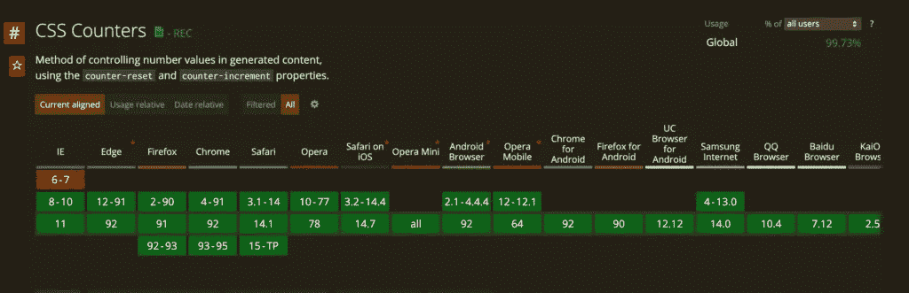

# 使用 CSS 中的计数器对元素进行自动编号——智慧极客

> 原文：<https://medium.com/nerd-for-tech/using-counters-in-css-to-number-elements-automatically-wisdom-geek-4d2a62282806?source=collection_archive---------4----------------------->


有序列表已经成为网页设计的重要组成部分很长一段时间了。如果我们需要更多地控制数字的外观，我们必须添加更多的 HTML 和/或 JavaScript 来做到这一点，直到现在。CSS 中的计数器为我们省去很多麻烦。

# ol 面临的挑战

一个有序列表可以呈现为:
1。第一项
2。第一项
3。第一项

如果我们想要复杂的数字呢？如果我们想要动态分页呢？或者以特定的方式设计数字？

不做`<li>Item one</li>`，我们将不得不用`<div><span>1.</span>Item one</div>`代替它。

然后将样式应用于 span 标记。但我们是开发商。我们不喜欢硬编码的数字和重复！CSS 中的计数器帮助了我们。

# CSS 中的计数器

CSS 计数器是变量，其值可以通过使用 CSS 规则来更改。它们的范围是当前网页。

在 CSS 中使用计数器之前，我们需要了解它的属性。`counter-reset`、`counter-increment`和`counter()`属性使得计数器的动态本质成为可能。还有几个其他属性，但这些对于基本计数器来说已经足够了。

*   计数器复位用于复位或初始化计数器。需要使用此属性创建计数器才能使用它。
*   counter-increment 用于增加计数器的值。
*   柜台干重活。应该在`:before`或`:after`伪选择器的内容属性中使用它来增加计数。

将这些放在一起，我们将首先初始化我们的列表:

```
div.list {
  counter-reset: numbered-list;
}
```

我们正在创建一个名为 numbered-list 的变量来存储我们的计数器。接下来，每当我们在这个列表中遇到一个 div 时，我们都要增加变量值。为此，我们将:

```
div.list div {
  counter-increment: list-number;
}
```

这建立了我们的计数器。我们现在需要使用 content 属性将它添加到 DOM 中。

```
div.list div:before {
  content: counter(numbered-list);
}
```

如果我们将这个 CSS 应用于一个列表:

```
<div class="list">
  <div>Item 1</div>
  <div>Item 2</div>
</div>
```

我们得到输出:
1 项目 1
2 项目 2

然后，我们可以根据需要对元素的 div.list div:before 部分设置样式。

我们甚至可以为计数器指定一个自定义的起始点，方法是将其初始化为:

```
counter-reset: list-number 10;
```

或者指定增量值:

```
counter-increment: list-number 10; 
```

浏览器对计数器的支持也很好:



所以我们可以在 CSS 中轻松启动计数器。

还有其他函数，比如 counters()，它允许嵌套计数器，counter 函数还接受第二个参数来指定计数器的格式，如果您正在寻找它们，这是很好的补充。

这就是你需要知道的关于 CSS 中的计数器的全部内容。如果你有任何问题，请在下面留言。

*最初发表于 2021 年 9 月 1 日*[*【https://www.wisdomgeek.com】*](https://www.wisdomgeek.com/development/web-development/using-counters-in-css-to-number-elements-automatically/)*。*