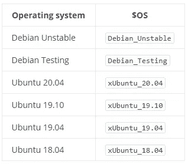

# 使用 CRI-O 作为 Kubernetes 的容器运行时

> 原文：<https://medium.com/nerd-for-tech/using-cri-o-as-container-runtime-for-kubernetes-b8ddf8326d38?source=collection_archive---------0----------------------->


在 [Unsplash](https://unsplash.com/s/photos/container?utm_source=unsplash&utm_medium=referral&utm_content=creditCopyText) 上由 [Bernd Dittrich](https://unsplash.com/@hdbernd?utm_source=unsplash&utm_medium=referral&utm_content=creditCopyText) 拍摄的照片

*在本帖中，我们将看到如何将 cri-o 设置为 Kubernetes 的容器运行时。*

## 什么是容器运行时？

容器运行时是一个负责在节点上运行和管理容器的软件。Docker 是最广为人知的容器运行时，但市场上很少有像 containerd、rkt 和 **cri-o** 这样的运行时。

在 1.20 版本之后，Kubernetes 将不再使用 docker 作为其容器运行时。对于 docker 来说，这没什么大不了的，因为 docker 不仅仅是一个容器运行时，它还是一套可以用来构建和运行容器的产品。你可以阅读这篇[帖子](https://kubernetes.io/blog/2020/12/02/dont-panic-kubernetes-and-docker/)了解更多信息。

## [CRI-O](https://cri-o.io/)

cri-o 是一个轻量级 OCI 兼容容器运行时，这意味着我们可以使用任何兼容注册表来存储图像和运行任何 OCI 兼容容器。你可以在这个网站[https://opencontainers.org](https://opencontainers.org/)/上了解更多关于 OCI(开放集装箱倡议)的信息。

Docker、Containerd 和 CRI-O 之间的比较如下所示:


码头工人 vs 集装箱工人 vs CRI-O

## 装置

在本演示中，我们将使用两个 ec2 虚拟机，一个作为主节点，另一个作为工作节点。必要的配置已经在网络层完成，这样这些节点就可以互相通信，Kubernetes 就可以工作了。

整个过程分为 3 个阶段:

## *先决条件:*

我们必须在两个节点上启用两个内核模块，然后在运行时启用它们。在两个节点上执行以下命令:

*注意:复制命令时，请忽略括号中的注释。*

```
#modprobe overlay  ( For using overlayFS )
#modprobe br_netfilter  (Turns on VxLan for pod communication)#cat > /etc/sysctl.d/99-kubernetes-cri.conf <<EOF
net.bridge.bridge-nf-call-iptables  = 1
net.ipv4.ip_forward                 = 1
net.bridge.bridge-nf-call-ip6tables = 1
EOF#sysctl --system
#swapoff -a (kubernetes scheduler requires this setting to be done.)
```

## 安装 cri-o:

在开始下载包之前，我们必须在两个节点上设置两个环境变量，它们是 **OS** 和**版本**。 **OS** 取决于这些节点的操作系统的风格和版本。使用下面的查找表来设置值。这些信息也可以在 cri-o 网站上找到。



$OS

要确定 Ubuntu 的版本，您可以运行以下命令:

```
#lsb_release -a
```

因为我运行的是 Ubuntu 18。*在两个节点上，我将设置如下值:

```
#OS=xUbuntu_18.04
```

接下来，设置要下载的 cri-o 版本。这应该与您计划部署的 Kubernetes 版本相匹配。我将使用 Kubernetes 1.20，因此将版本设置为 1.20。

```
#VERSION=1.20
```

现在我们可以执行下面的命令来下载软件包

```
#echo "deb [https://download.opensuse.org/repositories/devel:/kubic:/libcontainers:/stable/$OS/](https://download.opensuse.org/repositories/devel:/kubic:/libcontainers:/stable/$OS/) /" > /etc/apt/sources.list.d/devel:kubic:libcontainers:stable.list#echo "deb [http://download.opensuse.org/repositories/devel:/kubic:/libcontainers:/stable:/cri-o:/$VERSION/$OS/](http://download.opensuse.org/repositories/devel:/kubic:/libcontainers:/stable:/cri-o:/$VERSION/$OS/) /" > /etc/apt/sources.list.d/devel:kubic:libcontainers:stable:cri-o:$VERSION.list#curl -L [https://download.opensuse.org/repositories/devel:kubic:libcontainers:stable:cri-o:$VERSION/$OS/Release.key](https://download.opensuse.org/repositories/devel:kubic:libcontainers:stable:cri-o:$VERSION/$OS/Release.key) | apt-key add -
curl -L [https://download.opensuse.org/repositories/devel:/kubic:/libcontainers:/stable/$OS/Release.key](https://download.opensuse.org/repositories/devel:/kubic:/libcontainers:/stable/$OS/Release.key) | apt-key add -
```

更新 apt 库，安装 **cri-o** 、 **cri-o-runc** 和 **cri-tools** 。

```
#apt-get update
#apt-get install cri-o cri-o-runc cri-tools
```

一旦安装了包，我们将编辑 **/etc/crio/crio.conf** 文件并设置 **conmon=/usr/bin/conmon 的值。Conmon 是一个监控 crio 的实用程序。默认情况下，crio.conf 中的 conman 设置为空，我们必须用 conman 的二进制路径替换它。**

编辑完 crio.conf 文件后，启用 **cri-o.service** 并启动服务。

```
#systemctl enable cri-o.service
#systemctl start cri-o.service
#systemctl status cri-o.service
```

运行 **crictl info** 命令，检查 cri-o 是否安装并正确启动。

```
#:/home/ubuntu# crictl info
{
  "status": {
    "conditions": [
      {
        "type": "**RuntimeReady**",
        "status": true,
        "reason": "",
        "message": ""
      },
      {
        "type": "NetworkReady",
        "status": true,
        "reason": "",
        "message": ""
      }
    ]
  }
}
```

## 安装 K8:

我们将遵循标准的 **kubeadm** 方法来设置一个双节点集群。按照[本](https://kubernetes.io/docs/setup/production-environment/tools/kubeadm/install-kubeadm/)安装指南安装 **kubectl** 、 **kubeadm** 和 **kubelet** (版本 1.20)。我们不必遵循容器运行时部分，因为我们已经在上面的步骤中设置了 cri-o。

一旦安装了包，我们必须在两个节点上配置 **kubelet** 以开始使用 **systemd** 作为 cgroup 驱动程序。默认情况下，cri-o 使用 **systemd** 作为 cgroup 驱动程序，而 kubelet 被设置为使用 **cgroupfs** 。我们必须编辑 kubelet 服务文件，并包括一个额外的“ **KUBELET_EXTRA_ARGS** ”设置，在下面的快照中突出显示。

```
#vi /etc/systemd/system/kubelet.service.d/10-kubeadm.conf# Note: This dropin only works with kubeadm and kubelet v1.11+
[Service]
Environment="KUBELET_KUBECONFIG_ARGS=--bootstrap-kubeconfig=/etc/kubernetes/bootstrap-kubelet.conf --kubeconfig=/etc/kubernetes/kubelet.conf"
Environment="KUBELET_CONFIG_ARGS=--config=/var/lib/kubelet/config.yaml"
**Environment="KUBELET_EXTRA_ARGS=--feature-gates='AllAlpha=false,RunAsGroup=true' --container-runtime=remote --cgroup-driver=systemd --container-runtime-endpoint='unix:///var/run/crio/crio.sock' --runtime-request-timeout=5m"**
# This is a file that "kubeadm init" and "kubeadm join" generates at runtime, populating the KUBELET_KUBEADM_ARGS variable dynamically
EnvironmentFile=-/var/lib/kubelet/kubeadm-flags.env
# This is a file that the user can use for overrides of the kubelet args as a last resort. Preferably, the user should use
# the .NodeRegistration.KubeletExtraArgs object in the configuration files instead. KUBELET_EXTRA_ARGS should be sourced from this file.
EnvironmentFile=-/etc/default/kubelet
ExecStart=
ExecStart=/usr/bin/kubelet $KUBELET_KUBECONFIG_ARGS $KUBELET_CONFIG_ARGS $KUBELET_KUBEADM_ARGS $KUBELET_EXTRA_ARGS
```

保存文件并执行以下命令来重新加载 **systemd** ，然后重启 **kubelet** 服务:

```
#systemctl daemon-reload
#systemctl  restart kubelet
```

*注意:为了演示，我将把法兰绒部署为网络插件，并相应地设置****pod-network-CIDR****。*

我们现在可以执行 kubeadm init 命令，等待控制平面启动并运行。

```
#kubeadm init --pod-network-cidr=10.244.0.0/16
```

一旦控制面板启动，我们就可以用下面的命令部署法兰绒插件。在运行 **kubectl** 之前，确保按照 kubeadm 命令的输出复制 kubeconfig 文件。

```
#kubectl apply -f [https://raw.githubusercontent.com/coreos/flannel/master/Documentation/kube-flannel.ym](https://raw.githubusercontent.com/coreos/flannel/master/Documentation/kube-flannel.ym)
```

一旦创建了资源，检查是否所有在 **kube-system** 名称空间下的 pod 都在运行，然后执行 **kubeadm join** (从 kubeadm 输出中复制)将我们的 worker 节点加入到这个集群中。在主节点上执行以下命令，检查两个节点是否都启动，并显示状态为“就绪”:

```
#kubectl get pods -n kube-system
#kubectl get nodes -o wide
```

在上面的输出中，检查**容器-运行时**列，您会注意到它显示了 **cri-o://1.20.0**

现在您可以部署一个示例 nginx 容器，并检查它是否被正确部署。如果到目前为止没有遇到任何错误，这一步应该可以正常工作。

```
#kubectl run nginx --image=nginx
#kubectl get pods
```

## 那是所有人的

没那么简单！我们现在有一个使用 CRI-O 作为容器运行时的 Kubernetes 集群。

那为什么是 cri-o 呢？我正在设置 Kata 容器，为此，必须将 containerd 或 cri-o 设置为容器运行时。在我的下一篇文章中会有更多的介绍。

你可以在这个 [youtube 频道](https://youtube.com/playlist?list=PLOlDWXFyp3kD2IltmtTAyR_G-shyER1Nv)找到以上步骤的视频教程。感谢您花时间阅读本文。