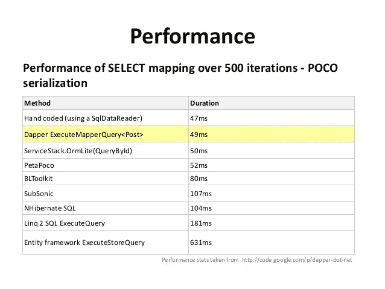
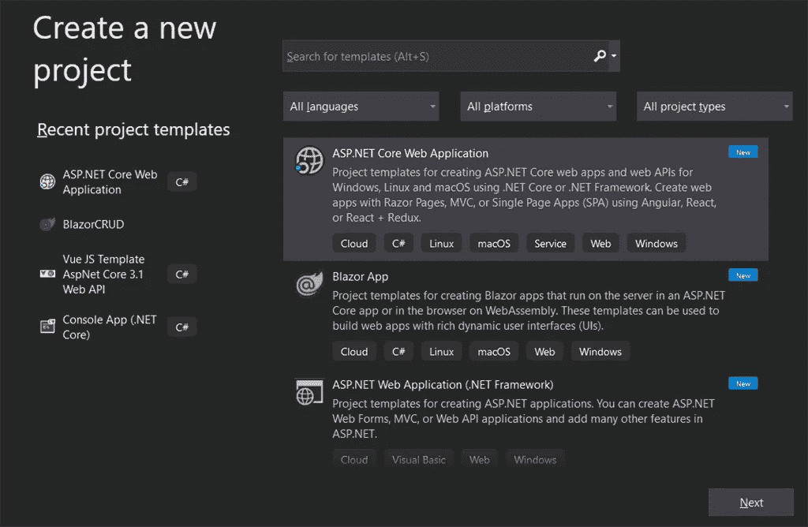
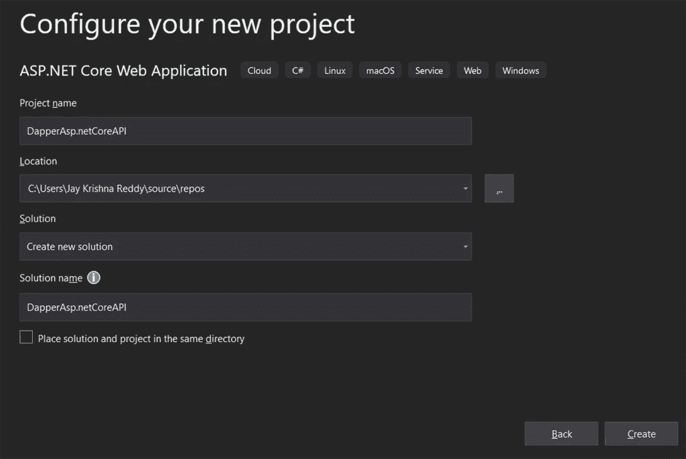
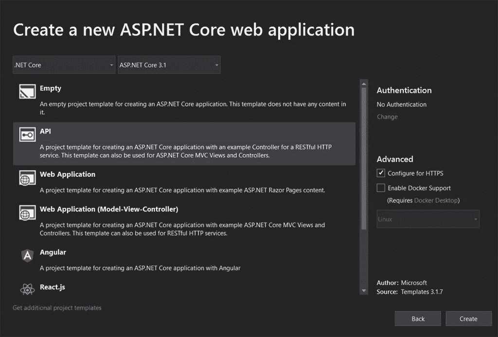
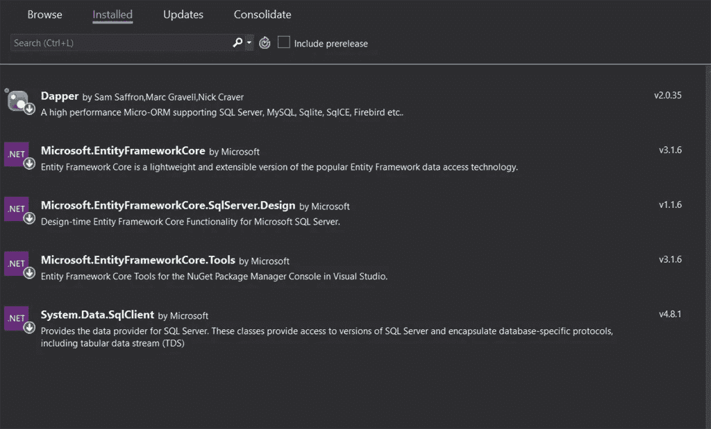
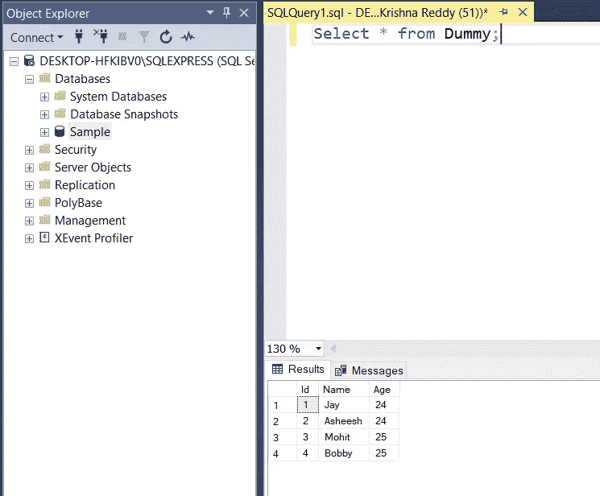
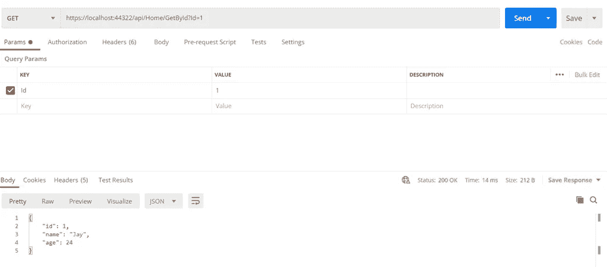

# 在 ASP.NET 核心 Web API 中使用 Dapper

> 原文：<https://medium.com/nerd-for-tech/using-dapper-in-asp-net-core-web-api-1d253e0e16a4?source=collection_archive---------0----------------------->

***F*** 首先，让我们清楚地了解一下 Dapper，以及它将如何在我们的核心 API 中发挥作用。我想我们大多数人都知道 Dapper 是什么，但这篇文章是为那些不知道 Dapper 的人写的。

# 衣冠楚楚的

Dapper 是一个简单的对象映射器，只不过是对象关系映射(ORM ),负责数据库和编程语言之间的映射，并且在速度方面拥有微型 ORM 之王的称号。它实际上与使用原始 ADO.NET 数据读取器和实体框架一样快。

**Dapper 是如何工作的？**

1.  创建一个 IDbConnection 对象。
2.  编写一个查询来执行 CRUD 操作
3.  在 Execute 方法中将查询作为参数传递。

# 表演

与所有对象关系映射相比，Dapper 是第二快的 ORM。

**Git Hub-Repo**

 [## JayKrishnareddy/Dapper_ORM

### 此时您不能执行该操作。您已使用另一个标签页或窗口登录。您已在另一个选项卡中注销，或者…

github.com](https://github.com/JayKrishnareddy/Dapper_ORM) 

**第一步**

创建一个 ASP.NET 核心项目

点击下一步按钮。

**第二步**

添加项目名称和解决方案名称，将项目保存到所需的任何位置。

点击创建按钮。

**第三步**

选择适当的 API 版本

单击“创建”按钮，将创建一个具有基本设置的示例项目。现在让我们进入我们的项目。

创建一个任意名称的空 API 控制器(Home)

现在创建 Services 文件夹，并向其中添加一个接口(IDapper.cs)和一个类(Dapperr.cs)。

现在添加 ASP.NET 核心库来设置数据库，并从 Nuget 包管理器将 Dapper 库添加到我们的项目中。

将 IDapper.cs 接口中的以下代码添加到我们项目中执行 Crud 操作的位置。

将代码添加到 Dapperr.cs 文件中，对于我们已经在接口中声明的每个方法，实际的方法实现都发生在该文件中

创建一个 DataContext 文件夹并在其中添加 AppContext 类。

在 AppContext.cs 文件中添加代码，以连接 DbContext 并连接数据库。

在 appsettings.json 文件中添加连接字符串:

在 Startup.cs 文件中进行连接设置。

**Startup.cs**

添加 Parameters.cs 文件，该文件充当与现有 SQL 数据库的对象映射。

**Parameters.cs**

在 SQL DB 中创建一个表，使用 Dapper 从这个核心 API 中访问表数据，因此我在数据库中创建了一个带有 dummy 的表名。

在家庭控制器中添加 CRUD 方法。

**HomeController.cs**

现在，我们可以运行应用程序并调用相应的方法来获取数据，或者使用 Dapper 将数据添加到现有的数据库中。

**输出**

如果你发现这篇文章对你有帮助，请给它一个👏🏻

继续学习…！