# 使用 Dapper 加载。网络核心

> 原文：<https://medium.com/nerd-for-tech/using-dapper-to-load-related-entities-in-net-core-e5bf4d870c7b?source=collection_archive---------0----------------------->

**Dapper** 是[微软的](https://en.wikipedia.org/wiki/.NET_Framework)[对象关系映射](https://en.wikipedia.org/wiki/Object-relational_mapping) (ORM)产品。NET 平台:提供了一个[框架](https://en.wikipedia.org/wiki/Software_framework)，用于将[面向对象](https://en.wikipedia.org/wiki/Object-oriented_programming) [领域模型](https://en.wikipedia.org/wiki/Domain_model)映射到传统的[关系数据库](https://en.wikipedia.org/wiki/Relational_database)。

**Dapper ORM 的主要特性:**

1.  对象映射。
2.  静态和动态对象绑定。
3.  SQL 查询和存储过程可以很容易地处理。
4.  静态对象绑定。

还有其他的表格。NET 等实体框架核心，但在。网络世界 Dapper 被称为 ORM 之王。在这篇文章中，我将介绍如何使用 Dapper。NET 核心项目，并通过 Dapper 使用原始查询检索相关实体。

**首先让我们创建实体，我们可以用它们来演示 Dapper 查询。以下是我将在示例中使用的四个实体。**

1.  学生
2.  班级
3.  课程
4.  学生课程

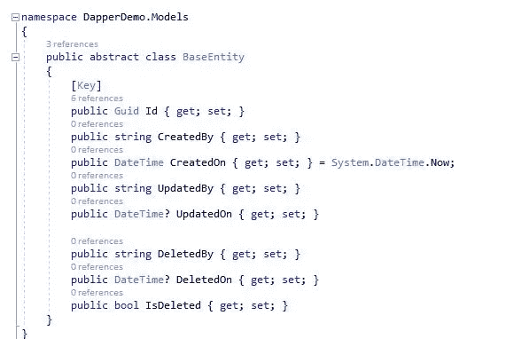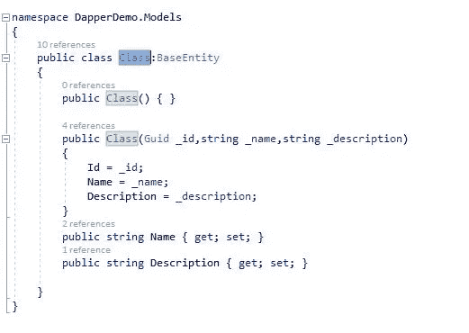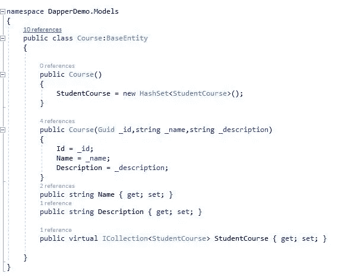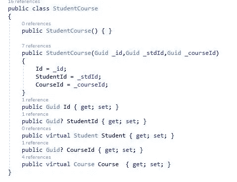

在这个例子中，我们使用了实体框架核心和 SQL server，所以在我们继续之前，我们需要实体框架包。

**让我们安装下面的 Nuget 包**

微软。EntityFrameworkCore

微软。实体框架工作核心设计

微软。EntityFrameworkCore . SQL server

微软。实体框架工作核心工具

**在 appsettings.jsonfile 中添加连接字符串**

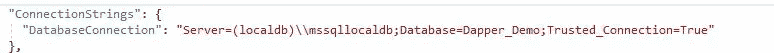

**创建 DbContext，作为 SQL Server 和之间的桥梁。网络实体。**

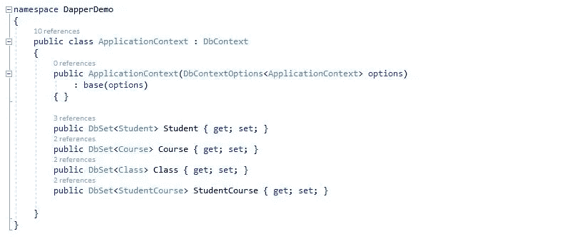

**在 ConfigureServices 方法的 Statup.cs 文件中配置 ApplicationContext 类。**

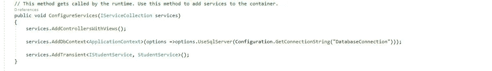

现在，我们需要做的下一步是将我们在上面创建的实体迁移到 SQL 数据库中。在这里，我们使用实体框架代码优先的方法将实体迁移到 Db 表中。

*添加-迁移“迁移名称”*

*更新-数据库*

**成功运行迁移命令后，它应该在 SQL Server 中创建数据库，并在应用程序上下文类中注册适当的表。在 SSMS，我们应该看到这样的东西。**

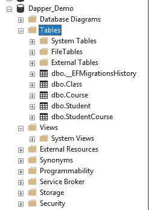

现在让我们考虑一个场景，其中我们需要检索具有适当的**班级**和**课程的**学生**的列表。**如果我们查看实体，**学生**有一个**类**与之相关。和**科目的多对多关系。**

**现在，让我们创建每个实体的视图模型，以便我们只在 UI 中表示那些需要的属性。**

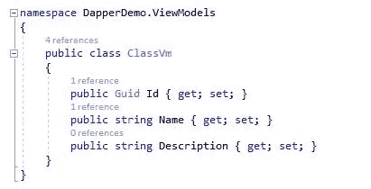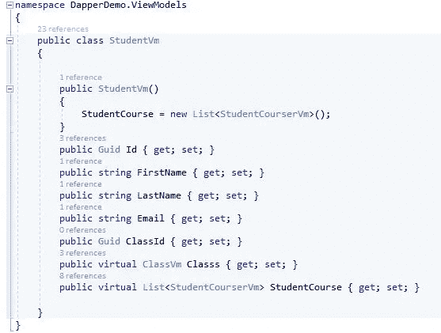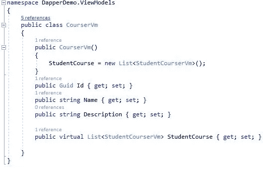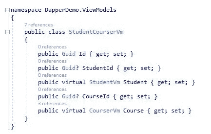

让我们使用 Dapper 和原始 SQL 查询来获取学生及其相关实体。首先我们需要为 dapper 添加 nuget 包。

为了获取相关类和课程的学生列表，我创建了一个学生服务类。

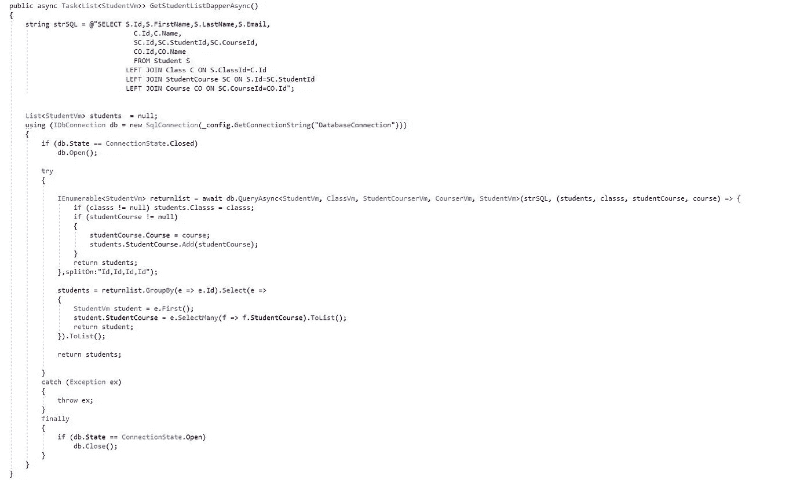

这是我们真正关注的查询。我已经创建了一个原始 SQL 查询，其中包含了我需要在 select 语句中提取的所需属性。

所选列按照它们在查询结构中的显示顺序映射到适当的视图模型属性。

Dapper 中的 SplitOn 属性用于指定所选列中要映射到某个 C#模型(视图模型)的位置。

**带输入参数的 Dapper 查询**

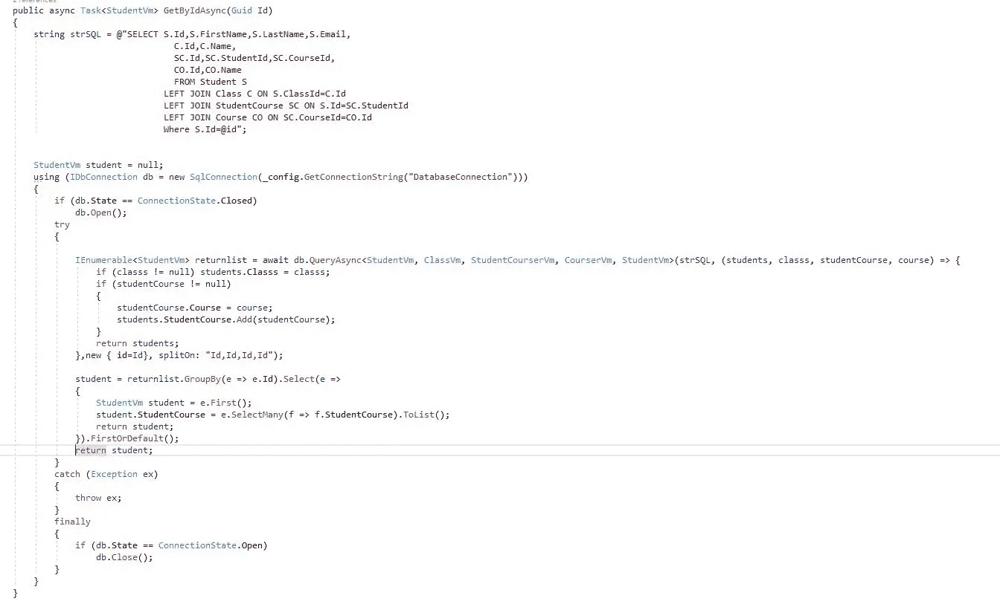

如果我们需要向 SQL 查询传递参数，我们可以在 SQL 查询中使用带有已定义属性名的匿名对象。

**创建控制器以使用服务**

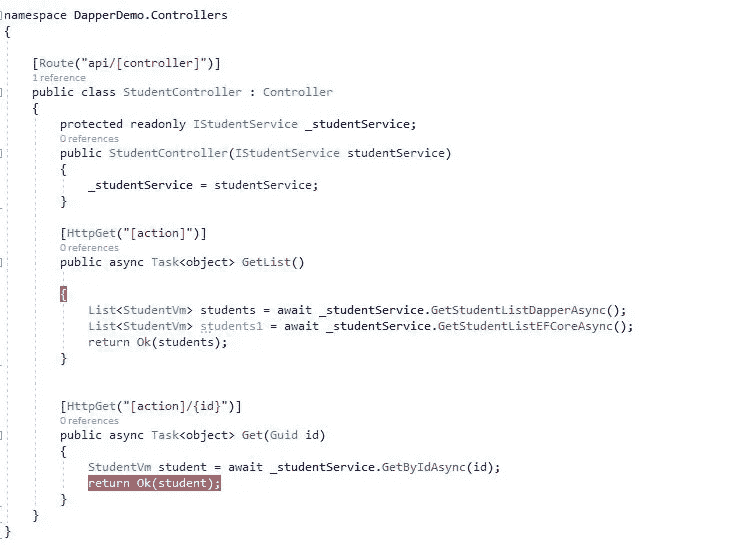

**控制器的 JSON 输出看起来像这样**

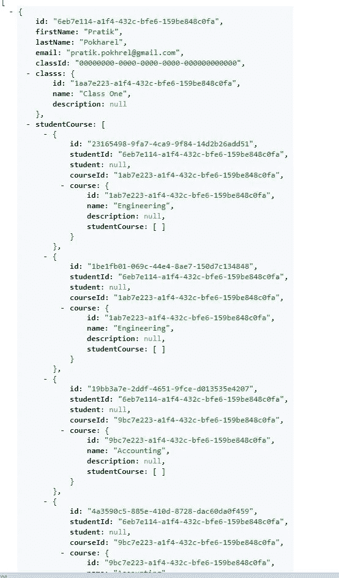

源代码:[https://github.com/PratikPokhrel/DapperDemo](https://github.com/PratikPokhrel/DapperDemo)