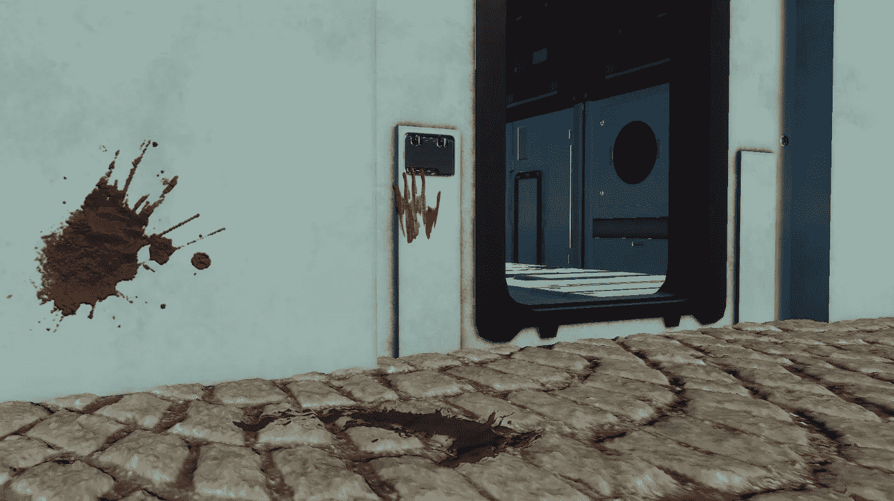

# 在 Unity 的 HDRP 使用贴花

> 原文：<https://medium.com/nerd-for-tech/using-decals-in-unitys-hdrp-b4fbad91104f?source=collection_archive---------4----------------------->

在您的 3D 环境中使用 2D 贴花是一种强大的方式，可以为您的游戏场景带来一些附加的纹理和细节。*贴花*可以是任何东西，从血液飞溅、弹孔、墙壁污垢或损坏，到艺术和海报，或者任何你想在*游戏对象*的*表面*上*投影*的*细节。*

我将使用来自*文件库*资源库的一些血液飞溅*贴花*。