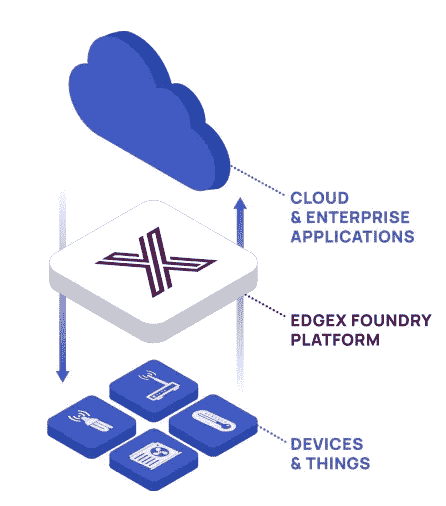
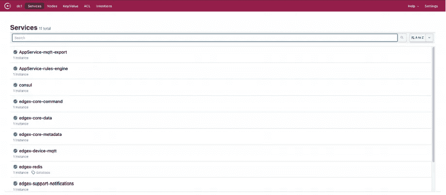
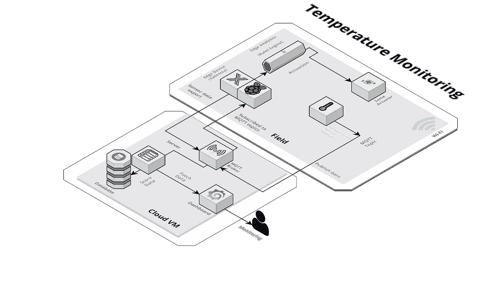
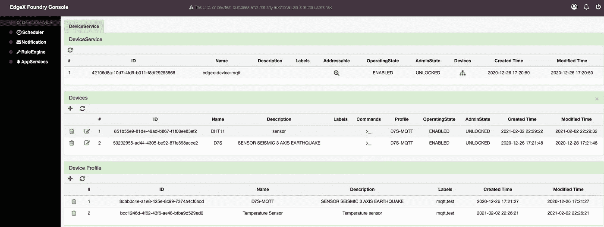
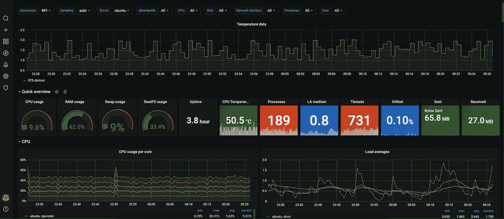
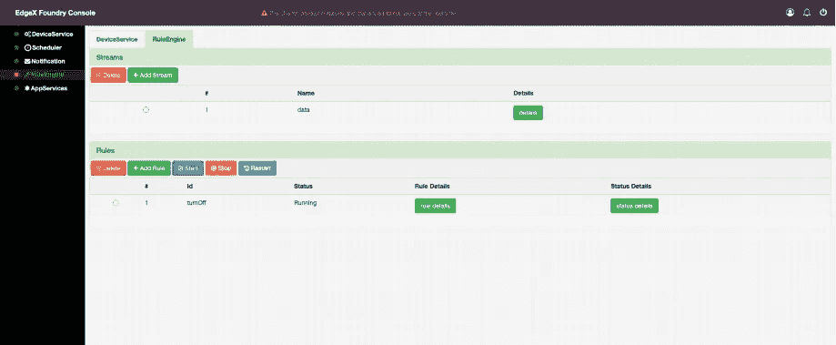
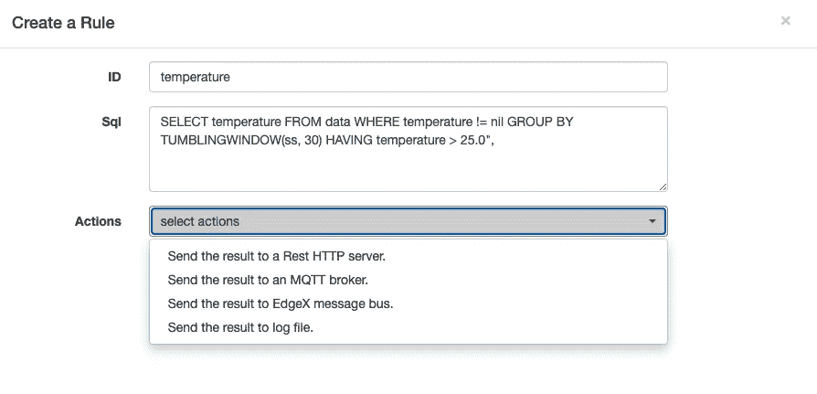

# 使用 EdgeX 作为物联网中间件

> 原文：<https://medium.com/nerd-for-tech/using-edgex-as-an-iot-middleware-6074288ca6dd?source=collection_archive---------3----------------------->

E [dgeX](https://www.edgexfoundry.org/) 是一个**开源**，厂商中立的边缘物联网中间件平台，以前由戴尔开发，现在在 Linux 基础下开发和维护。它目前得到了英特尔、Canonical、戴尔、IBM、Wipro 和其他大公司的支持。

EdgeX 翻译和转换来自设备的传感器数据，并通过基于网络的协议将其交付给应用程序，以满足客户的需求。它能够发送和接收数据，并用于控制和启动边缘节点。



EdgeX(来源:[https://www.edgexfoundry.org/](https://www.edgexfoundry.org/)

作为实习的一部分，我曾在这个平台上工作过，当我在开发过程中遇到问题时，惊讶地发现缺少在线支持。我不得不依靠 EdgeX Slack 社区来了解某些问题的原因。这可以追溯到 EdgeX 仍然没有被广泛用于开发物联网解决方案的原因。本文的目的是分享我的经验以及一个关于建立一个简单物联网用例的简短指南。

## 入门指南

现在我们已经对 EdgeX 有了基本的了解，让我们继续讨论开发方面的事情。EdgeX 由多个微服务组成，这些微服务以 docker 容器映像的形式打包，保存在 DockerHub 上，可以在这里[找到](https://hub.docker.com/u/edgexfoundry/)。

需要注意的是，本文讨论了 EdgeX 部署在边缘设备(如 Raspberry Pi)上的场景。幸运的是，EdgeX 支持 arm64 和 amd64 arch 类型。为了区分两种拱门类型的容器图像，arm64 的图像以“-arm64”结尾。因此，在这种情况下，我们将使用每个微服务的 arm64 版本。

一个例子是'[edgexfoundry/docker-device-BAC net-c-arm 64](https://hub.docker.com/r/edgexfoundry/docker-device-bacnet-c-arm64)，它的 amd64 对应物是'[edgexfoundry/docker-device-BAC net-c](https://hub.docker.com/r/edgexfoundry/docker-device-bacnet-c)

值得注意的是，EdgeX 正在积极开发中，每年都有两个主要版本。截止到撰写本文时，当前版本是河内的[](https://github.com/edgexfoundry/developer-scripts/tree/master/releases/hanoi/compose-files)**版本。**

**EdgeX 可以通过使用 docker-compose 文件来运行，可以在这里找到，也可以使用 Linux 上的[快照存储](https://snapcraft.io/edgexfoundry)来运行。从个人经验来看，我推荐使用 docker-compose 方法。**

**docker-compose 文件包含要从 DockerHub 中提取并使用的每个微服务的必要版本。它还允许修改微服务的某些参数，这将在本文的后面部分讨论。为了将来参考，来自[这里](https://github.com/edgexfoundry/developer-scripts/blob/master/releases/hanoi/compose-files/docker-compose-hanoi-no-secty-arm64.yml)的 docker-compose 文件将用于接下来的部分。需要注意的是，EdgeX 使用 **Redis** 在本地存储传感器数据。**

***注意:docker-compose 文件包含启动 EdgeX 所需的最少微服务，可以根据需要进行修改以包含必要的微服务。***

**要在 Raspberry Pi 上运行 EdgeX，我推荐使用 Ubuntu 服务器(在这里找到)并使用 SSH 进行开发。我将不解释设置，但将留下此[链接](https://pimylifeup.com/ubuntu-server-raspberry-pi/)以供参考。一旦 Ubuntu 安装程序准备好了必要的要求和下载的文件，终端上的以下命令(在 docker-compose.yml 文件的目录中)将启动并运行 EdgeX。**

```
docker-compose up -d
```

***注意:如果您想监控每个微服务的日志，可以跳过“-d”***

**在 EdgeX 没有任何错误地启动之后，我们可以通过使用在端口 8500 上运行的 Consul 服务来查看每个微服务的状态。只需在您的网络浏览器上访问 **localhost:8500** 即可打开 GUI 界面。**

****

**领事**

**为了保持文章的简洁，我不会深入到每一步的每一个细节，但会包括一个可以在这里找到的参考文献。**

## **用例**

**为了更好地理解 EdgeX，让我们以**温度监控**为例，使用 **MQTT** 协议、InfluxDB 和 Grafana 来演示 EdgeX 的功能。**

****

**使用 EdgeX 进行温度监控**

**在这种简单的温度监控情况下，可以使用 DHT11 等温度传感器来读取读数，驱动应在边缘完成，无需应用层用户的干预，以实现快速响应时间。值得注意的是，传感器与廉价的支持 Wi-Fi 的微控制器接口，以通过 MQTT 传输数据。**

**微控制器被配置为连接到 MQTT 代理，该代理设置在云上的 VM 环境中。要了解更多信息，[这篇](/@emqtt/upload-sensor-data-to-mqtt-cloud-service-via-nodemcu-esp8266-b31980b56308)文章可用作设置传感器节点的参考。为了调试 MQTT 消息，我推荐使用 [MQTTLens](https://chrome.google.com/webstore/detail/mqttlens/hemojaaeigabkbcookmlgmdigohjobjm?hl=en) ，因为我觉得它可以完成任务。需要注意的是，用于发布数据的 MQTT 主题将在后面使用，所以要记下来。**

## **配置 EDGEX**

**如前所述，每个 EdgeX 版本都只包含基本的微服务。为了使开发过程更容易，EdgeX 有一个控制台服务，它提供了一个 GUI 界面。**

**要包含这个服务，将下面的代码粘贴到 docker-compose 文件的*服务*下。需要注意的是，该服务运行在端口 4000 上，可以通过在您的 web 浏览器上访问: **localhost:4000** 来查看。**

```
services: // COPY THE CODE BELOW 
    ui:    
      container_name: edgex-ui-go    
      hostname: edgex-ui-go    
      image: edgexfoundry/docker-edgex-ui-go-arm64:1.3.0         
      networks:      
        edgex-network: null    
      ports:    
        - 127.0.0.1:4000:4000/tcp    
      read_only: true
```

**现在，为了使 EdgeX 支持 MQTT 通信作为其“设备服务”的一部分，我们需要在“服务”下添加以下代码，以包含设备-mqtt 微服务。**

```
device-mqtt:
  container_name: edgex-device-mqtt
  depends_on:
      - consul
      - data
      - metadata
  environment: 
      CLIENTS_COMMAND_HOST: edgex-core-command
      CLIENTS_COREDATA_HOST: edgex-core-data
      CLIENTS_DATA_HOST: edgex-core-data
      CLIENTS_METADATA_HOST: edgex-core-metadata
      CLIENTS_NOTIFICATIONS_HOST: edgex-support-notifications
      CLIENTS_RULESENGINE_HOST: edgex-kuiper
      CLIENTS_SCHEDULER_HOST: edgex-support-scheduler
      DATABASES_PRIMARY_HOST: edgex-redis
      EDGEX_SECURITY_SECRET_STORE: "false"
      REGISTRY_HOST: edgex-core-consul
      SERVICE_HOST: edgex-device-mqtt
  hostname: edgex-device-mqtt
  image: edgexfoundry/docker-device-mqtt-go-arm64:1.2.1
  volumes:
    - ./mqtt:/custom-config
  networks:
    edgex-network: {}
  ports:
    - 127.0.0.1:49982:49982/tcp
  read_only: true
  entrypoint:
    - /device-mqtt
    - --confdir=/custom-config
    - --registry=consul://edgex-core-consul:8500
```

**这里需要注意的一个要点是，在 *entrypoint、*下，我们有一个用于定制配置的配置目录，即在 docker-compose 文件所在的目录下，我们有一个包含 *configuration.toml* 的文件夹(我只是将其命名为 mqtt)。该文件用于配置 device-mqtt 服务，以便与其他配置一起连接到 mqtt 代理。请注意，发布数据的主题将在此处配置。文件可以在[这里](https://github.com/edgexfoundry/device-mqtt-go/blob/f040f91db28658e22aee59e3eddee7a4993b8cd8/cmd/res/configuration.toml)找到。要修改的关键参数在[驱动程序]下。**

```
*# Driver configs* [Driver]
...
IncomingHost = '**<ip address of server running the MQTT broker>**' IncomingTopic = '**<Sensor data topic>**' 
IncomingUser = '**<username for MQTT broker>**'
IncomingPassword = '**<password for MQTT broker>**'
ResponseHost = '**<ip address of server running the MQTT broker>**'
ResponseUser = '**<username for MQTT broker>**'
ResponsePassword = '**<password for MQTT broker>**'
...
```

**包含这个文件可以确保每次 device-mqtt 服务启动时，它都会自动连接到 TOML 文件中配置的 mqtt 代理。**

**在我们开始注册我们的“MQTT 设备”之前，还有最后一个微服务要包括在内。在架构图中，我们看到传感器数据存储在云数据库中。为了实现这一点，EdgeX 有一个名为“app-service-mqtt”的导出服务，其中本地存储的传感器数据通过 mqtt 消息导出到云数据库。在这种情况下，我们将使用 **InfluxDB** 来存储实时数据，以实现更好的可视化。不言而喻，InfluxDB 上的数据库是用来存储数据的。要包含这个微服务，请在*服务下添加以下代码。***

```
app-service-mqtt:
  container_name: edgex-app-service-configurable-mqtt
  depends_on:
    - consul
    - data
  environment:
    BINDING_PUBLISHTOPIC: events
    CLIENTS_COMMAND_HOST: edgex-core-command
    CLIENTS_COREDATA_HOST: edgex-core-data
    CLIENTS_DATA_HOST: edgex-core-data
    CLIENTS_METADATA_HOST: edgex-core-metadata
    CLIENTS_NOTIFICATIONS_HOST: edgex-support-notifications
    CLIENTS_RULESENGINE_HOST: edgex-kuiper
    CLIENTS_SCHEDULER_HOST: edgex-support-scheduler
    DATABASES_PRIMARY_HOST: edgex-redis
    EDGEX_PROFILE: mqtt-export
    EDGEX_SECURITY_SECRET_STORE: "false"
    MESSAGEBUS_SUBSCRIBEHOST_HOST: edgex-core-data
    REGISTRY_HOST: edgex-core-consul
    SERVICE_HOST: edgex-app-service-configurable-mqtt
    SERVICE_PORT: 48101
    WRITABLE_PIPELINE_FUNCTIONS_MQTTSEND_ADDRESSABLE_ADDRESS: **<server ip address running MQTT broker>** WRITABLE_PIPELINE_FUNCTIONS_MQTTSEND_ADDRESSABLE_PORT: 1883
    WRITABLE_PIPELINE_FUNCTIONS_MQTTSEND_ADDRESSABLE_PROTOCOL: tcp
    WRITABLE_PIPELINE_FUNCTIONS_MQTTSEND_ADDRESSABLE_TOPIC: "**<Topic name under which data is exported>**"
    WRITABLE_PIPELINE_FUNCTIONS_MQTTSEND_PARAMETERS_AUTORECONNECT: "true"
    WRITABLE_PIPELINE_FUNCTIONS_MQTTSEND_PARAMETERS_RETAIN: "true"
    WRITABLE_PIPELINE_FUNCTIONS_MQTTSEND_PARAMETERS_PERSISTONERROR: "false"
    # WRITABLE_PIPELINE_FUNCTIONS_MQTTSEND_ADDRESSABLE_PUBLISHER:
    WRITABLE_PIPELINE_FUNCTIONS_MQTTSEND_ADDRESSABLE_USER: "**<MQTT broker username>**"
    WRITABLE_PIPELINE_FUNCTIONS_MQTTSEND_ADDRESSABLE_PASSWORD: "**<MQTT broker password>**"
  hostname: edgex-app-service-configurable-mqtt
  image: edgexfoundry/docker-app-service-configurable-arm64:1.1.0
  networks:
    edgex-network: {}
  ports:
    - 127.0.0.1:48101:48101/tcp
  read_only: true
```

**最后一步是运行脚本来订阅在 MQTT 主题下发布的数据，并将数据存储到数据库中。在这里可以找到[的示例脚本。](https://github.com/jonas-werner/EdgeX_Tutorial/blob/master/messenger/app.py)**

**唷！在所有这些步骤之后，我们可以**最终**注册我们的 MQTT 设备’。**

****

**为了存储温度、湿度、加速度等任何传感器数据，EdgeX 要求您创建'**值描述符**，让 EdgeX 知道它将处理哪种测量量。除此之外，每个传感器设备都有一个与之关联的“配置文件”。设备配置文件类似于一个类，设备是对象。设备配置文件包含值描述符以及核心命令。在这里可以找到一个样本设备配置文件。EdgeX 要求注册设备配置文件，这可以通过使用运行在端口 4000 上的 UI 微服务简单地添加设备配置文件来完成。**

**最后一步是添加设备，方法是单击“devices”下的图标，然后使用“+”按钮添加具有适当配置的设备。**

****

**使用 UI 服务在 EdgeX 上注册 MQTT 设备**

**通过这种设置，每次传感器模块发布数据时，EdgeX 都会获取数据并将其导出到云数据库。此外，为了可视化这些数据，我们可以使用 Grafana，添加 InfluxDB 数据库作为数据源。为了分析 Raspberry Pi 的实时状态，我们可以使用 Telegraf 收集数据并将其存储到另一个 InfluxDB 数据库中。为了画龙点睛，我们可以使用 Grafana [模板](https://grafana.com/grafana/dashboards/10578)来可视化来自 Telegraf 的数据以及传感器输出。因为我没有带温度传感器，所以我为传感器数据生成了随机值。**

****

**用于数据可视化的 Grafana 仪表板**

**现在，为了在混合中添加一些基于价值的驱动，我们将使用“规则引擎”微服务。EdgeX Foundry 与 EMQ·x·柯伊伯合作，将规则引擎集成到 EdgeX 中。**

****

**设置规则引擎**

**首先，我们需要创建一个流，这可以通过 *UI* 服务来完成，然后我们可以创建一个规则。需要注意的是，语法类似于 SQL。我们还可以配置满足条件时要执行的操作。范围从向设备发出核心命令到将结果发送到 HTTP 服务器。需要注意的是，下面定义的规则每 30 秒取一次值。**

****

**在规则引擎中定义规则及其相应的操作**

## **结束注释**

**因此，在本文中，我们看到了 EdgeX 创建物联网解决方案的简单应用。我希望这篇文章能对鼓励开发人员尝试 EdgeX 有所帮助。如果你想让我在 EdgeX 中报道某个特定的部分，请在评论区告诉我:)**