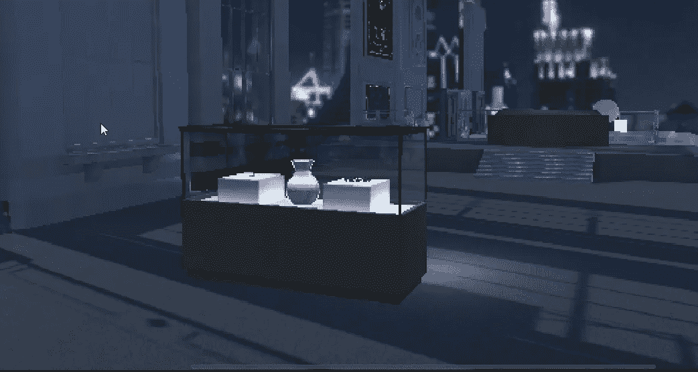
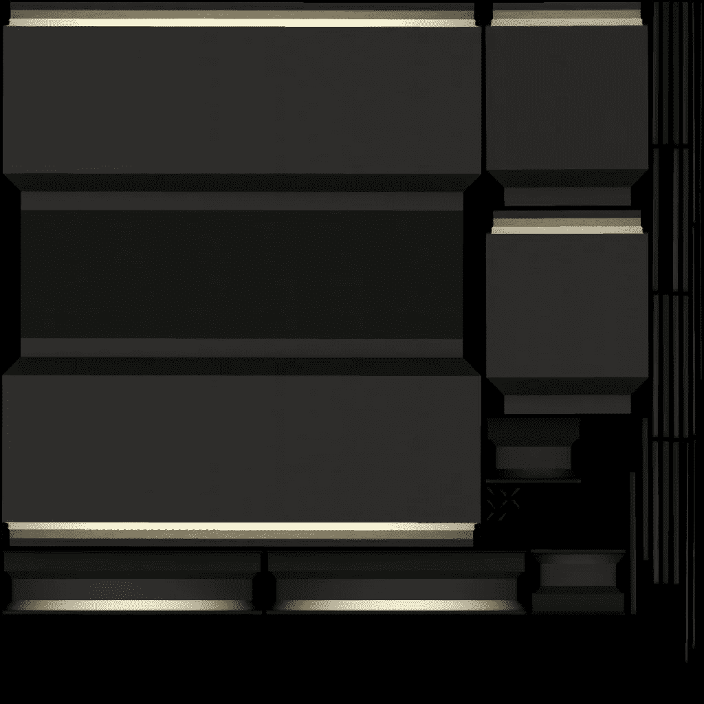
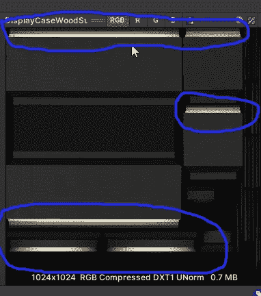
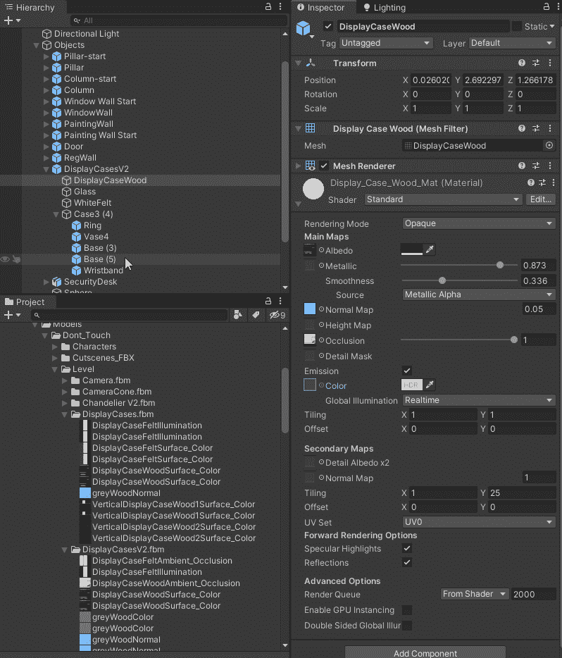
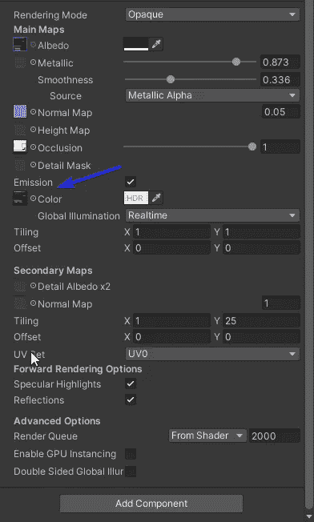
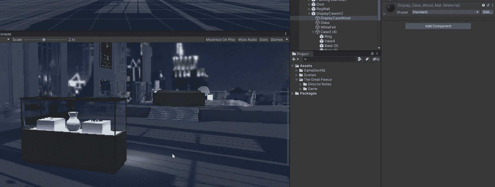

# 在 Unity 中使用发射

> 原文：<https://medium.com/nerd-for-tech/using-emissions-in-unity-dff9bf779d00?source=collection_archive---------10----------------------->

**目的:**在不使用光源的情况下，创造一个发光的展示柜。

之前的展示柜

一名 3D 艺术家创建了一个木材表面颜色纹理图，我们将在展示柜的材料上使用。

陈列柜纹理图

这张纹理贴图融合了光线数据。地图上的亮区是 Unity 让光发射的地方。这将围绕箱子的底部和箱子的顶部边缘。

发射纹理贴图

接下来，我们需要将这个纹理贴图添加到我们的展示柜材质着色器的发射通道中。

将纹理添加到发射通道

发射通道

现在我们已经准备好了一切，我们可以在 inspector 中实时调整排放。

现在让我们看看最终产品。你可以看到表壳边缘和底座周围的灯光。当需要一些光线时，使用发射通道是节省资源的好方法。

编码快乐！！！！！