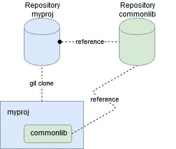
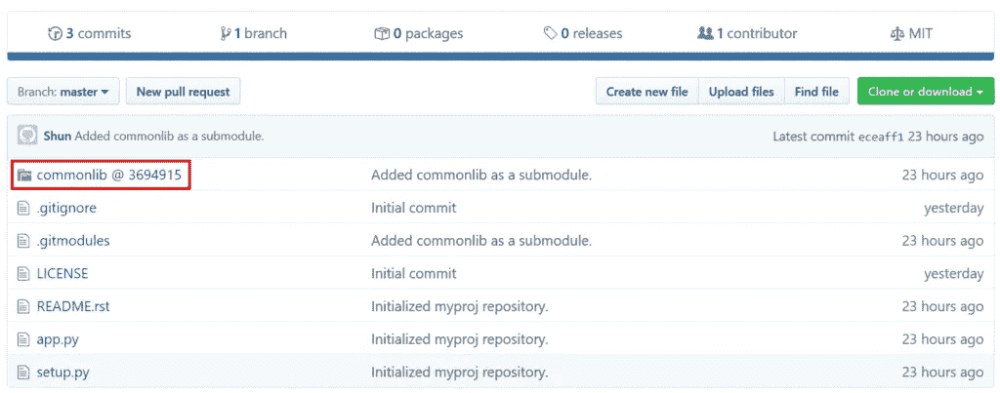

# 使用 Git 子模块和开发模式管理 Python 项目

> 原文：<https://medium.com/nerd-for-tech/using-git-submodule-and-develop-mode-to-manage-python-projects-887489ee9a53?source=collection_archive---------6----------------------->

*【更新时间:2020 年 12 月 27 日】*

作为一名软件工程师，我们从事的项目依赖于我们同时从事的另一个项目，这种情况并不少见。该场景可能如下所示:

我们有两个项目，每个项目都有自己的 Git 存储库:

*   一个公共库，比如说`*commonlib*`，被许多项目使用。这个库是独立的，有自己的测试套件和文档。
*   一个名为`*myproj*`的项目依赖于`*commonlib*`。

当我们在做`*myproj*`的时候，我们可能也需要同时更新`*commonlib*`。如果`*myproj*`和`*commonlib*`恰好都是 Python 项目，我们可以使用 setuptools 的[开发模式](https://setuptools.readthedocs.io/en/latest/setuptools.html#development-mode)(开发模式)和 [Git 子模块](https://git-scm.com/book/en/v2/Git-Tools-Submodules)(子模块)让工作更简单。本文演示了如何使用开发模式和子模块来处理这种情况。希望需要管理这种类型的工作流的人会发现这篇文章很有帮助。

`*commonlib*`和`*myproj*`在本文的其余部分中用作示例，该示例假设代码在具有以下条件的虚拟环境中运行:

*   Ubuntu 20.04
*   Python 3.9
*   Git 2.25

# 挑战

首先，对于 Python 项目开发，我们通常会设置一个虚拟环境，并将所有依赖项安装到虚拟环境中。然后，我们开始我们的项目，也就是本例中的`*myproj*`。但是，`*myproj*`需要`*commonlib*`，我们也同时在做。如果我们以通常的方式安装`*commonlib*`，例如 pip install，我们就不能使用 Git 来跟踪`*commonlib*`的变化。这是发展模式来解决的问题。

第二，`*commonlib*`被很多项目使用，包括`*myproj*`。一方面，在开发过程中，`*myproj*`可能需要坚持使用`*commonlib*`、*、*的特定版本或分支，但其他项目可能需要不同版本的`*commonlib*`。为了确保我们在处理`*myproj*`时使用正确的分支或版本`*commonlib*`，我们可以将依赖项设置为 Git 子模块。

# 什么是发展模式？

开发模式允许项目既可安装又可编辑。

通常，我们从 PyPi 安装一个 Python 包。

```
$ pip install <package_name>
```

或者，我们从本地软件包安装它。

```
$ pip install <path_to_local_archive>
```

无论哪种方式，软件包都将安装在我们的(虚拟)环境中。例如，当我们将 Python 包安装到虚拟环境中时，该包将被复制到/virtual _ environment/lib/Python 3.9/site-packages/。如果我们想将 [commonlib](https://github.com/shunsvineyard/commonlib) 安装到我们的虚拟环境中，我们可以:

```
$ git clone https://github.com/shunsvineyard/commonlib.git 
$ pip install commonlib/
```

安装完成后，将在 site-packages 文件夹中显示为已安装的软件包。我们可以使用`ls`命令来检查它。例如，结果可能如下所示:

```
(demoenv) shunsvineyard@INSPIRON7000:~$ ls -l ~/demoenv/lib/python3.9/site-packages/ 
total 332 
drwxr-xr-x  2 shunsvineyard shunsvineyard   4096 Nov  9 22:12 __pycache__ 
drwxr-xr-x  3 shunsvineyard shunsvineyard   4096 Dec 26 21:25 commonlib 
drwxr-xr-x  2 shunsvineyard shunsvineyard   4096 Dec 26 21:25 commonlib-0.0.1-py3.9.egg-info 
-rw-r--r--  1 shunsvineyard shunsvineyard     53 Nov  9 22:34 commonlib.egg-link 
-rw-r--r--  1 shunsvineyard shunsvineyard     52 Nov  9 22:34 easy-install.pth 
-rw-r--r--  1 shunsvineyard shunsvineyard    126 Nov  9 21:42 easy_install.py
…
```

开发模式创建从包到虚拟环境的链接。在开发模式下，可以安装一个 Python 包，允许我们在安装后编辑代码。因此，当我们更改代码时，更改会在虚拟环境中立即生效。

要以开发模式安装 Python 包，请使用命令

```
$ pip install -e <path to the package>
```

以`*commonlib*`为例，结果可能如下:

```
(demoenv) shunsvineyard@INSPIRON7000:~$ python -m pip install -e commonlib/ 
Obtaining file:///home/shunsvineyard/commonlib 
Installing collected packages: commonlib 
 Running setup.py develop for commonlib 
Successfully installed commonlib 
(demoenv) shunsvineyard@INSPIRON7000:~$ ls -l ~/demoenv/lib/python3.9/site-packages/ 
total 324 
drwxr-xr-x  2 shunsvineyard shunsvineyard   4096 Nov  9 22:12 __pycache__ 
-rw-r--r--  1 shunsvineyard shunsvineyard     31 Dec 26 22:28 commonlib.egg-link 
-rw-r--r--  1 shunsvineyard shunsvineyard     30 Dec 26 22:28 easy-install.pth 
-rw-r--r--  1 shunsvineyard shunsvineyard    126 Nov  9 21:42 easy_install.py
…
```

如果我们打开文件`*commonlib.egg-link*`，我们会看到它链接到哪里。举个例子，

```
(demoenv) shunsvineyard@INSPIRON7000:~$ cat ~/demoenv/lib/python3.9/site-packages/commonlib.egg-link 
/home/shunsvineyard/commonlib
```

请注意，开发模式仅适用于本地项目或 VCS 网址。如果我们试图从 PyPi 安装一个包作为开发模式，下面的错误信息将会显示。以`*numpy*`为例，

```
$ pip install -e numpy 
numpy should either be a path to a local project or a VCS url beginning with svn+, git+, hg+, or bzr+
```

# 什么是 Git 子模块？

Git 子模块是另一个 Git 存储库中的 Git 存储库。就好像一个 Git 存储库引用了另一个 Git 存储库。比如`*myproj*`对`*commonlib*`有依赖关系。如果`*commonlib*`是`*myproj*`的 Git 子模块，下图说明了它们的关系。



Git 子模块允许我们将一个 Git 存储库作为另一个 Git 存储库的子目录。当我们克隆`*myproj*`的时候，在`*myproj*`子模块引用中定义的一个特定的`*commonlib*`将会从`*commonlib*`库下载。通过这种方式，我们可以将另一个存储库(即`*commonlib*`)克隆到我们的项目(即`*myproj*`)中，并将提交分开。

以下章节使用`*commonlib*`和`*myproj*`演示开发模式和子模块的设置和工作流程。下面几节还假设我们从头开始做所有的事情，包括设置 Git 存储库。

# 设置项目

假设 *commonlib* 提供了一个简单且唯一的特性:问候。项目布局和代码如下所示:

```
commonlib/
 ├── LICENSE
 ├── README.rst
 ├── commonlib
 │   ├── __init__.py
 │   └── greeting.py
 └── setup.py
```

**greeting.py**

```
def greeting(name: str):
    """Print a simple greeting with the name."""
    print(f"Howdy, {name}")
```

**setup.py**

```
import pathlib
import setuptools

# The directory containing this file
HERE = pathlib.Path(__file__).parent

# The text of the README file
README = (HERE / "README.rst").read_text()

# This call to setup() does all the work
setuptools.setup(
    name="commonlib",
    version="0.0.1",
    description="A simple Python package",
    long_description=README,
    long_description_content_type="text/x-rst",
    author="Author Name",
    author_email="author@email.com",
    license="MIT",
    classifiers=[
        "License :: OSI Approved :: MIT License",
        "Programming Language :: Python"
    ],
    packages=setuptools.find_packages(),
    python_requires=">=3"
)
```

(完整的例子可以在[https://github.com/shunsvineyard/commonlib](https://github.com/shunsvineyard/commonlib)找到)

现在，我们已经准备好为`*commonlib*`和`*myproj*`建立 Git 存储库了。在此之前，我们需要设置一个 Git 服务器。这个示例使用 localhost(即 127.0.0.1)作为 Git 服务器。

```
$ sudo useradd git
$ sudo passwd git
$ su git
$ cd ~
$ git init –bare commonlib
$ git init –bare myproj
```

# 为 commonlib 设置 Git 仓库

有了 Git 服务器之后，我们可以将现有的`*commonlib*`添加到 Git 服务器中。返回到本地用户。

```
user:~$ cd commonlib/
user:~/commonlib$ git init
user:~/commonlib$ git add –all
user:~/commonlib$ git commit -a -m "Initialize commonlib repository"
user:~/commonlib$ git remote add origin git@127.0.0.1:commonlib
user:~/commonlib $ git push -u origin master
```

# 为 myproj 设置 Git 存储库

对于`*myproj*`，我们可以做和`*commonlib*`类似的事情。项目布局和代码如下所示:

```
myproj/
├── LICENSE
├── README.rst
├── app.py
└── setup.py
```

**app.py**

```
from commonlib import greeting

def run():
    greeting.greeting("Git Submodule")

if __name__ == "__main__":
    run()
```

**setup.py**

```
import pathlib
import setuptools

# The directory containing this file
HERE = pathlib.Path(__file__).parent

# The text of the README file
README = (HERE / "README.rst").read_text()

# This call to setup() does all the work
setuptools.setup(
    name="myproj",
    version="0.0.1",
    description="A simple Python project",
    long_description=README,
    long_description_content_type="text/x-rst",
    url="https://github.com/shunsvineyard/myproj",
    author="Author Name",
    author_email="author@email.com",
    license="MIT",
    classifiers=[
        "License :: OSI Approved :: MIT License",
        "Programming Language :: Python"
    ],
    packages=setuptools.find_packages(),
    python_requires=">=3"
)
```

然后，将现有代码添加到 Git 服务器。

```
user:~$ cd myproj/
user:~/myproj$ git init
user:~/myproj$ git add –all
user:~/myproj$ git commit -a -m "Initialize myprojrepository"
user:~/myproj$ git remote add origin git@127.0.0.1: myproj
user:~/myproj$ git push -u origin master
```

# 设置 Git 子模块

尽管 Git 子模块为各种情况提供了许多特性，但使用最多的两个用例是 1。添加一个存储库作为子模块；2 .更新子模块。

# 添加一个存储库作为子模块

可以通过以下命令将现有存储库添加为另一个存储库的子模块:

```
user:~$ cd myproj/
user:~/myproj$ git submodule add git@127.0.0.1:commonlib
user:~/myproj$ git submodule init
user:~/myproj$ git commit -a -m "Add commonlib as submodule"
user:~/myproj$ git push
```

添加子模块后，将创建一个子模块引用，即一个`.gitmodules`文件。它可能如下所示:

```
(demoenv) shunsvineyard@INSPIRON7000:~/workspace/myproj$ ls -al
total 40
drwxrwxr-x  4 shunsvineyard shunsvineyard 4096 Dec 20 07:20 .
drwxrwxr-x 10 shunsvineyard shunsvineyard 4096 Dec 20 06:47 ..
drwxrwxr-x  9 shunsvineyard shunsvineyard 4096 Dec 20 07:22 .git
-rw-rw-r--  1 shunsvineyard shunsvineyard 1233 Dec 20 06:44 .gitignore
-rw-rw-r--  1 shunsvineyard shunsvineyard   73 Dec 20 07:20 .gitmodules
-rw-rw-r--  1 shunsvineyard shunsvineyard 1067 Dec 20 06:44 LICENSE
-rw-rw-r--  1 shunsvineyard shunsvineyard  278 Dec 20 06:58 README.rst
-rw-rw-r--  1 shunsvineyard shunsvineyard  123 Dec 20 06:57 app.py
drwxrwxr-x  3 shunsvineyard shunsvineyard 4096 Dec 20 07:20 commonlib
-rw-rw-r--  1 shunsvineyard shunsvineyard  724 Dec 20 06:57 setup.py
```

如果我们打开文件`.gitmodules`，我们可以看到它记录了子模块的信息。

```
$ cat .gitmodules
[submodule "commonlib"]
        path = commonlib
        url = git@127.0.0.1:commonlib
```

注意:`.gitmodules`中子模块的 url 可以是相对路径。例如，`*commonlib*`和`*myproj*`都位于 Git 服务器的同一个文件夹中。网址可以简化为`../*commonlib*`。

如果我们使用 Github 来托管我们的存储库，子模块可能如下所示:



(示例`*myproj*`，可在[https://github.com/shunsvineyard/myproj](https://github.com/shunsvineyard/myproj)找到)

# 更新子模块

通常，有两种情况我们可能想要更新子模块:1 .由于一些代码更改而更新子模块。2.将子模块更新到较新或特定的版本。

## 情况 1:由于代码更改而更新子模块

子模块只是另一个 Git 存储库中的一个 Git 存储库。当我们在一个子模块上做一些改变时，我们做的事情和我们通常在一个常规的 Git 存储库上做的事情是一样的。

例如，我们在`*commonlib*`中添加了一个名为 greeting2 的新函数。

**greeting.py**

```
def greeting2(name: str):
    """Print a simple greeting with the name."""
    print(f"How are you, {name}?")
```

我们为子模块做的事情和为常规存储库做的事情一样:提交变更和推送变更。

```
user:~$ cd myproj/commonlib
user:~/myproj/commonlib$ git status
On branch master
Your branch is up to date with 'origin/master'.

Changes not staged for commit:
  (use "git add <file>..." to update what will be committed)
  (use "git checkout -- <file>..." to discard changes in working directory)

        modified:   greeting.py

no changes added to commit (use "git add" and/or "git commit -a")

user:~/myproj/commonlib$ git commit -a -m "Added a new greeting function."
user:~/myproj/commonlib$ git push
```

在我们提交和推送子模块变更之后，我们可以看到主项目的子模块引用，即`*myproj*`，也发生了变更，然后我们可以做同样的事情来更新引用。然后，`*myproj*`会附加更新的`*commonlib*`。

```
user:~/myproj/commonlib$ cd ../
user:~/myproj$ git status
On branch master
Your branch is up to date with 'origin/master'.

Changes not staged for commit:
  (use "git add <file>..." to update what will be committed)
  (use "git checkout -- <file>..." to discard changes in working directory)

        modified:   commonlib (new commits)

no changes added to commit (use "git add" and/or "git commit -a")

user:~/myproj$ git commit -a -m "Update submodule, commonlib"
user:~/myproj$ git push
```

## 情况 2:将子模块更新到新的或特定的版本

当其他人修改`*commonlib*`或添加新功能时，我们可能希望将`*commonlib*`子模块更新到最新版本。

比如有人在`*commonlib*`中增加了一个叫 greeting3 的新功能。

**greeting.py**

```
def greeting3():
    """Print a simple greeting with the name."""
    print("How's going?")
```

下面突出显示了提交哈希。

```
user2:~$ git clone git@127.0.0.1:commonlib
user2:~$ cd commonlib
user2:~/commonlib$ vim commonlib/greeting.py # add greeting3 function as the following
user2:~/commonlib$ git commit -a -m "Added greeting3 function."
user2:~/commonlib$ git push
user2:~/commonlib$ git log
commit 7735cf8460acd03f92e7c0529486c86ec83b2c0e (HEAD -> master, origin/master, origin/HEAD)
Author: user2 <user2@email.com>
Date:   Sun Dec 22 00:27:09 2019 +0000

    Added greeting3 function.
```

我们将子模块更新到较新或特定版本的方法是更新子模块指向的提交散列。

Git 子模块官方文档说，“子模块库停留在一个分离的头部状态，指向一个特定的提交。更改提交只需签出不同的标签或提交，然后将更改添加到父存储库中。”

下面是一个更新子模块提交 hash**7735 cf 8460 ACD 03 f 92 e7c 0529486 c 86 EC 83 B2 c0e**`.`的例子

```
user:~/myproj$ cd commonlib
user:~/myproj/commonlib$ git pull
user:~/myproj/commonlib$ git checkout 7735cf8460acd03f92e7c0529486c86ec83b2c0e
Note: checking out '7735cf8460acd03f92e7c0529486c86ec83b2c0e'.

You are in 'detached HEAD' state. You can look around, make experimental
changes and commit them, and you can discard any commits you make in this
state without impacting any branches by performing another checkout.

If you want to create a new branch to retain commits you create, you may
do so (now or later) by using -b with the checkout command again. Example:

  git checkout -b <new-branch-name>

HEAD is now at 7735cf8 Added greeting3 function.
user:~/myproj/commonlib$ cd ..
user:~/myproj$ git status
On branch master
Your branch is up to date with 'origin/master'.

Changes not staged for commit:
  (use "git add <file>..." to update what will be committed)
  (use "git checkout -- <file>..." to discard changes in working directory)

        modified:   commonlib (new commits)

no changes added to commit (use "git add" and/or "git commit -a")
user:~/myproj$ git commit -a -m "Update submodule, commonlib, to the newer one."
user:~/myproj$ git push
```

# 用 Git 子模块设置开发模式

开发模式是 setuptools 的能力，所以和写一个`setup.py`打包一个 Python 项目没什么区别。但是，当一个 Python 项目中有另一个 Python 项目作为其中的子模块，并且希望安装子模块作为开发模式时，我们需要将子模块添加到主项目的 requirements.txt 文件中。例如，`*myproj*`的 requirements.txt 可以如下。

```
# Install commonlib as development mode
-e ./commonlib # Path to the submodule
```

因此，当我们安装`*myproj*`的依赖项时，`*commonlib*`将自动安装为开发模式。

注意，如果子模块也有其依赖项，我们也可以将安装说明添加到主项目的`requirements.txt file`中。举个例子，

```
# Install the dependencies for commonlib
-r ./commonlib/requirements.txt

# Install commonlib as development mode
-e ./commonlib # Path to the submodule
```

# 工作流程

当我们处理一个包含几个小项目的大项目时，我们需要同时处理主项目和它的从属项目。在这种情况下，我们通常以团队的形式与他人合作。建议的工作流程分为两个阶段:设置阶段和工作阶段。

**设置阶段**

这个阶段准备代码和工作环境。

*   创建虚拟环境
*   使用`*--recurse-submodules*`下载源代码。`*--recurse-submodules*`将下载所有子模块。

```
$ git clone --recurse-submodules <URL_to_the_repository> 
```

*   检查分行。通常，当我们处理一个特性或者修复一个 bug 时，我们会创建一个分支。我们应该避免直接与主(或开发)分支一起工作。更多信息可以在[https://guides.github.com/introduction/flow/](https://guides.github.com/introduction/flow/)找到

```
$ git checkout <branch_name> 
```

*   将依赖项安装到虚拟环境中。

```
$ pip install -r requirements.txt
```

**工作阶段**

这一阶段表明我们正在处理真正的问题。除了代码更改之外，还有两种情况我们需要修改子模块。

**情况 1:如果我们需要对一个子模块进行一些代码修改:**

1.  创建此变更的一个分支，并为子模块代码变更创建一个拉式请求(PR)。
2.  在 PR 被批准并且分支被合并之后，更新子模块到 PR 刚刚被合并的提交。

**案例 2:有人更新了一个存储库，它是我们的子模块，我们想要将子模块更新到更新的提交:**

1.  使用子模块文件夹上的 git pull 来获取更改。
2.  将子模块的提交散列更新为我们想要的值。
3.  `cd`到主项目并提交子模块的变更

# 结论

当我们同时处理多个相关的项目时，很容易出错。当我们不得不在这种情况下工作时，开发模式和子模块提供了一种管理我们项目的简单方法。一开始使用开发模式和子模块可能并不简单。但是一旦我们熟悉了使用它，开发模式和子模块的结合防止了我们犯错误，提高了我们的生产力。

*原载于 2019 年 12 月 23 日*[*https://shunsvineyard . info*](https://shunsvineyard.info/2019/12/23/using-git-submodule-and-develop-mode-to-manage-python-projects/)*。*