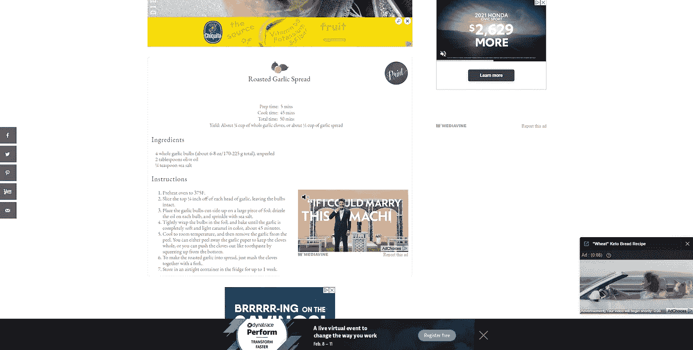
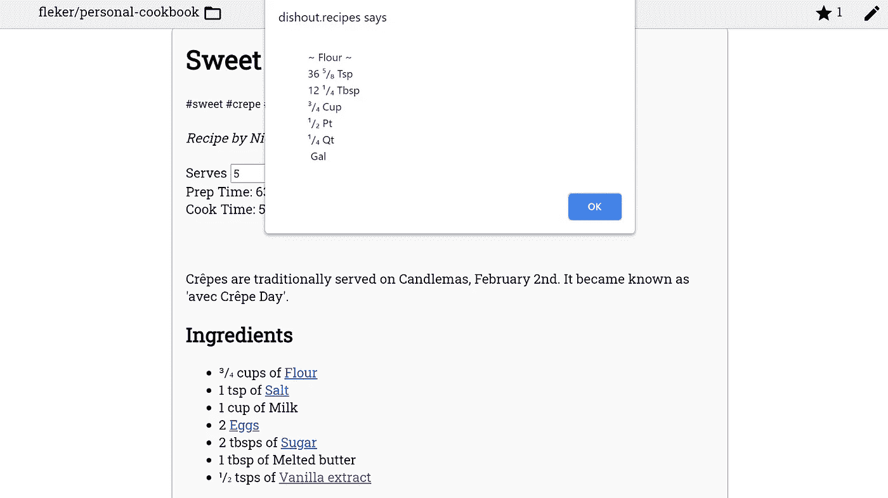
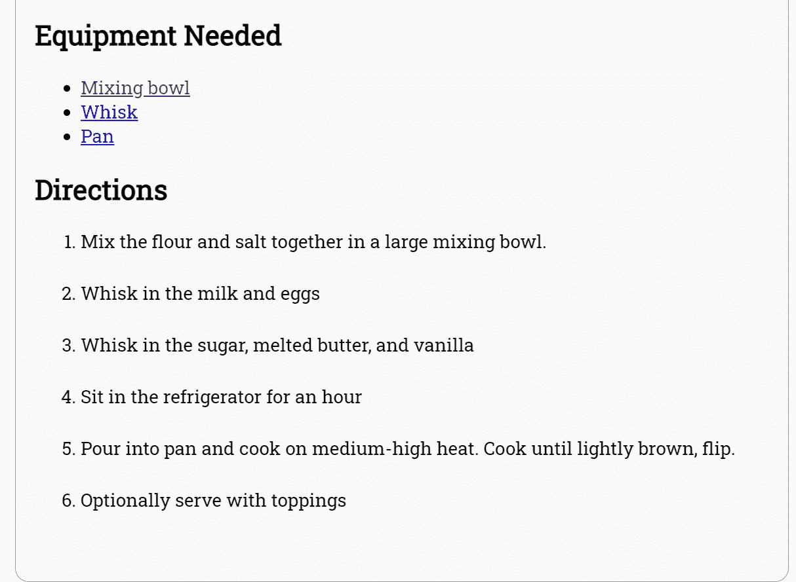
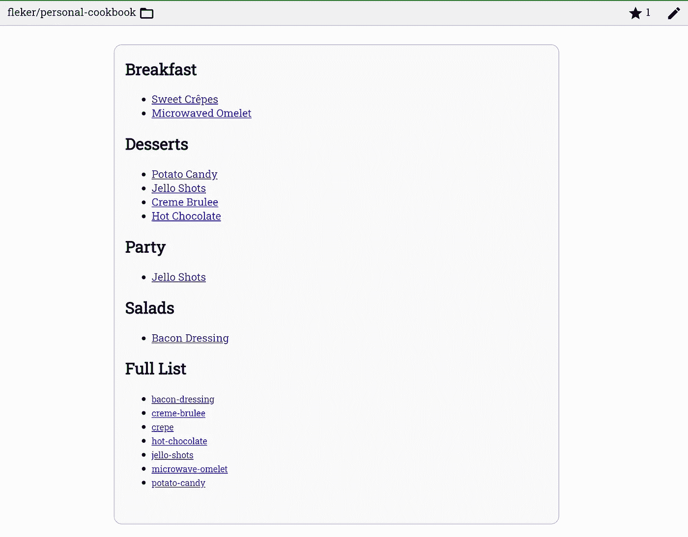

# 使用 Git 管理和浏览我的食谱

> 原文：<https://medium.com/nerd-for-tech/using-git-to-manage-and-browse-my-recipes-1f75d11d761c?source=collection_archive---------6----------------------->

一年前，我突然不得不学习如何烹饪食物。正如我们从*料理鼠王*中了解到的，任何人都可以烹饪。事实上，煮意大利面或焦糖洋葱并不难。

然而，几个月来，我想拓展新的食物和甜点。特别是，我的焦糖布丁洗得非常好。


烤得很完美

在网上浏览新菜谱的时候，我发现了很多用户体验的问题:

*   配料的数量通常分配给一个家庭的份量。一个人住，我会赚太多。
*   我不得不揣摩字里行间的意思，看看我需要什么设备，因为我没有一套完整的设备。
*   我有时会做一些替换，但是没有办法修改食谱。

所有这些都是小问题，当实际尝试浏览和阅读这些网站时会变得更加令人沮丧。每本书的顶部都布满了广告和杂乱无章的描述。我想要一种干净、易读的体验。



广告太多了

我真正想要的是修改这些食谱的方法。从软件工程的角度来看，我一直在使用 Git 修改代码。我找到一些代码，*把它叉上*，然后推叉子。有时候代码被上游接受，或者有时候我维护自己的副本。

为什么我们不能用食谱做到这一点？我想知道。我组装了一个 GitHub 托管的食谱浏览器 [dishout.recipes](http://dishout.recipes) 。该链接将您带到网站，其中包括文档和一些示例。

一切都始于一个 [GitHub repo](https://github.com/Fleker/personal-cookbook) 和一个食谱 JSON 或 YAML 文件。这个 cookbook 文件包含一个索引和存储库中所有其他食谱的组织列表，也是在 JSON 或 YAML 中。

这产生了一个简单的 URL 模式:[http://dishout.recipes/g/fleker/personal-cookbook/crepe](http://dishout.recipes/g/fleker/personal-cookbook/crepe)

这指向 repo `fleker/personal-cookbook`，然后查找标有“可丽饼”的食谱。这种格式适用于任何 GitHub repo，使我的项目或您自己的项目变得容易。

我知道用 YAML 或 JSON 写食谱有点复杂，可能需要你从头开始。然而，使用机器可读格式有几个好处。

```
ingredients:
      - item: Flour
        amount: 0.75
        unit: cup
```



自动转换

通过以这种方式定义成分，网站能够自动将单位测量值转换为近似值。

看到“服务”旁边的输入框了吗？通过更改该数字，配料量会自动更新。


在这一部分下面是一个设备，然后是编号的方向。



就是这样。你不需要别的了。没有广告，也没有任何长篇大论。您不需要登录或创建帐户。你只是得到一个干净、简单的食谱浏览器。

通过访问上一级，如[http://dishout.recipes/g/fleker/personal-cookbook](http://dishout.recipes/g/fleker/personal-cookbook)，你通过读取你的`.recipes.json`文件得到目录页。



你可以看到所有的东西都被很好地组织成你定义的类别。这允许你以你想要的方式浏览一切。

为了使这更容易，网站本身是[开源的](https://github.com/Fleker/git-recipes)，而[文档页面](http://dishout.recipes/docs)有模式的完整定义、JSON 模式文件和浏览器内验证器。

我期望很多人开始这样做吗？也许不是。但我认为这比现有的经验更好，所以我会继续努力。