# 使用 GitHub

> 原文：<https://medium.com/nerd-for-tech/using-github-a86ef7012f61?source=collection_archive---------19----------------------->

现在是时候让我们了解 GitHub 的本质，以及它能为我们的生活带来哪些便利。

***链接到项目***

一旦您创建了您的存储库，您会想要将它链接到项目。为此，您需要添加为该存储库创建的 URL:

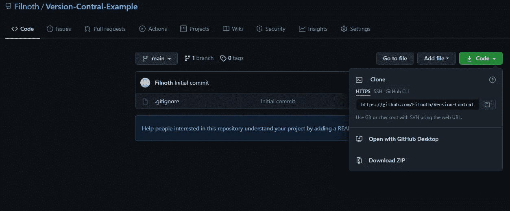

Git URL

从那里，你会想去你的 Unity 项目。最长的方法是打开 Git Bash，通过程序导航到项目:

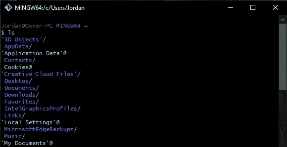

创建一个可以在 Git 中调用的列表

当您第一次打开 Git，并且不知道您希望调用的确切项目时，您可以键入 ls 创建一个列表来填充您的选项。

呼唤你的项目。

一旦你找到你想要选择的选项，输入 cd，然后输入你的选项。由于 Git 使用\来指定空格，一个更简单的方法是在输入前几个字母后按 tab，它会自动填充您想要的结果。不断重复这个过程，直到你打开你想要的项目。

或者，您可以通过 Git 跳过整个搜索，通过 Documents 文件夹打开您的项目位置。

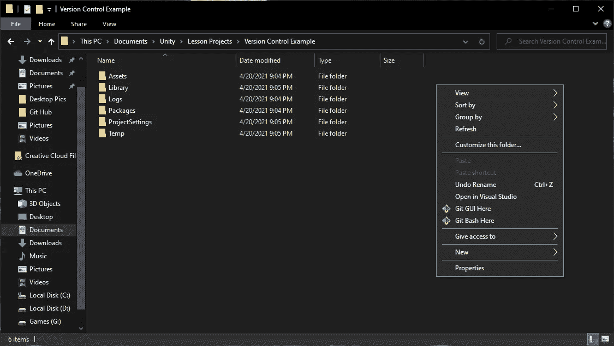

一旦你打开了文件夹，我们现在将在屏幕上点击右键，并在这里打开 Git Bash。

从这里，我们将会看到这个窗口:

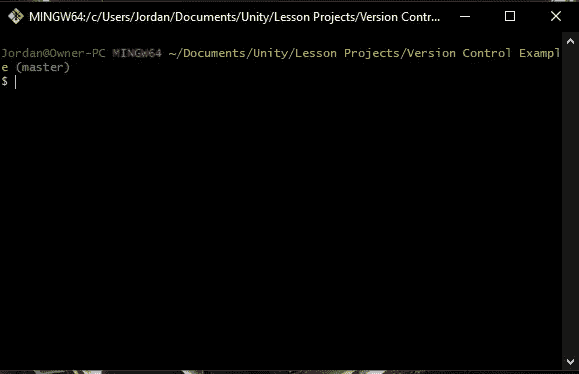

一旦我们从项目位置打开它，您将希望键入 git init 来初始化，以便与您想要做的任何事情进行通信并跟踪您的项目。在此之后，您需要将您之前创建的 web 服务器添加到存储库中。我们需要输入“git remote add origin ”,然后粘贴之前复制的 URL 地址。Origin 是服务器名称的行业标准。

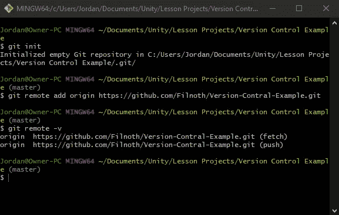

为了验证您所做的事情，您可以输入 git remote -v，它会显示您已经连接到服务器。有可能会提示你登录 GitHub。

***提交***

人们第一次使用版本控制的最大问题之一是某人做事的顺序。您不能只在代码中提交它，而忽略服务器上正在发生的任何事情，因为它可能包含您需要的信息。避免合并冲突带来的巨大麻烦的最好方法是:从服务器拉，提交，然后推。如果你遵循这个顺序，你就不太可能制造问题。

如果我们想知道有哪些命令可供我们使用，您只需输入 git--帮助查看您的选项:

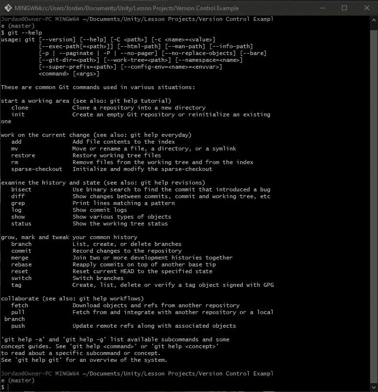

帮助命令的选项列表

从这里，我们将开始拉。

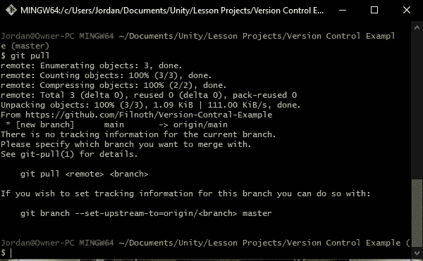

从这里开始，它将询问您希望从哪个分支中拔出。

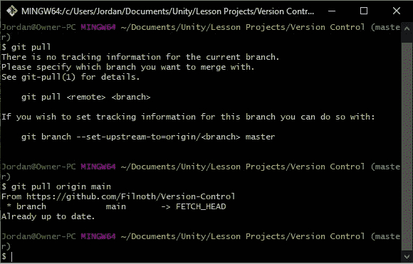

GitHub 最近的一个变化是用“main”替换了“master”。这样做是为了使措辞听起来更具包容性。一旦我们拉，你会注意到它说 Fetch_Head。头在前面，所以默认情况下会是最后一次提交。从这里，我们可以检查状态:

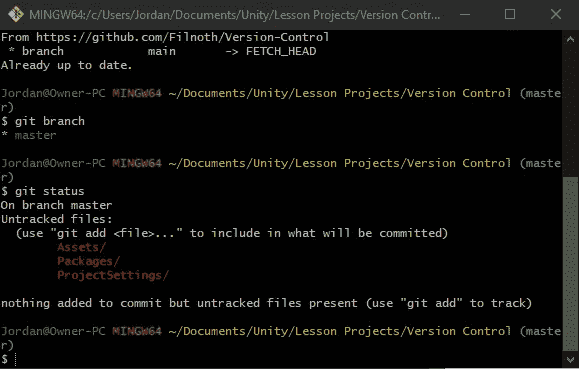

正如我们所看到的，文件是红色的，这表明它们目前没有被跟踪。要包含您想要提交的所有更改，您必须添加您想要包含在提交中的文件。你可以去 1 乘 1:

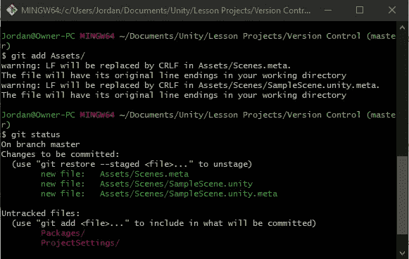

或者，您可以键入“git add”所有文件都将被添加到提交中。

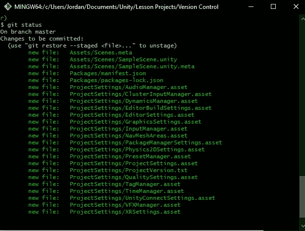

在这里，我们将通过键入“git commit-m”Message for commit 来创建一个 commit。

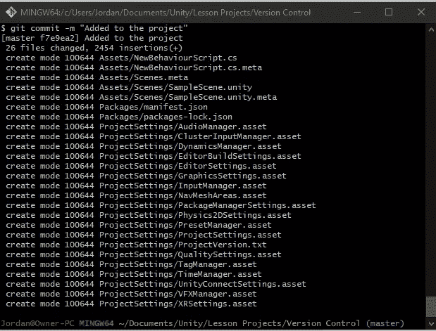

完成这一步后，我们现在需要完成最后一步并提交。如果我们只输入 git push，它会提示我们选择将 push 发送到哪里。

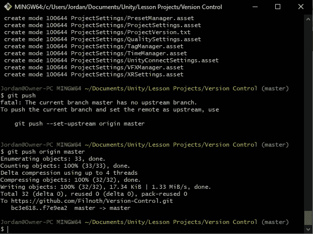

我们现在可以转到 GitHub，查看我们的存储库的更新，我们刚才提交的所有文件都会显示出来。

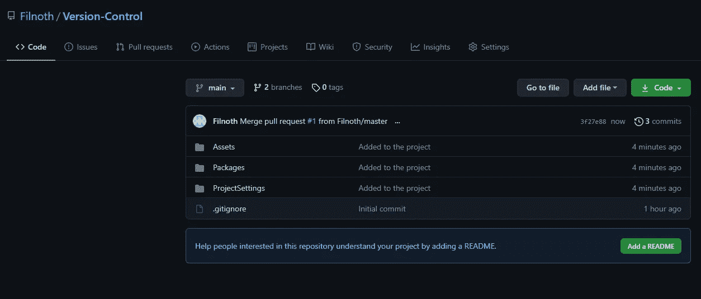

*分支是版本控制的一个非常重要的主题。很多专业人士会说早分支，勤分支。原因是因为它是轻量级的，并允许您与其他团队并行工作。可以做的是，您可以为游戏的已发布版本保留主分支，同时拥有一个开发分支，您可以在其中对游戏进行所有即将到来的更改。从那里，您可以进一步将其分支，并将一部分工作负载分解为多个更小的分支。*

*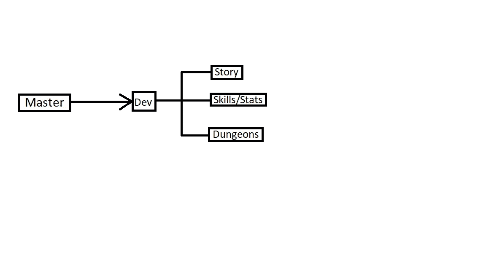*

*分支系统的示例。*

*正如我们从上面看到的，你可以将开发分支分成更小的部分，这样不同的团队可以同时在游戏的不同部分工作。*

*要创建或切换分支，非常简单:*

*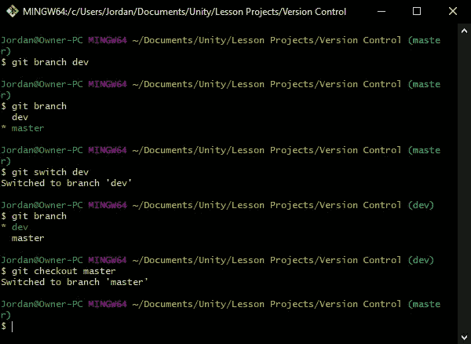*

*为了创建一个分支，我们所要做的就是输入 git branch __。*

*要切换分支，可以选择键入 git checkout __，或者 git switch __。对于那些使用该程序较久的人来说，他们会记得它是 checkout，但最近他们系统的另一个更新已经将该术语改为 switch。
至于当你在一个不同的分支时意味着什么，你能够在不影响其他分支的情况下添加到那个分支。
一旦我们完成了正在处理的分支中所有我们想做的事情，下一步就是将它合并到上一个分支中。在这种情况下，如果我们要添加到清单中，我们将必须提交更改，然后与 Dev 分支合并。*

*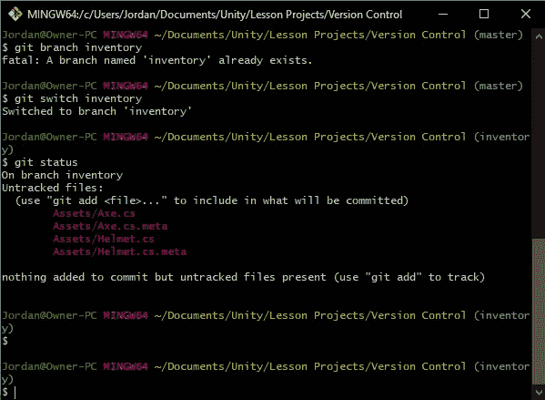*

*Git 中用于更改的新文件*

*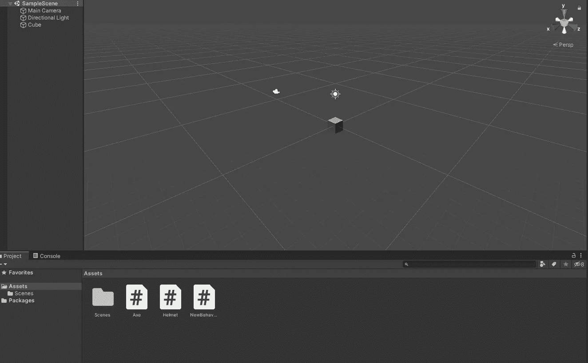*

*添加到清单分支的新脚本*

*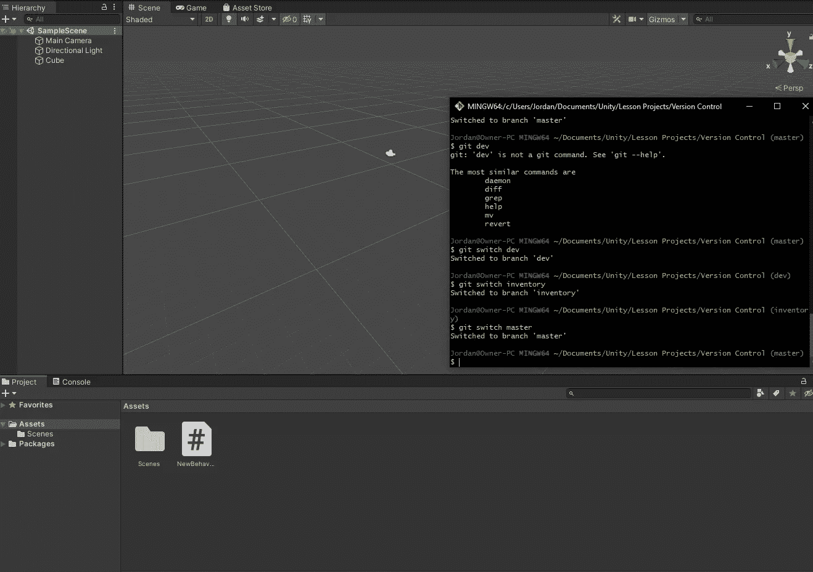*

*没有新脚本的主分支*

*正如我们所看到的，在 inventory 分支中，我们添加了几个新脚本并提交了它们。但是，如果我们切换到主分支，这些新脚本将不会显示，直到我们将分支合并在一起。为此，我们只需在主分支中输入 git merge inventory。*

*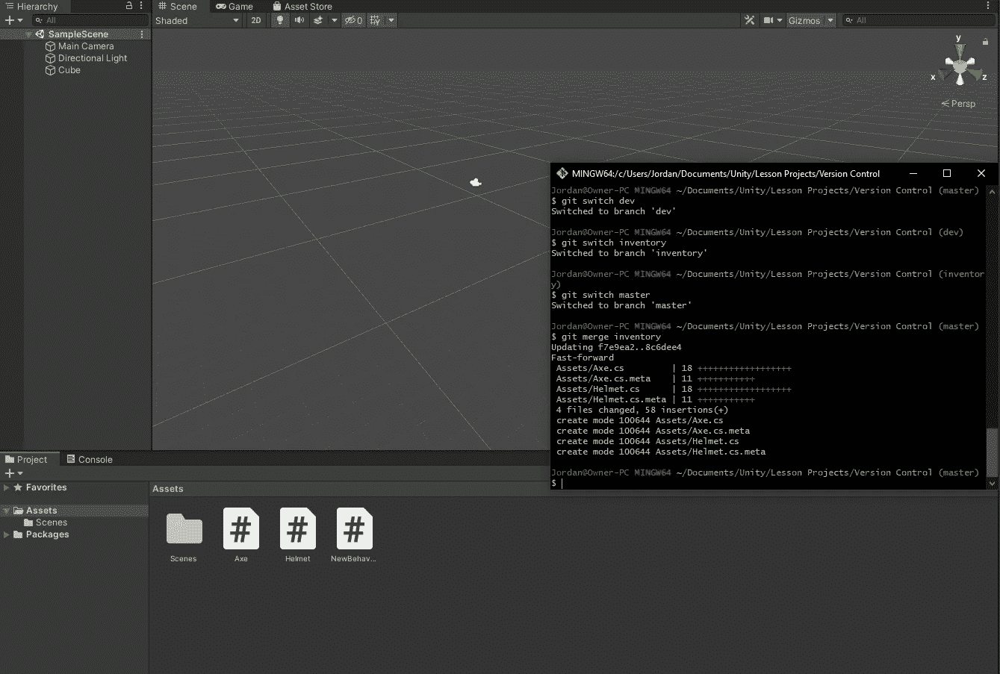*

*合并后的总分行。*

*一旦我们在本地完成了合并和提交，我们只需将它推送到主服务器，它就可以被任意使用了。*

****回复 vs 复位****

*当涉及到恢复或重置分支时，这一切都归结为如果您想要硬推送以前的状态，或者如果您只想将较旧的版本保存到新的分支中，请查看在那里做了什么，并决定您希望做什么更改。最安全的方法是恢复并把一个旧的提交作为一个新的分支来查看，但是如果这是需要立即完成的事情，那么就需要重置到以前的版本。
首先，你需要检查提交的日志。*

*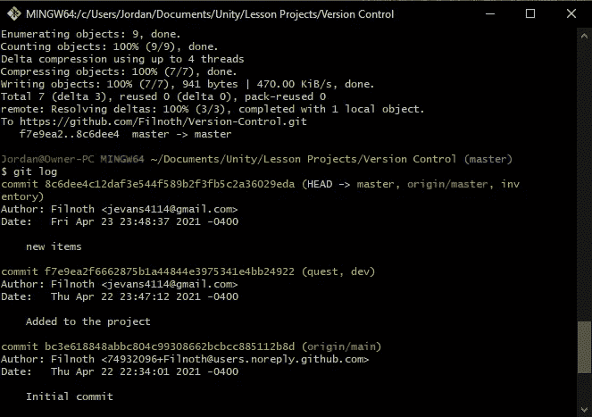*

*从这里，您可以复制其中一个提交日志的代码，并将其作为一个分支进行搜索:*

*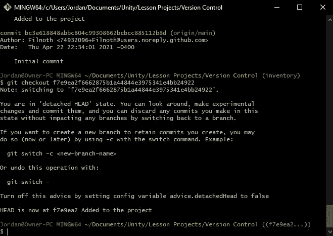*

*之后，我们要做的就是将它作为一个新分支，键入 git switch -c _____(新分支名称)并将您的代码粘贴到这里:*

*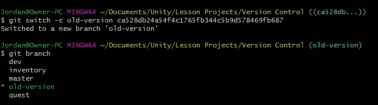*

*现在，我们将旧版本作为一个独立的分支，您可以看到在那里做了什么，如果您需要恢复所做的更改，可以按照前面的合并步骤将其添加到主文件中。*

*或者，重置您的项目只需几个快速步骤:*

*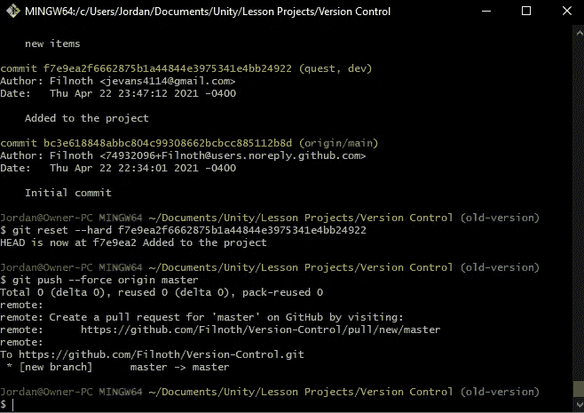*

*重置为以前的版本*

*我们只需键入 git reset--hard _ _ _ _ _ _ _ _，然后我们将通过键入 git push--force origin master 强制推送到原点。*

*现在我们已经很好地理解了如何使用 GitHub，我们现在可以应用我们新发现的知识并将其实现到未来的项目中。请继续关注更多内容，因为我们开始探索创建一个带有一些旧 Galaga 氛围的太空射击游戏。*