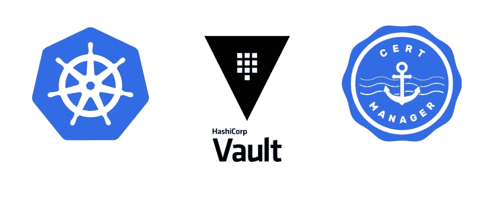

# 在证书管理器中将 Hashicorp Vault 用作证书颁发者

> 原文：<https://medium.com/nerd-for-tech/using-hashicorp-vault-as-a-certificate-issuer-in-cert-manager-9e19d7239d3d?source=collection_archive---------0----------------------->

在证书管理器中将 vault PKI 后端配置为证书提供商

在我的 [**上一篇文章**](/nerd-for-tech/free-and-automatic-ssl-certificates-in-kubernetes-using-cert-manager-6fb65ac63d5) 中，我已经解释了如何使用 let's encrypt 作为证书颁发者。在本文中，我们将了解如何使用 Hashicorp vault 作为使用 vault PKI 和 cert-manager 的证书颁发者。PKI 机密引擎生成动态 X.509 证书。使用这个 vault PKI 后端，用户可以获得证书，而不需要通过通常的手动过程来生成私钥和 CSR，提交给 CA，并等待验证和签名过程完成。证书通常在几秒钟内颁发。在本文中，我们将了解如何创建我们的根证书，并使用该证书对来自 cert-manager 的证书请求进行签名。


图片来源:谷歌图片

# 整个故事是关于什么的？(TLDR)

1.  创建我们自己的根 CA。
2.  使用 Vault PKI 作为证书颁发者，从证书管理器创建证书。

# 先决条件

1.  Kubernetes 集群(AKS、GKE、Kind、Local 集群)。

# 故事资源

1.  GitHub 链接:【https://github.com/pavan-kumar-99/medium-manifests 
2.  GitHub 分支:[**cert-manager-vault**](https://github.com/pavan-kumar-99/medium-manifests/tree/cert-manager-vault)

## 使用舵图安装 Hashicorp 保险库

我们将为金库安装官方头盔图，并手动解封。但是，这不是在生产环境中运行存储库的理想方式。您可能希望使用 KMS 密钥(如果安装在 AWS 中)或谷歌 KMS 密钥(如果安装在 GCP)来解封保险库。

掌舵安装 PKI 保险库

一旦安装了 helm chart，您应该会发现创建了一个名为 vault 的有状态集合，还创建了一个名为 **vault-0** 的 pod。但是，pod 未处于就绪状态，这是因为保险库尚未启封。现在让我们通过执行进入吊舱来打开保险库。

vault _ pki _ 开封. sh

让我们理解 init 命令的作用

> 存储库操作员 init-key-shares = 1-key-threshold = 1
> 
> -key-shares =要将生成的主密钥拆分成的密钥份额数。默认情况下，它是 5，需要 3 把钥匙才能打开保险库
> 
> -key-threshold =重建主密钥所需的密钥份额数。这必须小于或等于密钥份额。默认为 3。

## 生成根 CA 和中间 CA

Vault PKI 后端可以生成自己的自签名 CA。但是让我们创建我们自己的 CA，然后将它上传到 vault PKI 中，以签署我们的证书。

我们现在已经生成了我们的证书，现在让我们配置我们的 vault PKI 后端，以将这些证书添加为 CA。我们还必须创建保管库角色以及保管库发布和 CRL URLs。

## 配置保管库的 PKI 后端

让我们一个一个地理解这些命令

> vault 登录$VAULT_ROOT_TOKEN =用于使用根令牌登录 VAULT。
> 
> vault secrets enable pki =用于启用 vault pki 后端。
> 
> vault secrets tune-max-lease-ttl = 8760h pki =我们将 PKI 后端的 TTL 配置为 8760 小时。
> 
> vault write PKI/config/ca PEM _ bundle = @ PEM _ bundle ttl = 8760h = >我们正在将 CA 证书写入 vault，并将其 TTL 设置为 8760h

现在，我们已经将 PKI 证书上传到了保险库中。现在让我们创建一个 Vault PKI 角色。角色定义设置生成证书的条件。

一旦创建了角色，我们就应该配置可以颁发和撤销证书的端点。

现在，让我们为相应的 vault PKI 角色创建一个 vault 策略。

## 启用 Kubernetes 身份验证方法

Kubernetes auth 方法可用于使用 Kubernetes 服务帐户令牌对 vault 进行身份验证。这将帮助保管库将保管库令牌注入到 Kubernetes Pod 中。为此，让我们通过 exec 在 pod 中启用 vault Kubernetes 后端，因为必须从 vault pod 中传递**令牌 _reviewer_jwt** 。

我们现在已经创建了一个 Kubernetes auth 角色。此角色被绑定到服务帐户名 issuer 和名为 default 的命名空间以及先前创建的名为 betttercallpavan_pki 的策略。

## 安装证书管理器舵图

让我们知道在我们的集群上安装证书管理器的舵图。

```
$ helm repo add jetstack [https://charts.jetstack.io](https://charts.jetstack.io/)$ helm repo add jetstack [https://charts.jetstack.io](https://charts.jetstack.io/)$ helm install \
  cert-manager jetstack/cert-manager \
  --namespace cert-manager \
  --version v1.2.0 \
  --create-namespace \
  *--set installCRDs=true*
```



图片来源:谷歌图片

## 正在生成证书

现在让我们创建发行者。`Issuers`和`ClusterIssuers`是 Kubernetes 资源，代表可以通过接受证书签名请求来生成签名证书的证书颁发机构(ca)。所有证书管理器证书都需要处于就绪状态的引用颁发者来尝试满足请求。一个`Issuer`是一个命名空间资源，不可能从不同的命名空间中的`Issuer`颁发证书。

```
$ git clone [https://github.com/pavan-kumar-99/medium-manifests.git](https://github.com/pavan-kumar-99/medium-manifests.git) \
-b cert-manager-vault$ cd medium-manifests$ kubectl apply -f vault-pki-issuer.yaml
```

现在创建证书

```
$ kubectl apply -f vault-issuer-cert.yaml
```

现在，一旦发送了证书请求，您应该会看到在创建证书资源的名称空间中创建了 K8s 秘密。现在，证书可以被任何客户机/服务器使用。

```
$ kubectl get secret bettercallpavan-com-tls -n default
```

我们现在将部署一个示例 nginx 应用程序来验证我们的证书。

```
$ kubectl apply -f app.yaml$ ip=$(k get ing certmanagerapp-ingress -o jsonpath='{.status.loadBalancer.ingress[0].ip}')$ echo | openssl s_client -connect $ip:443 2>/dev/null | openssl x509 -noout -issuerissuer=O = Acme Co, CN = www.bettercallpavan.com
```


惊讶吗？

是的，这些是在证书管理器中将 Vault 用作证书颁发者所需的所有步骤。我希望你喜欢这篇文章。欢迎在评论区分享你的想法和使用 Hashicorp Vault PKI 的经验。如果您在部署过程中遇到任何问题，请在此处提出问题或随时通过我的电子邮件联系我(pavan1999.kumar@gmail.com)。

**清理**

```
$ git clone [https://github.com/pavan-kumar-99/medium-manifests.git](https://github.com/pavan-kumar-99/medium-manifests.git) \
-b cert-manager-vault$ cd medium-manifests$ kubectl delete -f ./*$ kubectl delete secret bettercallpavan-com-tls -n default
```

# 结论

1.  Cert-Manager 可用于获取有效期为 90 天的免费 SSL 证书。
2.  这些证书可以在到期后一个月内自动尝试更新。

以下是我的一些其他文章，你可能会感兴趣

直到下一次…..

# 被推荐的

[](/nerd-for-tech/deep-dive-into-cortex-part-i-c228e01f8c58) [## 深入探究皮层指标—第一部分

### 深入探究 Cortex Metrics.io 第一部分

medium.com](/nerd-for-tech/deep-dive-into-cortex-part-i-c228e01f8c58) [](/nerd-for-tech/running-apache-spark-on-eks-with-aws-spot-instances-f8ce91d319b9) [## 使用 AWS Spot 实例在 EKS 上运行 Apache Spark

### 通过 AWS Spot 实例为 EKS 上的 Apache Spark 工作负载有效节约成本

medium.com](/nerd-for-tech/running-apache-spark-on-eks-with-aws-spot-instances-f8ce91d319b9) [](/nerd-for-tech/deep-dive-into-thanos-part-i-f72ecba39f76) [## 深入灭霸——第一部分

### 使用灭霸和普罗米修斯操作员监控 Kubernetes 的工作负载

medium.com](/nerd-for-tech/deep-dive-into-thanos-part-i-f72ecba39f76) [](https://www.techmanyu.com/creating-self-hosted-github-runners-in-a-kubernetes-cluster-fd05560de34a) [## 在 Kubernetes 集群中创建自托管 GitHub 运行程序

### 在您自己的 Kubernetes 集群上运行 GitHub 操作

www.techmanyu.com](https://www.techmanyu.com/creating-self-hosted-github-runners-in-a-kubernetes-cluster-fd05560de34a)